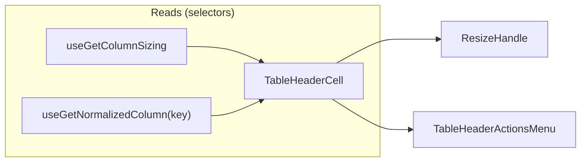

# TableHeaderCell Architecture

Interactive column header cell with sorting, pinning, resizing, visibility,
and per-column settings — all consolidated behind a single actions-menu
trigger so narrow columns still show their label instead of being crowded out
by inline icon buttons.

## File Structure

```text
TableHeaderCell/
├── TableHeaderCell.component.tsx        → <th> rendering label + ResizeHandle + TableHeaderActionsMenu
├── TableHeaderCell.types.ts             → TableHeaderCellProps (columnKey, pinInfo)
├── TableHeaderCell.stylex.ts            → Pinned positioning, base cell layout, shimmer
├── TableHeaderCell.test.tsx             → Unit coverage for label/resize/menu wiring
├── index.ts                             → Barrel export
│
├── ResizeHandle/
│   ├── ResizeHandle.component.tsx       → Drag-resize handle; owns useColumnResize + double-click reset
│   ├── ResizeHandle.types.ts            → ResizeHandleProps<TData>
│   ├── ResizeHandle.stylex.ts           → Resize handle line/hover/active styles
│   └── index.ts
│
├── TableHeaderActionsMenu/
│   ├── TableHeaderActionsMenu.component.tsx → Popover menu shell: gates sections, passes hasSectionAbove + forwards closeMenu
│   ├── TableHeaderActionsMenu.types.ts      → Props (isSortable, isStatic, hasSettings, pinSide, sortDirection)
│   ├── SortActions/                         → Thin shell composing the sort delegates (forwards columnKey/onClose/sortDirection)
│   │   ├── SortActions.component.tsx
│   │   ├── SortAscendingButton/             → Toggles asc + highlights when applied; owns useSetColumnSorting
│   │   ├── SortDescendingButton/            → Toggles desc + highlights when applied; owns useSetColumnSorting
│   │   └── ClearSortingButton/             → Always shown, disabled until sorted; owns useSetColumnSorting
│   ├── PinAndHideActions/                   → Thin shell composing the pin/hide delegates (forwards columnKey/onClose/pinSide/hasSectionAbove)
│   │   ├── PinAndHideActions.component.tsx
│   │   ├── PinLeftButton/                   → Toggles left pin + highlights; carries divider when hasSectionAbove; owns useSetColumnPinning
│   │   ├── PinRightButton/                  → Toggles right pin + highlights; owns useSetColumnPinning
│   │   ├── ClearPinningButton/             → Always shown, disabled until pinned; owns useSetColumnPinning
│   │   └── HideColumnButton/                → Hides the column, always carries the divider; owns useSetColumnVisibility
│   ├── ManageColumnAction/                  → Manage Column item (single self-connected button); owns the drawer-open meta actions
│   └── index.ts
│
└── utils/
    ├── getPinnedStyle.util.ts           → Returns left/right pinned StyleX
    └── getShadowStyle.util.ts           → Returns shadow separator StyleX
```

## Props

| Prop           | Type                | Description                      |
| -------------- | ------------------- | -------------------------------- |
| `columnKey`    | `DataKey<TData>`    | Column identifier                |
| `hasSettings`  | `boolean`           | Enables the "Manage Column" item |
| `pinInfo`      | `PinnedColumnInfo?` | Pin side, offset, shadow flags   |
| `customStylex` | `StyleXStyles?`     | Override styles                  |

## Context Dependencies



## Actions Menu

A single `MoreVerticalIcon` trigger (`TableActionsPopover`, shared with
`TableRowActionsMenu` — see `components/Table/TableActionsPopover/ARCHITECTURE.md`)
opens a popover built by `TableHeaderActionsMenu`, replacing the previous
inline pin/sort/settings buttons:

- **Sort** (`SortActions`, when `isSortable`): "Ascending"/"Descending" toggle
  the direction on/off exactly like `ColumnSettingsDrawer/SortingSection`
  (`direction === current ? undefined : direction`) and highlight the applied
  one via the `primary` variant + `aria-pressed`; "Clear Sorting" is always
  shown but `isDisabled` until a direction is applied.
- **Pin** (`PinAndHideActions`, when `!isStatic`): "Pin Left"/"Pin Right"
  toggle via `useSetColumnPinning` directly — no side-selection or conflict
  modal, same silent behavior as `ColumnSettingsDrawer/PinningSection` — and
  highlight the applied side (`primary` variant + `aria-pressed`). "Clear
  Pinning" (`useSetColumnPinning({ columnKey, side: undefined })`) is always
  shown but `isDisabled` until a side is pinned.
- **Hide Column** (`PinAndHideActions`, when `!isStatic`):
  `useSetColumnVisibility({ columnKey, isVisible: false })` — a single-column,
  table-level visibility action (see `contexts/TableConfig/ARCHITECTURE.md`),
  distinct from the settings-drawer's draft-scoped `useToggleColumnVisibility`.
- **Manage Column** (`ManageColumnAction`, when `hasSettings`): opens the
  per-column `ColumnSettingsDrawer` — identical wiring to the previous
  "Settings for {label}" button (`setTableColumnSelectedKey` +
  `setTableDrawersOpenState({ isColumnSettingsOpen: true,
isTableSettingsOpen: false })`).

**Stable layout & section dividers.** Every option always renders (the "Clear"
items disable rather than disappear) so the menu never changes height as state
changes. Section boundaries are drawn with `tableActionsPopoverStyles.menuSectionDivider`
— a `border-top` composed onto the **first item of each following section**
rather than a standalone `role="separator"` element or a `border-bottom` on a
last item (whose identity would shift as options toggle). "Hide Column" always
carries the divider (pin options always precede it within the section); "Pin
Left" and "Manage Column" carry it only when a section renders above them,
which the shell passes down via `hasSectionAbove` (`isSortable` for
`PinAndHideActions`, `isSortable || !isStatic` for `ManageColumnAction`).

The tree is two levels of private delegates (direct file imports, no barrels —
ADR-007). `SortActions` and `PinAndHideActions` are **thin shells** that only
forward props; each individual item ("Ascending", "Pin Left", …) is its own
`*Button` delegate that owns its store-action hook (`useSetColumnSorting` /
`useSetColumnPinning` / `useSetColumnVisibility`) and click handler, keeping
every file short and independently testable. `ManageColumnAction` is already a
single self-connected button, so it stays a leaf without a shell.
`TableHeaderActionsMenu` itself only gates which sections render and forwards
the popover's render-prop `closeMenu` down to each button's `onClose`, so every
item closes the popover after firing its action. The menu renders nothing (no
trigger) when the column has no sortable/pinnable/settings affordance at all.

### Resize

`ResizeHandle` fully owns `useColumnResize` (RAF-throttled drag resize) and
the double-click-to-reset-width handler; `TableHeaderCell` only passes
`columnKey`, `columnLabel`, `currentWidth`, `maxWidth`, `minWidth`.

The handle is a childless `<button>` whose 8px grab zone intentionally
straddles the cell's right border (`right: -4`), overhanging into the
neighbouring cell. Both halves land in the 6px `paddingInline` of the cell they
cover, so the handle never steals clicks from a label or an actions menu — keep
that relationship in mind if the header cell's padding ever shrinks. The visible
2px line is a `::before` fed by the `--resize-handle-line-color` custom
property, which is what lets a hover anywhere in the grab zone light the line.

## Loading State

Header cells receive `isLoadingState` from `TableHeader` and render their local
shimmer overlay without subscribing to loading state individually.
