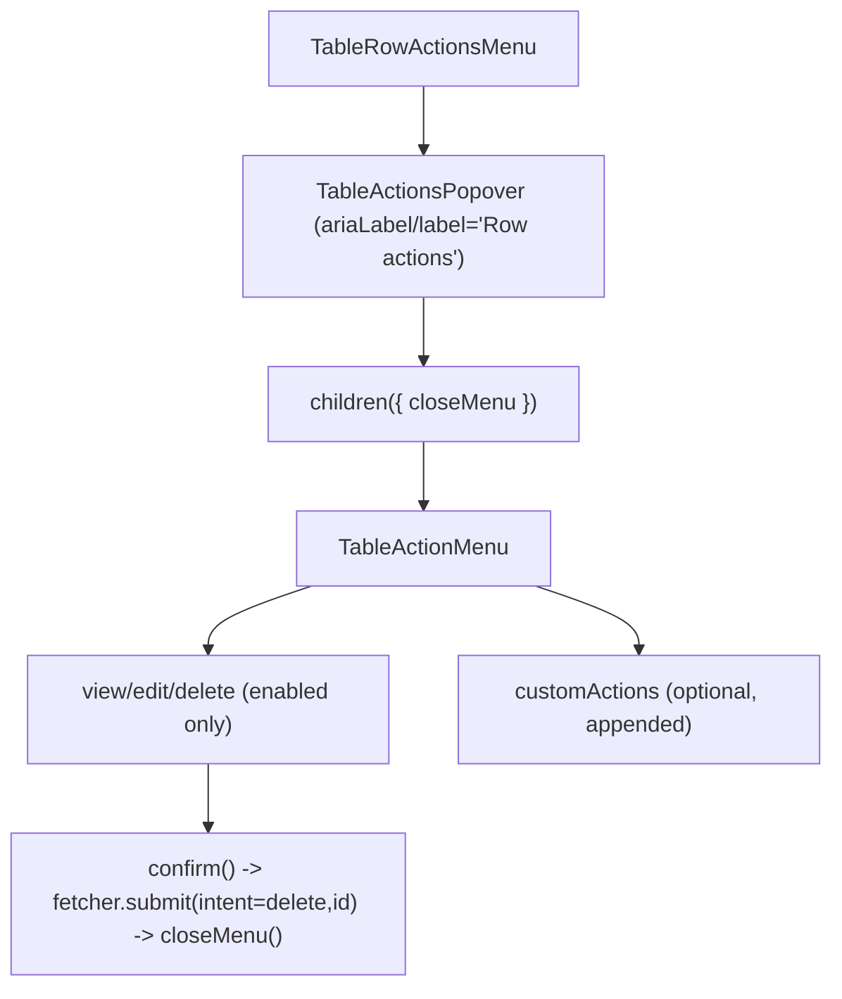

# TableRowActionsMenu Architecture

Row-level actions menu rendered in the table `actions` column using the native
Popover API.

## Responsibility

- Render view/edit/delete actions according to the `crud` feature flags.
- Resolve row ids through `resolveCrudRowId` from the column(s) marked `isPrimaryKey`.
- Perform delete with a confirmation prompt and React Router `useFetcher().submit()` to `metaState.deleteActionPath`.
- Append custom action-column content after built-in CRUD menu entries.
- Delegate the trigger button, popover panel, and coordinate positioning to the shared `TableActionsPopover` (see `components/Table/TableActionsPopover/ARCHITECTURE.md`) — this component only wires CRUD/delete behavior into the popover's render-prop `children`.

## File Structure

```
TableRowActionsMenu/
├── TableActionMenu/
│   ├── TableActionMenu.component.tsx              → Extracted view/edit/delete/custom-actions renderer
│   ├── TableActionMenu.types.ts                   → Local props contract
│   └── index.ts                                   → Local barrel
├── TableRowActionsMenu.component.tsx      → CRUD/delete wiring, composed into TableActionsPopover's children
├── TableRowActionsMenu.stylex.ts          → customActions separator style (row-specific)
├── TableRowActionsMenu.types.ts           → Props contract
├── ARCHITECTURE.md                     → This file
└── index.ts                            → Barrel export
```

## Render Flow



## Delete Contract

- Requires `crud.deleteActionPath`.
- Uses `method='post'` with form data payload: `intent=delete`, `id=<resolved row id>`.
- Confirmation text uses `titleSingular` when available for a user-facing prompt.
