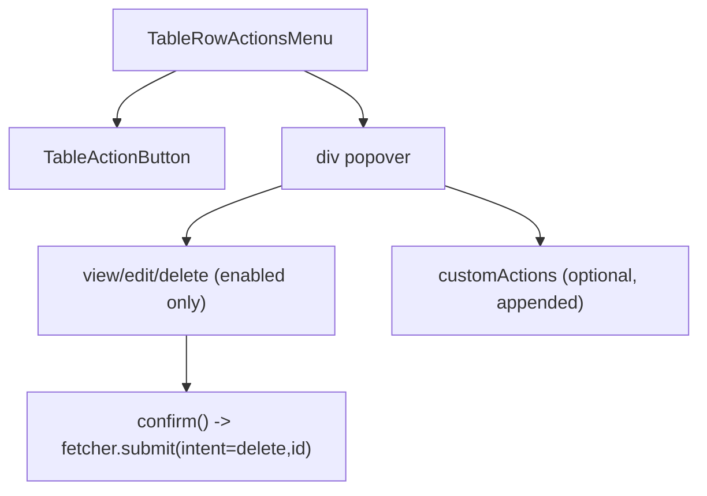

# TableRowActionsMenu Architecture

Row-level actions menu rendered in the table `actions` column using the native
Popover API.

## Responsibility

- Render view/edit/delete actions according to the `crud` feature flags.
- Resolve row ids through `resolveCrudRowId` (`idAccessor` key or resolver).
- Perform delete with a confirmation prompt and React Router `useFetcher().submit()` to a configured action endpoint.
- Append custom action-column content after built-in CRUD menu entries.

## File Structure

```
TableRowActionsMenu/
├── TableRowActionsMenu.component.tsx   → Menu trigger + popover panel + CRUD item wiring
├── TableRowActionsMenu.stylex.ts       → Trigger/menu/item styles
├── TableRowActionsMenu.types.ts        → Props contract
├── ARCHITECTURE.md                     → This file
└── index.ts                            → Barrel export
```

## Render Flow



## Delete Contract

- Requires `crud.deleteActionPath`.
- Uses `method='post'` with form data payload: `intent=delete`, `id=<resolved row id>`.
- Confirmation text uses `titleSingular` when available for a user-facing prompt.
