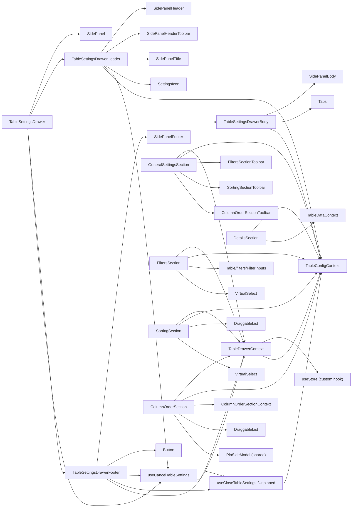
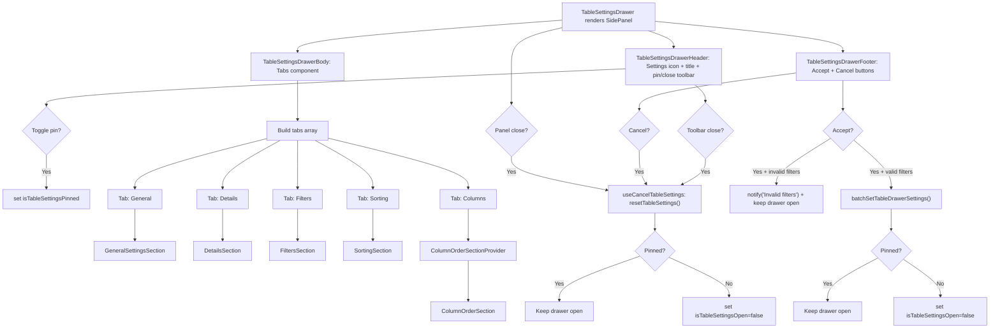
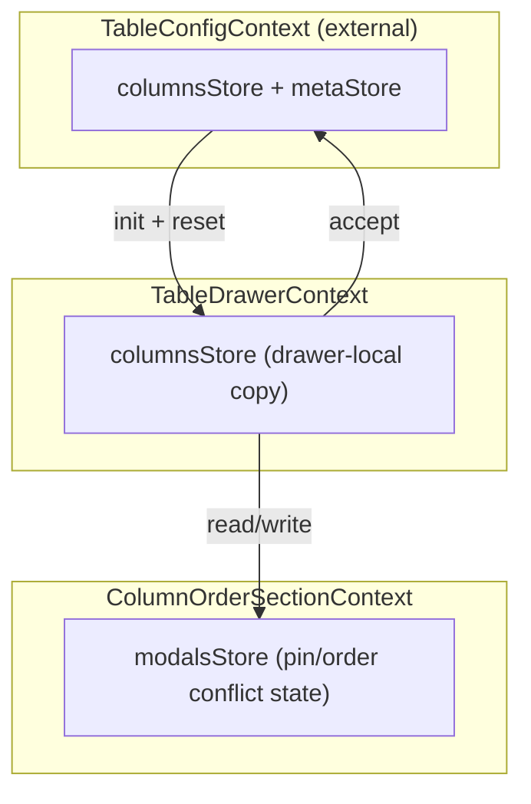

# TableSettingsDrawer Architecture

## File Structure

```
TableSettingsDrawer/
├── index.ts                              → Barrel export: TableSettingsDrawer
├── TableSettingsDrawer.component.tsx      → Root: SidePanel composing header/body/footer
│
├── TableSettingsDrawerHeader/            → Title + pin/close toolbar
│   ├── TableSettingsDrawerHeader.component.tsx
│   ├── TableSettingsDrawerHeader.types.ts
│   └── TableSettingsDrawerHeader.test.tsx
│
├── TableSettingsDrawerBody/              → Tabbed sections container
│   ├── TableSettingsDrawerBody.component.tsx
│   ├── TableSettingsDrawerBody.types.ts
│   └── TableSettingsDrawerBody.test.tsx
│
├── TableSettingsDrawerFooter/            → Accept/Cancel buttons
│   ├── TableSettingsDrawerFooter.component.tsx
│   ├── TableSettingsDrawerFooter.types.ts
│   └── TableSettingsDrawerFooter.test.tsx
│
├── hooks/                                → Handlers shared across the drawer shell
│   ├── useCancelTableSettings.hook.ts     → Reset drawer state + close if unpinned (busy-guarded)
│   └── useCloseTableSettingsIfUnpinned.hook.ts → Close drawer unless pinned
│
├── TableDrawerContext/                   → Store-based context for drawer state
│   ├── TableDrawerContext.context.ts      → createContext
│   ├── TableDrawerContext.provider.tsx     → Provider: reads table state, creates store
│   ├── TableDrawerContext.types.ts        → TableDrawerColumnsState, ContextValue
│   ├── useTableDrawerContextValue.hook.ts → use(TableDrawerContext)
│   ├── useColumnsStore.hook.ts            → useSyncExternalStore + selector
│   │
│   ├── actions/                           → 17 action hooks (set/clear/reset/batch)
│   │   ├── useBatchSetTableDrawerSettings → Push all drawer state to table
│   │   ├── useClearAllSettings            → Clear all fields
│   │   ├── useClearColumnOrderSection     → Clear visibility + pinning
│   │   ├── useClearFilters                → Clear all filters
│   │   ├── useClearSorting                → Clear all sorting
│   │   ├── useOrderColumnsBySorting       → Reorder columns by sorting
│   │   ├── useResetColumnOrderAndVisibility → Reset order + visibility from table
│   │   ├── useResetFilters                → Reset filters from table
│   │   ├── useResetSorting                → Reset sorting from table
│   │   ├── useResetTableSettings          → Reset all from table
│   │   ├── useSetColumnFilters            → Set filters object
│   │   ├── useSetColumnPinning            → Set pinning state + sync draft order
│   │   ├── useSetColumnsOrder             → Set column order array
│   │   ├── useSetColumnsSizing            → Set column widths
│   │   ├── useSetColumnsSortings          → Set sorting array
│   │   ├── useSetColumnsVisibility        → Set visibility set
│   │   └── useSortByColumnOrder           → Create sorts from column order
│   │
│   └── selectors/                         → 5 selector hooks (read drawer state)
│       ├── useGetColumnFilters
│       ├── useGetColumnOrder
│       ├── useGetColumnPinning
│       ├── useGetColumnsSorting
│       └── useGetColumnVisibility
│
├── GeneralSettingsSection/                → Width presets + cross-section toolbars
│   ├── GeneralSettingsSection.component.tsx
│   ├── GeneralSettingsSection.types.ts
│   ├── GeneralSettingsSection.stylex.ts
│   └── index.ts
│
├── DetailsSection/                        → Read-only table metadata and metrics
│   ├── DetailsSection.component.tsx
│   ├── DetailsSection.types.ts
│   ├── DetailsSection.stylex.ts
│   └── index.ts
│
├── FiltersSection/                        → Multi-filter add/remove/expand/validate
│   ├── FiltersSection.component.tsx        → Orchestrator
│   ├── index.ts
│   ├── validateFilter.util.ts
│   ├── AddFilterSection/                  → VirtualSelect for adding filters
│   ├── ActiveFiltersList/                 → Expandable filter items with FilterInputs
│   └── FiltersSectionToolbar/             → Expand/collapse/clear/reset filter (toolbar + footer)
│
├── SortingSection/                        → Multi-sort add/remove/reorder
│   ├── SortingSection.component.tsx        → Orchestrator
│   ├── SortingSection.types.ts
│   ├── index.ts
│   ├── AddSortSection/                    → VirtualSelect for adding sorts
│   ├── ActiveSortList/                    → DraggableList of sorts
│   ├── SortingSectionToolbar/             → Sort/clear/reset (toolbar + footer)
│   └── utils/
│
└── ColumnOrderSection/                    → Drag-drop column order + pin + visibility
    ├── ColumnOrderSection.component.tsx    → DraggableList + conflict modals
    ├── ColumnOrderSection.types.ts         → Conflict resolution types
    ├── ColumnOrderSection.stylex.ts
    ├── index.ts
    ├── ColumnOrderSectionContext/          → Nested context for modal state
    ├── ColumnOrderSectionToolbar/          → Order/clear/reset (toolbar + footer)
    ├── OrderConflictModal/                → Order/pin conflict resolution radio
    ├── PinConflictModal/                  → Pin contiguity conflict resolution
    ├── UnpinConflictModal/                → Unpin gap conflict resolution
    └── utils/                             → 9 pin/order conflict utilities
```

## Dependencies



## Render Flow



## State Management: TableDrawerContext

Store-based context pattern using `useStore` + `useSyncExternalStore` with
17 action hooks and 5 selector hooks.

See [TableDrawerContext/ARCHITECTURE.md](TableDrawerContext/ARCHITECTURE.md) for full details.

**Key flows**:

- **Accept**: `useBatchSetTableDrawerSettings` reads all drawer state and pushes it to
  `TableConfigContext`
- **Invalid accept**: `notify(...)` sends a warning through the app-level `NotificationProvider`; the viewport is rendered once at the root, not inside the drawer
- **Pin state**: `isTableSettingsPinned` is owned by `TableConfig.metaStore`, not local component state
- **Expanded filter children state**: `tableSettingsExpandedFilters` is owned by `TableConfig.metaStore` and restored by `FiltersSection`
- **Selected tab state**: `tableSettingsSelectedTab` is owned by `TableConfig.metaStore` and wired through controlled `Tabs`
- **Cancel**: `hooks/useCancelTableSettings` (shared by the panel close, the
  header toolbar close, and the footer Cancel button) calls
  `useResetTableSettings()` to read current table state back into the drawer
  store, then `hooks/useCloseTableSettingsIfUnpinned` closes only when
  unpinned; the whole flow no-ops while busy

## Tab Sections

All sections follow a consistent pattern: they use SidePanel sub-components for layout,
read/write state through TableDrawerContext actions and selectors, and each features
a toolbar in dual-variant mode.

| Section                  | Tab     | Features                                                           | Details                                                   |
| ------------------------ | ------- | ------------------------------------------------------------------ | --------------------------------------------------------- |
| `GeneralSettingsSection` | General | Width presets, cross-section clear/reset, all settings clear/reset | [ARCHITECTURE.md](GeneralSettingsSection/ARCHITECTURE.md) |
| `DetailsSection`         | Details | Required row counts, optional table/schema, technical metadata     | [ARCHITECTURE.md](DetailsSection/ARCHITECTURE.md)         |
| `FiltersSection`         | Filters | Add/remove/expand filters, FilterInputs, validation                | [ARCHITECTURE.md](FiltersSection/ARCHITECTURE.md)         |
| `SortingSection`         | Sorting | Add/remove/reorder sorts, direction toggle                         | [ARCHITECTURE.md](SortingSection/ARCHITECTURE.md)         |
| `ColumnOrderSection`     | Columns | Drag-drop reorder, pin toggle, visibility toggle, conflict modals  | [ARCHITECTURE.md](ColumnOrderSection/ARCHITECTURE.md)     |

### Section Toolbar Pattern

Filters, Sorting, and ColumnOrder sections each have a `*SectionToolbar` sub-component
that renders in two variants controlled by a `variant` prop:

| Variant     | Placement              | Button Style            | Shows Labels?  |
| ----------- | ---------------------- | ----------------------- | -------------- |
| `'toolbar'` | SidePanelSectionHeader | `ghost`, `mini`, `auto` | No (icon only) |
| `'footer'`  | Below the section      | `outline`, `sm`, `full` | Yes            |

Each toolbar provides section-specific actions (clear, reset, and special operations).
GeneralSettingsSection reuses all three toolbars in their `'footer'` variant.

## Nested Context Architecture



Three context layers:

1. **TableConfigContext** (external) — source of truth for the table
2. **TableDrawerContext** — local working copy of column state
3. **ColumnOrderSectionContext** — modal state for pin/order conflict resolution

## Consumers

Used in `TableDrawersSection` which wraps it with `TableDrawerProvider`:

```
<TableDrawerProvider>
  <TableSettingsDrawer
    isBusy={isLoadingMore || (isLoading && isTableSettingsPinned)}
  />
</TableDrawerProvider>
```

When load-more is in progress, or when the persisted drawer state is pinned+open
during initial loading, `TableDrawersSection` still renders this component and passes
`isBusy=true`. Controls remain visible but become non-interactive and
render shimmer overlays to preserve layout and avoid loading shifts.
