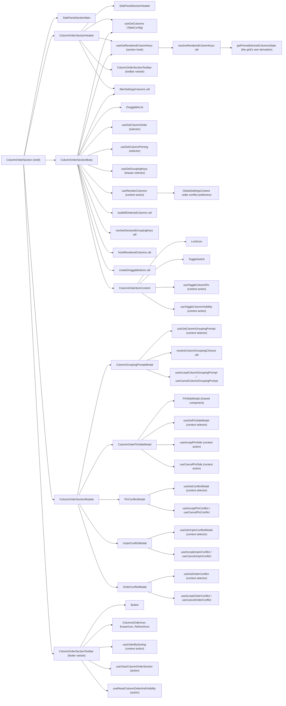
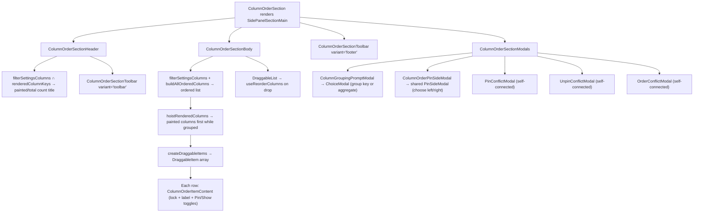
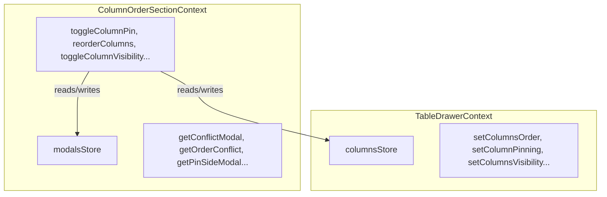

# ColumnOrderSection Architecture

Column reordering, visibility toggling, and pinning with drag-and-drop.
A thin shell (mirroring the `TableSettingsDrawer` header/body/footer pattern)
composing private delegates that own their store wiring, with a nested
ColumnOrderSectionContext managing this section's modal state.

## State Ownership Rule

No modal or row state is prop-drilled through the section shell. Each
delegate reads the selectors and dispatches the actions it needs itself:

| Delegate                    | Reads (selectors)                                                                     | Dispatches (actions)                                   |
| --------------------------- | ------------------------------------------------------------------------------------- | ------------------------------------------------------ |
| `ColumnOrderSection`        | — (pure composition)                                                                  | —                                                      |
| `ColumnOrderSectionHeader`  | columns, renderedColumnKeys                                                           | — (toolbar delegates its own)                          |
| `ColumnOrderSectionBody`    | columns, columnOrder, columnPinning, groupingKeys, renderedColumnKeys                 | reorderColumns                                         |
| `ColumnOrderItemContent`    | —                                                                                     | toggleColumnPin, toggleColumnVisibility                |
| `ColumnOrderSectionModals`  | — (pure composition)                                                                  | —                                                      |
| `ColumnGroupingPromptModal` | columnGroupingPrompt, columns, groupingKeys, groupingAggregates, groupingCapabilities | acceptColumnGroupingPrompt, cancelColumnGroupingPrompt |
| `ColumnOrderPinSideModal`   | pinSideModal                                                                          | acceptPinSide, cancelPinSide                           |
| `PinConflictModal`          | conflictModal                                                                         | acceptPinConflict, cancelPinConflict                   |
| `UnpinConflictModal`        | unpinConflictModal                                                                    | acceptUnpinConflict, cancelUnpinConflict               |
| `OrderConflictModal`        | orderConflict                                                                         | acceptOrderConflict, cancelOrderConflict               |

Every modal here but one renders the same shell — a description, a radio group,
and Accept/Cancel actions — so it delegates that shell to the shared
presentational `ChoiceModal` (`components/ChoiceModal/`) and supplies only its
own title, copy, options, and data wiring. What the radio group offers differs:
the conflict modals offer resolutions, while `ColumnGroupingPromptModal` offers
the roles a column can take in the grouping (ADR-096) — the same shell answering
a different question. `ColumnOrderPinSideModal` is the exception: it wraps the
shared `PinSideModal` (`components/PinSideModal/`), which likewise stays
presentational, and is its local owner.

## File Structure

```
ColumnOrderSection/
├── index.ts                              → Barrel export
├── ColumnOrderSection.component.tsx       → Thin shell: Header + Body + Toolbar + Modals
├── ColumnOrderSection.types.ts            → Section props + conflict resolution type re-exports
│
├── ColumnOrderSectionContext/            → Nested context for modal state
│   ├── ColumnOrderSectionContext.context.ts
│   ├── ColumnOrderSectionContext.types.ts
│   └── useColumnOrderSectionContextValue.hook.ts
│
├── ColumnOrderSectionHeader/             → Count title + compact toolbar (private delegate)
│   ├── ColumnOrderSectionHeader.component.tsx
│   ├── ColumnOrderSectionHeader.types.ts    → { isBusy? }
│   └── ColumnOrderSectionHeader.test.tsx
│
├── ColumnOrderSectionBody/               → Drag-and-drop column list (private delegate)
│   ├── ColumnOrderSectionBody.component.tsx
│   ├── ColumnOrderSectionBody.types.ts      → { isBusy? }
│   ├── ColumnOrderSectionBody.test.tsx
│   └── ColumnOrderItemContent/           → Row content: lock + label + Pin/Show toggles
│       ├── ColumnOrderItemContent.component.tsx
│       ├── ColumnOrderItemContent.types.ts
│       └── ColumnOrderItemContent.stylex.ts
│
├── ColumnGroupingPromptModal/            → Ask how an unnamed column should join the grouping (self-connected, no props; delegates shell to ChoiceModal)
│   ├── ColumnGroupingPromptModal.component.tsx
│   └── ColumnGroupingPromptModal.test.tsx
│
├── ColumnOrderSectionModals/             → Hosts this section's modals (pure composition)
│   ├── ColumnOrderSectionModals.component.tsx
│   └── ColumnOrderSectionModals.test.tsx
│
├── ColumnOrderPinSideModal/              → Store-connected wrapper around shared PinSideModal
│   ├── ColumnOrderPinSideModal.component.tsx
│   └── ColumnOrderPinSideModal.test.tsx
│
├── ColumnOrderSectionToolbar/            → Order/clear/reset actions (also used by GeneralSettingsSection)
│   ├── index.ts
│   ├── ColumnOrderSectionToolbar.component.tsx
│   └── ColumnOrderSectionToolbar.types.ts   → { isBusy?, variant? }
│
├── OrderConflictModal/                   → Order/pin conflict resolution (self-connected, no props; delegates shell to ChoiceModal)
│   ├── OrderConflictModal.component.tsx
│   └── OrderConflictModal.test.tsx
│
├── PinConflictModal/                     → Pin contiguity conflict resolution (self-connected, no props; delegates shell to ChoiceModal)
│   ├── PinConflictModal.component.tsx
│   └── PinConflictModal.test.tsx
│
├── UnpinConflictModal/                   → Unpin gap conflict resolution (self-connected, no props; delegates shell to ChoiceModal)
│   ├── UnpinConflictModal.component.tsx
│   └── UnpinConflictModal.test.tsx
│
└── utils/                                → Pin/order conflict and grouping-prompt utilities
    ├── index.ts
    ├── applyPin.util.ts                   → Apply pin respecting static columns
    ├── buildAllOrderedColumns.util.ts     → Build complete ordered column list
    ├── filterSettingsColumns.util.ts      → Columns manageable in the section (shared by header + body)
    ├── utils/getHasPinOrderConflict.util.ts     → Detect order/pinning conflicts
    ├── getIsContiguousPin.util.ts         → Check pin contiguity
    ├── insertAdjacentToPinnedGroup.util.ts → Insert next to pinned group
    ├── recalculatePinSides.util.ts        → Reassign left/right after reorder
    ├── resolveClosestEdgeSide.util.ts     → Resolve 'closest-edge' to side
    ├── resolvePinOrderConflict.util.ts    → Apply conflict resolution strategy
    └── restoreStaticColumnOrder.util.ts   → Restore static columns to positions
```

The modals and the Header/Body/Modals delegates are private
delegates (ADR-007): imported via direct file paths, no `index.ts`, and no
Props re-exports.

## Dependencies



## Render Flow



## Dual Context Architecture



The ColumnOrderSection uses **two nested contexts**:

- **TableDrawerContext**: column state (order, pinning, visibility)
- **ColumnOrderSectionContext**: modal state (conflict resolution and the
  grouping prompt)

Actions in ColumnOrderSectionContext read/write to both stores.

## Toolbar Dual-Variant Pattern

| Variant     | Placement              | Button Style            | Labels?        |
| ----------- | ---------------------- | ----------------------- | -------------- |
| `'toolbar'` | SidePanelSectionHeader | `ghost`, `mini`, `auto` | No (icon only) |
| `'footer'`  | Below DraggableList    | `outline`, `sm`, `full` | Yes            |

| Button                     | Action                            | Disabled When             |
| -------------------------- | --------------------------------- | ------------------------- |
| Order by Sorting           | `orderBySorting()`                | No sorting exists         |
| Clear Visibility & Pinning | `clearColumnOrderSection()`       | No pinning or hidden cols |
| Reset Order & Visibility   | `resetColumnOrderAndVisibility()` | Never                     |

## Utility Functions

| Utility                        | Purpose                                                                                              |
| ------------------------------ | ---------------------------------------------------------------------------------------------------- |
| `applyPin`                     | Add column to pin side, respecting static positions                                                  |
| `buildAllOrderedColumns`       | Merge columnOrder with remaining columns                                                             |
| `createDraggableItems`         | Maps ordered columns to draggable entries and delegates row content rendering                        |
| `derivePinSideResolutionState` | Resolve pin-side choice to direct update or conflict, shared by drawer + header                      |
| `getHasPinOrderConflict`       | Check if new order breaks pin contiguity                                                             |
| `filterSettingsColumns`        | Columns manageable in the section (no custom render, or static); shared by header counts + body list |
| `getIsContiguousPin`           | Check if pin side maintains contiguity                                                               |
| `getPinnedEntries`             | Flatten left/right pinning into keyed entries                                                        |
| `hoistRenderedColumns`         | List the painted columns first, in the order the grid paints them; identity when nothing is grouped  |
| `insertAdjacentToPinnedGroup`  | Place column next to its pin group                                                                   |
| `isColumnNamedByGrouping`      | Whether the grouping names a column — a group key, or one carrying an applied aggregate              |
| `pinAllBetween`                | Pin all columns between edge and target column                                                       |
| `recalculatePinSides`          | Reassign left/right based on position after reorder                                                  |
| `resolveClosestSide`           | Pick nearest pin side from edge distances                                                            |
| `resolveClosestEdgeSide`       | Convert 'closest-edge' to actual 'left' or 'right'                                                   |
| `resolveColumnGroupingChoices` | The roles a column can take in the grouping, or the refusal naming why it can take none              |
| `resolvePinConflictState`      | Shared pin-conflict resolution to next `{ columnOrder, columnPinning }`                              |
| `resolvePinOrderConflict`      | Apply one of three order/pin conflict resolutions                                                    |
| `resolveRenderedColumnKeys`    | Run the grid's own column derivation over the drawer's draft, mapped back to declared keys           |
| `resolveToggleColumnPinIntent` | Resolves pin/unpin toggle intent into direct update vs modal/auto-accept action                      |
| `restoreStaticColumnOrder`     | Ensure static columns stay in their original positions                                               |
| `restoreStaticPinnedColumns`   | Restores default pin side membership for static columns                                              |
| `sortPinnedKeysByOrder`        | Sort pinned keys by latest column order                                                              |
