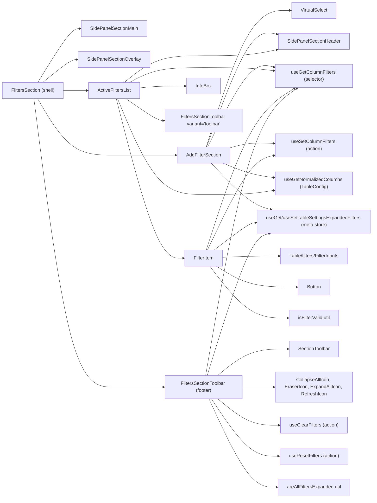
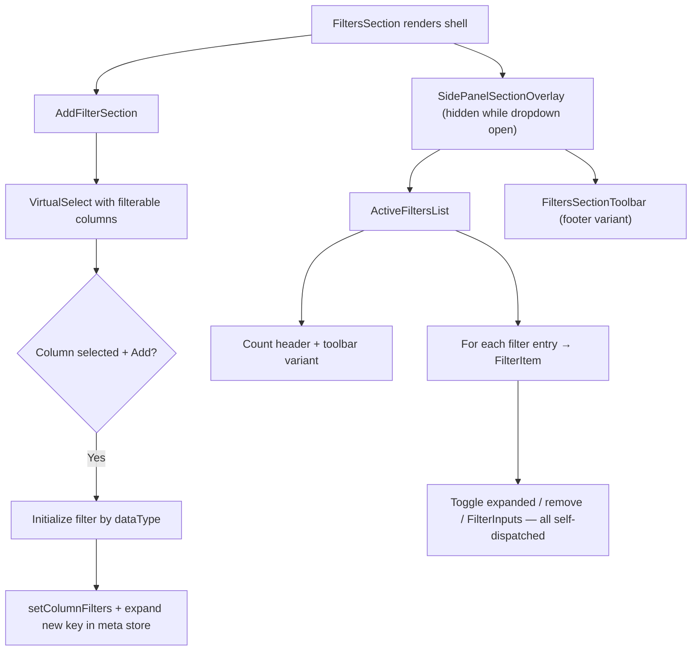

# FiltersSection Architecture

Multi-filter management with add/remove/expand/collapse and validation.
A thin shell composing self-connected delegates (PATTERNS.md § Thin Shell +
Self-Connected Delegates); expanded-filter state is owned by the table meta
store (persisted across drawer reopen), not by the section.

## State Ownership Rule

No store state is prop-drilled through the shell. Each delegate reads the
selectors and dispatches the actions it needs itself:

| Delegate                | Reads (selectors)                                              | Dispatches (actions)                                        |
| ----------------------- | -------------------------------------------------------------- | ----------------------------------------------------------- |
| `FiltersSection`        | — (holds only the `isAddFilterOpen` overlay presentation flag) | —                                                           |
| `AddFilterSection`      | columns, normalizedColumns, columnFilters, expandedFilters     | setColumnFilters, setTableSettingsExpandedFilters           |
| `ActiveFiltersList`     | columnFilters, normalizedColumns                               | — (rows self-connect)                                       |
| `FilterItem`            | columnFilters, expandedFilters                                 | setColumnFilters, setTableSettingsExpandedFilters           |
| `FiltersSectionToolbar` | columnFilters, expandedFilters                                 | clearFilters, resetFilters, setTableSettingsExpandedFilters |

`expandedFilters` is a `readonly string[]` slice of the table meta store
(`tableSettingsExpandedFilters`), persisted via `persistTableMetaUiState` —
single ownership; the former local `Set` mirror in the shell was removed.

## File Structure

```
FiltersSection/
├── index.ts                            → Barrel export
├── FiltersSection.component.tsx        → Thin shell: AddFilter + overlay(ActiveList + footer toolbar)
├── FiltersSection.types.ts             → { isBusy? }
├── FiltersSection.component.test.tsx   → Shell composition/overlay tests
│
├── AddFilterSection/                   → Dropdown to add new filters (self-connected)
│   ├── index.ts
│   ├── AddFilterSection.component.tsx  → VirtualSelect + Add; expands the new filter itself
│   ├── AddFilterSection.types.ts       → { isBusy?, onDropdownOpenChange? }
│   ├── AddFilterSection.stylex.ts
│   └── utils/getSelectedColumnLabel.util.ts → Label with "⚠️ (filtered)" suffix
│
├── ActiveFiltersList/                  → List shell: count header + toolbar + rows (self-connected)
│   ├── index.ts
│   ├── ActiveFiltersList.component.tsx
│   ├── ActiveFiltersList.types.ts      → { isBusy? }
│   ├── ActiveFiltersList.stylex.ts
│   └── FilterItem/                     → One filter row (self-connected)
│       ├── index.ts
│       ├── FilterItem.component.tsx    → Toggle/remove/inputs own their store wiring
│       ├── FilterItem.types.ts         → { column, columnKey, filter, isBusy }
│       ├── FilterItem.test.tsx
│       └── FilterItem.stylex.ts
│
├── FiltersSectionToolbar/              → Clear/reset/expand-all/collapse-all (fully self-connected)
│   ├── index.ts
│   ├── FiltersSectionToolbar.component.tsx
│   ├── FiltersSectionToolbar.types.ts  → { isBusy?, variant? }
│   └── FiltersSectionToolbar.test.tsx
│
└── utils/
    ├── areAllFiltersExpanded.util.ts   → Pure: all active filter keys expanded (toolbar disabled flag)
    ├── isFilterValid.util.ts (+ per-type validators)
    └── …
```

## Dependencies



## Render Flow



## Filter Validation (isFilterValid + per-type validators)

| Data Type     | Valid When                                          |
| ------------- | --------------------------------------------------- |
| `boolean`     | Always valid                                        |
| `date`        | Has value; "between" needs both values              |
| `select`      | Has at least one selection                          |
| `multiSelect` | Has at least one selection                          |
| `number`      | Has at least one value; "between" validates both    |
| `text`        | Some operators (equals, notEquals) don't need value |

## Toolbar Dual-Variant Pattern

| Variant     | Placement                | Button Style            | Labels?        |
| ----------- | ------------------------ | ----------------------- | -------------- |
| `'toolbar'` | ActiveFiltersList header | `ghost`, `mini`, `auto` | No (icon only) |
| `'footer'`  | Below filter list        | `outline`, `sm`, `full` | Yes            |

| Button        | Action                                      | Disabled When                      |
| ------------- | ------------------------------------------- | ---------------------------------- |
| Expand All    | `setExpandedFilters(filterKeys)`            | No filters or all already expanded |
| Collapse All  | `setExpandedFilters([])`                    | Nothing expanded                   |
| Clear Filters | `clearFilters()` + `setExpandedFilters([])` | No filters exist                   |
| Reset Filters | `resetFilters()` (from table)               | Never                              |
