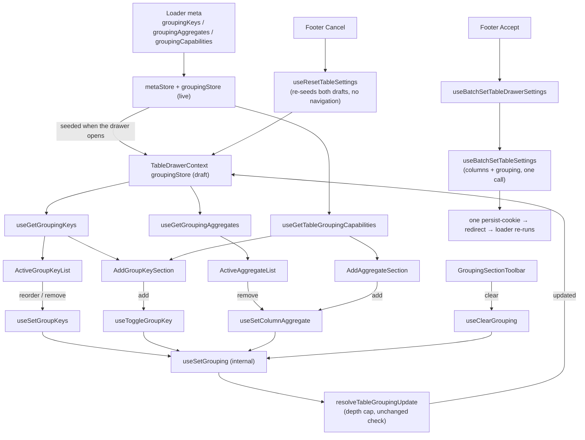

# GroupingSection Architecture

The settings drawer's Grouping tab: the staged group keys in nesting order,
the staged aggregates, the totals mode, and the controls to add either.

**The totals mode is grouping configuration, not a display setting.** `rollup`
adds a subtotal row per level and a grand total to what the read returns, so it
changes the SQL and travels in the `grouping` param with the keys — which is why
it stages and commits here rather than sitting in the general settings section
([ADR-065](../../../../../../../docs/decisions/ADR-065-grouped-rows-render-a-hierarchy-column.md)).

Rendered only where the route declared `isGroupingEnabled` on its loader `meta`
([ADR-063](../../../../../../../docs/decisions/ADR-063-request-shaping-capabilities-on-the-loader-meta.md)).
Absent means off, so a table whose endpoint cannot group has no Grouping tab at
all.

## Staged like every other section, committed differently

Every control here writes the drawer's grouping **draft**, and Accept commits
it. That is the same contract the sorting, filters and columns sections keep —
`TableDrawerContext` seeds the drafts when the drawer opens, edits accumulate
there, Accept commits and Cancel discards.

What differs is the commit, not the staging. Column state is cookie-persisted;
grouping is URL state
([ADR-061](../../../../../../../docs/decisions/ADR-061-grouping-config-in-url-expansion-in-store.md)),
so committing it writes the `grouping` search param and the resulting redirect
re-runs the loader, because the configuration decides what SQL the route emits.
So grouping is a **second store** on `TableDrawerContext` rather than a slice of
the columns draft, and `useBatchSetTableSettings` carries both.

**Accept is one navigation, whatever was staged.** Both commits ride in a single
`persistTableState` call, which matters for a reason that is easy to miss:
column state and grouping submit through the same `persist-table-state` fetcher
key, and `router.fetch` aborts a key's in-flight request before starting the
next — two calls would cancel one commit and cost two navigations for the half
that survived. `GroupingSection.test.tsx` asserts the count across a multi-edit
sequence, because asserting the resulting grouping alone passes under the
per-edit behaviour this replaced.

The **column-header grouping menu is the surface that still applies
immediately**, and legitimately: it is a direct action with no Accept to wait
for. Its actions live in `TableConfig/grouping/actions`; the drawer's staged
twins live in `TableDrawerContext/actions` and resolve through the same
`applyGroupingReducer`, so the drawer cannot stage a configuration Accept would
then refuse.

This reverses the live-write departure #568 introduced ([#654](https://github.com/luciocabrera/vite-react-compiler/issues/654)):
a Cancel button that did not cancel is a correctness problem, and batching turns
N loader round trips into one.

## File Structure

```
GroupingSection/
├── ARCHITECTURE.md
├── GroupingSection.component.tsx       → Shell: add-key, overlay, lists, toolbar
├── GroupingSection.test.tsx            → Staging + navigation-count integration test
├── GroupingSection.types.ts            → GroupingSectionProps, GroupKeyItem
├── index.ts
├── AddGroupKeySection/                 → VirtualSelect for adding a group key
├── ActiveGroupKeyList/                 → DraggableList of staged keys
│   └── GroupKeyItemContent/            → One key row: level, label, remove
├── AddAggregateSection/                → Column select → legal-function select
├── ActiveAggregateList/                → Staged aggregates, each removable
├── GroupingModeSection/                → Totals mode: groups only, or groups with subtotals
├── GroupingSectionToolbar/             → Clear grouping (toolbar + footer)
└── utils/
    ├── toGroupKeyItems.util.ts         → Staged keys + labels, in nesting order
    ├── toAggregateItems.util.ts        → Staged aggregates + labels, column order
    └── toAggregatableColumnOptions.util.ts → Columns the catalogue can aggregate
```

## Data flow



## Where each answer comes from

| Question                                | Answered by                                        | Not by                                |
| --------------------------------------- | -------------------------------------------------- | ------------------------------------- |
| May this column be a group key at all?  | `resolveColumnCapabilities(column).isGroupable`    | the catalogue (that is #642's half)   |
| Which aggregates may this column take?  | `metaState.groupingCapabilities[key].aggregates`   | `TableColumn.dataType` (#550)         |
| How many keys may be applied?           | `MAX_TABLE_GROUP_KEYS`                             | anything local to a component         |
| Is this configuration a change at all?  | `resolveTableGroupingUpdate`                       | the component                         |
| What grouping is the section showing?   | `TableDrawerContext`'s `groupingStore` (the draft) | the live `TableConfig` grouping store |
| What grouping is the **table** showing? | `TableConfig`'s `groupingStore`                    | the draft, until Accept commits it    |

`TableColumn.dataType` is a five-member presentation vocabulary that reports
`numeric`, `jsonb` and `point` alike as `string`, so a menu built from it offers
`sum` on columns that cannot take it and hides it on the one column that can.
That is the defect #550 found and
[ADR-058](../../../../../../../docs/decisions/ADR-058-grouping-legality-by-analytical-role.md)
settled; the aggregate lists here read the catalogue's per-column answer instead.

## Depth cap

`MAX_TABLE_GROUP_KEYS` is read in three places and enforced in one:

- `AddGroupKeySection` replaces its control with a message at the cap;
- `GroupByColumnButton` (header menu) disables adding at the cap;
- `resolveTableGroupingUpdate` **refuses** a longer list, whole rather than
  truncated — truncating would group by a prefix of what was asked for and
  answer a different question in silence. Both write paths run it, the staged
  one and the live one, so the drawer refuses at the cap exactly where the
  commit would.

The cap is one of two key-list invariants, both checked by `areGroupKeysLegal`
and both refused whole: the other is that no key repeats. `getInitialGroupingState`
checks the same predicate, because seeding the store is a write path too — and
the one a consumer's hand-written loader reaches directly, where an unchecked
list renders as grouped and then raises at `assertGroupKeys`.

It is a duplicate of `@lcabrera/server`'s `MAX_GROUP_KEYS`
([ADR-039](../../../../../../../docs/decisions/ADR-039-duplicate-over-undeclared-edges.md)),
pinned to it by `groupingContract.test.ts` in `apps/react-router`.

## Props

| Component                | Prop                   | Type                        | Default    | Notes                                   |
| ------------------------ | ---------------------- | --------------------------- | ---------- | --------------------------------------- |
| `GroupingSection`        | `isBusy`               | `boolean`                   | `false`    | Forwarded to every delegate             |
| `AddGroupKeySection`     | `isBusy`               | `boolean`                   | `false`    |                                         |
| `AddGroupKeySection`     | `onDropdownOpenChange` | `(isOpen: boolean) => void` | —          | Dims the rest of the section while open |
| `ActiveGroupKeyList`     | `isBusy`               | `boolean`                   | `false`    |                                         |
| `AddAggregateSection`    | `isBusy`               | `boolean`                   | `false`    |                                         |
| `ActiveAggregateList`    | `isBusy`               | `boolean`                   | `false`    |                                         |
| `GroupingSectionToolbar` | `isBusy`               | `boolean`                   | `false`    |                                         |
| `GroupingSectionToolbar` | `variant`              | `'footer' \| 'toolbar'`     | `'footer'` | The dual-variant pattern                |

Every delegate is self-connected: the shell forwards presentation flags and
nothing else, so no grouping state is drilled through it.

## What is deliberately absent

**A reset button.** Sorting's toolbar has clear _and_ reset because sorting has a
cookie-persisted default to reset to. Grouping has none — it is URL state — so
the two would be one action under two names.

**A filter input beside an aggregate.** A filtered aggregate has no slot in the
compact `grouping` param the whole configuration round-trips through, so
offering one would build a state a shared link silently loses. Deferred by #569,
and closed on every path this package owns — the menus, the commands, the store
and the param — rather than merely left unbuilt. The capability itself still
exists on `@lcabrera/server`'s `GroupAggregate`; what is unreachable is reaching
it from here.

**Group-key refusal UX.** A key the catalogue refuses (a primary key, a `jsonb`
column) still produces an error page. `groupingCapabilities` carries `canGroup`
and the reason for exactly that surface; wiring it is #642.
