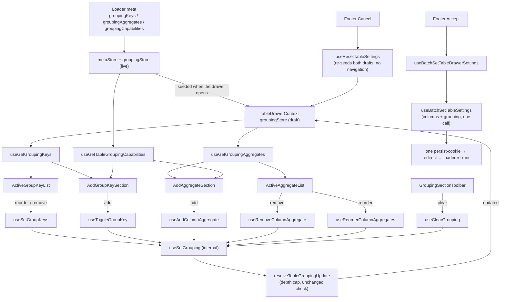

# GroupingSection Architecture

The settings drawer's Grouping tab: the staged group keys in nesting order,
the staged aggregates, the totals mode, and the controls to add either.

**The totals mode is grouping configuration, not a display setting.** `rollup`
adds a subtotal row per level and a grand total to what the read returns, so it
changes the SQL and travels in the `grouping` param with the keys — which is why
it stages and commits here rather than sitting in the general settings section
([ADR-065](../../../../../../../docs/decisions/ADR-065-grouped-rows-render-a-hierarchy-column.md)).

Rendered only where the route declared `isGroupingEnabled` on its loader `meta`
([ADR-063](../../../../../../../docs/decisions/ADR-063-request-shaping-capabilities-on-the-loader-meta.md)).
Absent means off, so a table whose endpoint cannot group has no Grouping tab at
all.

## Staged like every other section, committed differently

Every control here writes the drawer's grouping **draft**, and Accept commits
it. That is the same contract the sorting, filters and columns sections keep —
`TableDrawerContext` seeds the drafts when the drawer opens, edits accumulate
there, Accept commits and Cancel discards.

What differs is the commit, not the staging. Column state is cookie-persisted;
grouping is URL state
([ADR-061](../../../../../../../docs/decisions/ADR-061-grouping-config-in-url-expansion-in-store.md)),
so committing it writes the `grouping` search param and the resulting redirect
re-runs the loader, because the configuration decides what SQL the route emits.
So grouping is a **second store** on `TableDrawerContext` rather than a slice of
the columns draft, and `useBatchSetTableSettings` carries both.

**Accept is one navigation, whatever was staged.** Both commits ride in a single
`persistTableState` call, which matters for a reason that is easy to miss:
column state and grouping submit through the same `persist-table-state` fetcher
key, and `router.fetch` aborts a key's in-flight request before starting the
next — two calls would cancel one commit and cost two navigations for the half
that survived. `GroupingSection.test.tsx` asserts the count across a multi-edit
sequence, because asserting the resulting grouping alone passes under the
per-edit behaviour this replaced.

The **column-header grouping menu is the surface that still applies
immediately**, and legitimately: it is a direct action with no Accept to wait
for. Its actions live in `TableConfig/grouping/actions`; the drawer's staged
twins live in `TableDrawerContext/actions` and resolve through the same
`applyGroupingReducer`, so the drawer cannot stage a configuration Accept would
then refuse.

This reverses the live-write departure #568 introduced ([#654](https://github.com/luciocabrera/lcabrera-stack/issues/654)):
a Cancel button that did not cancel is a correctness problem, and batching turns
N loader round trips into one.

## File Structure

```
GroupingSection/
├── ARCHITECTURE.md
├── GroupingSection.component.tsx       → Shell: add-key, overlay, lists, toolbar
├── GroupingSection.test.tsx            → Staging + navigation-count integration test
├── GroupingSection.types.ts            → GroupingSectionProps, GroupKeyItem, AggregateItem, AggregatePickerGap
├── index.ts
├── AddGroupKeySection/                 → VirtualSelect for adding a group key
├── ActiveGroupKeyList/                 → DraggableList of staged keys
│   └── GroupKeyItemContent/            → One key row: level, label, remove
├── AddAggregateSection/                → Column select → addable-function select, or the message saying why it went quiet
├── ActiveAggregateList/                → DraggableList of staged aggregates — one row per (column, function)
│   ├── AggregateItemContent/           → One measure row: label, share toggle, remove
│   └── ShareOfTotalToggle/             → Share of the grand total, on the measures it is defined for
├── GroupingModeSection/                → Totals mode: groups only, or groups with subtotals
├── TotalsPlacementSection/             → Totals position: above or below their rows (rollup only)
├── GroupingSectionToolbar/             → Clear grouping (toolbar + footer)
└── utils/
    ├── toGroupKeyItems.util.ts         → Staged keys + labels, in nesting order
    ├── toAggregateItems.util.ts        → Staged aggregates + labels + a per-entry id, in staged order
    ├── toAggregatableColumnOptions.util.ts → Columns an aggregate may be offered on (resolveOfferableAggregates, in display order)
    ├── resolveAddableAggregates.util.ts → Functions still ADDABLE on the chosen column: what the read affords, minus what it carries — with the cause when that is nothing
    ├── resolveAggregatePickerGap.util.ts → Which cause emptied the function list, ordered by which control the user must act on
    └── toGroupKeyColumnOptions.util.ts → Columns that may still be a group key (declared ∧ catalogue, minus staged)
```

## Data flow



## Where each answer comes from

| Question                                        | Answered by                                                                                             | Not by                                                          |
| ----------------------------------------------- | ------------------------------------------------------------------------------------------------------- | --------------------------------------------------------------- |
| May this column be a group key at all?          | `resolveGroupKeyAvailability` — the declared flag narrowed by the catalogue                             | either gate alone (ADR-068)                                     |
| Which aggregates does this column's type allow? | `metaState.groupingCapabilities[key].aggregates`                                                        | `TableColumn.dataType` (#550)                                   |
| Which of those may be **offered** here?         | `resolveOfferableAggregates` — those, minus an active group key                                         | either half on its own (#830)                                   |
| Which of those can the **read** still afford?   | `resolveAffordableAggregates` — those, minus a spent `countDistinct` budget (#842)                      | any per-column answer, which cannot see the rest of the request |
| Which of those may still be **added** here?     | `resolveAddableAggregates` — those, minus what the column carries (#841)                                | the shared predicate, which the menu shares                     |
| Why is there no function to offer?              | `resolveAggregatePickerGap`, mapped to a message in `AddAggregateSection.constants.ts`                  | the empty list, which every cause produces                      |
| May this measure show a share?                  | `isShareableAggregate` — additive measures only (ADR-086)                                               | the column, which has no say in it                              |
| Which measure does a share belong to?           | the `(columnKey, fn)` pair (#831)                                                                       | the column key alone                                            |
| In what order are the measures listed?          | the staged `aggregates` order, dragged in this list (#832)                                              | the column order, which no longer orders it                     |
| How many keys may be applied?                   | `MAX_TABLE_GROUP_KEYS`                                                                                  | anything local to a component                                   |
| How many distinct counts may a read carry?      | `MAX_TABLE_COUNT_DISTINCT_AGGREGATES`, via `isWithinCountDistinctBudget` / `hasCountDistinctBudgetLeft` | anything local to a component                                   |
| Is this configuration a change at all?          | `resolveTableGroupingUpdate`                                                                            | the component                                                   |
| What grouping is the section showing?           | `TableDrawerContext`'s `groupingStore` (the draft)                                                      | the live `TableConfig` grouping store                           |
| What grouping is the **table** showing?         | `TableConfig`'s `groupingStore`                                                                         | the draft, until Accept commits it                              |
| Where do the totals go?                         | `TableDrawerContext`'s `totalsPlacementStore` (the draft)                                               | the grouping draft — see below                                  |
| May the user reshape the grouping?              | `metaState.isGroupingLocked`, read by each delegate itself                                              | a prop drilled from the shell                                   |

`TableColumn.dataType` is a five-member presentation vocabulary that reports
`numeric`, `jsonb` and `point` alike as `string`, so a menu built from it offers
`sum` on columns that cannot take it and hides it on the one column that can.
That is the defect #550 found and
[ADR-058](../../../../../../../docs/decisions/ADR-058-grouping-legality-by-analytical-role.md)
settled; the aggregate lists here read the catalogue's per-column answer instead.

The **key** list reads it too, since #642: `toGroupKeyColumnOptions` filters
through `resolveGroupKeyAvailability`, so a column the catalogue refuses is not
offered here any more than the header menu leaves it enabled. Offering one meant
a selection the endpoint rejected, which reached the user as an empty table with
no message
([ADR-068](../../../../../../../docs/decisions/ADR-068-a-refused-read-is-rendered-data-not-an-exception.md)).
A refused column is **left out** here rather than listed and disabled: a
`VirtualSelect` option carries no room for a reason, and the header menu is where
a user asks about one specific column.

The **aggregate** lists reached the same shape one issue later, and for the
mirror-image reason. Both of them —
`toAggregatableColumnOptions`' column list and `AddAggregateSection`'s function
list — resolve through
[`resolveOfferableAggregates`](../../utils/ARCHITECTURE.md), which composes the
catalogue's type legality with "is this column an active group key" and answers
with nothing at all in the second case: under one column per key that column
renders its key's value, so an aggregate chosen on it could never be shown
([ADR-080](../../../../../../../docs/decisions/ADR-080-a-group-key-renders-in-its-own-column.md)).
This picker had that second condition and the column header menu did not, so the
menu offered functions on a column this list had already dropped and clicking
one wrote the grouping store and changed nothing on screen (#830). One predicate
now serves both, each fed from its own commit context — the draft keys here, the
live ones there.

The picker is still not where the rule is enforced. The grouping configuration
is URL state, so a request can always name one column as both key and measure,
and `resolveGroupCellChildren` is where the key actually wins.

### The one answer the picker and the menu give differently

The function picker subtracts the aggregates the chosen column already carries;
the header menu does not. That is the design, not drift (#841), and it is worth
saying plainly because the two surfaces sharing one legality predicate is the
whole point of the paragraph above.

**Legality is a property of the column, so it is shared. What to do with an
applied function is a property of the gesture, so it is not.** This picker only
ever adds, and #831 made adding an append with a duplicate guard — so offering a
function the column already carries offers a guarded no-op: Add accepts the
choice, `addTableColumnAggregate` returns the state it was handed, and nothing
moves. That is the very thing `commands/ARCHITECTURE.md` rules out, _"never
offered rather than offered-and-disabled"_. The header menu **toggles**, so the
applied item there is the only affordance that removes the aggregate; subtracting
it would leave an aggregate that can be applied from the menu and not cleared
from it.

So the subtraction lives in `resolveAddableAggregates`, **beside**
`resolveOfferableAggregates` rather than inside it. Giving the shared predicate
the aggregate list would force one answer on both surfaces, and it is the menu
that would lose. `resolveOfferableAggregates.surfaces.test.tsx` asserts both
halves against the same applied aggregate, so a later "harmonisation" fails
there rather than reaching a user.

`gap` is the second half of that util's answer, and it exists because an empty
function list has several causes that must not read alike: the read has no room
for another distinct count (#842), every legal function is already applied
(#841), or none was legal at all (an unaggregatable column, a staged group key,
no column chosen yet). The last has nothing to say and answers `undefined`; the
first two each need saying, and they need saying **differently** — the **column**
list does not subtract either kind of column (that list is #830's and stays as it
is), so it is still offered and the picker has to explain why it went quiet. It
shows an `InfoBox` in place of the control, the same shape `AddGroupKeySection`
uses at the depth cap.

The two messages are not interchangeable, which is why the cause travels rather
than being inferred from the empty list. "This column has them all" sends the
user to this column's own measures; "the read has no room for another distinct
count" sends them to whichever **other** column holds one — and it names a cost
rather than a prohibition, because that is what
`MAX_TABLE_COUNT_DISTINCT_AGGREGATES` is: `count(DISTINCT …)` sorts every group,
again per grouping set. Getting that wrong would teach a reader that their data
forbids something it does not. `AddAggregateSection.constants.ts` holds the map,
closed over `AggregatePickerGap`, so a cause with no message is a type error
rather than a blank box.

### A second Distinct Count is withheld, and not by this util

The budget is a property of the **whole request** — every column's aggregates
counted together — so it cannot be a per-column answer, and it must reach the
header menu too. It lives in `resolveAffordableAggregates`
([`Table/utils/`](../../utils/ARCHITECTURE.md)), between the shared per-column
predicate and this one, and both offering surfaces resolve through it.

Its count leaves out the column being asked about. That is #841's trap on a new
axis: withholding the function everywhere would take away the header menu item
that removes an applied distinct count, so the column carrying one goes on being
offered it while every other column is not. This picker never sees the
difference, since it subtracts what the column carries anyway.

## Totals placement is staged here but is not part of the grouping

`TotalsPlacementSection` sits beside the mode control and stages like everything
else, but what it stages lives in its **own** draft store rather than in the
grouping draft, because it commits somewhere else: the grouping goes to the
`grouping` search param, while the placement goes to the `totals` param **and**
the UI-flags cookie, since it is a preference that outlives the table it was set
on (ADR-085).

It renders only under `rollup`. `flat` emits no subtotal and no grand total, so
there would be nothing to position.

## A column carries as many aggregates as the user asks for

`aggregates` is an ordered list of `(columnKey, fn)` records, so `total_amount`
can show its minimum and its average at once (#831). Three consequences land in
this section:

- **The list is one row per pair**, keyed by the pair rather than by the column —
  a column key repeats the moment a column carries two measures, and React would
  reconcile two distinct rows as one.
- **The order is staged state**, not column order: it is what the `grouping` param
  carries and what the user drags (#832), so `toAggregateItems` preserves it
  rather than sorting.
- **Adding is an append with a duplicate guard**, not a replace. Re-adding an
  applied pair answers with the state it was handed, so the commit reports
  `unchanged` and nothing navigates. The picker does not offer that pair in the
  first place (#841, above) — the guard is the backstop, not the affordance.

The header menu writes the same shape live: `AggregateButton` derives its
pressed state through `deriveAggregateCommandState` — the aggregates' **own**
derivation, beside the shared `deriveToggleCommandState` rather than widening it,
because several items can be active at once and sorting must not gain that state.

## The aggregate order is dragged, and the drag names ids

`ActiveAggregateList` renders through `DraggableList`, like the three staged
lists beside it. Until the shape change there was nothing to drag: a
column-to-function map has no order of its own, and a handle would have offered
a choice with no effect. An ordered list makes the order a real choice, and the
`agg` array is what carries it through the URL — so a reorder survives a shared
link and a reload, and one that did not would be a defect here rather than in
the format.

**The reorder is a permutation named by row ids, not a whole-list write.** That
is where `useReorderColumnAggregates` departs from `useSetGroupKeys`, whose
reorder rebuilds the key list from the rows. It has to: `toGroupKeyItems` keeps
a key whose column the route does not declare, labelling it by key, while
`toAggregateItems` **drops** the equivalent aggregate — so rebuilding the
aggregate list from what is on screen would un-stage an entry the user never saw
and never touched. `reorderTableColumnAggregates` sorts the staged entries by
the ids it was handed instead, which can neither invent an aggregate nor drop
one; anything the ids do not name keeps its relative order after those they do.

The row identity is the `(columnKey, fn)` token, not the column, for the same
reason the list is one row per pair — by the time a column can appear twice, a
column-keyed `DraggableItem.id` would make two rows one drag target.

## A share is chosen here and rendered elsewhere

`ShareOfTotalToggle` sits on each applied aggregate and stages that
**`(columnKey, fn)` pair** into the grouping draft's `shares` — an aggregate
rather than a column, because `sum` and `count` are both shareable and a column
may carry both (#831, widening ADR-086). What it turns on is rendered by `TableGroupShare`,
inside the measure's own cell in the grid — not by anything in this section, and
not in a column of its own (ADR-086 §4 records why a derived column would undo
ADR-080).

It renders itself away on every aggregate a share is **not** defined for, which
is everything but `sum` and `count`. That is a legality rule rather than a
preference: the denominator is derived from the rows the read returned, and only
an additive measure has one that can be derived correctly.

## A locked preset

A route may declare `meta.isGroupingLocked`, which fixes the grouping's shape —
its keys, its mode and its per-key granularity — while leaving the aggregates
editable: a curated grouping says how rows are grouped, not what is measured
over them.

Every delegate that reshapes the grouping reads the flag **itself**, the same
way it reads everything else here. That is not only the self-connected-delegate
pattern: the drawer is not the only surface that edits a grouping — the
column-header menu does too — so the lock is applied per surface rather than by
hiding one container. A lock honoured in the drawer and ignored in the header
menu is not a lock.

Under a lock the key list still renders, without its drag handles and remove
controls. "Hides the picker while still rendering the grouping" is the
requirement, and a reader still needs to see what the table is grouped by.

## Depth cap

`MAX_TABLE_GROUP_KEYS` is read in three places and enforced in one:

- `AddGroupKeySection` replaces its control with a message at the cap;
- `GroupByColumnButton` (header menu) disables adding at the cap;
- `resolveTableGroupingUpdate` **refuses** a longer list, whole rather than
  truncated — truncating would group by a prefix of what was asked for and
  answer a different question in silence. Both write paths run it, the staged
  one and the live one, so the drawer refuses at the cap exactly where the
  commit would.

The cap is one of two key-list invariants, both checked by `areGroupKeysLegal`
and both refused whole: the other is that no key repeats. `getInitialGroupingState`
checks the same predicate, because seeding the store is a write path too — and
the one a consumer's hand-written loader reaches directly, where an unchecked
list renders as grouped and then raises at `assertGroupKeys`.

It is a duplicate of `@lcabrera/server`'s `MAX_GROUP_KEYS`
([ADR-039](../../../../../../../docs/decisions/ADR-039-duplicate-over-undeclared-edges.md)),
pinned to it by a contract test in a consumer that depends on both packages.

`MAX_TABLE_COUNT_DISTINCT_AGGREGATES` is the second constant of that shape and is
pinned by the same test (#842). It is not a depth cap: it bounds the **read**
rather than the key list, so it is checked by `isWithinCountDistinctBudget.util.ts`
rather than by `areGroupKeysLegal`, and the surfaces spend it by withholding an
offer rather than by disabling a control.
[`Table/ARCHITECTURE.md`](../../ARCHITECTURE.md) enumerates which of the
builder's other guard rails this side can breach by construction and which it
cannot predict at all.

## Props

| Component                | Prop                   | Type                        | Default    | Notes                                   |
| ------------------------ | ---------------------- | --------------------------- | ---------- | --------------------------------------- |
| `GroupingSection`        | `isBusy`               | `boolean`                   | `false`    | Forwarded to every delegate             |
| `AddGroupKeySection`     | `isBusy`               | `boolean`                   | `false`    |                                         |
| `AddGroupKeySection`     | `onDropdownOpenChange` | `(isOpen: boolean) => void` | —          | Dims the rest of the section while open |
| `ActiveGroupKeyList`     | `isBusy`               | `boolean`                   | `false`    |                                         |
| `AddAggregateSection`    | `isBusy`               | `boolean`                   | `false`    |                                         |
| `ActiveAggregateList`    | `isBusy`               | `boolean`                   | `false`    |                                         |
| `TotalsPlacementSection` | `isBusy`               | `boolean`                   | `false`    | Renders nothing outside `rollup`        |
| `GroupingSectionToolbar` | `isBusy`               | `boolean`                   | `false`    |                                         |
| `GroupingSectionToolbar` | `variant`              | `'footer' \| 'toolbar'`     | `'footer'` | The dual-variant pattern                |

Every delegate is self-connected: the shell forwards presentation flags and
nothing else, so no grouping state is drilled through it.

## What is deliberately absent

**A reset button.** Sorting's toolbar has clear _and_ reset because sorting has a
cookie-persisted default to reset to. Grouping has none — it is URL state — so
the two would be one action under two names.

**A filter input beside an aggregate.** A filtered aggregate has no slot in the
compact `grouping` param the whole configuration round-trips through, so
offering one would build a state a shared link silently loses. Deferred by #569,
and closed on every path this package owns — the menus, the commands, the store
and the param — rather than merely left unbuilt. The capability itself still
exists on `@lcabrera/server`'s `GroupAggregate`; what is unreachable is reaching
it from here.

**Group-key refusal UX.** A key the catalogue refuses (a primary key, a `jsonb`
column) still produces an error page. `groupingCapabilities` carries `canGroup`
and the reason for exactly that surface; wiring it is #642.
