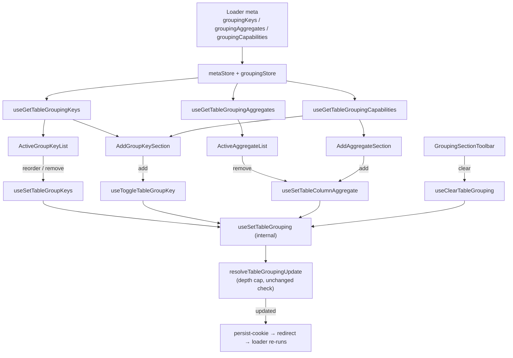

# GroupingSection Architecture

The settings drawer's Grouping tab: the applied group keys in nesting order,
the selected aggregates, and the controls to add either.

Rendered only where the route declared `isGroupingEnabled` on its loader `meta`
([ADR-063](../../../../../../../docs/decisions/ADR-063-request-shaping-capabilities-on-the-loader-meta.md)).
Absent means off, so a table whose endpoint cannot group has no Grouping tab at
all.

## The one deliberate departure from its siblings

Every other drawer section edits a **draft** — `TableDrawerContext` seeds a copy
of the columns store and `useBatchSetTableDrawerSettings` commits the lot on
Accept. This section writes through the **live** grouping store instead.

The draft exists so a batch of cookie-persisted column state commits in one
write. Grouping is URL state
([ADR-061](../../../../../../../docs/decisions/ADR-061-grouping-config-in-url-expansion-in-store.md)):
every change writes the `grouping` search param through the persist-cookie flow
and the resulting redirect re-runs the loader, because the configuration decides
what SQL the route emits. Drafting it would mean the drawer showed a grouping
the table was not showing — for a control that restates the query, a worse trade
than a navigation per edit.

The consequence to know: **each edit here is a navigation**, the same as a click
in the column header menu.

## File Structure

```
GroupingSection/
├── ARCHITECTURE.md
├── GroupingSection.component.tsx       → Shell: add-key, overlay, lists, toolbar
├── GroupingSection.types.ts            → GroupingSectionProps, GroupKeyItem
├── index.ts
├── AddGroupKeySection/                 → VirtualSelect for adding a group key
├── ActiveGroupKeyList/                 → DraggableList of applied keys
│   └── GroupKeyItemContent/            → One key row: level, label, remove
├── AddAggregateSection/                → Column select → legal-function select
├── ActiveAggregateList/                → Selected aggregates, each removable
├── GroupingSectionToolbar/             → Clear grouping (toolbar + footer)
└── utils/
    ├── toGroupKeyItems.util.ts         → Applied keys + labels, in nesting order
    ├── toAggregateItems.util.ts        → Selected aggregates + labels, column order
    └── toAggregatableColumnOptions.util.ts → Columns the catalogue can aggregate
```

## Data flow



## Where each answer comes from

| Question                               | Answered by                                      | Not by                              |
| -------------------------------------- | ------------------------------------------------ | ----------------------------------- |
| May this column be a group key at all? | `resolveColumnCapabilities(column).isGroupable`  | the catalogue (that is #642's half) |
| Which aggregates may this column take? | `metaState.groupingCapabilities[key].aggregates` | `TableColumn.dataType` (#550)       |
| How many keys may be applied?          | `MAX_TABLE_GROUP_KEYS`                           | anything local to a component       |
| Is this configuration a change at all? | `resolveTableGroupingUpdate`                     | the component                       |

`TableColumn.dataType` is a five-member presentation vocabulary that reports
`numeric`, `jsonb` and `point` alike as `string`, so a menu built from it offers
`sum` on columns that cannot take it and hides it on the one column that can.
That is the defect #550 found and
[ADR-058](../../../../../../../docs/decisions/ADR-058-grouping-legality-by-analytical-role.md)
settled; the aggregate lists here read the catalogue's per-column answer instead.

## Depth cap

`MAX_TABLE_GROUP_KEYS` is read in three places and enforced in one:

- `AddGroupKeySection` replaces its control with a message at the cap;
- `GroupByColumnButton` (header menu) disables adding at the cap;
- `resolveTableGroupingUpdate` **refuses** a longer list, whole rather than
  truncated — truncating would group by a prefix of what was asked for and
  answer a different question in silence.

The cap is one of two key-list invariants, both checked by `areGroupKeysLegal`
and both refused whole: the other is that no key repeats. `getInitialGroupingState`
checks the same predicate, because seeding the store is a write path too — and
the one a consumer's hand-written loader reaches directly, where an unchecked
list renders as grouped and then raises at `assertGroupKeys`.

It is a duplicate of `@lcabrera/server`'s `MAX_GROUP_KEYS`
([ADR-039](../../../../../../../docs/decisions/ADR-039-duplicate-over-undeclared-edges.md)),
pinned to it by `groupingContract.test.ts` in `apps/react-router`.

## Props

| Component                | Prop                   | Type                        | Default    | Notes                                   |
| ------------------------ | ---------------------- | --------------------------- | ---------- | --------------------------------------- |
| `GroupingSection`        | `isBusy`               | `boolean`                   | `false`    | Forwarded to every delegate             |
| `AddGroupKeySection`     | `isBusy`               | `boolean`                   | `false`    |                                         |
| `AddGroupKeySection`     | `onDropdownOpenChange` | `(isOpen: boolean) => void` | —          | Dims the rest of the section while open |
| `ActiveGroupKeyList`     | `isBusy`               | `boolean`                   | `false`    |                                         |
| `AddAggregateSection`    | `isBusy`               | `boolean`                   | `false`    |                                         |
| `ActiveAggregateList`    | `isBusy`               | `boolean`                   | `false`    |                                         |
| `GroupingSectionToolbar` | `isBusy`               | `boolean`                   | `false`    |                                         |
| `GroupingSectionToolbar` | `variant`              | `'footer' \| 'toolbar'`     | `'footer'` | The dual-variant pattern                |

Every delegate is self-connected: the shell forwards presentation flags and
nothing else, so no grouping state is drilled through it.

## What is deliberately absent

**A reset button.** Sorting's toolbar has clear _and_ reset because sorting has a
cookie-persisted default to reset to. Grouping has none — it is URL state — so
the two would be one action under two names.

**A filter input beside an aggregate.** A filtered aggregate has no slot in the
compact `grouping` param the whole configuration round-trips through, so
offering one would build a state a shared link silently loses. Deferred by #569,
and closed on every path this package owns — the menus, the commands, the store
and the param — rather than merely left unbuilt. The capability itself still
exists on `@lcabrera/server`'s `GroupAggregate`; what is unreachable is reaching
it from here.

**Group-key refusal UX.** A key the catalogue refuses (a primary key, a `jsonb`
column) still produces an error page. `groupingCapabilities` carries `canGroup`
and the reason for exactly that surface; wiring it is #642.
