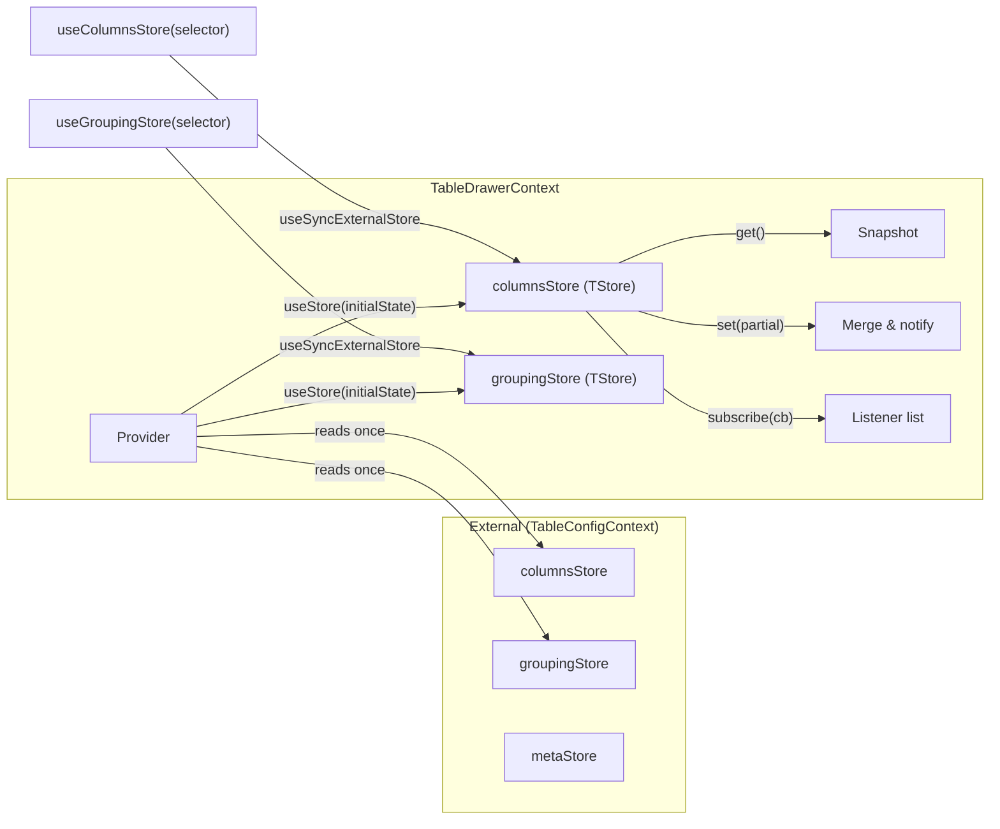
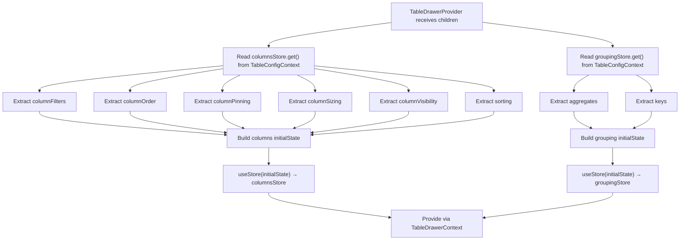

# TableDrawerContext Architecture

Store-based context that manages local table settings state within the drawer.
Changes are held locally until the user explicitly accepts or cancels.

Two stores, split by **where each one commits** rather than by how it is edited:
`columnsStore` commits to the cookie, `groupingStore` to the `grouping` search
param ([ADR-061](../../../../../../../docs/decisions/ADR-061-grouping-config-in-url-expansion-in-store.md)).
Both seed at mount — which is when the drawer opens, since `TableDrawersSection`
mounts the provider only while it is — so Cancel has a baseline to restore even
when the user's first action is a removal.

## File Structure

```
TableDrawerContext/
├── TableDrawerContext.context.ts           → createContext with empty initial store
├── TableDrawerContext.provider.tsx          → Provider: reads table state → creates store
├── TableDrawerContext.types.ts             → TableDrawerColumnsState, ContextValue
├── useTableDrawerContextValue.hook.ts      → use(TableDrawerContext)
├── useColumnsStore.hook.ts                 → Resolves the drawer's columnsStore, delegates to useStoreSelector
├── useGroupingStore.hook.ts                → Resolves the drawer's groupingStore, delegates to useStoreSelector
│
├── actions/                                → Hooks that write to the drawer stores
│   ├── buildBatchTableSettingsUpdate.util.ts → Normalize drawer snapshot into the table batch-update payload
│   ├── useBatchSetTableDrawerSettings      → Push both drafts to the table in one commit
│   ├── useClearAllSettings                 → Clear all column fields
│   ├── useClearColumnOrderSection          → Clear visibility + pinning
│   ├── useClearFilters                     → Clear all filters
│   ├── useClearGrouping                    → Stage grouping switched off
│   ├── useClearSorting                     → Clear all sorting
│   ├── useOrderColumnsBySorting            → Reorder columns by current sorting
│   ├── useResetColumnOrderAndVisibility    → Reset order + visibility from table
│   ├── useResetFilters                     → Reset filters from table
│   ├── useResetSorting                     → Reset sorting from table
│   ├── useResetTableSettings               → Re-seed both drafts from the table
│   ├── useSetColumnAggregate               → Stage / clear one column's aggregate
│   ├── useSetColumnFilters                 → Set filters object
│   ├── useSetColumnPinning                 → Set pinning state
│   ├── useSetColumnsOrder                  → Set column order array
│   ├── useSetColumnsSizing                 → Set column widths
│   ├── useSetColumnsSortings               → Set sorting array
│   ├── useSetColumnsVisibility             → Set visibility set
│   ├── useSetGrouping                      → Internal: the draft's single grouping write path
│   ├── useSetGroupKeys                     → Stage the whole ordered key list
│   ├── useSortByColumnOrder                → Create sorts from column order
│   └── useToggleGroupKey                   → Stage adding / removing one key
│
└── selectors/                              → Hooks that read from the drawer stores
    ├── useGetColumnFilters
    ├── useGetColumnOrder
    ├── useGetColumnPinning
    ├── useGetColumnsSorting
    ├── useGetColumnVisibility
    ├── useGetGroupingAggregates
    └── useGetGroupingKeys
```

`useSetGrouping` is deliberately absent from `actions/index.ts`, the same way
`useSetTableGrouping` is absent from the live grouping barrel: the named actions
are what surfaces call, so no component computes a grouping transition itself.

## Store Pattern



The `useStore` hook (from `@/hooks`) creates a store with `get`, `set`, `subscribe`, and
`getServerSnapshot`. The store holds a flat object; `set()` does a shallow merge
(`{ ...prev, ...partial }`), then notifies all subscribers.

## State Shape

```typescript
TableDrawerColumnsState<TData> = Pick<
  TableColumnsState<TData>,
  | 'columnFilters' // Record<string, ColumnFilter>
  | 'columnOrder' // string[]
  | 'columnPinning' // { left: string[], right: string[] }
  | 'columnSizing' // Record<string, number>
  | 'columnVisibility' // Set<string> (hidden columns)
  | 'sorting' // SortingState[]
>;

// The grouping draft is the live shape unchanged, so the draft and the applied
// configuration are always comparable by `resolveTableGroupingUpdate`.
TableGroupingState = {
  aggregates: Record<string, TableAggregateFn>;
  keys: readonly string[]; // ordered: the query's nesting order
};
```

## Provider Initialization

Both drafts are seeded here, once, at mount — and mount **is** the drawer
opening, because `TableDrawersSection` renders this provider only while the
drawer is open and keys it on the drawers sync nonce. That is what gives Cancel
a baseline to restore even when the user's first action is a removal.



## Actions

Actions are hooks that return a callback. Each callback reads the store it owns
and calls `set(partial)` on it — `columnsStore` for the column draft,
`groupingStore` for the grouping one.

| Hook                               | Reads From           | Writes To          | Side Effect                                                                  |
| ---------------------------------- | -------------------- | ------------------ | ---------------------------------------------------------------------------- |
| `useSetColumnFilters`              | —                    | `columnsStore`     | —                                                                            |
| `useSetColumnsOrder`               | —                    | `columnsStore`     | —                                                                            |
| `useSetColumnsSortings`            | —                    | `columnsStore`     | —                                                                            |
| `useSetColumnPinning`              | —                    | `columnsStore`     | —                                                                            |
| `useSetColumnsSizing`              | —                    | `columnsStore`     | —                                                                            |
| `useSetColumnsVisibility`          | —                    | `columnsStore`     | —                                                                            |
| `useClearFilters`                  | —                    | `columnsStore`     | Sets `columnFilters` to `{}`                                                 |
| `useClearSorting`                  | —                    | `columnsStore`     | Sets `sorting` to `[]`                                                       |
| `useClearColumnOrderSection`       | —                    | `columnsStore`     | Clears visibility + pinning                                                  |
| `useClearAllSettings`              | —                    | `columnsStore`     | Clears all fields                                                            |
| `useResetFilters`                  | `TableConfigContext` | `columnsStore`     | Restores filters from table                                                  |
| `useResetSorting`                  | `TableConfigContext` | `columnsStore`     | Restores sorting from table                                                  |
| `useResetColumnOrderAndVisibility` | `TableConfigContext` | `columnsStore`     | Restores order + visibility from table                                       |
| `useResetTableSettings`            | `TableConfigContext` | both drawer stores | Restores all fields, grouping included, from the table                       |
| `useOrderColumnsBySorting`         | `columnsStore`       | `columnsStore`     | Reorders columns by current sorting                                          |
| `useSortByColumnOrder`             | `columnsStore`       | `columnsStore`     | Creates asc sorts from column order                                          |
| `useSetGrouping` (internal)        | `groupingStore`      | `groupingStore`    | Resolves through `resolveTableGroupingUpdate`; no persistence, no navigation |
| `useToggleGroupKey`                | —                    | `groupingStore`    | Stages a key added or removed                                                |
| `useSetGroupKeys`                  | —                    | `groupingStore`    | Stages the whole ordered key list (reorder, remove)                          |
| `useSetColumnAggregate`            | —                    | `groupingStore`    | Stages or clears one column's aggregate                                      |
| `useClearGrouping`                 | —                    | `groupingStore`    | Stages no keys and no aggregates                                             |
| `useBatchSetTableDrawerSettings`   | both drawer stores   | `TableConfig`      | Pushes both drafts to the table in **one** commit — see below                |

## Selectors

| Hook                       | Returns                            | Description                       |
| -------------------------- | ---------------------------------- | --------------------------------- |
| `useGetColumnFilters`      | `ColumnFilters`                    | Current filter map                |
| `useGetColumnOrder`        | `ColumnOrderState`                 | Current column order array        |
| `useGetColumnPinning`      | `ColumnPinningState`               | Current pinning `{ left, right }` |
| `useGetColumnsSorting`     | `SortingState[]`                   | Current sorting array             |
| `useGetColumnVisibility`   | `Set<string>`                      | Set of hidden column keys         |
| `useGetGroupingKeys`       | `readonly string[]`                | Staged group keys, nesting order  |
| `useGetGroupingAggregates` | `Record<string, TableAggregateFn>` | Staged aggregates by column       |

## One commit, one navigation

`useBatchSetTableDrawerSettings` hands both drafts to a **single**
`useBatchSetTableSettings` call. That is not a tidiness preference: column state
and grouping persist through the same `persist-table-state` fetcher key, and
`router.fetch` aborts a key's in-flight request before starting the next — so
two commit calls would cancel one of them and cost two navigations for the half
that survived. `useBatchSetTableSettings` therefore appends the grouping
persistence entry to the column entries and calls `persistTableState` once.
