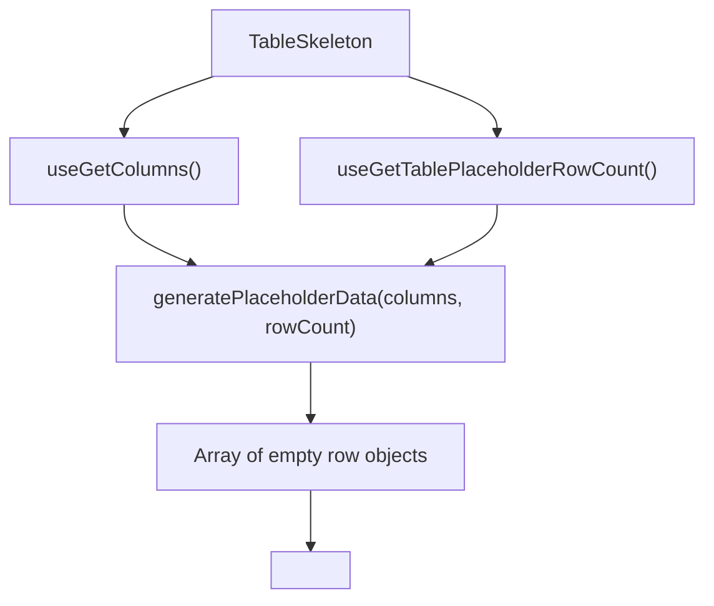

# TableSkeleton Architecture

Loading placeholder that renders a full table while data is being fetched
inside the Suspense boundary. It reserves `placeholderRowCount` generated rows,
which is what keeps the swap to real data shift-free.

## File Structure

```
TableSkeleton/
├── TableSkeleton.component.tsx   → Generates placeholder data → renders Table
├── TableSkeleton.types.ts        → SkeletonResponse type
└── index.ts                      → Barrel export
```

## How It Works



Reuses the actual `Table` component with `isLoading=true`, which triggers
shimmer overlays in `TableBodyCell` and `TableHeaderCell`.

## Why the row count matters

`TableBody` sizes `<tbody>` as `totalRows × rowHeight`, so the number of rows
the skeleton reserves _is_ the height the page commits to before data arrives.
It defaults to `INITIAL_PAGE_SIZE` (the same page size the loaders request), so
a full first page swaps in at exactly the reserved height and nothing moves. A
response shorter than `placeholderRowCount` — a filtered view, a small table —
shrinks `<tbody>` on arrival; that is inherent to reserving space for a count
you cannot know yet, and the reserved count should stay pinned to the loader's
page size rather than drift from it.

A previous iteration seeded this height from tab-scoped rows in sessionStorage
("paint stale rows during refresh"). The write side was never wired, so the read
always returned `undefined` and the branch was unreachable; it was removed
rather than completed, because reserving a _stale_ row count is precisely what
makes the reserved height disagree with the incoming page.

## Context Dependencies

| Selector                         | Purpose                     |
| -------------------------------- | --------------------------- |
| `useGetColumns`                  | Column definitions for keys |
| `useGetTablePlaceholderRowCount` | Number of skeleton rows     |
