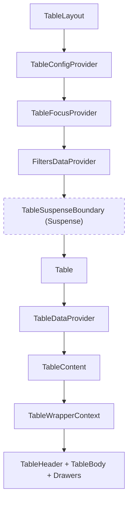
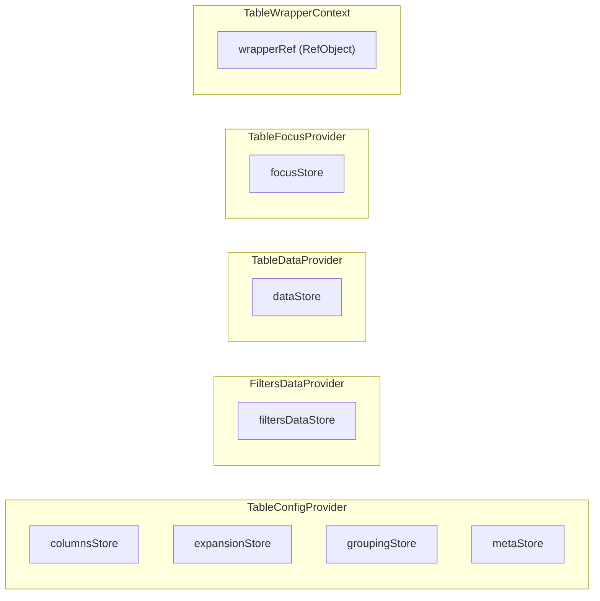
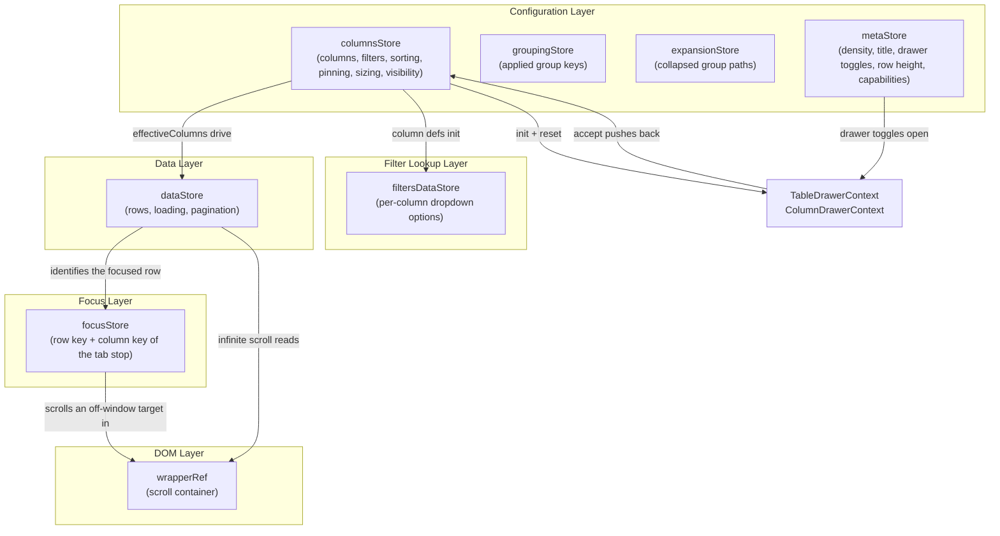

# Table Contexts Architecture

The context providers that together manage all table state — one per row of the
Context → Store Summary below. Each owns one or more external stores (except
TableWrapper, which holds a ref).

## File Structure

```
contexts/
├── index.ts                    → Barrel: FiltersDataProvider, TableConfigProvider, TableDataProvider, TableFocusProvider
│
├── FiltersData/                → Filter lookup data per column (survives Suspense)
│   ├── FiltersDataContext.*     → Context, Provider, Types
│   └── filters/                → 1 store, 2 actions, 1 selector, 1 util
│
├── TableConfig/                → Column settings + UI meta + row grouping + expansion (multi-store)
│   ├── TableConfigContext.*     → Context, Provider, Types
│   ├── columns/                → Column store, actions, selectors
│   ├── expansion/              → Expansion store, actions, selectors, the group-tree derivation (ADR-067)
│   ├── grouping/               → Grouping store, actions, selectors (ADR-061)
│   ├── meta/                   → Meta store, actions, selectors
│   └── utils/                  → getInitialColumnsState, getInitialExpansionState, getInitialGroupingState, getInitialMetaState
│
├── TableData/                  → Row data + loading + pagination
│   ├── TableDataContext.*       → Context, Provider, Types
│   ├── data/                   → 1 store, 1 action, 4 selectors
│   └── utils/                  → getInitialDataState
│
├── TableFocus/                 → The grid's roving focus target (ADR-062)
│   ├── TableFocusContext.*      → Context, Provider, Types
│   └── focus/                  → focusStore, its actions, selectors and utils
│
└── TableWrapper/               → Ref-based context for wrapper DOM access
    ├── TableWrapperContext.*    → Context, Types
    └── useTableWrapperRef      → Hook to consume the ref
```

## Provider Nesting



**Why this order matters:**

- **TableConfigProvider** is outermost — column definitions, meta config,
  grouping state and expansion are stable across data fetches. Grouping lives
  here for exactly that reason: a grouping change causes a navigation, and state
  on the data context would not survive it (ADR-061). Expansion sits beside it
  rather than on it, because `TableGroupingState` also crosses the loader
  boundary and a `Set` does not (ADR-067)
- **TableFocusProvider** sits beside the config, above Suspense, for the same
  reason grouping does: the data context is re-created on every navigation, so
  focus held there would be discarded by a revalidation the user did not ask for
  (ADR-062)
- **FiltersDataProvider** sits above Suspense — filter dropdown options survive
  when the Suspense key changes during sort/filter navigations
- **TableDataProvider** sits inside Suspense — row data is re-created on
  each navigation via the resolved promise
- **TableWrapperContext** is innermost — needs the rendered wrapper `<div>` ref

## Store Overview



## Context → Store Summary

The per-slice hook lists live in each context's own `ARCHITECTURE.md` and its
`INVENTORY.md` rows, which is where they stay in step with the code.

| Context        | Store(s)                                                          | State Pattern                            |
| -------------- | ----------------------------------------------------------------- | ---------------------------------------- |
| `TableConfig`  | `columnsStore` + `expansionStore` + `groupingStore` + `metaStore` | `TStore` + `useSyncExternalStore`        |
| `FiltersData`  | `filtersDataStore`                                                | Single `TStore` + `useSyncExternalStore` |
| `TableData`    | `dataStore`                                                       | Single `TStore` + `useSyncExternalStore` |
| `TableFocus`   | `focusStore`                                                      | Single `TStore` + `useSyncExternalStore` |
| `TableWrapper` | — (ref only)                                                      | `RefObject<HTMLDivElement>`              |

## Cross-Context Data Flow



## Detailed Architecture

| Context      | Details                                         |
| ------------ | ----------------------------------------------- |
| FiltersData  | [ARCHITECTURE.md](FiltersData/ARCHITECTURE.md)  |
| TableConfig  | [ARCHITECTURE.md](TableConfig/ARCHITECTURE.md)  |
| TableData    | [ARCHITECTURE.md](TableData/ARCHITECTURE.md)    |
| TableFocus   | [ARCHITECTURE.md](TableFocus/ARCHITECTURE.md)   |
| TableWrapper | [ARCHITECTURE.md](TableWrapper/ARCHITECTURE.md) |
