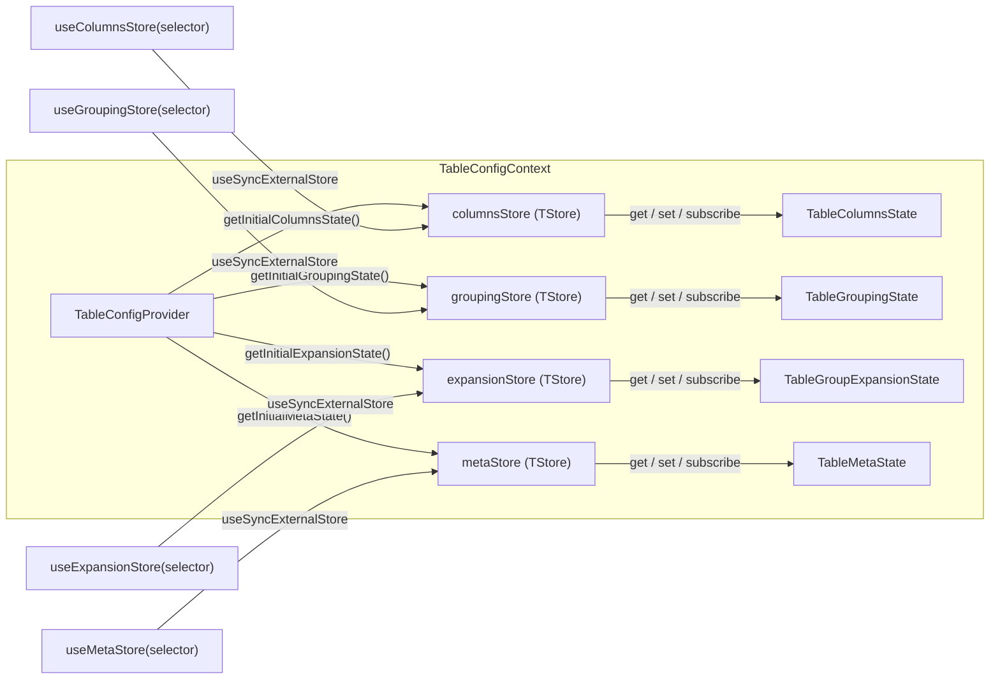
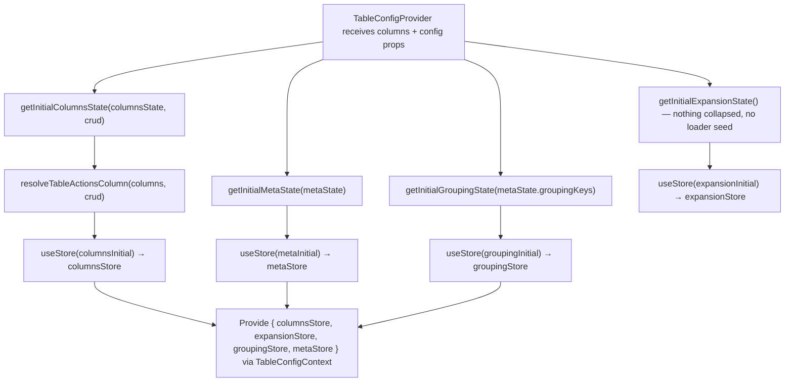
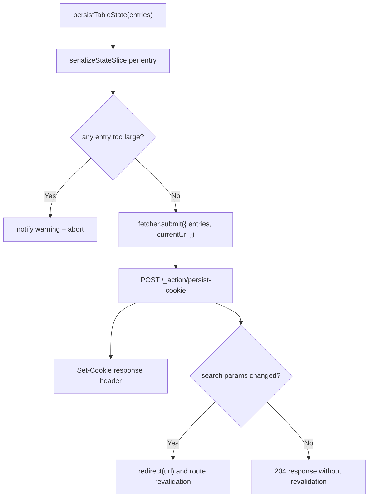

# TableConfig Context Architecture

Central configuration context that manages **column settings**, **UI meta state**
and **row grouping** through four independent stores. This is the primary source
of truth for how columns are displayed, filtered, sorted, grouped, pinned, and
sized.

## File Structure

```
TableConfig/
├── TableConfigContext.context.ts            → createContext (undefined default)
├── TableConfigContext.provider.tsx           → Provider: creates all three stores from initial state props
├── TableConfigContext.types.ts              → ContextValue (columnsStore + expansionStore + groupingStore + metaStore)
├── useTableConfigContextValue.hook.ts       → use(TableConfigContext) with guard
├── index.ts                                 → Barrel: TableConfigProvider, hooks
│
├── columns/                                 → Column-related store, actions, selectors
│   ├── useColumnsStore.hook.ts              → Resolves the config columnsStore, delegates to useStoreSelector
│   │
│   ├── actions/                                 → Public API: every hook here is an executable action, all barrel-exported
│   │   ├── hooks/                               → Internal to actions/ — shared hooks, never barrel-exported
│   │   │   ├── usePersistTableStateAction.hook.ts → Cookie persistence (server action) used by six actions
│   │   │   └── usePersistColumnSizingAction.hook.ts → Reads the store + submits the current widths via usePersistCookieAction (server action)
│   │   ├── utils/buildPersistencePayload.util.ts       → Shared persistence-entry builder for batch settings hooks
│   │   ├── utils/resolveBatchColumnSettingsUpdate.util.ts → Build next derived column config slices for one batch column update
│   │   ├── utils/resolveBatchTableSettingsUpdate.util.ts → Build next derived column config slices for one table-wide settings update
│   │   ├── utils/commitPinningAndOrderUpdate.util.ts → Shared persist+store commit helper for pinning actions
│   │   ├── utils/commitResolvedVisibilityState.util.ts → Shared persist+store commit helper for visibility actions
│   │   ├── utils/buildColumnSizingCookieEntry.util.ts → Pure: build the columnSizing cookie entry (serialize widths, scoped by appId + persistenceKey)
│   │   ├── utils/resolveColumnPinningUpdate.util.ts  → Build next pinning state + synced order for one pinning change
│   │   ├── utils/resolveColumnSizingUpdate.util.ts   → Build next sizing map + pinned offsets for one column resize
│   │   ├── utils/resolveColumnVisibilityUpdate.util.ts → Build next columnVisibility Set for one column show/hide
│   │   ├── utils/writeColumnSizing.util.ts       → Shared: write one column's width + recompute pinned offsets
│   │   ├── useBatchSetColumnSettings.hook.ts    → Bulk-update multiple column fields
│   │   ├── useBatchSetTableSettings.hook.ts     → Push settings from drawer → store
│   │   ├── useResetColumnFilter.hook.ts         → Clear filter for one column
│   │   ├── useSetColumnFilter.hook.ts           → Set filter for one column
│   │   ├── useSetColumnPinning.hook.ts          → Set pinning state
│   │   ├── useSetColumnSizing.hook.ts           → Set a column width and persist it
│   │   ├── useSetColumnSizingWithoutSync.hook.ts → Set a column width, skip the cookie write (drag frames only)
│   │   ├── useSetColumnSorting.hook.ts          → Set sorting state
│   │   ├── useSetColumnVisibility.hook.ts       → Show/hide a single column directly on the live store (not a drawer draft)
│   │   └── useSyncColumnsSizing.hook.ts         → Persist the stored widths without changing any
│   │
│   └── selectors/
│       ├── useGetColumnFilters.hook.ts          → All column filters
│       ├── useGetPinnedColumnPartition.hook.ts           → Pre-split pinning partition (derived)
│       ├── useGetColumnOrder.hook.ts            → Column order array
│       ├── useGetColumnPinning.hook.ts          → Pinning state { left, right }
│       ├── useGetColumnSizing.hook.ts           → Column width map (whole map)
│       ├── useGetColumnWidth.hook.ts            → Single column's width by key (granular)
│       ├── useGetColumnVisibility.hook.ts       → Hidden columns set
│       ├── useGetColumns.hook.ts                → Raw column definitions
│       ├── useGetColumnsSorting.hook.ts         → Sorting state array
│       ├── useGetNormalizedColumn.hook.ts       → Single normalized column by key
│       ├── useGetNormalizedColumns.hook.ts      → All normalized columns
│       ├── useGetPinnedColumnInfo.hook.ts       → Single column's pinned-offset entry by key (granular)
│       └── useGetPinnedColumnOffsets.hook.ts    → Pre-computed pinned offsets, whole map (derived)
│
├── meta/                                    → UI meta store, actions, selectors
│   ├── useMetaStore.hook.ts                 → useSyncExternalStore + selector
│   │
│   ├── actions/
│   │   ├── utils/getNextStatePatch.util.ts                → Build drawer-open state patches while preserving the restore snapshot
│   │   ├── utils/getNextToggleColumnSettingsStatePatch.util.ts → Build the next patch when toggling the column-settings drawer
│   │   ├── useSetTableColumnSelectedKey.hook.ts          → Track selected column
│   │   ├── useToogleTableIsColumnSettingsOpen.hook.ts    → Toggle column settings drawer
│   │   └── useToogleTableIsTableSettingsOpen.hook.ts     → Toggle table settings drawer
│   │
│   └── selectors/
│       ├── useGetTableColumnSelectedKey.hook.ts          → Selected column key
│       ├── useGetTableAdditionalMetadata.hook.ts         → Optional custom metadata map
│       ├── useGetTableDensity.hook.ts                    → Table density setting
│       ├── useGetTableInitialPageSize.hook.ts            → Initial page size value
│       ├── useGetTableIsBordered.hook.ts                 → Border toggle
│       ├── useGetTableIsColumnSettingsOpen.hook.ts       → Column settings open state
│       ├── useGetTableIsRounded.hook.ts                  → Rounded-corners toggle
│       ├── useGetTableIsStriped.hook.ts                  → Striped rows toggle
│       ├── useGetTableIsTableSettingsOpen.hook.ts        → Table settings open state
│       ├── useGetTableOverscan.hook.ts                   → Virtual scroll overscan
│       ├── useGetTablePersistenceKey.hook.ts             → Persistence key
│       ├── useGetTablePlaceholderRowCount.hook.ts        → Placeholder row count
│       ├── useGetTableRowHeight.hook.ts                  → Row height value
│       ├── useGetTableSchemaName.hook.ts                 → Optional schema name
│       ├── useGetTableTableName.hook.ts                  → Optional table name
│       ├── useGetTableThreshold.hook.ts                  → Fetch-more threshold
│       ├── useGetTableTitlePlural.hook.ts                → Plural table title string
│       └── useGetTableTitleSingular.hook.ts              → Singular table title string
│
├── grouping/                                → Row grouping store, actions, selectors (ADR-061)
│   ├── useGroupingStore.hook.ts             → Resolves the config groupingStore, delegates to useStoreSelector
│   │
│   │  Everything here is the **live** store — the surface is the column-header
│   │  menu, which acts immediately. The settings drawer stages into its own
│   │  grouping draft (`TableSettingsDrawer/TableDrawerContext`) and commits
│   │  through `useBatchSetTableSettings`, so whole-list replace and whole-map
│   │  read live there rather than here.
│   │
│   ├── utils/areGroupKeysLegal.util.ts      → Pure predicate shared by both write paths: within the depth cap, and no key repeated
│   │
│   ├── actions/
│   │   ├── utils/applyGroupingReducer.util.ts       → Pure: apply an action's reducer to the caller's snapshot and resolve the result; shared with the drawer's draft write path
│   │   ├── utils/resolveTableGroupingUpdate.util.ts → Pure: one interaction's grouping change as data (updated / unchanged); refuses an illegal key list whole
│   │   ├── utils/toggleTableGroupKey.util.ts        → Pure: append a key at the tail, or remove it
│   │   ├── utils/setTableColumnAggregate.util.ts    → Pure: set or clear one column's aggregate
│   │   ├── utils/setTableGroupingMode.util.ts       → Pure: set which grouping sets the read emits, keys and aggregates untouched (the drawer's `useSetGroupingMode` is its only caller — the mode has no apply-immediately surface)
│   │   ├── utils/resolveGroupingColumnsPatch.util.ts → Pure: the derived columns-store patch a grouping change produces — the key hoist follows the keys (ADR-080)
│   │   ├── useSetTableGrouping.hook.ts      → **Internal**: the single write path, taking a reducer so the store is read once
│   │   ├── useToggleTableGroupKey.hook.ts   → Add/remove one key (header menu)
│   │   ├── useSetTableColumnAggregate.hook.ts → Apply or clear one column's aggregate
│   │   └── useClearTableGrouping.hook.ts    → Clear every key and every aggregate
│   │
│   ├── utils/resolveGroupPathKey.util.ts    → Pure: a group's identity as one string — the key expansion is stored under, and the one `resolveRowKey` gives a group row
│   │
│   └── selectors/
│       ├── useGetTableGroupingKeys.hook.ts       → The applied group keys, in nesting order
│       └── useGetTableColumnAggregate.hook.ts    → The aggregate applied to one column
│
├── expansion/                               → Which group rows are collapsed (ADR-061, ADR-067)
│   ├── useExpansionStore.hook.ts            → Resolves the config expansionStore, delegates to useStoreSelector
│   │
│   │  A separate store from grouping, and the reason is the loader boundary:
│   │  `TableGroupingState` is also the URL codec's and the loader's type, and a
│   │  `Set` does not cross it (ADR-009).
│   │
│   ├── utils/
│   │   ├── resolveGroupTreeNodes.util.ts    → Pure: each loaded row's level, parent and visibility; group ancestry from the path, detail rows from the nearest group above
│   │   ├── resolveTableGroupTree.util.ts    → Pure: the rows a collapse leaves standing plus their ARIA tree metadata; returns the caller's array by reference when there is no tree
│   │   ├── toggleCollapsedGroupPath.util.ts → Pure: one group's expansion flipped, as a new set
│   │   └── pruneCollapsedGroupPaths.util.ts → Pure: drop collapsed paths the new rows no longer carry; same instance back when nothing changed
│   │
│   ├── actions/
│   │   ├── utils/resolveGroupCollapseFocusTarget.util.ts → Pure: the ancestor focus falls back to when a collapse hides the focused row
│   │   ├── useToggleTableGroupExpansion.hook.ts → Open or close one group by path, moving focus first when the collapse takes the focused row with it
│   │   └── usePruneTableGroupExpansion.hook.ts  → Reconcile the collapsed paths against the rows just loaded
│   │
│   └── selectors/
│       └── useGetTableCollapsedGroupPaths.hook.ts → The paths whose subtree is hidden
│
├── utils/
  ├── getInitialColumnsState.util.ts       → Build initial columns state from props; synthesizes the `actions` column via `resolveTableActionsColumn` when `crud.read/update/delete` is enabled (or a consumer `actions` column is declared), and only force-pins it right when it actually exists
  ├── getInitialExpansionState.util.ts     → Nothing collapsed: a grouped read returns whole, so the tree opens (ADR-067). No loader seed — expansion does not travel in the URL
  ├── getInitialGroupingState.util.ts      → Build initial grouping state from the configuration the loader applied (`metaState.groupingKeys` + `metaState.groupingAggregates` + `metaState.groupingMode`)
  ├── getInitialMetaState.util.ts          → Build initial meta state from props
  └── index.ts                             → Barrel: utils
```

## Multi-Store Pattern



The stores are kept separate so column-heavy updates (filters, sorting, reorder)
do not trigger re-renders in components that only read meta state (density, title),
and vice versa.

**Why grouping is here and not on the data context.** `TableConfigProvider` sits
outside the Suspense boundary and stays mounted across navigations, while
`TableDataProvider` sits inside it and is re-created from each navigation's
resolved promise. A grouping change _causes_ a navigation, so grouping state on
the data context would be wiped by its own effect — and expansion, which joins
this store next, is re-applied by group path after exactly that refetch
(ADR-061). `TableConfigContext.provider.test.tsx` pins this with mount counts on
both halves rather than by assuming it.

## Columns State Shape

```typescript
TableColumnsState<TData> = {
  columns: ColumnDef<TData>[];           // Raw column definitions
  columnFilters: ColumnFilters;          // Record<string, ColumnFilter>
  pinnedColumnPartition: PinnedColumnPartitionState;       // Pre-split { leftPinnedCols, centerCols, rightPinnedCols }
  columnOrder: ColumnOrderState;         // string[]
  columnPinning: ColumnPinningState;     // { left: string[], right: string[] }
  columnSizing: ColumnSizingState;       // Record<string, number>
  columnVisibility: Set<string>;         // Hidden column keys
  sorting: SortingState[];               // Active sort entries
  effectiveColumns: EffectiveColumn[];   // Columns with applied settings
  normalizedColumns: NormalizedColumn[]; // Flat enriched column descriptors
  pinnedColumnOffsets: PinnedColumnOffsetsState; // Pre-computed sticky offsets
  staticKeys: Set<string>;              // Non-reorderable column keys
};
```

## Grouping State Shape

```typescript
TableGroupingState = {
  aggregates: Readonly<Record<string, TableAggregateFn>>; // At most one aggregate per column — the whole shape the compact URL param can carry, and the shape of the #569 deferral: no state here describes a *filtered* aggregate
  keys: readonly string[];           // Applied group keys, in the query's nesting order
  mode: TableGroupingMode;           // `flat` (one set) or `rollup` (one per prefix, plus the grand total). Duplicated from `@lcabrera/server`'s `GroupingMode`; `cube` is deliberately absent because its sets are not prefixes and nothing renders a lattice as a tree (#574)
};
```

**A grouping change writes the columns store too.** The layout a grouped grid
paints — the group keys hoisted to the head of the order and the left pin, and
forced visible — is a _derivation_ of this state, not a member of it (ADR-080),
so `useSetTableGrouping` re-derives the columns store's view slices in the same
interaction, from one snapshot of each store. What it does not touch is
`columns`, `columnOrder`, `columnPinning` or `columnVisibility`: the hoist must
reach neither the persisted layout nor the settings drawer, which is what lets
ungrouping restore the user's layout with no snapshot to keep.

## Expansion State Shape

```typescript
TableGroupExpansionState = {
  collapsedGroupPaths: ReadonlySet<string>; // Group paths whose subtree is HIDDEN — membership means collapsed, as `ColumnVisibilityState` holds the hidden columns. Empty = fully expanded, which is the initial state
};
```

**Why the complement, and why a separate store.** A grouped read returns whole
(ADR-059) and lazy per-level fetching is a non-goal, so collapsing by default
would hide rows already fetched and save nothing; the empty set therefore has to
mean "expanded". And it is not a field on `TableGroupingState` because that type
is also the URL codec's and `createTableRouteLoader`'s — everything in it crosses
the single-fetch boundary, where a `Set` does not survive (ADR-009, ADR-067).

## Meta State Shape

```typescript
TableMetaState = {
  appId?: string;                    // App id used to namespace persisted cookie/storage keys
  columnSelectedKey: string | null;  // Currently selected column key
  crud?: TableCrudConfig;            // CRUD feature flags (create/read/update/delete) for row actions + create link (read via useGetTableCrud)
  deleteActionPath?: string;         // Action route the row delete submit posts to (required when crud.delete)
  density: TableDensity;             // compact | normal | comfortable
  drawersSyncNonce?: number;          // Monotonic nonce used to force drawer provider re-seed
  enablePrefetch: boolean;           // Prefetch next page after load-more (ADR-006)
  error: Error | null;               // Table-level error
  groupingAggregates?: Readonly<Record<string, TableAggregateFn>>; // Per-column aggregate the loader applied, sanitized from the same param; seeds the grouping store
  groupingCapabilities?: Readonly<Record<string, TableColumnGroupingCapability>>; // What each column may do in a grouped read, from the pg catalogue (ADR-058) and shipped by the loader (ADR-063). The aggregate menu is built from this and nothing else — `dataType` cannot answer it (#550). Absent = nothing is legal, never everything
  groupingKeys?: readonly string[];  // Group keys the loader applied, read from the `grouping` param and sanitized (ADR-061); seeds the grouping store
  groupingMode?: TableGroupingMode;  // Grouping mode the loader applied, from the same param. Absent = `flat`, which is what a link written before rollup existed means
  initialPageSize: number;           // First page row count
  isBordered: boolean;               // Show borders
  isColumnSettingsOpen: boolean;     // Column settings drawer open
  isGroupingEnabled?: boolean;       // Endpoint capability: the route's read can group server-side (ADR-063); absent = off
  isKeysetEnabled?: boolean;         // Endpoint capability: load-more sends a keyset cursor (ADR-052/ADR-063); absent = off
  isRounded: boolean;                // Round the table card's corners (default false)
  isServerFilterEnabled?: boolean;   // Endpoint capability: load-more sends the column filters (ADR-063); absent = off
  isStriped: boolean;                // Striped rows
  isTableSettingsPinned: boolean;    // Table settings pinned as side panel
  isTableSettingsOpen: boolean;      // Table settings drawer open
  loadMorePageSize: number;          // Subsequent page row count
  overscan: number;                  // Virtual scroll overscan count
  persistenceKey: string;            // Key for URL/cookie persistence
  placeholderRowCount: number;       // Skeleton row count while loading
  rowHeight: number;                 // Row height in px
  tableSettingsExpandedFilters: string[]; // Expanded filter keys in table settings drawer
  tableSettingsSelectedTab: string;  // Last selected tab in table settings drawer
  threshold: number;                 // Scroll threshold for fetch-more
  title: string;                     // Table display title
  wasTableSettingsOpenBeforeColumnSettings: boolean; // Snapshot used to restore table settings after column drawer closes
};
```

## Provider Initialization



Consumers no longer need to declare an `actions` column by hand: `crud` is
threaded from `metaState.crud` into `getInitialColumnsState`, which appends
the synthesized column (and force-pins it right) whenever `read`/`update`/
`delete` is enabled. `crud.create` alone never adds it (header-only, no row
id). A consumer-declared `key: 'actions'` column (e.g. with a custom `render`
for extra menu items) is still honored and merged onto the defaults.

Session hydration now happens in route `clientLoader`s before the table mounts,
so SSR and the initial client render already agree on the seeded state.

## Testing Pattern

- `columns.hooks.test.tsx`, `meta.hooks.test.tsx` and `grouping.hooks.test.tsx` share a common store scaffold through [src/utils/tests/createMockStore.util.ts](src/utils/tests/createMockStore.util.ts).
- Columns action-hook tests share a dedicated mock wiring utility via [src/utils/tests/createTableConfigColumnsActionMocks.util.ts](src/utils/tests/createTableConfigColumnsActionMocks.util.ts).
- Tests keep `vi.mock(...)` stable while reassigning local store instances in `beforeEach`, which avoids `vi.hoisted` initialization-order pitfalls.

## Columns Actions

| Hook                            | Reads From     | Writes To      | Description                                                                                                                                      |
| ------------------------------- | -------------- | -------------- | ------------------------------------------------------------------------------------------------------------------------------------------------ |
| `useBatchSetColumnSettings`     | —              | `columnsStore` | Bulk-set multiple column fields at once                                                                                                          |
| `useBatchSetTableSettings`      | —              | `columnsStore` | Push all settings from TableSettingsDrawer                                                                                                       |
| `useResetColumnFilter`          | —              | `columnsStore` | Remove filter for a single column                                                                                                                |
| `useSetColumnFilter`            | —              | `columnsStore` | Set filter value for a single column                                                                                                             |
| `useSetColumnPinning`           | `columnsStore` | `columnsStore` | Update pinning, keep column order synced (including header unpin reorder-to-fill), and commit pinning/order via shared helper                    |
| `useSetColumnSizing`            | `columnsStore` | `columnsStore` | Set column width map, recompute pinned offsets, and persist; the default for any completed resize, so callers never pair it with a sync          |
| `useSetColumnSizingWithoutSync` | `columnsStore` | `columnsStore` | The same store write with the cookie write omitted — for `useColumnDragSession`'s per-frame drag updates (the pointer half of `useColumnResize`) |
| `useSetColumnSorting`           | `columnsStore` | `columnsStore` | Toggle/set sort for a column                                                                                                                     |
| `useSetColumnVisibility`        | `columnsStore` | `columnsStore` | Show/hide a single column directly (quick-access affordance, e.g. the header actions menu) and commit via shared helper                          |
| `useSyncColumnsSizing`          | `columnsStore` | `columnsStore` | Recalculate sizing after layout shift                                                                                                            |

Direct mutation actions (`useSetColumnSorting`, `useSetColumnPinning`,
`useSetColumnVisibility`) also bump
`metaStore.drawersSyncNonce` after successful commits. `TableDrawersSection`
uses this nonce in provider keys to remount drawer-local stores and keep panel
state aligned with source-of-truth column state.

## Shared Batch Utilities

The two batch settings hooks now share two focused pure helpers instead of each inlining their derived-view and persistence-array construction.

| Utility                            | Location                  | Purpose                                                                                       |
| ---------------------------------- | ------------------------- | --------------------------------------------------------------------------------------------- |
| `deriveColumnViewState`            | `components/Table/utils/` | Compose `normalizedColumns` with `getPinnedDerivedColumnsState()` output                      |
| `buildPersistencePayload`          | `columns/actions/utils/`  | Build the persistence entry array for batch settings updates                                  |
| `getColumnSettingsNextStatePatch`  | `components/Table/utils/` | Build the persisted meta patch after applying column settings                                 |
| `getHasQueryChanged`               | `components/Table/utils/` | Compare current vs next filters/sorting to decide whether query revalidation is needed        |
| `getIsTableSettingsOpen`           | `components/Table/utils/` | Restore the table-settings drawer when column settings borrowed its open state                |
| `resolveBatchColumnSettingsUpdate` | `columns/actions/utils/`  | Compose the next per-column batch update from shared sort/filter/size/pin resolvers           |
| `resolveBatchTableSettingsUpdate`  | `columns/actions/utils/`  | Compose the next table-wide settings update from incoming settings plus derived slices        |
| `writeColumnSizing`                | `columns/actions/utils/`  | Write one column's width to the store and recompute pinned offsets                            |
| `buildColumnSizingCookieEntry`     | `columns/actions/utils/`  | Pure: build the `columnSizing` cookie entry from the stored widths (the loader reads it back) |

## How Actions Share Logic

**An action never calls another action.** `actions/` is the public API of this
context: each hook is an executable action, and every one of them is exported
from `actions/index.ts`. Anything only used _inside_ that layer lives beside it
instead — `actions/utils/` for pure helpers, `actions/hooks/` for shared hooks —
and never appears in the barrel.

Reusable logic is shared through those helpers, which take the stores (and any
collaborator, like `persistTableState`) **as arguments** rather than reaching for
context themselves. `commitResolvedPinningState` is the reference example; the
three sizing actions follow it:

| Action                          | Composition                                          |
| ------------------------------- | ---------------------------------------------------- |
| `useSetColumnSizing`            | `writeColumnSizing` + `usePersistColumnSizingAction` |
| `useSetColumnSizingWithoutSync` | `writeColumnSizing`                                  |
| `useSyncColumnsSizing`          | `usePersistColumnSizingAction`                       |

Each grabs its stores from context once and delegates; none of them imports
another action. That is what keeps `useSetColumnSizing` a single call for its
consumers without stacking actions on top of one another.

`usePersistTableStateAction` and `usePersistColumnSizingAction`
(`actions/hooks/`) are the shared-hook cases: actions inside this context need
them, nothing outside `actions/` does. `usePersistColumnSizingAction` reads the
store and submits the current widths through `usePersistCookieAction`, so the
three sizing actions compose it the same way six column actions compose
`usePersistTableStateAction`. `usePersistTableStateAction` previously sat in
`Table/hooks/`, which forced every action to import the hooks barrel and closed
an `actions → hooks → actions` import cycle. Nothing under `contexts/` imports
`Table/hooks/` now, so the dependency runs one way only and the cycle is
structurally impossible rather than merely avoided.

### Persistence — the cookie is the only channel

Every persisted slice (`columnSizing`, `columnOrder`, `columnPinning`,
`columnVisibility`, `sorting`, `columnFilters`, and the drawer's UI state) is
written to a **cookie** and to nothing else:

| Written by                     | Writes                     | Read back by                                         |
| ------------------------------ | -------------------------- | ---------------------------------------------------- |
| `usePersistTableStateAction`   | cookie (via server action) | the loader — `readTableLoaderStateFromRequest` (SSR) |
| `usePersistColumnSizingAction` | cookie (via server action) | the loader — same                                    |
| `usePersistTableUiFlagsAction` | cookie (via server action) | the loader — `readPersistedUiFlagsFromCookie`        |

**Why one channel, not two.** The cookie is the only thing SSR can read, and both
stores seed exclusively from what the loader passes down. So the server's markup
and the client's first render are guaranteed to agree — a hydration mismatch is
not merely avoided, it is unrepresentable.

A second, client-only channel (sessionStorage) cannot be SSR'd by definition, so
whatever it holds can only be applied _after_ the server's markup has painted.
That is a layout shift by construction, and it was not hypothetical: the table
used to read `columnSizing` and the drawer flags from sessionStorage and prefer
them (`sessionState.columnSizing ?? columnSizing`), so any drift between the
channels both **reverted** the user's change on reload and **shifted** the
columns after the skeleton had already painted. Tab-scoped layout state and a
shift-free first paint are mutually exclusive; this table chooses the latter.

The consequence to accept: tables are **not** isolated per tab — two tabs share
one cookie, and the last write wins.

`PersistedUiState` therefore carries the _whole_ drawer state: open/pinned
reserves the drawer's width, and the selected tab and expanded filters decide
what is painted inside it. Anything omitted could not be SSR'd.

Only `dataState` (the skeleton's cached rows) remains in sessionStorage. It is
not layout: SSR paints blank placeholders either way, and the rows are a
per-tab cache, not state the server could seed.

### usePersistTableStateAction

Persists column-oriented table state slices by submitting the cookie update
through a React Router server action (Set-Cookie).



Supports both single entries and batch submissions. Each entry specifies:

- `persistenceKey` — cookie name namespace
- `slice` — which state slice (columnFilters, sorting, etc.)
- `valueSlice` — the data to persist
- `searchParamKey/Value` — optional URL search param sync
- Revalidation happens only when persisted `searchParamKey/Value` produce an
  effective URL search-param change; otherwise the action returns `204` and
  only cookie persistence occurs.
- Oversized entries block the entire apply flow before URL sync or cookie persistence to avoid partial restored state
- No-op when `persistenceKey` is empty

## Columns Selectors

| Hook                          | Returns                         | Description                                 |
| ----------------------------- | ------------------------------- | ------------------------------------------- |
| `useGetColumns`               | `ColumnDef[]`                   | Raw column definitions                      |
| `useGetColumnFilters`         | `ColumnFilters`                 | All active column filters                   |
| `useGetColumnOrder`           | `ColumnOrderState`              | Column order array                          |
| `useGetColumnPinning`         | `ColumnPinningState`            | Pinning state `{ left, right }`             |
| `useGetColumnSizing`          | `ColumnSizingState`             | Column width map (whole map)                |
| `useGetColumnWidth`           | `number \| undefined`           | One column's width by key (granular)        |
| `useGetColumnVisibility`      | `Set<string>`                   | Set of hidden column keys                   |
| `useGetColumnsSorting`        | `SortingState[]`                | Active sorting entries                      |
| `useGetNormalizedColumn`      | `NormalizedColumn`              | Single enriched column by key               |
| `useGetNormalizedColumns`     | `NormalizedColumn[]`            | All enriched column descriptors             |
| `useGetPinnedColumnPartition` | `PinnedColumnPartitionState`    | Pre-split left/center/right columns         |
| `useGetPinnedColumnOffsets`   | `PinnedColumnOffsetsState`      | Sticky offsets, whole map                   |
| `useGetPinnedColumnInfo`      | `PinnedColumnInfo \| undefined` | One column's pinned entry by key (granular) |

## Meta Actions

Persisted meta UI fields are mutation-owned: each action that changes drawer UI
state submits the update through `usePersistTableUiFlagsAction()` (which POSTs to
the `/_action/persist-cookie` server action for the `Set-Cookie`) before
committing its `metaStore.set(...)` patch. This keeps the cookie aligned without
a subscription effect in the provider.

| Hook                                   | Writes To   | Description                                                                 |
| -------------------------------------- | ----------- | --------------------------------------------------------------------------- |
| `useSetTableColumnSelectedKey`         | `metaStore` | Set which column is selected                                                |
| `useSetTableDrawersOpenState`          | `metaStore` | Set both drawer open states, capture restore snapshot, and persist UI state |
| `useSetTableSettingsExpandedFilters`   | `metaStore` | Persist expanded filter items in table settings                             |
| `useSetTableSettingsSelectedTab`       | `metaStore` | Persist selected table settings tab                                         |
| `useSetTableIsColumnSettingsPinned`    | `metaStore` | Persist column settings pinned state                                        |
| `useSetTableIsTableSettingsOpen`       | `metaStore` | Persist table settings open state                                           |
| `useSetTableIsTableSettingsPinned`     | `metaStore` | Persist table settings pinned state                                         |
| `useSetTableColumnSettingsSelectedTab` | `metaStore` | Persist selected column-settings tab                                        |
| `useToogleTableIsColumnSettingsOpen`   | `metaStore` | Toggle column settings drawer and persist derived open state                |
| `useToogleTableIsTableSettingsOpen`    | `metaStore` | Toggle table settings drawer and persist derived open state                 |

## Meta Selectors

| Hook                                 | Returns                                                                | Description                         |
| ------------------------------------ | ---------------------------------------------------------------------- | ----------------------------------- |
| `useGetTableAdditionalMetadata`      | `Record<string, TableMetadataValue \| null \| undefined> \| undefined` | Optional custom metadata map        |
| `useGetTableColumnSelectedKey`       | `string \| null`                                                       | Currently selected column key       |
| `useGetTableDensity`                 | `TableDensity`                                                         | Table density setting               |
| `useGetTableDrawersSyncNonce`        | `number`                                                               | Drawer remount nonce for panel sync |
| `useGetTableEnablePrefetch`          | `boolean`                                                              | Whether prefetch buffer is active   |
| `useGetTableInitialPageSize`         | `number`                                                               | Initial page row count              |
| `useGetTableIsBordered`              | `boolean`                                                              | Whether borders are shown           |
| `useGetTableIsColumnSettingsOpen`    | `boolean`                                                              | Column settings drawer state        |
| `useGetTableIsTableSettingsPinned`   | `boolean`                                                              | Table settings pinned state         |
| `useGetTableIsRounded`               | `boolean`                                                              | Whether the table card is rounded   |
| `useGetTableIsStriped`               | `boolean`                                                              | Whether rows are striped            |
| `useGetTableIsTableSettingsOpen`     | `boolean`                                                              | Table settings drawer state         |
| `useGetTableLoadMorePageSize`        | `number`                                                               | Subsequent page row count           |
| `useGetTableOverscan`                | `number`                                                               | Virtual scroll overscan count       |
| `useGetTablePersistenceKey`          | `string`                                                               | Persistence key for URL/cookie sync |
| `useGetTablePlaceholderRowCount`     | `number`                                                               | Skeleton row count                  |
| `useGetTableRowHeight`               | `number`                                                               | Row height in px                    |
| `useGetTableSchemaName`              | `string \| undefined`                                                  | Optional schema name                |
| `useGetTableSettingsExpandedFilters` | `string[]`                                                             | Persisted expanded filter keys      |
| `useGetTableSettingsSelectedTab`     | `string`                                                               | Persisted table settings tab key    |
| `useGetTableTableName`               | `string \| undefined`                                                  | Optional table name                 |
| `useGetTableThreshold`               | `number`                                                               | Fetch-more scroll threshold         |
| `useGetTableTitlePlural`             | `string`                                                               | Plural table display title          |
| `useGetTableTitleSingular`           | `string`                                                               | Singular table display title        |
