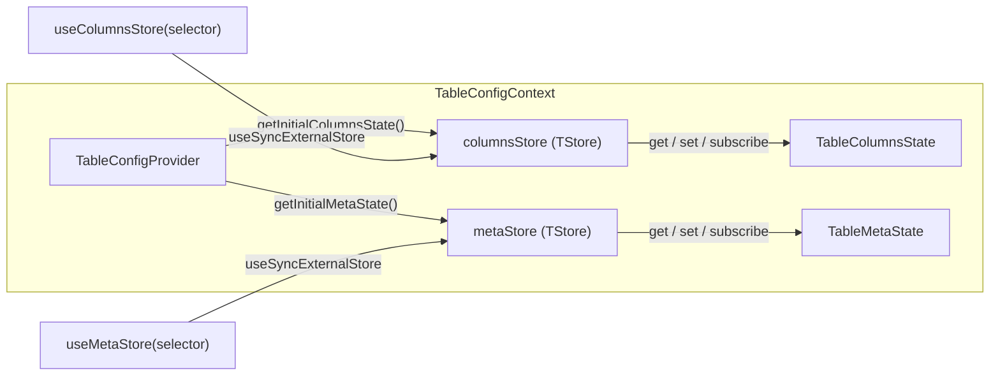
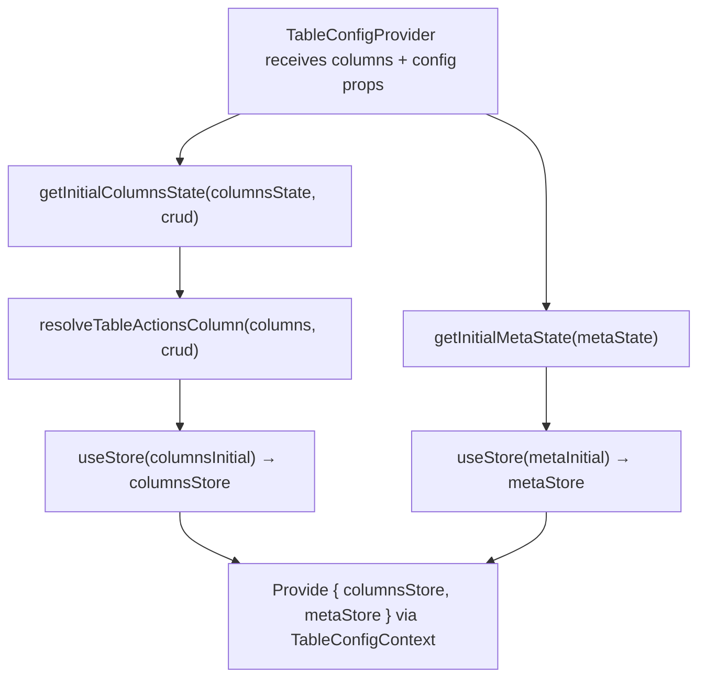

# TableConfig Context Architecture

Central configuration context that manages **column settings** and **UI meta state**
through two independent stores. This is the primary source of truth for how
columns are displayed, filtered, sorted, pinned, and sized.

## File Structure

```
TableConfig/
├── TableConfigContext.context.ts            → createContext (undefined default)
├── TableConfigContext.provider.tsx           → Provider: creates both stores from initial state props
├── TableConfigContext.types.ts              → ContextValue (columnsStore + metaStore)
├── useTableConfigContextValue.hook.ts       → use(TableConfigContext) with guard
├── index.ts                                 → Barrel: TableConfigProvider, hooks
│
├── columns/                                 → Column-related store, actions, selectors
│   ├── useColumnsStore.hook.ts              → useSyncExternalStore + selector
│   │
│   ├── actions/
│   │   ├── utils/buildPersistencePayload.util.ts       → Shared persistence-entry builder for batch settings hooks
│   │   ├── utils/resolveBatchColumnSettingsUpdate.util.ts → Build next derived column config slices for one batch column update
│   │   ├── utils/resolveBatchTableSettingsUpdate.util.ts → Build next derived column config slices for one table-wide settings update
│   │   ├── utils/commitPinningAndOrderUpdate.util.ts → Shared persist+store commit helper for pinning actions
│   │   ├── utils/commitResolvedVisibilityState.util.ts → Shared persist+store commit helper for visibility actions
│   │   ├── utils/resolveColumnPinningUpdate.util.ts  → Build next pinning state + synced order for one pinning change
│   │   ├── utils/resolveColumnSizingUpdate.util.ts   → Build next sizing map + pinned offsets for one column resize
│   │   ├── utils/resolveColumnVisibilityUpdate.util.ts → Build next columnVisibility Set for one column show/hide
│   │   ├── useBatchSetColumnSettings.hook.ts    → Bulk-update multiple column fields
│   │   ├── useBatchSetTableSettings.hook.ts     → Push settings from drawer → store
│   │   ├── useResetColumnFilter.hook.ts         → Clear filter for one column
│   │   ├── useSetColumnFilter.hook.ts           → Set filter for one column
│   │   ├── useSetColumnPinning.hook.ts          → Set pinning state
│   │   ├── useSetColumnSizing.hook.ts           → Set column widths
│   │   ├── useSetColumnSorting.hook.ts          → Set sorting state
│   │   ├── useSetColumnVisibility.hook.ts       → Show/hide a single column directly on the live store (not a drawer draft)
│   │   └── useSyncColumnsSizing.hook.ts         → Sync sizing after layout changes
│   │
│   └── selectors/
│       ├── useGetColumnFilters.hook.ts          → All column filters
│       ├── useGetColumnGroups.hook.ts           → Pre-split column groups (derived)
│       ├── useGetColumnOrder.hook.ts            → Column order array
│       ├── useGetColumnPinning.hook.ts          → Pinning state { left, right }
│       ├── useGetColumnSizing.hook.ts           → Column width map
│       ├── useGetColumnVisibility.hook.ts       → Hidden columns set
│       ├── useGetColumns.hook.ts                → Raw column definitions
│       ├── useGetColumnsSorting.hook.ts         → Sorting state array
│       ├── useGetEffectiveColumns.hook.ts       → Columns with applied settings
│       ├── useGetNormalizedColumn.hook.ts       → Single normalized column by key
│       ├── useGetNormalizedColumnFilters.hook.ts → Filters with column metadata
│       ├── useGetNormalizedColumns.hook.ts      → All normalized columns
│       ├── useGetPinnedColumnOffsets.hook.ts    → Pre-computed pinned offsets (derived)
│       └── useGetStaticColumnKeys.hook.ts       → Non-reorderable column keys
│
├── meta/                                    → UI meta store, actions, selectors
│   ├── useMetaStore.hook.ts                 → useSyncExternalStore + selector
│   │
│   ├── actions/
│   │   ├── utils/getNextStatePatch.util.ts                → Build drawer-open state patches while preserving the restore snapshot
│   │   ├── utils/getNextToggleColumnSettingsStatePatch.util.ts → Build the next patch when toggling the column-settings drawer
│   │   ├── useSetTableColumnSelectedKey.hook.ts          → Track selected column
│   │   ├── useToogleTableIsColumnSettingsOpen.hook.ts    → Toggle column settings drawer
│   │   └── useToogleTableIsTableSettingsOpen.hook.ts     → Toggle table settings drawer
│   │
│   └── selectors/
│       ├── useGetTableColumnSelectedKey.hook.ts          → Selected column key
│       ├── useGetTableAdditionalMetadata.hook.ts         → Optional custom metadata map
│       ├── useGetTableDensity.hook.ts                    → Table density setting
│       ├── useGetTableInitialPageSize.hook.ts            → Initial page size value
│       ├── useGetTableIsBordered.hook.ts                 → Border toggle
│       ├── useGetTableIsColumnSettingsOpen.hook.ts       → Column settings open state
│       ├── useGetTableIsStriped.hook.ts                  → Striped rows toggle
│       ├── useGetTableIsTableSettingsOpen.hook.ts        → Table settings open state
│       ├── useGetTableOverscan.hook.ts                   → Virtual scroll overscan
│       ├── useGetTablePersistenceKey.hook.ts             → Persistence key
│       ├── useGetTablePlaceholderRowCount.hook.ts        → Placeholder row count
│       ├── useGetTableRowHeight.hook.ts                  → Row height value
│       ├── useGetTableSchemaName.hook.ts                 → Optional schema name
│       ├── useGetTableTableName.hook.ts                  → Optional table name
│       ├── useGetTableThreshold.hook.ts                  → Fetch-more threshold
│       ├── useGetTableTitlePlural.hook.ts                → Plural table title string
│       └── useGetTableTitleSingular.hook.ts              → Singular table title string
│
├── utils/
  ├── getInitialColumnsState.util.ts       → Build initial columns state from props; synthesizes the `actions` column via `resolveTableActionsColumn` when `crud.read/update/delete` is enabled (or a consumer `actions` column is declared), and only force-pins it right when it actually exists
  ├── getInitialMetaState.util.ts          → Build initial meta state from props
  ├── resolveHydratedTableConfigState.util.ts → Merge route defaults with persisted column/UI state
  └── index.ts                             → Barrel: utils
```

## Dual-Store Pattern



Two stores are kept separate so column-heavy updates (filters, sorting, reorder)
do not trigger re-renders in components that only read meta state (density, title),
and vice versa.

## Columns State Shape

```typescript
TableColumnsState<TData> = {
  columns: ColumnDef<TData>[];           // Raw column definitions
  columnFilters: ColumnFilters;          // Record<string, ColumnFilter>
  columnGroups: ColumnGroupsState;       // Pre-split { leftPinnedCols, centerCols, rightPinnedCols }
  columnOrder: ColumnOrderState;         // string[]
  columnPinning: ColumnPinningState;     // { left: string[], right: string[] }
  columnSizing: ColumnSizingState;       // Record<string, number>
  columnVisibility: Set<string>;         // Hidden column keys
  sorting: SortingState[];               // Active sort entries
  effectiveColumns: EffectiveColumn[];   // Columns with applied settings
  normalizedColumns: NormalizedColumn[]; // Flat enriched column descriptors
  pinnedColumnOffsets: PinnedColumnOffsetsState; // Pre-computed sticky offsets
  staticKeys: Set<string>;              // Non-reorderable column keys
};
```

## Meta State Shape

```typescript
TableMetaState = {
  appId?: string;                    // App id used to namespace persisted cookie/storage keys
  columnSelectedKey: string | null;  // Currently selected column key
  crud?: TableCrudConfig;            // CRUD feature flags (create/read/update/delete) for row actions + create link (read via useGetTableCrud)
  deleteActionPath?: string;         // Action route the row delete submit posts to (required when crud.delete)
  density: TableDensity;             // compact | normal | comfortable
  drawersSyncNonce?: number;          // Monotonic nonce used to force drawer provider re-seed
  enablePrefetch: boolean;           // Prefetch next page after load-more (ADR-006)
  error: Error | null;               // Table-level error
  initialPageSize: number;           // First page row count
  isBordered: boolean;               // Show borders
  isColumnSettingsOpen: boolean;     // Column settings drawer open
  isStriped: boolean;                // Striped rows
  isTableSettingsPinned: boolean;    // Table settings pinned as side panel
  isTableSettingsOpen: boolean;      // Table settings drawer open
  loadMorePageSize: number;          // Subsequent page row count
  overscan: number;                  // Virtual scroll overscan count
  persistenceKey: string;            // Key for URL/cookie persistence
  placeholderRowCount: number;       // Skeleton row count while loading
  rowHeight: number;                 // Row height in px
  tableSettingsExpandedFilters: string[]; // Expanded filter keys in table settings drawer
  tableSettingsSelectedTab: string;  // Last selected tab in table settings drawer
  threshold: number;                 // Scroll threshold for fetch-more
  title: string;                     // Table display title
  wasTableSettingsOpenBeforeColumnSettings: boolean; // Snapshot used to restore table settings after column drawer closes
};
```

## Provider Initialization



Consumers no longer need to declare an `actions` column by hand: `crud` is
threaded from `metaState.crud` into `getInitialColumnsState`, which appends
the synthesized column (and force-pins it right) whenever `read`/`update`/
`delete` is enabled. `crud.create` alone never adds it (header-only, no row
id). A consumer-declared `key: 'actions'` column (e.g. with a custom `render`
for extra menu items) is still honored and merged onto the defaults.

Session hydration now happens in route `clientLoader`s before the table mounts,
so SSR and the initial client render already agree on the seeded state.

## Testing Pattern

- `columns.hooks.test.tsx` and `meta.hooks.test.tsx` share a common store scaffold through [src/components/test-utils/createMockStore.util.ts](src/components/test-utils/createMockStore.util.ts).
- Columns action-hook tests share a dedicated mock wiring utility via [src/components/test-utils/createTableConfigColumnsActionMocks.util.ts](src/components/test-utils/createTableConfigColumnsActionMocks.util.ts).
- Tests keep `vi.mock(...)` stable while reassigning local store instances in `beforeEach`, which avoids `vi.hoisted` initialization-order pitfalls.

## Columns Actions

| Hook                        | Reads From     | Writes To      | Description                                                                                                                   |
| --------------------------- | -------------- | -------------- | ----------------------------------------------------------------------------------------------------------------------------- |
| `useBatchSetColumnSettings` | —              | `columnsStore` | Bulk-set multiple column fields at once                                                                                       |
| `useBatchSetTableSettings`  | —              | `columnsStore` | Push all settings from TableSettingsDrawer                                                                                    |
| `useResetColumnFilter`      | —              | `columnsStore` | Remove filter for a single column                                                                                             |
| `useSetColumnFilter`        | —              | `columnsStore` | Set filter value for a single column                                                                                          |
| `useSetColumnPinning`       | `columnsStore` | `columnsStore` | Update pinning, keep column order synced (including header unpin reorder-to-fill), and commit pinning/order via shared helper |
| `useSetColumnSizing`        | `columnsStore` | `columnsStore` | Set column width map and recompute pinned offsets via shared sizing resolver                                                  |
| `useSetColumnSorting`       | `columnsStore` | `columnsStore` | Toggle/set sort for a column                                                                                                  |
| `useSetColumnVisibility`    | `columnsStore` | `columnsStore` | Show/hide a single column directly (quick-access affordance, e.g. the header actions menu) and commit via shared helper       |
| `useSyncColumnsSizing`      | `columnsStore` | `columnsStore` | Recalculate sizing after layout shift                                                                                         |

Direct mutation actions (`useSetColumnSorting`, `useSetColumnPinning`,
`useSetColumnVisibility`) also bump
`metaStore.drawersSyncNonce` after successful commits. `TableDrawersSection`
uses this nonce in provider keys to remount drawer-local stores and keep panel
state aligned with source-of-truth column state.

## Shared Batch Utilities

The two batch settings hooks now share two focused pure helpers instead of each inlining their derived-view and persistence-array construction.

| Utility                            | Location                  | Purpose                                                                                |
| ---------------------------------- | ------------------------- | -------------------------------------------------------------------------------------- |
| `deriveColumnViewState`            | `components/Table/utils/` | Compose `normalizedColumns` with `getPinnedDerivedColumnsState()` output               |
| `buildPersistencePayload`          | `columns/actions/utils/`  | Build the persistence entry array for batch settings updates                           |
| `getColumnSettingsNextStatePatch`  | `components/Table/utils/` | Build the persisted meta patch after applying column settings                          |
| `getHasQueryChanged`               | `components/Table/utils/` | Compare current vs next filters/sorting to decide whether query revalidation is needed |
| `getIsTableSettingsOpen`           | `components/Table/utils/` | Restore the table-settings drawer when column settings borrowed its open state         |
| `resolveBatchColumnSettingsUpdate` | `columns/actions/utils/`  | Compose the next per-column batch update from shared sort/filter/size/pin resolvers    |
| `resolveBatchTableSettingsUpdate`  | `columns/actions/utils/`  | Compose the next table-wide settings update from incoming settings plus derived slices |

## Columns Selectors

| Hook                            | Returns                    | Description                           |
| ------------------------------- | -------------------------- | ------------------------------------- |
| `useGetColumns`                 | `ColumnDef[]`              | Raw column definitions                |
| `useGetColumnFilters`           | `ColumnFilters`            | All active column filters             |
| `useGetColumnOrder`             | `ColumnOrderState`         | Column order array                    |
| `useGetColumnPinning`           | `ColumnPinningState`       | Pinning state `{ left, right }`       |
| `useGetColumnSizing`            | `ColumnSizingState`        | Column width map                      |
| `useGetColumnVisibility`        | `Set<string>`              | Set of hidden column keys             |
| `useGetColumnsSorting`          | `SortingState[]`           | Active sorting entries                |
| `useGetEffectiveColumns`        | `EffectiveColumn[]`        | Columns with all settings applied     |
| `useGetNormalizedColumn`        | `NormalizedColumn`         | Single enriched column by key         |
| `useGetNormalizedColumns`       | `NormalizedColumn[]`       | All enriched column descriptors       |
| `useGetNormalizedColumnFilters` | `NormalizedFilter[]`       | Filters enriched with column metadata |
| `useGetColumnGroups`            | `ColumnGroupsState`        | Pre-split left/center/right columns   |
| `useGetPinnedColumnOffsets`     | `PinnedColumnOffsetsState` | Sticky offsets for pinned columns     |
| `useGetStaticColumnKeys`        | `Set<string>`              | Non-reorderable column keys           |

## Meta Actions

Persisted meta UI fields are mutation-owned: each action that changes drawer UI
state calls `persistTableMetaUiState()` before committing its
`metaStore.set(...)` patch. This keeps sessionStorage aligned without a
subscription effect in the provider.

| Hook                                   | Writes To   | Description                                                                 |
| -------------------------------------- | ----------- | --------------------------------------------------------------------------- |
| `useSetTableColumnSelectedKey`         | `metaStore` | Set which column is selected                                                |
| `useSetTableDrawersOpenState`          | `metaStore` | Set both drawer open states, capture restore snapshot, and persist UI state |
| `useSetTableSettingsExpandedFilters`   | `metaStore` | Persist expanded filter items in table settings                             |
| `useSetTableSettingsSelectedTab`       | `metaStore` | Persist selected table settings tab                                         |
| `useSetTableIsColumnSettingsPinned`    | `metaStore` | Persist column settings pinned state                                        |
| `useSetTableIsTableSettingsOpen`       | `metaStore` | Persist table settings open state                                           |
| `useSetTableIsTableSettingsPinned`     | `metaStore` | Persist table settings pinned state                                         |
| `useSetTableColumnSettingsSelectedTab` | `metaStore` | Persist selected column-settings tab                                        |
| `useToogleTableIsColumnSettingsOpen`   | `metaStore` | Toggle column settings drawer and persist derived open state                |
| `useToogleTableIsTableSettingsOpen`    | `metaStore` | Toggle table settings drawer and persist derived open state                 |

## Meta Selectors

| Hook                                 | Returns                                                                | Description                             |
| ------------------------------------ | ---------------------------------------------------------------------- | --------------------------------------- |
| `useGetTableAdditionalMetadata`      | `Record<string, TableMetadataValue \| null \| undefined> \| undefined` | Optional custom metadata map            |
| `useGetTableColumnSelectedKey`       | `string \| null`                                                       | Currently selected column key           |
| `useGetTableDensity`                 | `TableDensity`                                                         | Table density setting                   |
| `useGetTableDrawersSyncNonce`        | `number`                                                               | Drawer remount nonce for panel sync     |
| `useGetTableEnablePrefetch`          | `boolean`                                                              | Whether prefetch buffer is active       |
| `useGetTableInitialPageSize`         | `number`                                                               | Initial page row count                  |
| `useGetTableIsBordered`              | `boolean`                                                              | Whether borders are shown               |
| `useGetTableIsColumnSettingsOpen`    | `boolean`                                                              | Column settings drawer state            |
| `useGetTableIsTableSettingsPinned`   | `boolean`                                                              | Table settings pinned state             |
| `useGetTableIsStriped`               | `boolean`                                                              | Whether rows are striped                |
| `useGetTableIsTableSettingsOpen`     | `boolean`                                                              | Table settings drawer state             |
| `useGetTableLoadMorePageSize`        | `number`                                                               | Subsequent page row count               |
| `useGetTableOverscan`                | `number`                                                               | Virtual scroll overscan count           |
| `useGetTableAppId`                   | `string \| undefined`                                                  | App id used to namespace persisted keys |
| `useGetTablePersistenceKey`          | `string`                                                               | Persistence key for URL/cookie sync     |
| `useGetTablePlaceholderRowCount`     | `number`                                                               | Skeleton row count                      |
| `useGetTableRowHeight`               | `number`                                                               | Row height in px                        |
| `useGetTableSchemaName`              | `string \| undefined`                                                  | Optional schema name                    |
| `useGetTableSettingsExpandedFilters` | `string[]`                                                             | Persisted expanded filter keys          |
| `useGetTableSettingsSelectedTab`     | `string`                                                               | Persisted table settings tab key        |
| `useGetTableTableName`               | `string \| undefined`                                                  | Optional table name                     |
| `useGetTableThreshold`               | `number`                                                               | Fetch-more scroll threshold             |
| `useGetTableTitlePlural`             | `string`                                                               | Plural table display title              |
| `useGetTableTitleSingular`           | `string`                                                               | Singular table display title            |
