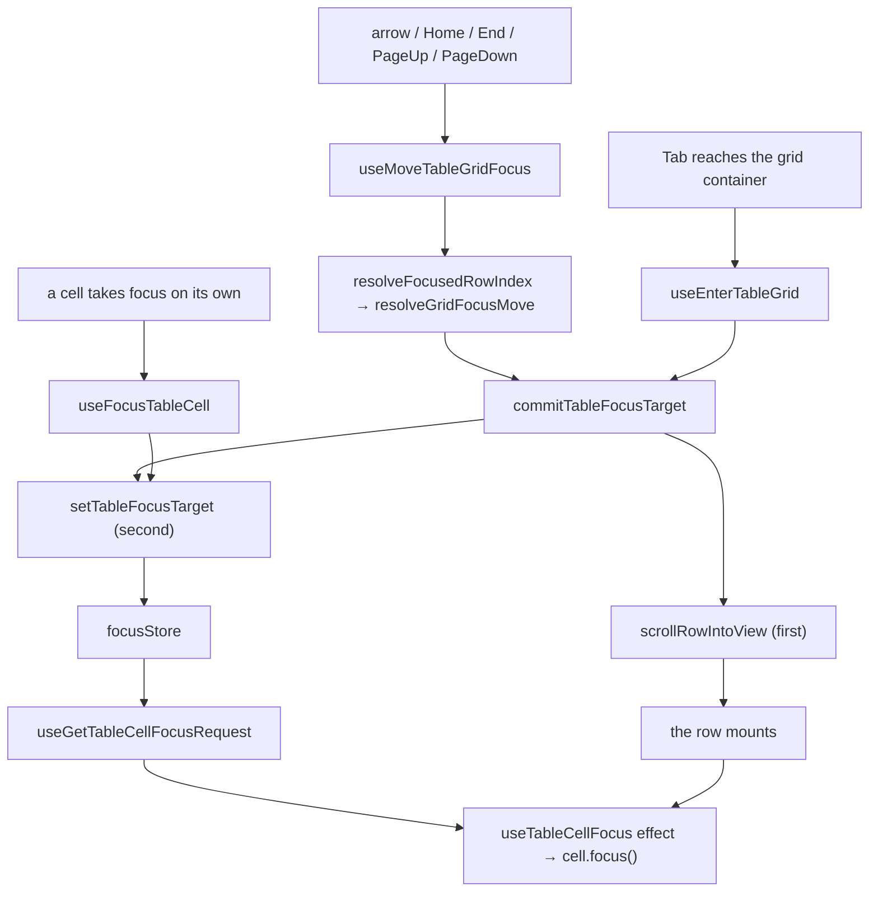

# TableFocus Context Architecture

Owns the grid's roving focus: which cell the single tab stop points at, and when
that cell must take DOM focus. One store, `focusStore`
([ADR-062](../../../../../../../docs/decisions/ADR-062-grid-semantics-roving-focus-and-row-identity.md)).

## Why focus is data

A focused row that scrolls out of the virtualization window is **unmounted**.
DOM focus falls to `<body>`, the tab order restarts from the top of the
document, and arrow-key navigation dies with no error and no visible cause.
`document.activeElement` therefore cannot be the source of truth for something
the DOM stops containing.

Focus is held here as a **row key plus a column key** — the row key being the
data-derived identity `resolveRowKey` produces, never an array index, so it
survives a sort, a filter and a window slide alike.

## Why it is mounted where it is

Above the Suspense boundary, beside `TableConfigProvider`, and for the reason
grouping sits there ([ADR-061](../../../../../../../docs/decisions/ADR-061-grouping-config-in-url-expansion-in-store.md)):
`TableDataProvider` is re-created on every navigation, so focus placed there
would be discarded by a revalidation the user did not ask for. Focus belongs to
the grid the user is operating, not to the page of rows currently loaded into it.

Both mount sites compose it — `TableLayout` and `StaticTable`.

## File Structure

```
TableFocus/
├── TableFocusContext.context.ts     → createContext
├── TableFocusContext.provider.tsx   → creates focusStore
├── TableFocusContext.types.ts       → TableFocusContextValue, provider props
├── useTableFocusContextValue.hook.ts→ guarded context read (infrastructure)
├── index.ts                         → barrel: TableFocusProvider
├── ARCHITECTURE.md                  → this file
│
└── focus/
    ├── useFocusStore.hook.ts        → useSyncExternalStore wiring for the slice
    ├── utils/
    │   └── getInitialFocusState.util.ts → no target, no focus, request id 0
    ├── selectors/
    │   ├── useGetIsTableGridTabStop.hook.ts     → does the container carry tabIndex 0
    │   ├── useGetIsTableCellTabStop.hook.ts     → does this cell carry it
    │   └── useGetTableCellFocusRequest.hook.ts  → outstanding request id, or 0
    └── actions/
        ├── useEnterTableGrid.hook.ts        → focus arrived; delegate if it landed on the container
        ├── useLeaveTableGrid.hook.ts        → focus left the grid
        ├── useReleaseTableGridFocus.hook.ts → the focused cell's node has gone away
        ├── useFocusTableCell.hook.ts        → a cell took focus on its own (pointer)
        ├── useMoveTableGridFocus.hook.ts    → a key moved the tab stop, or expanded a group
        └── utils/
            ├── resolveGridFocusKey.util.ts       → the keyboard map, unclamped
            ├── resolveGridFocusMove.util.ts      → that answer, bounded by this grid
            ├── resolveGroupExpansionKey.util.ts  → is this key a tree expansion rather than a move (ADR-067)
            ├── resolveGridFocusContext.util.ts   → the four snapshots, derived once; `data` is the visible rows
            ├── resolveFocusedRowIndex.util.ts    → recover the target's index in current data
            ├── getGridColumnKeys.util.ts         → navigable columns, in painted order
            ├── getGridPageRows.util.ts           → rows per PageUp/PageDown
            ├── setTableFocusTarget.service.ts    → the one place a request is raised
            ├── scrollRowIntoView.service.ts      → bring an off-window row in
            ├── moveTableFocusToRow.service.ts    → reposition the target when something removed its row
            └── commitTableFocusTarget.service.ts → scroll, then request (in that order)
```

## State

| Field            | Type                  | Meaning                                                      |
| ---------------- | --------------------- | ------------------------------------------------------------ |
| `columnKey`      | `string \| undefined` | Focused column; absent while the grid holds no cell focus    |
| `focusRequestId` | `number`              | Bumped whenever focus must be applied to the target's node   |
| `isGridFocused`  | `boolean`             | Whether DOM focus currently sits inside the grid             |
| `rowIndex`       | `number \| undefined` | Absolute index of the focused row among the loaded rows      |
| `rowKey`         | `string \| undefined` | Data-derived identity of the focused row, never its position |

`focusRequestId` is an id rather than a boolean because re-entering the grid
asks for the cell that is **already** the target: a flag would already be set
and the re-entry would be lost. A cell selects the id only when it is the
target and reads `0` otherwise, so a focus move re-renders the two cells whose
answer changed and no others.

## Exactly one tab stop

| State                                        | `tabIndex={0}` on |
| -------------------------------------------- | ----------------- |
| Grid not focused                             | the container     |
| Grid focused, focused row rendered           | that cell         |
| Grid focused, focused row outside the window | the container     |
| Grid focused, no rows at all                 | the container     |

The third row is the one that takes work. When the focused row is unmounted the
grid must hand the tab stop back — and a browser does **not** reliably raise
`focusout` for a node it has removed, so the signal comes from the node itself:
the cell's unmount cleanup calls `useReleaseTableGridFocus`, which clears
`isGridFocused` only if the store still names that cell. The guard is what keeps
an ordinary move between two mounted cells from revoking the tab stop the
neighbour was just granted.

## Focus flow



The scroll runs **before** the store write. A move whose target lies outside the
window has to bring the row in first, so that by the time it mounts the request
is already outstanding and is honoured on the cell's first effect rather than
needing a second pass.

## Focus recovery

`resolveFocusedRowIndex` implements ADR-062's rule and is the only place it
lives:

| Situation                        | Where focus goes                                  |
| -------------------------------- | ------------------------------------------------- |
| Row still at its stored index    | stays (checked first — the ordinary case is free) |
| Row moved (sort, filter, insert) | follows the row, found by identity                |
| Row gone from the data           | nearest surviving row at the same absolute index  |
| No rows survive                  | the grid container, which is always focusable     |

One feature overrides the third row rather than inheriting it, exactly as ADR-062
required each of them to decide: a **collapse** that hides the focused row hands
focus to the collapsed group row, its nearest surviving ancestor, because the
nearest survivor by index is whatever shifted up into the vacated slot — usually
a row in a different group ([ADR-067](../../../../../../../docs/decisions/ADR-067-expansion-is-the-collapsed-set-and-a-group-row-is-a-tree-node.md)).
`resolveGroupCollapseFocusTarget` decides it and `moveTableFocusToRow` writes it,
including handing the tab stop back to the container — the cell's own release
cannot fire, because the store has already been re-pointed away from it.

## Navigating a tree

Under grouping the grid navigates the rows a collapse leaves standing, not every
loaded row: `resolveGridFocusContext` derives them through
`resolveTableGroupTree`, so a hidden row cannot be a focus target that no cell
answers. On a **group row** the two horizontal keys are expansion keys first —
`ArrowRight` opens a closed group, `ArrowLeft` closes an open one — and cell
navigation second, so nothing is lost and the fallback is one more press
(ADR-067).

## Consumers

| Consumer                                    | Reads / dispatches                                              |
| ------------------------------------------- | --------------------------------------------------------------- |
| `hooks/useTableGridFocus` → `TableBase`     | container tab stop; enter / leave / move                        |
| `hooks/useTableCellFocus` → `TableBodyCell` | cell tab stop; focus request; pointer focus; release on unmount |

Neither component touches the store: the two hooks in `Table/hooks/` are the
whole surface, exactly as the store pattern requires.
