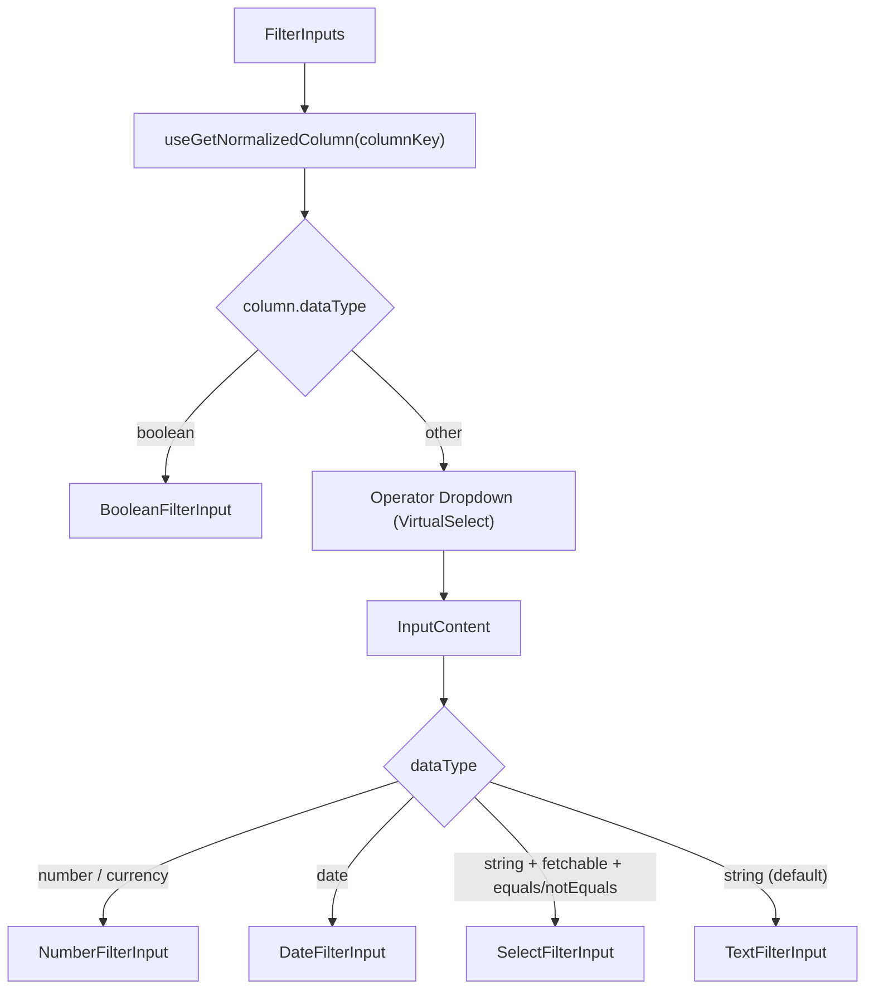
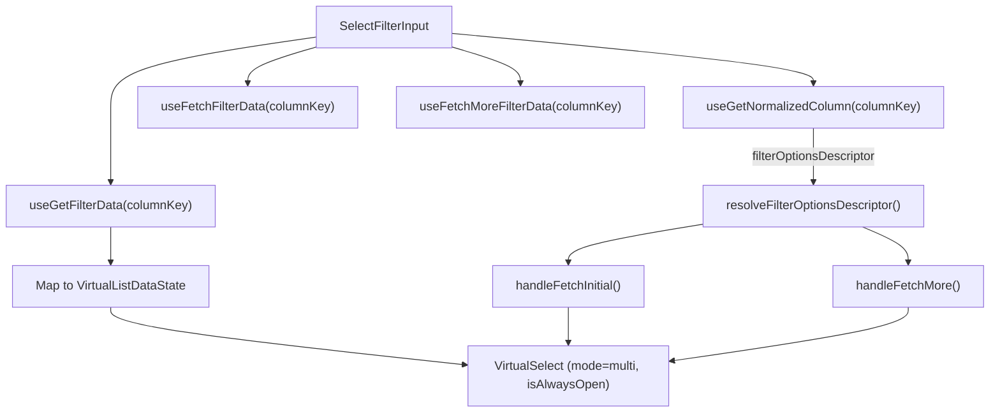

# filters/ Architecture

Modular filter input system. `FilterInputs` is the orchestrator that reads
column metadata, renders an operator dropdown, and delegates to the
appropriate type-specific input component.

## File Structure

```
filters/
├── filters.constants.ts              → NO_AUTOFILL_INPUT_PROPS (shared anti-autofill input attrs)
│
├── FilterInputs/                         → Orchestrator: operator + type-based input
│   ├── FilterInputs.component.tsx         → Operator dropdown + InputContent
│   ├── FilterInputs.types.ts              → FilterInputsProps
│   ├── FilterInputs.stylex.ts             → Layout styles
│   ├── index.ts
│   │
│   ├── InputContent/                      → Switch-based renderer
│   │   ├── InputContent.component.tsx      → Pure dispatch: routes to type-specific input
│   │   ├── InputContent.types.ts           → InputContentProps
│   │   ├── index.ts
│   │   │
│   │   └── TextOrSelectFilterInput/       → Private delegate (no barrel): text-typed default branch
│   │       ├── TextOrSelectFilterInput.component.tsx → Select list (fetchable + equality op) vs text input + operator mapping
│   │       ├── TextOrSelectFilterInput.test.tsx
│   │       └── TextOrSelectFilterInput.types.ts
│   │
│   └── utils/
│       ├── getOperatorFromFilter.util.ts   → Extract or default to 'equals'
│       ├── getOperatorOptions.util.ts      → Get operators for data type
│       ├── getSelectedOperatorLabel.util.ts → Label for current operator
│       └── index.ts
│
├── BooleanFilterInput/                    → Three-state toggle: All / True / False
│   ├── BooleanFilterInput.component.tsx
│   ├── BooleanFilterInput.types.ts
│   ├── BooleanFilterInput.stylex.ts
│   └── index.ts
│
├── TextFilterInput/                       → Free-text input with operator
│   ├── TextFilterInput.component.tsx
│   ├── TextFilterInput.types.ts
│   ├── TextFilterInput.stylex.ts
│   └── index.ts
│
├── NumberFilterInput/                     → Number input with min/max (between mode)
│   ├── NumberFilterInput.component.tsx
│   ├── NumberFilterInput.types.ts
│   ├── NumberFilterInput.stylex.ts
│   ├── utils/
│   │   ├── computeInitialValue.util.ts
│   │   ├── computeInitialMaxValue.util.ts
│   │   └── index.ts
│   └── index.ts
│
├── DateFilterInput/                       → Date picker with range (between mode)
│   ├── DateFilterInput.component.tsx
│   ├── DateFilterInput.types.ts
│   ├── DateFilterInput.stylex.ts
│   ├── utils/
│   │   ├── computeInitialValue.util.ts
│   │   ├── computeInitialEndDate.util.ts
│   │   └── index.ts
│   └── index.ts
│
└── SelectFilterInput/                     → Multi-select with lazy-loaded options
    ├── SelectFilterInput.component.tsx
    ├── SelectFilterInput.types.ts
    ├── SelectFilterInput.stylex.ts
    └── index.ts
```

## FilterInputs Routing



## Filter Types

| Component            | Filter Type | Operators                                         | Special Features                |
| -------------------- | ----------- | ------------------------------------------------- | ------------------------------- |
| `BooleanFilterInput` | `boolean`   | — (no operator)                                   | Three buttons: All/True/False   |
| `TextFilterInput`    | `text`      | equals, notEquals, contains, startsWith, endsWith | Free-text input                 |
| `NumberFilterInput`  | `number`    | equals, greaterThan, lessThan, between, ...       | Dual input in between mode      |
| `DateFilterInput`    | `date`      | equals, before, after, between, ...               | Date picker, dual in between    |
| `SelectFilterInput`  | `select`    | — (multi-select)                                  | Lazy-loaded via `VirtualSelect` |

## SelectFilterInput Data Flow



Uses `FiltersDataContext` for per-column filter options with pagination.
The column's serializable `filterOptionsDescriptor` (ADR-009) describes the
data source; `resolveFilterOptionsDescriptor` (`src/utils/filters/`) turns it
into the `{ onLoadMore, dataSelector, dataTotalSelector }` contract at fetch
time — static descriptors slice client-side, distinct descriptors page
through the generic distinct endpoints.

## Consumers

- `FiltersSectionBody` in `TableSettingsDrawer` (table-level filters)
- `ColumnSettingsDrawer` (per-column filter)
