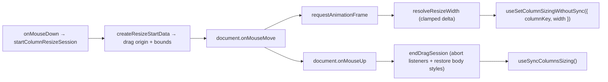
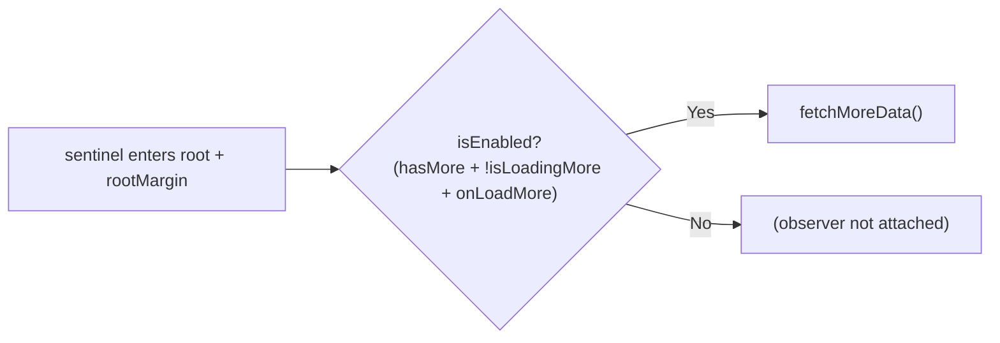

# hooks/ Architecture

Table-specific hooks for column resizing, infinite scroll, scroll reset, the
grid's roving focus and the group tree the body renders.

These are **UI mechanics** — pointer gestures, observers, scroll position. They
may call actions (that direction is fine), but nothing in `contexts/` imports
from here, which is what keeps the actions ↔ hooks dependency one-directional.
`usePersistTableStateAction` used to live here despite being consumed only by
the column actions; it now sits in `contexts/TableConfig/columns/actions/hooks/`.

## File Structure

```
hooks/
├── useColumnResize.hook.ts              → Single entry point for resizing a column: every handler + width/bounds
├── useColumnDragSession.hook.ts         → Private to useColumnResize: pointer state around a drag session
├── useInfiniteScroll.hook.ts            → Sentinel intersection detection (wraps shared useInfiniteScrollObserver)
├── useScrollResetAfterLoad.hook.ts      → Self-connected scroll-to-origin after full (non-load-more) loads
├── useTableGridFocus.hook.ts            → The grid element's tabIndex + focus/blur/keydown handlers
├── useTableCellFocus.hook.ts            → One cell's tabIndex, focus ref and pointer-focus handler
├── useTableGroupTree.hook.ts            → The rows a collapse leaves standing plus their ARIA tree metadata
├── useSyncTableGroupExpansion.hook.ts   → Drops collapsed paths the rows just loaded no longer carry
├── useTableGroupFoldAll.hook.ts         → The fold-every-group pair plus whether either has anything to do
├── useTableGroupLevelFold.hook.ts       → The same pair for one column's level, plus whether it is offered at all
├── useTableColumnLayoutLock.hook.ts     → Whether a grouped column refuses pinning, and hiding with it — the four Pin/Hide menu items' one answer
├── utils/
│   ├── createResizeStartData.util.ts    → Drag-start snapshot: origin + effective width/bounds (+ .test)
│   ├── getIsGridNavigationTarget.util.ts → Is this key event the grid's to interpret (+ .test)
│   ├── getShouldApplyCellFocus.util.ts  → May an outstanding focus request move DOM focus (+ .test)
│   ├── resolveKeyboardResizeAction.util.ts → Key → step/jump/reset/ignore policy (+ .test)
│   ├── resolveResizeWidth.util.ts       → Pointer delta → clamped column width (+ .test)
│   └── startColumnResizeSession.service.ts → Opens a drag session: listeners, RAF, body styles (+ .test)
└── index.ts                             → Barrel export
```

## useTableGridFocus / useTableCellFocus

The two halves of the grid's roving tab stop, and the only surface `TableBase`
and `TableBodyCell` see of the focus store — neither component reads a selector
or dispatches an action of its own. The model they implement, and why focus has
to be data rather than `document.activeElement`, is
[contexts/TableFocus/ARCHITECTURE.md](../contexts/TableFocus/ARCHITECTURE.md)
([ADR-062](../../../../../../docs/decisions/ADR-062-grid-semantics-roving-focus-and-row-identity.md)).

`useTableGridFocus` reads `event.relatedTarget` on blur to tell leaving the grid
from moving between two cells inside it, and `getIsGridNavigationTarget` to leave
a key pressed inside a cell's own control — a row-actions menu, a filter input —
to that control rather than swallowing it from the bubbling phase.

## useTableGroupTree / useSyncTableGroupExpansion / useTableGroupFoldAll / useTableGroupLevelFold

The render side of expansion ([ADR-067](../../../../../../docs/decisions/ADR-067-expansion-is-the-collapsed-set-and-a-group-row-is-a-tree-node.md)).

`useTableGroupTree` is the one derivation `TableBase`, `TableBody` and
`TableBodyRows` all read: the rows a collapse leaves standing, and each row's
level, position, set size and expansion state. It composes two selectors and
derives outside them rather than being one selector, deliberately — a selector
handed to `useSyncExternalStore` is called on every check and must return a
stable value for an unchanged store, and this derivation allocates. The React
Compiler memoizes the result on the two stable inputs (ADR-004), and a table
with no group rows short-circuits to its own array by reference, so an ungrouped
grid pays no per-row allocation on a scroll frame.

`useSyncTableGroupExpansion` is the effect half, mounted once on `TableBase`. It
runs the prune action whenever the data array's identity changes — a navigation
or a loaded page — and the action writes only when a path was actually dropped,
which is what stops the effect re-entering itself.

`useTableGroupFoldAll` is what the header menu's "Expand All Groups" and
"Collapse All Groups" items are wired to (#774). It takes the foldable set from
`useTableGroupTree` rather than enumerating one of its own — that set is what
every per-row chevron is drawn from, so a disabled "Collapse All" means exactly
"no chevron on screen would close anything", and there is no second derivation
for the two answers to drift apart in.

`useTableGroupLevelFold` is the same wiring for "Expand This Level" and
"Collapse This Level", which fold **the groups the open column states** — every
group at once where a chevron in that column folds one (ADR-097). It does not
re-derive which those are: it takes the level disclosures the tree already keys
by column and unions the ones this column carries, so the menu and the chevrons
answer from one derivation rather than two that agree by arithmetic.

Its third answer, `hasGroupLevel`, decides whether the two items are rendered at
all, and it asks a different question from the enabled states: is this column an
applied group key. A column that is none is **withheld**, for the reason the
aggregation block is — no click here can make a column a group key. A key whose
groups own no rows is **disabled** instead, because that is a state the reader
can clear: the innermost key gains a fold the moment a deeper key is applied.
Under `flat` nothing is foldable at all, so every key column shows the pair
inert, which is what ADR-083 already says the whole-table pair does there.

## useColumnResize

The single owner of column-resize interaction and store wiring. Returns every
handler a splitter needs (`onMouseDown`, `onKeyDown`, `onDoubleClick`) plus the
`width` and resolved `bounds` it has to announce, so `ResizeHandle` spreads the
result and triggers no actions of its own. Discrete interactions go straight
through `useSetColumnSizing`, which persists on its own.

The pure computations live in `utils/`: `createResizeStartData` resolves the
drag origin and effective bounds, `resolveResizeWidth` clamps the dragged width,
and `resolveKeyboardResizeAction` maps a keypress to a step/jump/reset/ignore.

### useColumnDragSession

The pointer half, split out of `useColumnResize` purely to keep each unit small
— it is **not** a second owner and is deliberately absent from the barrel.
It holds only the pointer state — which session is in flight, and whether the
column is resizing — and owns the drag's two-phase write: frames preview via
`useSetColumnSizingWithoutSync`, mouse up persists once.

The DOM wiring itself lives in `utils/startColumnResizeSession.service.ts`,
which each mouse down calls to open a session and which returns that session's
teardown. Side effects belong in a service rather than the hook, and the split
keeps both units under the 90-line `maxUnitSize` fallow enforces. The hook
passes the session two lifecycle callbacks: `onGestureEnd` (mouse up only →
clears `isResizing`) and `onSessionEnd` (**every** teardown path → clears the
ref).

Mouse up **flushes the last width before persisting**. Ending the session
cancels the frame still in flight, and a browser delivers a quick drag's final
move and its release in the same frame — so without the flush that movement is
discarded, leaving the column at the previous frame's width and saving that
instead of where it was let go. A fast enough flick loses the gesture entirely.
Tests must queue frames rather than run them synchronously to cover this.

Each mouse down opens a **self-contained drag session**: the start snapshot, the
move handler, and the teardown are all locals of `startColumnResizeSession`.
Listeners are registered with one `AbortController` signal, so ending the
session (mouse up, unmount, or a superseding mouse down) detaches both in one
`abort()`. No manual memoization (ADR-004) and no cross-render mutable data
bag — the only ref holds the active session's teardown for unmount safety.



| Feature              | Detail                                                     |
| -------------------- | ---------------------------------------------------------- |
| Throttling           | `requestAnimationFrame` per move event                     |
| Constraints          | `minWidth` / `maxWidth` clamping                           |
| Selection prevention | Disables text selection during drag                        |
| Cleanup              | Session teardown on mouse up, unmount, or superseding drag |

## useInfiniteScroll

Observes a sentinel element at the end of the scroll container and triggers data
fetching when it nears the bottom. Delegates to the shared
`useInfiniteScrollObserver` hook (`@/hooks`), which uses `IntersectionObserver`
instead of a scroll listener to avoid synchronous layout reads on every scroll
event.



| Param                       | Purpose                                                     |
| --------------------------- | ----------------------------------------------------------- |
| `scrollContainerRef`        | Scrollable element used as IntersectionObserver root        |
| `sentinelRef`               | Element rendered at the end of the content to observe       |
| `threshold`                 | Pixel distance from bottom (encoded as bottom `rootMargin`) |
| `hasMore` / `isLoadingMore` | Gate the `isEnabled` flag to prevent duplicate fetches      |
| `fetchMoreData`             | Async function to append next page                          |

Table state hydration is now handled by route `clientLoader`s and passed into
`TableLayout` as initial state. Keep new loader-seeded merge logic in the
TableConfig utils layer rather than adding post-mount effects back into hooks.

## useScrollResetAfterLoad

Scrolls the table container back to the origin when a full (non-load-more)
load finishes, so filter/sort refreshes always show the first rows. Owns its
store wiring (subscribes to `useGetTableIsLoading`/`useGetTableIsLoadingMore`
itself); callers only pass the scroll container ref. Extracted from
`TableContent` (WP6) so the layout shell holds no loading-transition logic.
