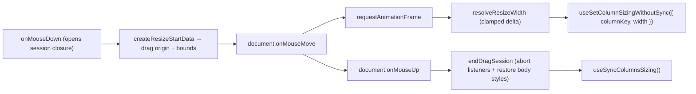
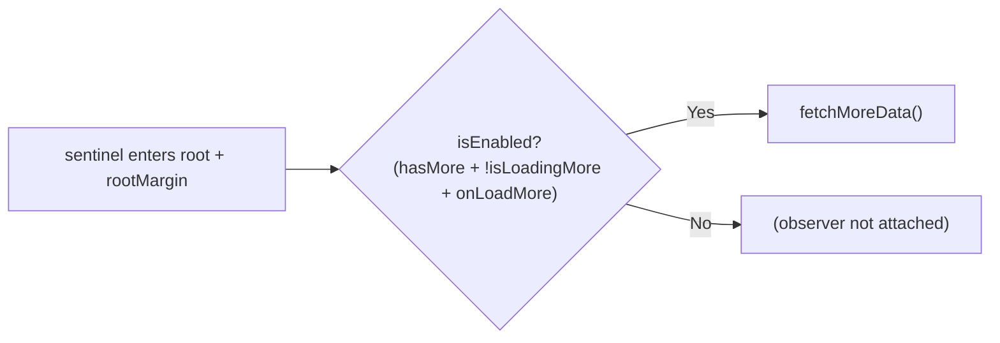

# hooks/ Architecture

Table-specific hooks for column resizing, infinite scroll, and scroll reset.

These are **UI mechanics** — pointer gestures, observers, scroll position. They
may call actions (that direction is fine), but nothing in `contexts/` imports
from here, which is what keeps the actions ↔ hooks dependency one-directional.
`usePersistTableStateAction` used to live here despite being consumed only by
the column actions; it now sits in `contexts/TableConfig/columns/actions/hooks/`.

## File Structure

```
hooks/
├── useColumnResize.hook.ts              → Single entry point for resizing a column: every handler + width/bounds
├── useColumnDragSession.hook.ts         → Private to useColumnResize: RAF-throttled drag (DOM wiring only)
├── useInfiniteScroll.hook.ts            → Sentinel intersection detection (wraps shared useInfiniteScrollObserver)
├── useScrollResetAfterLoad.hook.ts      → Self-connected scroll-to-origin after full (non-load-more) loads
├── utils/
│   ├── createResizeStartData.util.ts    → Drag-start snapshot: origin + effective width/bounds (+ .test)
│   ├── resolveKeyboardResizeAction.util.ts → Key → step/jump/reset/ignore policy (+ .test)
│   └── resolveResizeWidth.util.ts       → Pointer delta → clamped column width (+ .test)
└── index.ts                             → Barrel export
```

## useColumnResize

The single owner of column-resize interaction and store wiring. Returns every
handler a splitter needs (`onMouseDown`, `onKeyDown`, `onDoubleClick`) plus the
`width` and resolved `bounds` it has to announce, so `ResizeHandle` spreads the
result and triggers no actions of its own. Discrete interactions go straight
through `useSetColumnSizing`, which persists on its own.

The pure computations live in `utils/`: `createResizeStartData` resolves the
drag origin and effective bounds, `resolveResizeWidth` clamps the dragged width,
and `resolveKeyboardResizeAction` maps a keypress to a step/jump/reset/ignore.

### useColumnDragSession

The pointer half, split out of `useColumnResize` purely to keep each unit small
— it is **not** a second owner and is deliberately absent from the barrel.
Keeps only the DOM wiring (document listeners, RAF bookkeeping, body
cursor/selection toggles) and owns the drag's two-phase write: frames preview
via `useSetColumnSizingWithoutSync`, mouse up persists once.

Mouse up **flushes the last width before persisting**. Ending the session
cancels the frame still in flight, and a browser delivers a quick drag's final
move and its release in the same frame — so without the flush that movement is
discarded, leaving the column at the previous frame's width and saving that
instead of where it was let go. A fast enough flick loses the gesture entirely.
Tests must queue frames rather than run them synchronously to cover this.

Each mouse down opens a **self-contained drag session closure**: the start
snapshot, the move handler, and the teardown are all locals of `onMouseDown`.
Listeners are registered with one `AbortController` signal, so ending the
session (mouse up, unmount, or a superseding mouse down) detaches both in one
`abort()`. No manual memoization (ADR-004) and no cross-render mutable data
bag — the only ref holds the active session's teardown for unmount safety.



| Feature              | Detail                                                     |
| -------------------- | ---------------------------------------------------------- |
| Throttling           | `requestAnimationFrame` per move event                     |
| Constraints          | `minWidth` / `maxWidth` clamping                           |
| Selection prevention | Disables text selection during drag                        |
| Cleanup              | Session teardown on mouse up, unmount, or superseding drag |

## useInfiniteScroll

Observes a sentinel element at the end of the scroll container and triggers data
fetching when it nears the bottom. Delegates to the shared
`useInfiniteScrollObserver` hook (`@/hooks`), which uses `IntersectionObserver`
instead of a scroll listener to avoid synchronous layout reads on every scroll
event.



| Param                       | Purpose                                                     |
| --------------------------- | ----------------------------------------------------------- |
| `scrollContainerRef`        | Scrollable element used as IntersectionObserver root        |
| `sentinelRef`               | Element rendered at the end of the content to observe       |
| `threshold`                 | Pixel distance from bottom (encoded as bottom `rootMargin`) |
| `hasMore` / `isLoadingMore` | Gate the `isEnabled` flag to prevent duplicate fetches      |
| `fetchMoreData`             | Async function to append next page                          |

Table state hydration is now handled by route `clientLoader`s and passed into
`TableLayout` as initial state. Keep new loader-seeded merge logic in the
TableConfig utils layer rather than adding post-mount effects back into hooks.

## useScrollResetAfterLoad

Scrolls the table container back to the origin when a full (non-load-more)
load finishes, so filter/sort refreshes always show the first rows. Owns its
store wiring (subscribes to `useGetTableIsLoading`/`useGetTableIsLoadingMore`
itself); callers only pass the scroll container ref. Extracted from
`TableContent` (WP6) so the layout shell holds no loading-transition logic.
