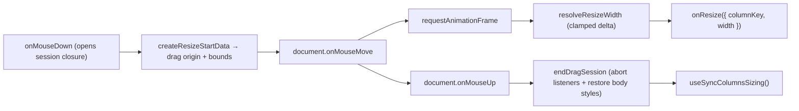
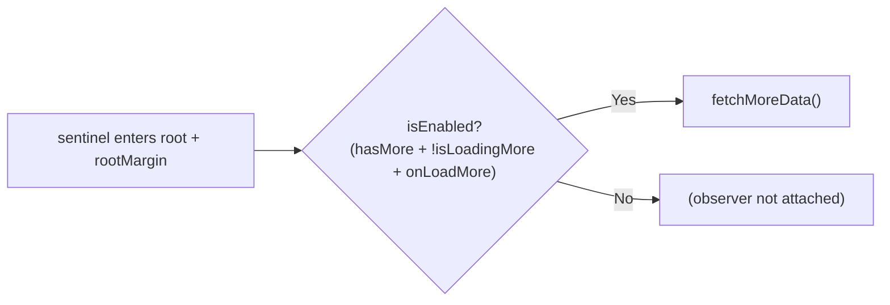
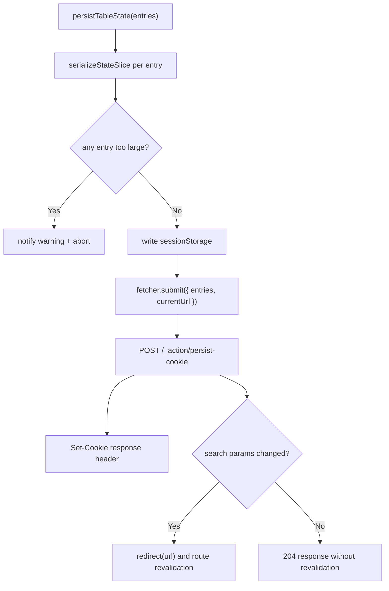

# hooks/ Architecture

Table-specific hooks for column resizing, infinite scroll, and state persistence.

## File Structure

```
hooks/
├── useColumnResize.hook.ts              → RAF-throttled drag resize (DOM wiring only)
├── useInfiniteScroll.hook.ts            → Sentinel intersection detection (wraps shared useInfiniteScrollObserver)
├── usePersistCookieAction.hook.ts       → Server action cookie persistence for column state
├── useScrollResetAfterLoad.hook.ts      → Self-connected scroll-to-origin after full (non-load-more) loads
├── utils/
│   ├── createResizeStartData.util.ts    → Drag-start snapshot: origin + effective width/bounds (+ .test)
│   └── resolveResizeWidth.util.ts       → Pointer delta → clamped column width (+ .test)
└── index.ts                             → Barrel export
```

## useColumnResize

RAF-throttled mouse drag handler for column width adjustment. The pure
computations live in `utils/` (`createResizeStartData` resolves the drag
origin and effective bounds; `resolveResizeWidth` clamps the dragged width);
the hook keeps only the DOM wiring — document listeners, RAF bookkeeping,
and body cursor/selection toggles.

Each mouse down opens a **self-contained drag session closure**: the start
snapshot, the move handler, and the teardown are all locals of `onMouseDown`.
Listeners are registered with one `AbortController` signal, so ending the
session (mouse up, unmount, or a superseding mouse down) detaches both in one
`abort()`. No manual memoization (ADR-004) and no cross-render mutable data
bag — the only ref holds the active session's teardown for unmount safety.



| Feature              | Detail                                                     |
| -------------------- | ---------------------------------------------------------- |
| Throttling           | `requestAnimationFrame` per move event                     |
| Constraints          | `minWidth` / `maxWidth` clamping                           |
| Double-click         | Resets column to auto width                                |
| Selection prevention | Disables text selection during drag                        |
| Cleanup              | Session teardown on mouse up, unmount, or superseding drag |

## useInfiniteScroll

Observes a sentinel element at the end of the scroll container and triggers data
fetching when it nears the bottom. Delegates to the shared
`useInfiniteScrollObserver` hook (`@/hooks`), which uses `IntersectionObserver`
instead of a scroll listener to avoid synchronous layout reads on every scroll
event.



| Param                       | Purpose                                                     |
| --------------------------- | ----------------------------------------------------------- |
| `scrollContainerRef`        | Scrollable element used as IntersectionObserver root        |
| `sentinelRef`               | Element rendered at the end of the content to observe       |
| `threshold`                 | Pixel distance from bottom (encoded as bottom `rootMargin`) |
| `hasMore` / `isLoadingMore` | Gate the `isEnabled` flag to prevent duplicate fetches      |
| `fetchMoreData`             | Async function to append next page                          |

Table state hydration is now handled by route `clientLoader`s and passed into
`TableLayout` as initial state. Keep new loader-seeded merge logic in the
TableConfig utils layer rather than adding post-mount effects back into hooks.
| Guard | No-op when persistenceKey is empty |

## usePersistTableStateAction

Persists column-oriented table state slices through the dual-channel flow: write
sessionStorage immediately, then submit the cookie update through a React Router
server action.



Supports both single entries and batch submissions. Each entry specifies:

- `persistenceKey` — cookie name namespace
- `slice` — which state slice (columnFilters, sorting, etc.)
- `valueSlice` — the data to persist
- `searchParamKey/Value` — optional URL search param sync
- Revalidation happens only when persisted `searchParamKey/Value` produce an
  effective URL search-param change; otherwise the action returns `204` and
  only cookie/session persistence occurs.
- Oversized entries block the entire apply flow before sessionStorage, URL sync, or cookie persistence to avoid partial restored state

## useScrollResetAfterLoad

Scrolls the table container back to the origin when a full (non-load-more)
load finishes, so filter/sort refreshes always show the first rows. Owns its
store wiring (subscribes to `useGetTableIsLoading`/`useGetTableIsLoadingMore`
itself); callers only pass the scroll container ref. Extracted from
`TableContent` (WP6) so the layout shell holds no loading-transition logic.
