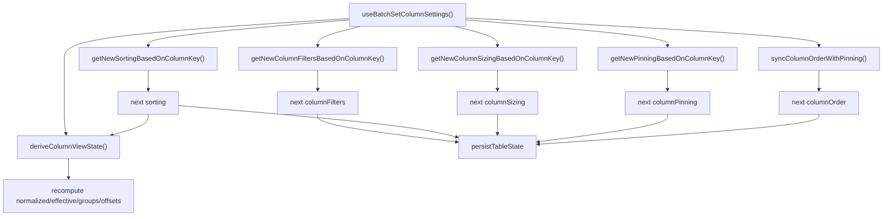
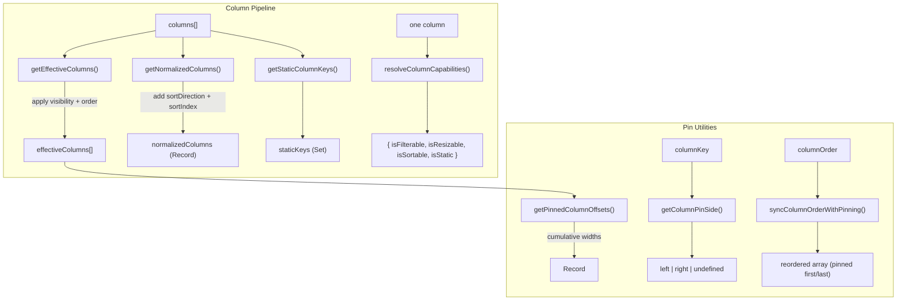

# utils/ Architecture

Pure utility functions for column processing and state persistence.

## File Structure

```
utils/
├── createActionsColumn.util.ts                   → Build the row-actions column, merging consumer overrides onto defaults
├── createBasicColumn.util.ts                     → Build generic non-render table columns from shared metadata
├── deriveColumnViewState.util.ts                 → Compose normalized columns + pinning-derived slices
├── getColumnSettingsNextStatePatch.util.ts       → Build the next table-meta patch after column-settings accept
├── getColumnPinSide.util.ts                      → Detect which side a column is pinned to
├── getEffectiveColumns.util.ts                   → Apply visibility + order + pinning
├── getHasQueryChanged.util.ts                    → Compare current vs next filters/sorting for revalidation decisions
├── getIsTableSettingsOpen.util.ts                → Restore table-settings open state from the column-drawer takeover snapshot
├── getNewColumnFiltersBasedOnColumnKey.util.ts   → Build next filter map for one column change
├── getNewColumnSizingBasedOnColumnKey.util.ts    → Build next sizing map for one column change
├── getNewPinningBasedOnColumnKey.util.ts         → Build next pinning state for one column change
├── getNewSortingBasedOnColumnKey.util.ts         → Build next sorting array for one column change
├── getNormalizedColumns.util.ts                  → Enrich columns with sort metadata
├── getPinnedColumnOffsets.util.ts                → Compute sticky offsets for pinned columns
├── getPinnedDerivedColumnsState.util.ts          → Build effective columns, groups, and pinned offsets
├── getPersistedUiState.util.ts                   → Extract the persisted meta UI slice from full table meta state
├── getStaticColumnKeys.util.ts                   → Extract non-reorderable column keys
├── getStorageKey.util.ts                         → Build namespaced storage key
├── orderColumnsByKeys.util.ts                    → Order columns to follow a key list, appending unmentioned ones
├── readPersistedStateFromCookie.util.ts          → SSR-safe cookie state read
├── readPersistedUiFlagsFromCookie.util.ts        → SSR-safe read of drawer open/pinned flags from cookie
├── resolveColumnCapabilities.util.ts              → Resolve a column's capability flags against the defaults
├── resolveCrudRowId.util.ts                       → Resolve CRUD row id from the primary-key column(s)
├── resolveFetchMoreState.util.ts                 → Shared append/hasMore/total resolution for paginated fetch actions
├── resolveGridRowIndexing.util.ts                 → aria-rowcount and a body row's aria-rowindex, from one base (not exported from the barrel)
├── resolvePrimaryKeyColumnKeys.util.ts            → Keys of isPrimaryKey columns (declaration order, excludes 'actions')
├── resolveTableActionsColumn.util.ts              → Synthesize/merge the row-actions column from `crud` + any consumer override
├── serializeStateSlice.util.ts                   → JSON serialize a state slice
├── splitColumnsByPinning.util.ts                 → Split columns into left/center/right groups
├── syncColumnOrderWithPinning.util.ts            → Pin-aware column reordering
├── persistence.constants.ts                      → Storage key constants
├── persistence.types.ts                          → Persistence config types
└── index.ts                                      → Barrel export for shared table utils
```

## Batch Column Settings Decomposition

The batch update action in TableConfig now delegates per-slice state transitions to focused pure utilities.
This removes heavy branch logic from the hook and makes each rule testable in isolation.



| Function                            | Input                                                                        | Output             | Purpose                                                                                                                            |
| ----------------------------------- | ---------------------------------------------------------------------------- | ------------------ | ---------------------------------------------------------------------------------------------------------------------------------- |
| getNewSortingBasedOnColumnKey       | columnKey, sorting, existingSorting                                          | SortingState       | Update/remove one column sort while preserving order                                                                               |
| getNewColumnFiltersBasedOnColumnKey | columnKey, columnFilter, columnFiltersState                                  | ColumnFiltersState | Replace or remove one column filter entry without mutating state                                                                   |
| getNewColumnSizingBasedOnColumnKey  | columnKey, columnSizing, columnSizesState                                    | ColumnSizingState  | Replace/remove one width entry for a column                                                                                        |
| getNewPinningBasedOnColumnKey       | columnKey, columnPinning, existingPinning, staticKeys                        | ColumnPinningState | Pin/unpin one column while honoring static key constraints                                                                         |
| syncColumnOrderWithPinning          | columnKey, columnPinning, columns, currentOrder, previousPinning, newPinning | ColumnOrderState   | Keep order consistent with pinning groups; pin inserts into pinned groups and unpin repositions adjacent to remaining pinned group |
| deriveColumnViewState               | columns, sorting, order, pinning, sizing, visibility                         | derived view state | Recompute normalized columns plus pinning-dependent derived slices together                                                        |

## Column Utilities



| Function                        | Input                                         | Output                                                                              | Purpose                                                                                                                                                                                                           |
| ------------------------------- | --------------------------------------------- | ----------------------------------------------------------------------------------- | ----------------------------------------------------------------------------------------------------------------------------------------------------------------------------------------------------------------- |
| createActionsColumn             | overrides (partial TableColumn)               | TableColumn                                                                         | Build the row-actions column, merging consumer overrides (e.g. `render`) onto pinned/static/non-filterable defaults                                                                                               |
| createBasicColumn               | dataType, key, label, min/max widths          | TableColumn                                                                         | Build reusable basic typed columns in app route constants without re-declaring helper logic (distinct filter options are appended by loaders via `@lcabrera/ui/routing/appendDistinctFilterDescriptors`, ADR-009) |
| deriveColumnViewState           | columns, sorting, order, pinning, sizing      | { normalizedColumns, effectiveColumns, pinnedColumnPartition, pinnedColumnOffsets } | Compose sort metadata with pinning-dependent derived state in one call                                                                                                                                            |
| getColumnSettingsNextStatePatch | metaState                                     | Partial<TableMetaState>                                                             | Compute the persisted meta patch after accepting column settings                                                                                                                                                  |
| getEffectiveColumns             | columns, order, visibility                    | TableColumn[]                                                                       | Visible columns in display order; pinned columns follow reconciled display order                                                                                                                                  |
| getHasQueryChanged              | current filters/sorting, next filters/sorting | boolean                                                                             | Detect whether a settings mutation should trigger query revalidation/loading state                                                                                                                                |
| getIsTableSettingsOpen          | metaState                                     | boolean                                                                             | Restore table-settings visibility when column settings temporarily took over the panel state                                                                                                                      |
| getPinnedDerivedColumnsState    | columns, order, pinning, sizing, visibility   | { effectiveColumns, pinnedColumnPartition, pinnedColumnOffsets }                    | Recompute all pinning-dependent derived slices in one call                                                                                                                                                        |
| getNormalizedColumns            | columns, sorting                              | NormalizedColumnsState                                                              | Columns enriched with sort metadata                                                                                                                                                                               |
| getStaticColumnKeys             | columns                                       | Set<string>                                                                         | Keys of locked/static columns                                                                                                                                                                                     |
| orderColumnsByKeys              | columns, columnOrder                          | TableColumn[]                                                                       | Columns reordered to follow `columnOrder`; unmentioned columns keep their relative order and are appended, order entries with no matching column are dropped                                                      |
| getPinnedColumnOffsets          | pinning, sizing, columns                      | Record<key, PinnedColumnInfo>                                                       | Sticky positions for pinned columns                                                                                                                                                                               |
| getColumnPinSide                | columnKey, pinning                            | PinSide or undefined                                                                | Which side a column is pinned to                                                                                                                                                                                  |
| resolveColumnCapabilities       | column (or undefined)                         | { isFilterable, isResizable, isSortable, isStatic }                                 | Materialize a column's capability defaults in one place; the only reader of the optional flags in the component tree                                                                                              |
| resolveCrudRowId                | row, columns                                  | string                                                                              | Build a CRUD row id from the primary-key column(s) (single = raw value, composite = encoded values joined by `_`)                                                                                                 |
| resolvePrimaryKeyColumnKeys     | columns                                       | DataKey[]                                                                           | Keys of `isPrimaryKey` columns in declaration order (excludes `actions`)                                                                                                                                          |
| resolveTableActionsColumn       | columns, crud                                 | { columns, hasActionsColumn }                                                       | Adds/merges the synthetic `actions` column when `crud.read/update/delete` is enabled or the consumer declared one                                                                                                 |
| resolveFetchMoreState           | currentData, selectors, response, totals      | { combinedData, hasMore, totalLoadedRows, totalRows }                               | Shared pagination merge logic used by table rows and filter-options load-more                                                                                                                                     |
| resolveAriaRowCount             | totalRows                                     | number                                                                              | The grid's `aria-rowcount`: the dataset plus its header row, or `-1` when the consumer supplied no total (ADR-062)                                                                                                |
| resolveBodyAriaRowIndex         | rowIndex                                      | number                                                                              | A body row's absolute `aria-rowindex`; shares one base with the count, so the last row's index equals it (ADR-062)                                                                                                |
| splitColumnsByPinning           | pinning, effectiveColumns                     | PinnedColumnPartitionState                                                          | Split columns into left/center/right                                                                                                                                                                              |
| syncColumnOrderWithPinning      | order, previous/new pinning                   | string[]                                                                            | Reorder to keep pinned columns grouped; unpin columns move adjacent to remaining pinned group                                                                                                                     |

`resolveColumnCapabilities` is the single home for the capability defaults. The
flags on `TableColumn` are optional, and an omitted one is not a missing value —
reading `column.isSortable` directly re-derives a default at the point of use,
which is what the hand-spelled predicates it replaced each did, in spellings that
did not agree with one another. It also folds `isStatic` into `isResizable`,
because a static column is locked against every user modification, resizing
included. `deriveToggleCommandState` takes its availability argument from it
(`commands/ARCHITECTURE.md`).

The one code that still reads the flags directly is `src/benchmarks/`, which
re-implements the predicate on purpose to measure array shapes and is excluded
from the published package. Anywhere in the component tree, go through the
resolver — `vp lint`/`vp check` will not catch a direct read, so this is the
convention that has to hold by review (`src/PATTERNS.md`).

getPinnedColumnOffsets computes offsets and boundary markers (isLastPinnedLeft, isFirstPinnedRight) from effective column order so shadow boundaries stay aligned with rendered sticky positions even if pinning arrays are out of order.

## Persistence Utilities

```mermaid
graph LR
  subgraph "Read"
    Cookie["document.cookie / request headers"] --> Read["readPersistedStateFromCookie()"]
    Read --> State["{ columnFilters, sorting, columnOrder, ... }"]
  end

  subgraph "Write (cookie via server action)"
    Slice["state slice"] --> Serialize["serializeStateSlice()"]
    Serialize --> KV["{ key, value }"]
    KV --> Build["buildColumnSizingCookieEntry() / buildUiFlagsCookieEntry()"]
    Build --> Action["usePersistCookieAction()"]
    Action --> Route["POST /_action/persist-cookie → Set-Cookie"]
  end
```

| Function                       | Purpose                                                                                       |
| ------------------------------ | --------------------------------------------------------------------------------------------- |
| readPersistedStateFromCookie   | Parse persisted state from cookies (SSR-safe)                                                 |
| getPersistedUiState            | Extract the persisted UI subset from `TableMetaState` (consumed by `buildUiFlagsCookieEntry`) |
| serializeStateSlice            | Convert a state slice to a `{ key, value }` payload (consumed by the cookie-entry builders)   |
| readPersistedUiFlagsFromCookie | SSR-safe read of drawer open/pinned flags from cookie                                         |
| getStorageKey                  | Build storage key, optionally `appId`-scoped                                                  |

Persistence **writes** no longer live in this `utils/` layer. Drawer-UI-flag and
column-sizing persistence moved to action hooks —
`usePersistTableUiFlagsAction` (`contexts/TableConfig/meta/actions/`) and
`usePersistColumnSizingAction` (`contexts/TableConfig/columns/actions/hooks/`) —
which build a cookie entry from the pure builders above
(`buildUiFlagsCookieEntry` / `buildColumnSizingCookieEntry`) and submit it via
`usePersistCookieAction` to the `/_action/persist-cookie` server action
(`Set-Cookie`). The pure builders remain the seam these utils feed; the effect
sits in the hook, so no `*.service.ts` writer is needed here.
