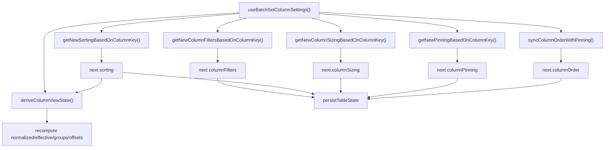
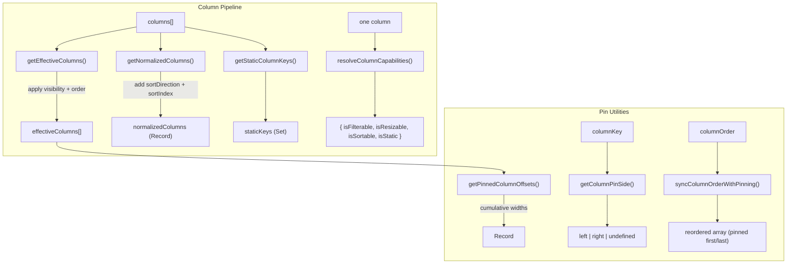

# utils/ Architecture

Pure utility functions for column processing and state persistence.

## File Structure

```
utils/
├── createActionsColumn.util.ts                   → Build the row-actions column, merging consumer overrides onto defaults
├── createBasicColumn.util.ts                     → Build generic non-render table columns from shared metadata
├── deriveColumnViewState.util.ts                 → Compose normalized columns + pinning-derived slices
├── getColumnSettingsNextStatePatch.util.ts       → Build the next table-meta patch after column-settings accept
├── getColumnPinSide.util.ts                      → Detect which side a column is pinned to
├── getEffectiveColumns.util.ts                   → Apply visibility + order + pinning
├── getHasQueryChanged.util.ts                    → Compare current vs next filters/sorting for revalidation decisions
├── getIsTableSettingsOpen.util.ts                → Restore table-settings open state from the column-drawer takeover snapshot
├── getNewColumnFiltersBasedOnColumnKey.util.ts   → Build next filter map for one column change
├── getNewColumnSizingBasedOnColumnKey.util.ts    → Build next sizing map for one column change
├── getNewPinningBasedOnColumnKey.util.ts         → Build next pinning state for one column change
├── getNewSortingBasedOnColumnKey.util.ts         → Build next sorting array for one column change
├── getNormalizedColumns.util.ts                  → Enrich columns with sort metadata
├── getPinnedColumnOffsets.util.ts                → Compute sticky offsets for pinned columns
├── getPinnedDerivedColumnsState.util.ts          → Build effective columns, groups, and pinned offsets
├── getPersistedUiState.util.ts                   → Extract the persisted meta UI slice from full table meta state
├── getStaticColumnKeys.util.ts                   → Extract non-reorderable column keys
├── getStorageKey.util.ts                         → Build namespaced storage key
├── orderColumnsByKeys.util.ts                    → Order columns to follow a key list, appending unmentioned ones
├── readPersistedStateFromCookie.util.ts          → SSR-safe cookie state read
├── readPersistedUiFlagsFromCookie.util.ts        → SSR-safe read of drawer open/pinned flags from cookie
├── resolveColumnCapabilities.util.ts              → Resolve a column's capability flags against the defaults
├── resolveColumnLayoutLock.util.ts                → Whether a grouped column refuses pinning, and hiding with it
├── resolveCrudRowId.util.ts                       → Resolve CRUD row id from the primary-key column(s)
├── resolveFetchMoreState.util.ts                 → Shared append/hasMore/total resolution for paginated fetch actions
├── resolveGridRowIndexing.util.ts                 → aria-rowcount and a body row's aria-rowindex, from one base (not exported from the barrel)
├── resolveGroupKeyAvailability.util.ts            → Whether a column may be OFFERED as a group key: the declared flag narrowed by the catalogue
├── orderLegalAggregates.util.ts                   → The aggregates legal for a column's real type, in menu order
├── resolveOfferableAggregates.util.ts             → Which of those a surface may OFFER: none at all while the column is a group key
├── countCountDistinct.util.ts                     → How many countDistinct aggregates a list carries, across every column together
├── isWithinCountDistinctBudget.util.ts            → Whether a list is one a grouped read can carry — the boundary's question
├── hasCountDistinctBudgetLeft.util.ts             → Whether one MORE would fit — an offering surface's, and not the same answer
├── resolveAffordableAggregates.util.ts            → Which of the offerable ones the whole READ still has room for, and which were withheld
├── resolvePrimaryKeyColumnKeys.util.ts            → Keys of isPrimaryKey columns (declaration order, excludes 'actions')
├── resolveTableActionsColumn.util.ts              → Synthesize/merge the row-actions column from `crud` + any consumer override
├── serializeStateSlice.util.ts                   → JSON serialize a state slice
├── splitColumnsByPinning.util.ts                 → Split columns into left/center/right groups
├── syncColumnOrderWithPinning.util.ts            → Pin-aware column reordering
├── tableAggregateToken.util.ts                   → One applied aggregate's identity as a string, and the right-split parse back
├── persistence.constants.ts                      → Storage key constants
├── persistence.types.ts                          → Persistence config types
└── index.ts                                      → Barrel export for shared table utils
```

## Batch Column Settings Decomposition

The batch update action in TableConfig now delegates per-slice state transitions to focused pure utilities.
This removes heavy branch logic from the hook and makes each rule testable in isolation.



| Function                            | Input                                                                        | Output             | Purpose                                                                                                                            |
| ----------------------------------- | ---------------------------------------------------------------------------- | ------------------ | ---------------------------------------------------------------------------------------------------------------------------------- |
| getNewSortingBasedOnColumnKey       | columnKey, sorting, existingSorting                                          | SortingState       | Update/remove one column sort while preserving order                                                                               |
| getNewColumnFiltersBasedOnColumnKey | columnKey, columnFilter, columnFiltersState                                  | ColumnFiltersState | Replace or remove one column filter entry without mutating state                                                                   |
| getNewColumnSizingBasedOnColumnKey  | columnKey, columnSizing, columnSizesState                                    | ColumnSizingState  | Replace/remove one width entry for a column                                                                                        |
| getNewPinningBasedOnColumnKey       | columnKey, columnPinning, existingPinning, staticKeys                        | ColumnPinningState | Pin/unpin one column while honoring static key constraints                                                                         |
| syncColumnOrderWithPinning          | columnKey, columnPinning, columns, currentOrder, previousPinning, newPinning | ColumnOrderState   | Keep order consistent with pinning groups; pin inserts into pinned groups and unpin repositions adjacent to remaining pinned group |
| deriveColumnViewState               | columns, sorting, order, pinning, sizing, visibility                         | derived view state | Recompute normalized columns plus pinning-dependent derived slices together                                                        |

## Column Utilities



| Function                        | Input                                                | Output                                                                              | Purpose                                                                                                                                                                                                                                                                                               |
| ------------------------------- | ---------------------------------------------------- | ----------------------------------------------------------------------------------- | ----------------------------------------------------------------------------------------------------------------------------------------------------------------------------------------------------------------------------------------------------------------------------------------------------- |
| createActionsColumn             | overrides (partial TableColumn)                      | TableColumn                                                                         | Build the row-actions column, merging consumer overrides (e.g. `render`) onto pinned/static/non-filterable defaults                                                                                                                                                                                   |
| createBasicColumn               | dataType, key, label, min/max widths                 | TableColumn                                                                         | Build reusable basic typed columns in app route constants without re-declaring helper logic (distinct filter options are appended by loaders via `@lcabrera/ui/routing/appendDistinctFilterDescriptors`, ADR-009)                                                                                     |
| deriveColumnViewState           | columns, sorting, order, pinning, sizing             | { normalizedColumns, effectiveColumns, pinnedColumnPartition, pinnedColumnOffsets } | Compose sort metadata with pinning-dependent derived state in one call                                                                                                                                                                                                                                |
| getColumnSettingsNextStatePatch | metaState                                            | Partial<TableMetaState>                                                             | Compute the persisted meta patch after accepting column settings                                                                                                                                                                                                                                      |
| getEffectiveColumns             | columns, order, visibility                           | TableColumn[]                                                                       | Visible columns in display order; pinned columns follow reconciled display order                                                                                                                                                                                                                      |
| getHasQueryChanged              | current filters/sorting, next filters/sorting        | boolean                                                                             | Detect whether a settings mutation should trigger query revalidation/loading state                                                                                                                                                                                                                    |
| getIsTableSettingsOpen          | metaState                                            | boolean                                                                             | Restore table-settings visibility when column settings temporarily took over the panel state                                                                                                                                                                                                          |
| getPinnedDerivedColumnsState    | columns, order, pinning, sizing, visibility          | { effectiveColumns, pinnedColumnPartition, pinnedColumnOffsets }                    | Recompute all pinning-dependent derived slices in one call                                                                                                                                                                                                                                            |
| getNormalizedColumns            | columns, sorting                                     | NormalizedColumnsState                                                              | Columns enriched with sort metadata                                                                                                                                                                                                                                                                   |
| getStaticColumnKeys             | columns                                              | Set<string>                                                                         | Keys of locked/static columns                                                                                                                                                                                                                                                                         |
| orderColumnsByKeys              | columns, columnOrder                                 | TableColumn[]                                                                       | Columns reordered to follow `columnOrder`; unmentioned columns keep their relative order and are appended, order entries with no matching column are dropped                                                                                                                                          |
| getPinnedColumnOffsets          | pinning, sizing, columns                             | Record<key, PinnedColumnInfo>                                                       | Sticky positions for pinned columns                                                                                                                                                                                                                                                                   |
| getColumnPinSide                | columnKey, pinning                                   | PinSide or undefined                                                                | Which side a column is pinned to                                                                                                                                                                                                                                                                      |
| resolveColumnCapabilities       | column (or undefined)                                | { isFilterable, isResizable, isSortable, isStatic }                                 | Materialize a column's capability defaults in one place; the only reader of the optional flags in the component tree                                                                                                                                                                                  |
| resolveColumnLayoutLock         | columnKey, columns, groupingKeys                     | 'group-key' \| 'measure' \| undefined                                               | Which layout actions a column refuses while grouping is applied: a group key is force-pinned left and forced visible by the layout derivation, a measure resolves its layout actions to the column it measures. The one answer the four Pin/Hide menu items read (ADR-100)                            |
| resolveCrudRowId                | row, columns                                         | string \| undefined                                                                 | Build a CRUD row id from the primary-key column(s) (single = raw value, composite = encoded values joined by `_`), or `undefined` when the row cannot produce one — it answers rather than throws, because its only caller renders (ADR-062)                                                          |
| resolveGroupKeyAvailability     | column, catalogue capability                         | { isGroupable, refusal }                                                            | Whether a column may be **offered** as a group key: `resolveColumnCapabilities`' declared answer narrowed by the catalogue's (ADR-058/067). Absent capability leaves the declaration standing; a consumer opt-out wins and reports no reason                                                          |
| orderLegalAggregates            | the catalogue's aggregate set                        | TableAggregateFn[]                                                                  | The aggregates legal for a column's real **type**, in menu order; also drops a SQL name this package has no label for                                                                                                                                                                                 |
| resolveOfferableAggregates      | catalogue capability, isGroupKey                     | TableAggregateFn[]                                                                  | Which of those a surface may **offer**: the ordered legal set, and nothing at all while the column is an active group key (ADR-080). One predicate for the header menu and the drawer picker alike (#830); deliberately blind to what is already applied (#841) and to the whole-request rails (#842) |
| countCountDistinct              | the whole aggregate list                             | number                                                                              | How many `countDistinct` aggregates it carries, across every column together — derived once, so the two predicates below differ only in how they compare it                                                                                                                                           |
| isWithinCountDistinctBudget     | the whole aggregate list                             | boolean                                                                             | Whether a list is one a grouped read can carry — the boundary question, asked by `sanitizeGroupingByColumns` of a URL and `areGroupAggregatesLegal` of a store seed, and refused whole by both (#842)                                                                                                 |
| hasCountDistinctBudgetLeft      | the aggregates applied elsewhere                     | boolean                                                                             | Whether one more would still fit — the **offering** question, deliberately not the one above: a list at the budget is legal and has no room, and a surface asking the wrong one offers the entry that breaks it                                                                                       |
| resolveAffordableAggregates     | applied, catalogue capability, columnKey, isGroupKey | { affordable, withheld }                                                            | The offerable set narrowed by the read's `countDistinct` budget, plus what that narrowing took away. Both offering surfaces call this rather than the predicate above; the column's own entries are out of the count, so its applied item stays toggle-off-able (#842)                                |
| toTableAggregateToken           | { columnKey, fn }                                    | string                                                                              | One applied aggregate's identity as a single string (`"total_amount:sum"`). A column may carry several measures, so neither half identifies an entry alone (#831); one spelling serves the URL token, the share-denominator map key and the staged list's React key                                   |
| parseTableAggregateToken        | token                                                | TableColumnAggregate or undefined                                                   | The inverse, splitting on the **last** `:` and checking the suffix against the closed function vocabulary — which is what lets a consumer's column key contain a `:`. Lives beside the encoder (ADR-082); only the `grouping` codec calls it                                                          |
| parseTableAggregateTokens       | tokens                                               | TableColumnAggregate[] or undefined                                                 | The same over a whole list and **all-or-nothing**: one unreadable token answers `undefined` for the lot, so a caller cannot accept a partly-read list (ADR-061's refuse-whole rule)                                                                                                                   |
| resolvePrimaryKeyColumnKeys     | columns                                              | DataKey[]                                                                           | Keys of `isPrimaryKey` columns in declaration order (excludes `actions`)                                                                                                                                                                                                                              |
| resolveTableActionsColumn       | columns, crud                                        | { columns, hasActionsColumn }                                                       | Adds/merges the synthetic `actions` column when `crud.read/update/delete` is enabled or the consumer declared one                                                                                                                                                                                     |
| resolveFetchMoreState           | currentData, selectors, response, totals             | { combinedData, hasMore, totalLoadedRows, totalRows }                               | Shared pagination merge logic used by table rows and filter-options load-more                                                                                                                                                                                                                         |
| resolveAriaRowCount             | totalRows                                            | number                                                                              | The grid's `aria-rowcount`: the dataset plus its header row, or `-1` when the consumer supplied no total (ADR-062)                                                                                                                                                                                    |
| resolveBodyAriaRowIndex         | rowIndex                                             | number                                                                              | A body row's absolute `aria-rowindex`; shares one base with the count, so the last row's index equals it (ADR-062)                                                                                                                                                                                    |
| splitColumnsByPinning           | pinning, effectiveColumns                            | PinnedColumnPartitionState                                                          | Split columns into left/center/right                                                                                                                                                                                                                                                                  |
| syncColumnOrderWithPinning      | order, previous/new pinning                          | string[]                                                                            | Reorder to keep pinned columns grouped; unpin columns move adjacent to remaining pinned group                                                                                                                                                                                                         |

`resolveColumnCapabilities` is the single home for the capability defaults. The
flags on `TableColumn` are optional, and an omitted one is not a missing value —
reading `column.isSortable` directly re-derives a default at the point of use,
which is what the hand-spelled predicates it replaced each did, in spellings that
did not agree with one another. It also folds `isStatic` into `isResizable`,
because a static column is locked against every user modification, resizing
included. `deriveToggleCommandState` takes its availability argument from it
(`commands/ARCHITECTURE.md`).

**Grouping is the one capability with a second gate, and it composes rather than
competes.** `resolveGroupKeyAvailability` calls the resolver and then narrows its
`isGroupable` with the catalogue's answer from the loader meta (ADR-058,
ADR-063), because a column's real Postgres type and its distinct-value
statistics are questions the browser cannot answer and the declared flag defaults
to `true`. Every surface that offers a group key goes through it — the header
menu item and the drawer's add-key list — so the two cannot disagree. An absent
capability leaves the declared answer standing: a route may group without
shipping a map at all.

**Aggregation has a second gate too, and `resolveOfferableAggregates` is where
it composes.** The catalogue answers which functions a column's real type
supports; the grouping keys answer whether the column is currently rendering a
key's value instead of a measure (ADR-080), in which case none of them may be
offered. Both surfaces that offer an aggregate — the column header menu's
aggregation block and the drawer's "Add Aggregate" picker — call it, and the
composition is the point: they had a gate each, the picker knew about group keys
and the menu did not, so the menu offered functions that wrote the store and
changed nothing on screen (#830).

Each surface still feeds it from its **own** commit context, exactly as the
command layer requires: the header menu passes the live grouping keys and the
drawer passes its draft, so the picker reflects a key staged behind Accept while
the menu reflects the one the table is grouped by. Sharing the predicate is not
sharing the state.

**It takes no account of which aggregates are already applied, and that omission
is load-bearing** (#841). Legality is a property of the column, so both surfaces
want the same answer; what to do about an _applied_ function is a property of the
gesture, so they do not. The drawer's picker only adds, so offering a function the
column already carries offers a guarded no-op — it composes this predicate with
its staged aggregates in `GroupingSection/utils/resolveAddableAggregates.util.ts`
and subtracts them there. The header menu toggles, so that same item is the only
way to remove an aggregate and has to stay. Taking the aggregate list as an
argument here would force one answer on both surfaces, and it is the menu that
would lose. `resolveOfferableAggregates.surfaces.test.tsx` pins both halves
against the same applied aggregate, so the divergence cannot be quietly closed.

**One grouping rule is not a per-column question at all, and it composes a layer
further out** (#842). `@lcabrera/server` budgets a grouped read at
`MAX_TABLE_COUNT_DISTINCT_AGGREGATES` `countDistinct` aggregates, counted across
every column together, so a per-column predicate cannot see the input the answer
depends on — the same line `Table.types.ts` draws between
`TableGroupKeyRefusalReason` (per column, answerable before anything is selected)
and `TableGroupingRefusalReason` (per request). `resolveAffordableAggregates`
holds it, calls the per-column predicate first and narrows its answer, and is
what **both** offering surfaces resolve through; `resolveOfferableAggregates`'
signature is untouched, so no caller's answer moved.

Its count leaves out the column being asked about, and that is the same trap
#841 walked into on a different axis: a rule withholding the function everywhere
takes away the header menu item that removes an applied `countDistinct`, leaving
a measure that can be applied from the menu and not cleared from it. Excluding
the column's own entries answers "would one _more_ fit" from either side —
the carrying column sees room, every other column sees none. The picker never
notices the difference, since it subtracts what the column carries anyway.

The rule reaches the two boundaries through `isWithinCountDistinctBudget`
instead, which is a **separate file** from the offering question
`hasCountDistinctBudgetLeft` precisely because the two differ on the input that
matters: a list holding exactly the budget is legal and has no room left. Both
count through `countCountDistinct`, so the number is derived once and only the
comparison differs (`<=` versus `<`).

The **precedence** is the consumer's opt-out first, and it carries no reason.
`isGroupable: false` and a catalogue refusal can both be true at once, and they
are different facts: the first is the table's own decision, which the endpoint
never said and the user cannot act on. Reporting the catalogue's sentence there
would attribute one to the other and offer a distinct-value explanation for a
column that was never going to be on the menu.

The one code that still reads the flags directly is `src/benchmarks/`, which
re-implements the predicate on purpose to measure array shapes and is excluded
from the published package. Anywhere in the component tree, go through the
resolver — `vp lint`/`vp check` will not catch a direct read, so this is the
convention that has to hold by review (`src/PATTERNS.md`).

getPinnedColumnOffsets computes offsets and boundary markers (isLastPinnedLeft, isFirstPinnedRight) from effective column order so shadow boundaries stay aligned with rendered sticky positions even if pinning arrays are out of order.

## Persistence Utilities

```mermaid
graph LR
  subgraph "Read"
    Cookie["document.cookie / request headers"] --> Read["readPersistedStateFromCookie()"]
    Read --> State["{ columnFilters, sorting, columnOrder, ... }"]
  end

  subgraph "Write (cookie via server action)"
    Slice["state slice"] --> Serialize["serializeStateSlice()"]
    Serialize --> KV["{ key, value }"]
    KV --> Build["buildColumnSizingCookieEntry() / buildUiFlagsCookieEntry()"]
    Build --> Action["usePersistCookieAction()"]
    Action --> Route["POST /_action/persist-cookie → Set-Cookie"]
  end
```

| Function                       | Purpose                                                                                       |
| ------------------------------ | --------------------------------------------------------------------------------------------- |
| readPersistedStateFromCookie   | Parse persisted state from cookies (SSR-safe)                                                 |
| getPersistedUiState            | Extract the persisted UI subset from `TableMetaState` (consumed by `buildUiFlagsCookieEntry`) |
| serializeStateSlice            | Convert a state slice to a `{ key, value }` payload (consumed by the cookie-entry builders)   |
| readPersistedUiFlagsFromCookie | SSR-safe read of drawer open/pinned flags from cookie                                         |
| getStorageKey                  | Build storage key, optionally `appId`-scoped                                                  |

Persistence **writes** no longer live in this `utils/` layer. Drawer-UI-flag and
column-sizing persistence moved to action hooks —
`usePersistTableUiFlagsAction` (`contexts/TableConfig/meta/actions/`) and
`usePersistColumnSizingAction` (`contexts/TableConfig/columns/actions/hooks/`) —
which build a cookie entry from the pure builders above
(`buildUiFlagsCookieEntry` / `buildColumnSizingCookieEntry`) and submit it via
`usePersistCookieAction` to the `/_action/persist-cookie` server action
(`Set-Cookie`). The pure builders remain the seam these utils feed; the effect
sits in the hook, so no `*.service.ts` writer is needed here.
