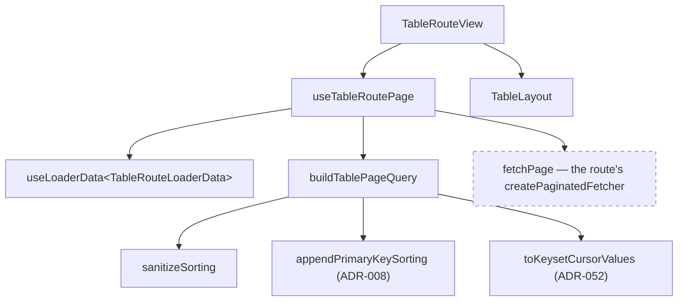

# TableRouteView Architecture

A whole table route's view: loader data in, paginated table out. The view-side
counterpart to `createTableRouteLoader` — between the two, a table route
declares its columns, its loader and its fetcher, and writes no fetch plumbing,
no sort composition and no table JSX.

## File Structure

```
TableRouteView/
├── TableRouteView.component.tsx  → Thin shell: useTableRoutePage + TableLayout
├── TableRouteView.types.ts       → TableRouteViewProps
└── TableRouteView.test.tsx       → Wiring + selector defaults
```

No `.stylex.ts`: the component renders no element of its own. All layout comes
from `TableLayout`.

No `index.ts` either. Consumers reach this component through the root barrel
(`import { TableRouteView } from '@lcabrera/ui'`), so a folder barrel would be a
deep barrel nobody imports through — which ADR-007 rule 3 bans, and which the
fallow gate flags as an unused file.

## Why it exists

Three routes had written the same 40-line component — the same `useLoaderData`
destructure, the same six `TableLayout` props, the same two selectors, and the
same `sanitizeSorting` → `appendPrimaryKeySorting` composition inlined into
`onLoadMore`. That last part is not incidental duplication:
`createTableRouteLoader` deliberately stores only the _user's_ sorting in
`columnsState` and appends the primary-key tiebreaker (ADR-008) for the server
query alone, so every load-more has to re-derive it or paginate incoherently.

## Composition



`fetchPage` is dashed because it is the one piece the route supplies.

## Props

| Prop                | Type                                       | Required | Description                                                              |
| ------------------- | ------------------------------------------ | -------- | ------------------------------------------------------------------------ |
| `actions`           | `ReactNode`                                | No       | Toolbar content, forwarded to `TableLayout`                              |
| `dataSelector`      | `(r: TResponse) => readonly TData[]`       | No       | Defaults to `response.data`                                              |
| `dataTotalSelector` | `(r: TResponse) => number \| undefined`    | No       | Defaults to `response.total`                                             |
| `fetchPage`         | `(query: PaginatedQuery) => Promise<TRes>` | Yes      | The route's paginated read — typically a `createPaginatedFetcher` result |

Every prop here is something only the component can supply — a function or a
node. What the _endpoint_ can do is not a prop; see below.

## Where the capability flags live

`isKeysetEnabled` and `isServerFilterEnabled` are **not props**. They are
declared on the loader `meta` and read back from the loader's `metaState`
(ADR-063):

```ts
export const loader = createTableRouteLoader<Row, RowResponse>({
  /* … */
  meta: { isKeysetEnabled: true, isServerFilterEnabled: true },
});
```

They describe what the _endpoint_ understands, and endpoints differ. Sending a
`cursor` to an offset-only endpoint is merely noise, but sending a `filter` to
an endpoint that ignores it is a correctness bug: the table appends unfiltered
rows to a filtered view.

Two properties follow, and both are load-bearing:

- **Absent means off.** A route that declares no capability meta sends exactly
  what one declaring both `false` sends, so adopting `TableRouteView` cannot
  change a route's request shape by accident. This is ADR-056 §4's safety
  property, carried over intact when the mechanism moved.
- **One declaration, both halves.** The loader builds the first page; the view
  builds every page after it. A prop is invisible to the loader by construction,
  so a capability declared there had to be restated in the loader body, with
  nothing checking that the two agreed.

The test for whether something belongs on `meta` is mechanical: if the loader or
the load-more query would have to read it, it is a capability and goes on `meta`.

## Response constraint

`TResponse extends TablePageResponse<TData>` — `{ data, hasMore?, total? }` —
so the two selectors have working defaults. A route whose response names its
fields differently, or that needs its own JSX around the table, composes
`useTableRoutePage` with `TableLayout` directly instead; the hook is exported
for exactly that case.

## Dependencies

- `@lcabrera/ui/hooks/useTableRoutePage.hook` — the loader read + load-more wiring
- `@lcabrera/ui/components/Table/TableLayout` — the rendered surface
- `@lcabrera/api/http/http.types` — `PaginatedQuery`, the fetcher contract

## Related

- `createTableRouteLoader` (`@lcabrera/ui/routing/loaders`) — the loader half
- `createPaginatedFetcher` (`@lcabrera/api/http`) — the fetch half
- ADR-008 (primary-key tiebreaker), ADR-052 (keyset cursor), ADR-056 (this
  extraction), ADR-063 (capabilities declared on the loader `meta`)
