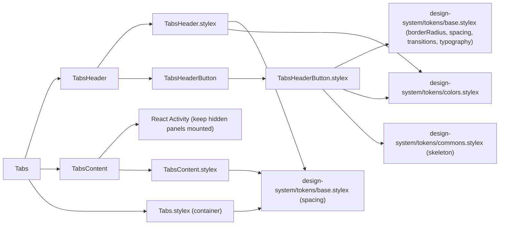
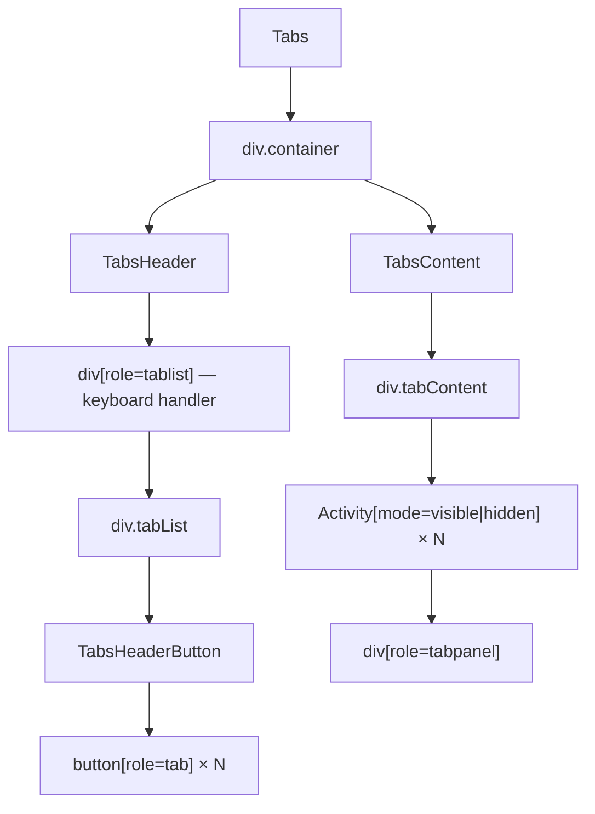

# Tabs Architecture

Accessible, keyboard-navigable tab strip using React's `Activity` component for hidden-but-mounted panels. The root `Tabs` is a thin shell that owns selection state and composes two private delegates: `TabsHeader` (tab strip + keyboard navigation) and `TabsContent` (panel rendering).

## File Structure

```
Tabs/
├── index.ts                          → Barrel export (Tabs, TabItem)
├── Tabs.component.tsx                → Thin shell: selection state + composition
├── Tabs.types.ts                     → TabsProps, TabItem
├── Tabs.stylex.ts                    → Container layout styles
├── TabsHeader/                       → Private delegate (no barrel)
│   ├── TabsHeader.component.tsx      → Tab list + keyboard navigation + focus refs
│   ├── TabsHeader.types.ts           → TabsHeaderProps
│   ├── TabsHeader.stylex.ts          → tabList
│   ├── utils/
│   │   ├── getNewIndex.util.ts       → Keyboard-navigation index resolver (Arrow/Home/End)
│   │   └── getNewIndex.util.test.ts  → Unit coverage for key-to-index mapping
│   └── TabsHeaderButton/             → Private delegate (no barrel)
│       ├── TabsHeaderButton.component.tsx  → Single tab button render + click selection
│       ├── TabsHeaderButton.types.ts       → TabsHeaderButtonProps
│       └── TabsHeaderButton.stylex.ts      → tabButton, tabButtonActive, busy overlay
└── TabsContent/                      → Private delegate (no barrel)
    ├── TabsContent.component.tsx     → Activity-wrapped tabpanels
    ├── TabsContent.types.ts          → TabsContentProps
    └── TabsContent.stylex.ts         → tabContent, tabPanel
```

`TabsHeader` and `TabsContent` are consumed only by `Tabs` and are imported via direct file paths (no `index.ts`, per ADR-007 rule 3).

## Dependencies



## Render Structure



## State & Ownership

| Owner         | State / refs                         | Responsibility                                                  |
| ------------- | ------------------------------------ | --------------------------------------------------------------- |
| `Tabs`        | `uncontrolledActiveTab` (`useState`) | Controlled/uncontrolled resolution, busy guard, `onSelectTab`   |
| `TabsHeader`  | `tabRefs` (`Map<string, button>`)    | Keyboard navigation + imperative focus of the target tab button |
| `TabsContent` | —                                    | Pure rendering of Activity-wrapped panels                       |

| State                   | Type     | Initial value                               |
| ----------------------- | -------- | ------------------------------------------- |
| `uncontrolledActiveTab` | `string` | `defaultSelectedTab` → first tab key → `''` |

`activeTab` is derived in `Tabs` as:

- controlled mode: `selectedTab` when key exists in `tabs`, otherwise first tab key
- uncontrolled mode: `uncontrolledActiveTab`

Both delegates receive `activeTab` and `tabs`; `TabsHeader` additionally receives `isBusy` and the `onSelectTab` callback (the parent's busy-guarded selection setter).

## Keyboard Navigation

Handled by `onKeyDown` on the `role="tablist"` wrapper inside `TabsHeader`:

| Key          | Action                               |
| ------------ | ------------------------------------ |
| `ArrowLeft`  | Move to previous tab (wraps to last) |
| `ArrowRight` | Move to next tab (wraps to first)    |
| `Home`       | Move to first tab                    |
| `End`        | Move to last tab                     |

`TabsHeader` delegates key-to-index mapping to `TabsHeader/utils/getNewIndex.util.ts` so the navigation math remains pure and unit-testable.

On navigation: `onSelectTab(newKey)` + `tabRefs.get(newKey)?.focus()`. Navigation is ignored while `isBusy`.

## Activity-Based Panel Rendering

All panels are always rendered by `TabsContent` via React's `<Activity>` component:

| `mode`      | Behaviour                                           |
| ----------- | --------------------------------------------------- |
| `'visible'` | Panel is rendered and visible                       |
| `'hidden'`  | Panel stays mounted but is hidden (preserves state) |

This avoids unmounting/remounting panel content when switching tabs.

## Accessibility (ARIA)

| Element          | Attributes                                                                              |
| ---------------- | --------------------------------------------------------------------------------------- |
| Tab list wrapper | `role="tablist"`, `aria-label="Settings tabs"`                                          |
| Tab button       | `role="tab"`, `aria-selected`, `aria-controls="tabpanel-{key}"`, `id="tab-{key}"`       |
| Active tab       | `tabIndex={0}`; inactive tabs `tabIndex={-1}` (roving tabindex)                         |
| Tab panel        | `role="tabpanel"`, `id="tabpanel-{key}"`, `aria-labelledby="tab-{key}"`, `tabIndex={0}` |

## Props

### `TabsProps`

Extends `ComponentPropsWithoutRef<'div'>` (all native `div` attributes are forwarded via `...props`).

| Prop                 | Type            | Default       | Description                                   |
| -------------------- | --------------- | ------------- | --------------------------------------------- |
| `tabs`               | `TabItem[]`     | —             | Ordered list of tab configurations (required) |
| `defaultSelectedTab` | `string`        | `tabs[0].key` | Initially active tab key                      |
| `selectedTab`        | `string`        | —             | Controlled active tab key                     |
| `isBusy`             | `boolean`       | `false`       | Renders tab controls in a loading state       |
| `onSelectTab`        | `(key) => void` | —             | Callback fired when tab selection changes     |

### `TabItem`

| Field      | Type        | Description                              |
| ---------- | ----------- | ---------------------------------------- |
| `key`      | `string`    | Unique identifier used in ARIA and state |
| `header`   | `ReactNode` | Tab button label (text or element)       |
| `children` | `ReactNode` | Panel content shown when tab is active   |

### `TabsHeaderProps` (private)

| Prop          | Type            | Description                                      |
| ------------- | --------------- | ------------------------------------------------ |
| `activeTab`   | `string`        | Currently active tab key                         |
| `isBusy`      | `boolean`       | Disables buttons and renders the shimmer overlay |
| `onSelectTab` | `(key) => void` | Fired on click or keyboard navigation            |
| `tabs`        | `TabItem[]`     | Tab configurations                               |

### `TabsContentProps` (private)

| Prop        | Type        | Description              |
| ----------- | ----------- | ------------------------ |
| `activeTab` | `string`    | Currently active tab key |
| `tabs`      | `TabItem[]` | Tab configurations       |
