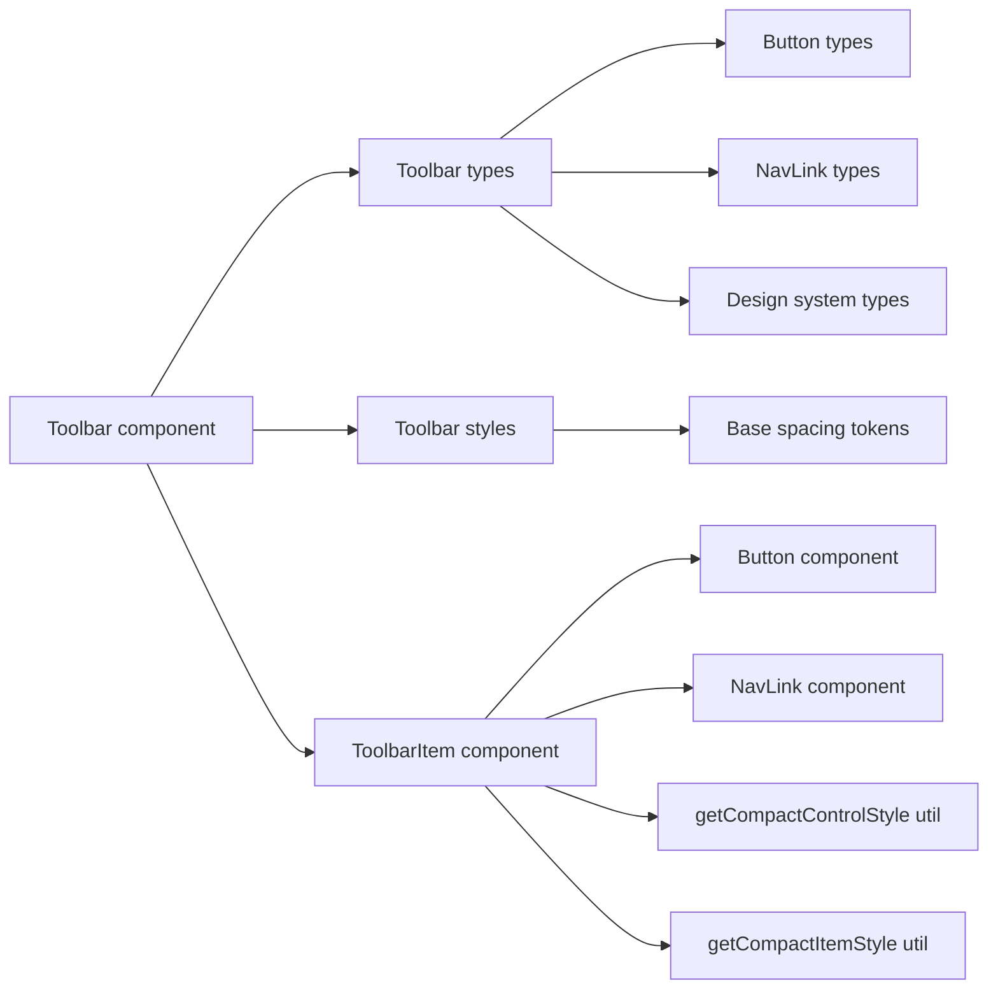
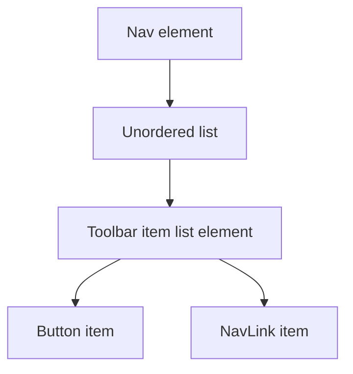
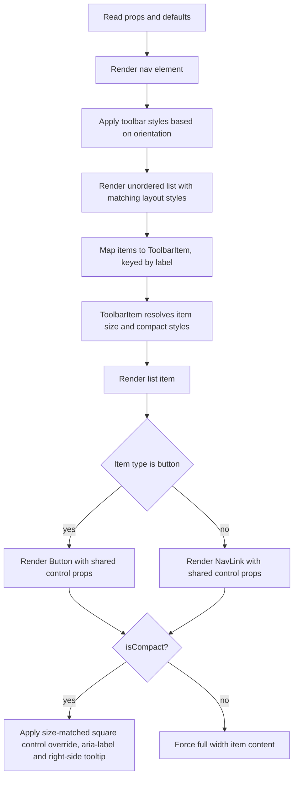
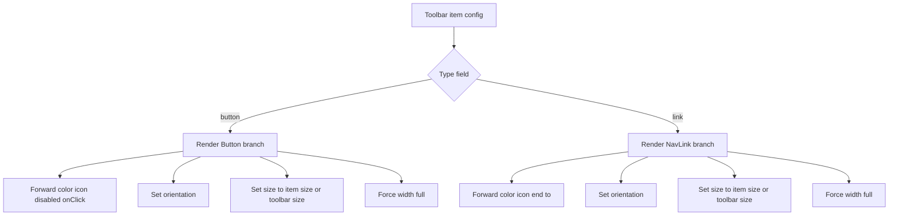
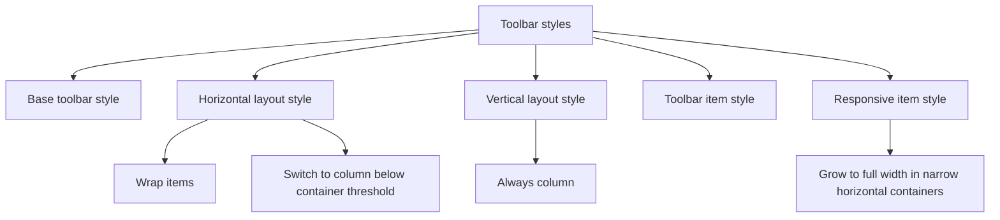

# Toolbar Component Architecture

Composable navigation and action container that renders a typed list of items as
Buttons or NavLinks, with responsive layout behavior driven by orientation,
container queries, and an optional compact icon-only mode.

## File Structure

```
Toolbar/
├── ARCHITECTURE.md         -> This documentation
├── index.ts                -> Barrel export: Toolbar + Toolbar types
├── README.md               -> Usage guide and examples
├── Toolbar.component.tsx   -> nav/ul layout shell; maps items to ToolbarItem
├── Toolbar.stylex.ts       -> Layout and responsive styles
├── Toolbar.test.tsx        -> Unit tests (nav render, button/link items)
├── Toolbar.types.ts        -> Item configuration unions and ToolbarProps
│
├── ToolbarItem/            -> Private delegate (no barrel): one entry = li + Button/NavLink branch
│   ├── ToolbarItem.component.tsx
│   ├── ToolbarItem.test.tsx
│   └── ToolbarItem.types.ts -> { isCompact, item, orientation, size }
│
└── utils/                  -> One-per-file size→style lookups (no barrel)
    ├── getCompactControlStyle.util.ts (+ test)
    └── getCompactItemStyle.util.ts (+ test)
```

## Dependencies



## Public API

`ToolbarProps` extends native `nav` props plus:

| Prop          | Type                     | Default    | Description                                           |
| ------------- | ------------------------ | ---------- | ----------------------------------------------------- |
| `isCompact`   | `boolean`                | `false`    | Centers square icon-only controls with label tooltips |
| `items`       | `ToolbarItemConfig[]`    | -          | Ordered list of toolbar items                         |
| `orientation` | `horizontal \| vertical` | `vertical` | Layout direction                                      |
| `size`        | design-system size       | `md`       | Fallback size for items without explicit size         |

### Item Types

`ToolbarItemConfig` is a discriminated union:

- `ToolbarButtonConfig`
- `ToolbarLinkConfig`

#### ToolbarButtonConfig

- Extends Button props except `children` and `width`
- Requires `label`
- Uses `type: 'button'`

#### ToolbarLinkConfig

- Extends NavLink props except `children` and `className`
- Requires `label`
- Uses `type: 'link'`
- Reuses Button color semantics for visual consistency

## Render Structure



## Render Flow



## Item Rendering Strategy

Toolbar itself is only the `nav`/`ul` layout shell. Each entry is rendered by
the private `ToolbarItem` delegate, which derives the resolved size and compact
styles, builds the shared control props once, and branches between Button and
NavLink.



### Button branch

For button items, Toolbar forwards:

- `color`
- `icon`
- `isIconOnly=isCompact`
- `isDisabled`
- `onClick`
- `orientation`
- `size`
- `width='full'`
- `customStylex=size-matched compact control override` when `isCompact`
- `tooltipContent=label` when `isCompact`
- `tooltipPlacement='right'` when `isCompact`
- button label as `children`

### Link branch

For link items, Toolbar forwards:

- `color`
- `end`
- `icon`
- `isIconOnly=isCompact`
- `orientation`
- `size`
- `to`
- `width='full'`
- `customStylex=size-matched compact control override` when `isCompact`
- `tooltipContent=label` when `isCompact`
- `tooltipPlacement='right'` when `isCompact`
- link label as `children`

## Layout Model

Both the outer `nav` and inner `ul` reuse the `toolbar` base style plus an
orientation-specific modifier.



### Base toolbar style

Shared base style defines:

- `display: flex`
- `width: 100%`
- `gap`
- `margin: 0`
- `padding: 0`
- `listStyle: none`
- `containerName: toolbar`
- `containerType: inline-size`

### Orientation behavior

- `vertical`: always column, no wrapping
- `horizontal`: row by default, wrap enabled, switches to column below the
  container query threshold
- `isCompact`: centers items and constrains each control to the resolved item
  size as a square;
  Button/NavLink render as true icon-only controls while `aria-label` and a
  right-side tooltip keep the item name discoverable.

### Item behavior

Each list item uses a flex wrapper. In horizontal mode, `toolbarItemResponsive`
allows items to expand to full width when the toolbar container becomes narrow.

## Accessibility and Semantics

- Uses semantic `nav` as the root container.
- Uses `role='navigation'` explicitly.
- Delegates link/button semantics to NavLink and Button.
- Requires consumers to provide meaningful `aria-label` for navigation purpose.

## Examples and Intended Consumers

Two main use cases:

- vertical navigation for side panels
- horizontal action bars mixing links and buttons

`README.md` acts as the higher-level usage guide, while this document focuses on
internal composition and rendering behavior.

## Design Tradeoffs

- Item keys are currently derived from `label`, so duplicate labels can produce
  unstable or colliding keys.
- Toolbar intentionally stays stateless; routing state, click side effects, and
  active link logic live in child components.
- The new barrel `index.ts` keeps public imports stable, but internal files in
  the same folder may still choose direct relative imports when that is clearer.
