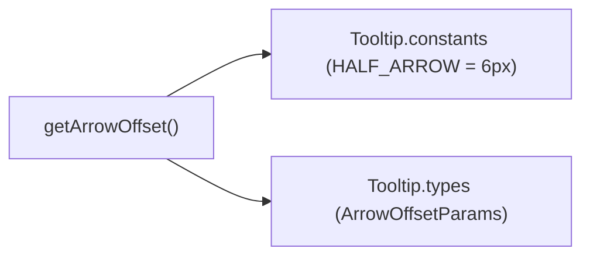

# Tooltip utils/ Architecture

Pure helper functions for tooltip arrow positioning used by the `Tooltip`
shell. Delegate-specific helpers live with their delegate
(`TooltipContent/utils/getArrowStyle.util.ts`,
`TooltipTrigger/utils/getIsNativeInteractiveElement.util.ts`).

## File Structure

```
utils/
├── index.ts                    → Barrel export
└── getArrowOffset.util.ts      → Compute arrow pixel offset along the placement axis
```

## Dependencies



## `getArrowOffset`

Positions the arrow so it visually points at the horizontal/vertical centre of the trigger element.

```
offset = triggerCenter - tooltipStart - HALF_ARROW
```

| Param           | Description                                                       |
| --------------- | ----------------------------------------------------------------- |
| `triggerCenter` | Centre of the trigger along the relevant axis (px)                |
| `tooltipStart`  | Leading edge of the tooltip box along the same axis (px)          |
| `HALF_ARROW`    | Half of `arrowSize` token (6 px) — centres the arrow on the pixel |

The result is applied as a `left` (horizontal) or `top` (vertical) offset on
the arrow element via `TooltipContent/utils/getArrowStyle.util.ts`.
