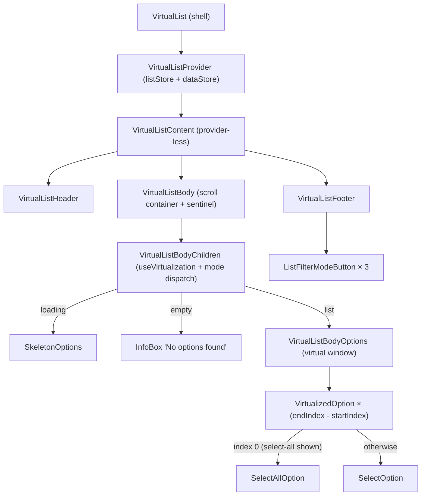
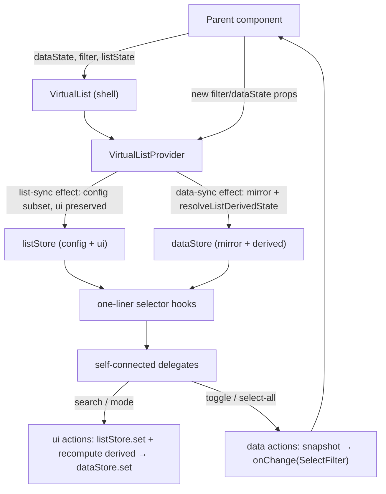
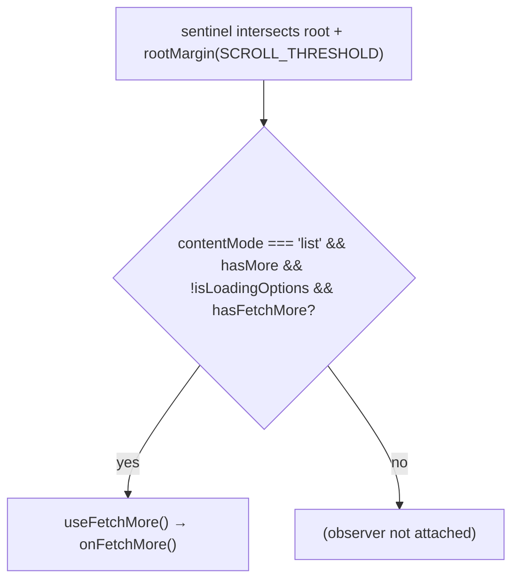

# VirtualList Architecture

Virtualized, searchable, multi-select list with infinite scroll, skeleton loading, and filter-mode toolbar. Internally wired with the repo's **single-context, stores-per-concern external store** pattern (see `contexts/ARCHITECTURE.md`), mirroring `TableConfig`: the public `VirtualList` is a thin shell mounting one `VirtualListProvider` (`listStore` + `dataStore`) around the provider-less `VirtualListContent`; every delegate self-connects through one-liner selector hooks and action hooks instead of receiving drilled props.

Composing components provide the same context by **composition** instead of rendering `VirtualList`: `VirtualSelectProvider` renders `VirtualListProvider` around its children and renders `VirtualListContent` where the list belongs — `VirtualSelect` is the canonical example (its header reads selectors from the same stores while the list is closed).

## File Structure

```
VirtualList/
├── index.ts                         → Barrel export (VirtualList, VirtualListContent, VirtualListDataState)
├── VirtualList.component.tsx        → Thin shell: providers + VirtualListContent
├── VirtualList.types.ts             → Public props + store state types (config/ui/data, content mode)
├── VirtualList.constants.ts         → ITEM_HEIGHT, LIST_MAX_HEIGHT, DEFAULT_CONTAINER_HEIGHT, SCROLL_THRESHOLD
├── VirtualList.stylex.ts            → Shared option-row/container styles used by SelectAllOption, SelectOption and root container
│
├── contexts/                        → Single context, stores per concern (see contexts/ARCHITECTURE.md)
│   ├── VirtualListContext.*         → listStore + dataStore + callbacks; VirtualListProvider
│   ├── list/                        → listStore: config mirror + list-owned UI state (slice: list/)
│   └── data/                        → dataStore: props mirror + pre-computed derived state (slice: data/)
│
├── VirtualListContent/              → Provider-less composition: container + Header/Body/Footer
│                                      (zero props — layout via list selectors; exported for composed-provider use)
│
├── VirtualListHeader/               → Self-connected search input and clear button (zero props)
│
├── VirtualListBody/                 → Scroll container + infinite-scroll sentinel (zero props — layout via list selectors; sentinel only in the `list` content mode; suppresses fill-fetch while a client filter is active)
│   ├── VirtualListBodyChildren/     → useVirtualization + content-mode dispatch (prop: scrollContainerRef)
│   └── VirtualListBodyOptions/      → Virtual window renderer (props: startIndex, endIndex, offsetY, totalHeight)
│
├── VirtualizedOption/               → Self-connected per-row owner (prop: index)
├── SelectAllOption/                 → Pure "Select All / Deselect All" checkbox row
├── SelectOption/                    → Pure single option row with optional checkbox
├── SkeletonOptions/                 → Pure shimmer placeholder rows during initial load
│
├── VirtualListFooter/               → Self-connected status bar (zero props)
│   └── ListFilterModeButton/        → Store-connected wrapper per filter mode (props: count, icon, mode, tooltip)
│
└── utils/                           → Pure derivations behind the store writers
    ├── resolveListDerivedState.util.ts  → Composes the filtering/mode/loading utils below into the derived store slice
    ├── getFilteredOptions.util.ts       → Search + filter-mode filtering
    ├── getIsAllSelected.util.ts         → All-visible-selected check
    ├── resolveContentMode.util.ts       → loading | empty | list dispatch
    ├── resolveIsInitialLoading.util.ts  → Initial-load/bootstrap window detection
    └── isClientFilterActive.util.ts     → Search/filter-mode active? (VirtualListBody gates infinite-scroll fill on it)
```

## Component Hierarchy



## State Ownership Rule

Every store slice is read — and every action dispatched — inside the component that renders it. Selectors are strict one-liners over one slice store hook (`useListStore` / `useListDataStore`); derived values are pre-computed into the data store, never derived in selectors. The only remaining props are presentation flags and producer→direct-child virtualization values (same shape as `TableBody → TableBodyRows`).

| Delegate                                               | Selectors read                                                                                                                                                     | Actions dispatched                      | Props kept                                             |
| ------------------------------------------------------ | ------------------------------------------------------------------------------------------------------------------------------------------------------------------ | --------------------------------------- | ------------------------------------------------------ |
| `VirtualList` (shell)                                  | — (no store wiring in the shell)                                                                                                                                   | —                                       | public API (unchanged)                                 |
| `VirtualListContent`                                   | `useGetShouldFillHeight` (list)                                                                                                                                    | —                                       | none                                                   |
| `VirtualListHeader`                                    | `useGetSearchTerm`, `useGetSearchInputName` (list)                                                                                                                 | `useSetSearchTerm`, `useClearSearch`    | none                                                   |
| `VirtualListBody`                                      | `useGetHasMore`, `useGetIsLoadingOptions` (data), `useGetHasFetchMore`, `useGetListMaxHeight`, `useGetShouldFillHeight` (list)                                     | `useFetchMore`                          | none                                                   |
| `VirtualListBodyChildren`                              | `useGetContentMode`, `useGetTotalItems` (data)                                                                                                                     | —                                       | `scrollContainerRef` (producer→child)                  |
| `VirtualListBodyOptions`                               | `useGetFilteredOptions`, `useGetShouldShowSelectAll` (data)                                                                                                        | —                                       | `startIndex`, `endIndex`, `offsetY`, `totalHeight`     |
| `VirtualizedOption`                                    | `useGetFilteredOptions`, `useGetIsAllSelected`, `useGetIsLoadingOptions`, `useGetSelectedValues`, `useGetShouldShowSelectAll` (data), `useGetHasCheckboxes` (list) | `useToggleOption`, `useToggleSelectAll` | `index`                                                |
| `VirtualListFooter`                                    | `useGetIsLoading`, `useGetIsLoadingMore`, `useGetLoadedCount`, `useGetSelectedCount`, `useGetTotalCount` (data), `useGetHasCheckboxes` (list)                      | —                                       | none                                                   |
| `ListFilterModeButton`                                 | `useGetListFilterMode` (list)                                                                                                                                      | `useSetListFilterMode`                  | `count`, `icon`, `mode`, `tooltip` (presentation only) |
| `SelectAllOption` / `SelectOption` / `SkeletonOptions` | — (pure presentational leaves; `VirtualizedOption`/`VirtualListBodyChildren` are their store-connected owners)                                                     | —                                       | full presentational surface                            |

## Data Flow



Selection is **parent-owned** (controlled-component contract): the `dataStore` only mirrors `filter.values` for reads; toggle actions emit the next `SelectFilter` through `onChange` and the value round-trips through the parent. The `listStore` carries both the config-props mirror and the list-owned UI state (`searchTerm`, `listFilterMode`) — the two halves have distinct writers (provider sync vs. UI actions), see `contexts/ARCHITECTURE.md` → Writer-Boundary Rule.

## Virtualization Strategy

Virtualization state stays in **local hooks**, mirroring the Table (`TableBody`): `VirtualListBody` owns the scroll container ref; `VirtualListBodyChildren` runs `useVirtualization` against it (with `totalItems` from the store) and passes the window (`startIndex`, `endIndex`, `offsetY`, `totalHeight`) producer→direct-child into `VirtualListBodyOptions`, which renders only `endIndex - startIndex` `VirtualizedOption` elements translated via CSS `translateY`.

The outer options list is explicitly sized with `border-box`, `width: 100%`,
`max-width: 100%`, and `min-width: 0` so embedded lists stay inside constrained
parents such as drawer filter cards.

| Constant                   | Value       | Role                                             |
| -------------------------- | ----------- | ------------------------------------------------ |
| `ITEM_HEIGHT`              | `32 px`     | Fixed row height (enables O(1) offset math)      |
| `LIST_MAX_HEIGHT`          | `18.75 rem` | Default `max-height` of the scroll container     |
| `DEFAULT_CONTAINER_HEIGHT` | `300 px`    | Fallback before the ref is measured              |
| `SCROLL_THRESHOLD`         | `50 px`     | Distance from bottom that triggers `onFetchMore` |

## Infinite Scroll

A 1px sentinel element is rendered at the end of the scroll container and
watched with `useInfiniteScrollObserver` (`@lcabrera/ui/hooks`). `IntersectionObserver`
computes proximity off the layout pass; `SCROLL_THRESHOLD` is passed as the
bottom `rootMargin`. The observer inputs come from selectors and the fetch is
dispatched through the `useFetchMore` action.

The sentinel exists **only in the `list` content mode**, because it marks the end
of the rendered options and the other modes render none. It is an in-flow sibling
of the body content, so in the `empty`/`loading` modes it would be the only child
giving the scroll container a `scrollHeight` — a phantom overflow that both paints
a scrollbar over "No options found" and reads to the observer as a real
scrolled-to-bottom, defeating the `shouldFetchToFill` guard and fetching every
remaining page (#432). Bootstrapping the first page is `onFetchInitial`'s job, not
the sentinel's.



The initial fetch (`onFetchInitial`) fires once from a `VirtualListProvider` effect on mount — i.e. when the stores come alive. With a composing provider (`VirtualSelectProvider`) that is the composing component's mount, not the list's.

## Filter Modes

| Mode           | Visible options                     |
| -------------- | ----------------------------------- |
| `'all'`        | All loaded options (post-search)    |
| `'selected'`   | Only options in `filter.values`     |
| `'unselected'` | Only options NOT in `filter.values` |

## Props

| Prop               | Type                              | Default      | Description                                      |
| ------------------ | --------------------------------- | ------------ | ------------------------------------------------ |
| `dataState`        | `VirtualListDataState`            | —            | Loading flags, data array, optional totalCount   |
| `filter`           | `SelectFilter`                    | —            | Controlled selected values (`filter.values`)     |
| `hasCheckboxes`    | `boolean`                         | `true`       | Show checkboxes next to options                  |
| `hasSelectAll`     | `boolean`                         | `true`       | Show "Select All" row when >1 option exists      |
| `listMaxHeight`    | `string`                          | `'18.75rem'` | CSS max-height of the scrollable list            |
| `name`             | `string`                          | —            | `name` attribute on the search input             |
| `onChange`         | `(filter?: SelectFilter) => void` | —            | Called on every selection change                 |
| `onFetchInitial`   | `() => Promise<void> \| void`     | —            | Fetches data on mount                            |
| `onFetchMore`      | `() => Promise<void> \| void`     | —            | Fetches next page when near bottom               |
| `shouldFillHeight` | `boolean`                         | `false`      | Expand list to fill all available vertical space |
