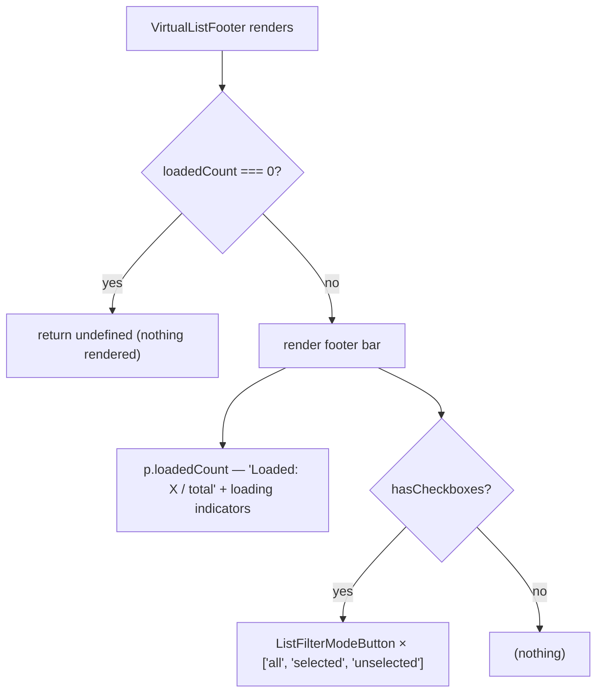

# VirtualListFooter Architecture

Self-connected status bar below the virtual list (zero props, no `.types.ts`): shows loaded/total count and the filter-mode toggle buttons (All / Selected / Unselected).

## File Structure

```
VirtualListFooter/
├── index.ts                            → Barrel export
├── VirtualListFooter.component.tsx     → Count label + filter-mode button group (self-connected)
├── VirtualListFooter.stylex.ts         → Layout styles (footer, loadedCount, listFilterGroup)
└── ListFilterModeButton/               → Store-connected wrapper per mode (see below)
```

## Store Wiring

| Kind      | Hooks                                                                                                                                           |
| --------- | ----------------------------------------------------------------------------------------------------------------------------------------------- |
| Selectors | `useGetIsLoading`, `useGetIsLoadingMore`, `useGetLoadedCount`, `useGetSelectedCount`, `useGetTotalCount` (data), `useGetHasCheckboxes` (config) |
| Actions   | — (mode switching lives in `ListFilterModeButton`)                                                                                              |

## Render Flow



## Filter Mode Buttons

Each `ListFilterModeButton` receives only presentation props (`count`, `icon`, `mode`, `tooltip`) and self-connects for behavior: active state from `useGetListFilterMode() === mode`, switching via `useSetListFilterMode`.

| Mode         | Icon                | Tooltip prefix                 | Count                         |
| ------------ | ------------------- | ------------------------------ | ----------------------------- |
| `all`        | `ListAllIcon`       | "Show all options"             | `loadedCount`                 |
| `selected`   | `ListCheckedIcon`   | "Show only selected options"   | `selectedCount`               |
| `unselected` | `ListUncheckedIcon` | "Show only unselected options" | `loadedCount - selectedCount` |

## Notes

- The footer is hidden entirely while no options are loaded (avoids a bare status line before any data loads).
- Must render inside the VirtualList providers (see `../contexts/ARCHITECTURE.md`).
