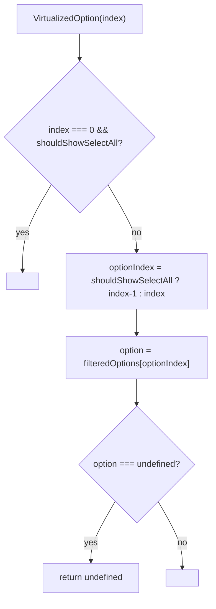

# VirtualizedOption Architecture

Self-connected row owner: maps a virtual-scroll index to either `SelectAllOption` (index 0, when enabled) or a `SelectOption` row, wiring the pure leaves to selectors and actions itself (PATTERNS.md rule: row content owns its store wiring; the leaves stay presentational).

## File Structure

```
VirtualizedOption/
├── index.ts                          → Barrel export
├── VirtualizedOption.component.tsx   → Index-based dispatch + store wiring for the pure leaves
└── VirtualizedOption.types.ts        → Props ({ index })
```

## Props

| Prop    | Type     | Description                                     |
| ------- | -------- | ----------------------------------------------- |
| `index` | `number` | Virtual row index (0-based, includes SelectAll) |

## Store Wiring

| Kind      | Hooks                                                                                                                                                                |
| --------- | -------------------------------------------------------------------------------------------------------------------------------------------------------------------- |
| Selectors | `useGetFilteredOptions`, `useGetIsAllSelected`, `useGetIsLoadingOptions`, `useGetSelectedValues`, `useGetShouldShowSelectAll` (data), `useGetHasCheckboxes` (config) |
| Actions   | `useToggleOption`, `useToggleSelectAll` (data)                                                                                                                       |

## Render Flow



## Index Accounting

`VirtualizedOption` is the only place that applies the +1 offset: when `shouldShowSelectAll` is `true`, index `0` → `SelectAllOption` and indices `1…n` map to `filteredOptions[index - 1]`.
