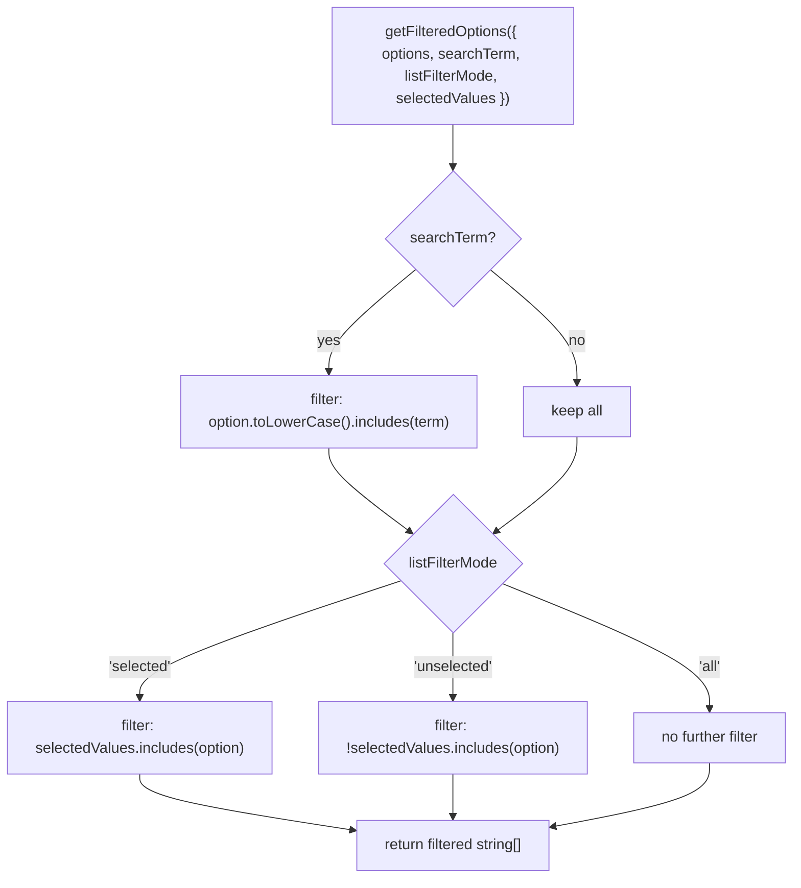

# utils/ Architecture

Pure derivation utilities behind the VirtualList store writers. `resolveListDerivedState` is the single entry point used by the `VirtualListProvider` data-sync effect and the UI actions to pre-compute the derived slice of the data store; the other utils are its tested decomposition.

## File Structure

```
utils/
├── index.ts                            → Barrel (resolveListDerivedState — the only cross-directory consumer entry)
├── resolveListDerivedState.util.ts     → Derived store slice: filteredOptions, isAllSelected, shouldShowSelectAll, totalItems, contentMode
├── getFilteredOptions.util.ts          → Apply search term + filter mode to options array
├── getIsAllSelected.util.ts            → Whether every filtered option is selected
├── resolveContentMode.util.ts          → 'loading' | 'empty' | 'list' dispatch
└── resolveIsInitialLoading.util.ts     → Initial-load / onFetchInitial bootstrap detection
```

## Function Reference

| Function                  | Input                                                                                                           | Output                           | Used by                                                               |
| ------------------------- | --------------------------------------------------------------------------------------------------------------- | -------------------------------- | --------------------------------------------------------------------- |
| `resolveListDerivedState` | `{ data, hasFetchInitial, hasSelectAll, isLoading, isLoadingMore, listFilterMode, searchTerm, selectedValues }` | derived data-store slice         | `getInitialListDataState`, `useSetSearchTerm`, `useSetListFilterMode` |
| `getFilteredOptions`      | `{ listFilterMode, options, searchTerm, selectedValues }`                                                       | `string[]`                       | `resolveListDerivedState`                                             |
| `getIsAllSelected`        | `{ filteredOptions, selectedValues }`                                                                           | `boolean`                        | `resolveListDerivedState`                                             |
| `resolveContentMode`      | `{ filteredOptionsCount, isInitialLoading }`                                                                    | `'loading' \| 'empty' \| 'list'` | `resolveListDerivedState`                                             |
| `resolveIsInitialLoading` | `{ hasFetchInitial, isLoading, isLoadingMore, optionsCount }`                                                   | `boolean`                        | `resolveListDerivedState`                                             |

## Logic Flow — getFilteredOptions



## Notes

- Search is **case-insensitive** substring match; filter modes apply **after** the search step.
- All functions are pure — no store access, no side effects.
