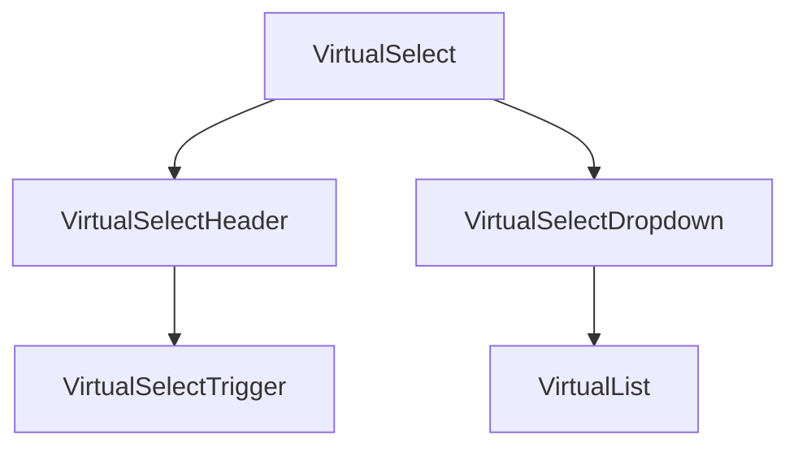
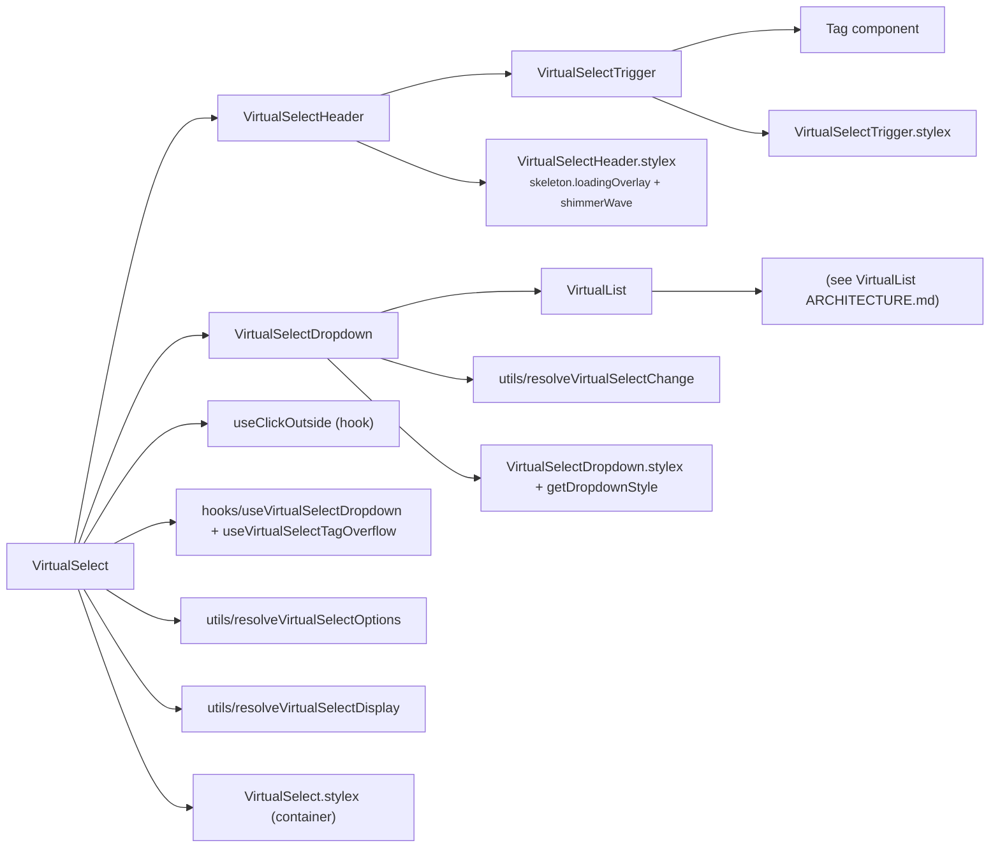
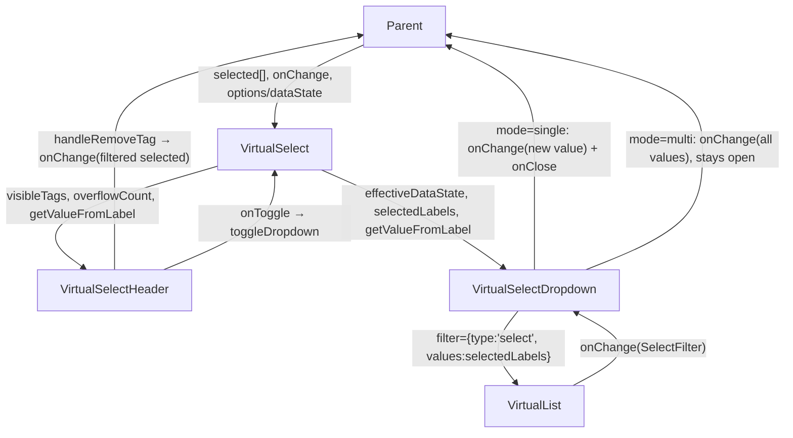
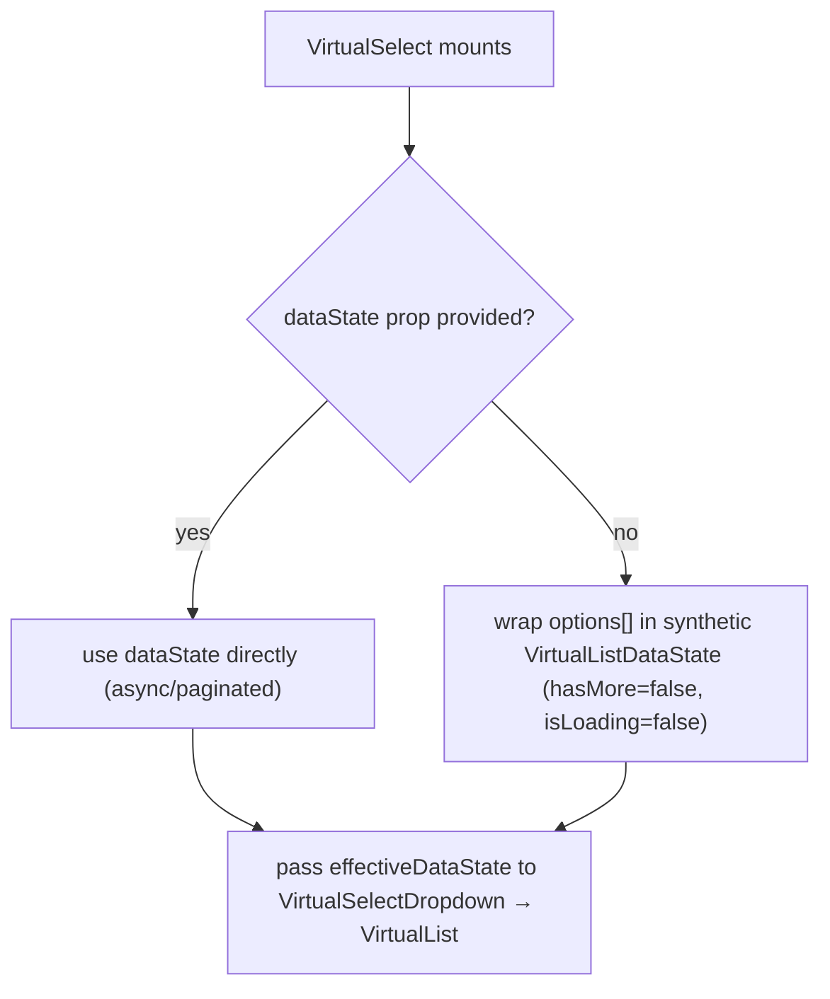
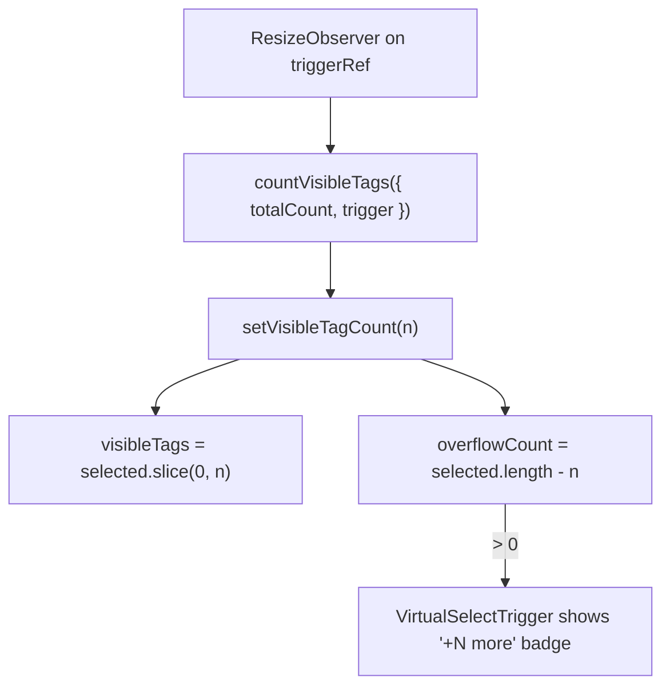

# VirtualSelect Architecture

Dropdown select component (single or multi) backed by a virtualized list, with tag-chip display, overflow counting, and optional async infinite-scroll data loading.

## File Structure

```
VirtualSelect/
├── index.ts                          → Barrel export
├── VirtualSelect.component.tsx       → Orchestrator: refs, open state, option/display resolution
├── VirtualSelect.types.ts            → VirtualSelectProps, VirtualSelectMode
├── VirtualSelect.stylex.ts           → Container styles
│
├── VirtualSelectHeader/              → Private delegate — busy overlay + trigger, owns tag removal
│   └── (see its ARCHITECTURE.md)
│
├── VirtualSelectDropdown/            → Private delegate — positioned listbox shell around VirtualList,
│   └── (see its ARCHITECTURE.md)       owns selection-change resolution + dropdown styles
│
├── VirtualSelectTrigger/             → Combobox trigger (placeholder / label / tag chips)
│   ├── ARCHITECTURE.md
│   ├── index.ts
│   ├── VirtualSelectTrigger.component.tsx
│   ├── VirtualSelectTrigger.stylex.ts   (exports TRIGGER_MAX_HEIGHT)
│   └── VirtualSelectTrigger.types.ts
│
├── hooks/
│   ├── useVirtualSelectDropdown.hook.ts     → Open/close state + onOpenChange notification
│   └── useVirtualSelectTagOverflow.hook.ts  → ResizeObserver-driven visible tag count
│
└── utils/
    ├── ARCHITECTURE.md
    ├── index.ts
    └── (option/selection/display resolution — see utils/ARCHITECTURE.md)
```

`VirtualSelectHeader` and `VirtualSelectDropdown` are private delegates (no `index.ts`, imported via direct file paths — ADR-007).

## Component Hierarchy



## Dependencies



## Data Flow



The orchestrator resolves options (`resolveVirtualSelectOptions`), display state (`resolveVirtualSelectDisplay`), open state (`useVirtualSelectDropdown`), and tag overflow (`useVirtualSelectTagOverflow`), then hands the derived values to the two delegates. The delegates own their handlers: `VirtualSelectHeader` resolves tag removal, `VirtualSelectDropdown` resolves list selection changes.

## Selection Modes

| Mode     | Trigger display      | VirtualList props                           | On change                              |
| -------- | -------------------- | ------------------------------------------- | -------------------------------------- |
| `single` | Single text label    | `hasCheckboxes=false`, `hasSelectAll=false` | Pick newly added value, close dropdown |
| `multi`  | Tag chips + overflow | `hasCheckboxes=true`, `hasSelectAll=true`   | Forward full values array, stay open   |

## Dropdown Positioning

Owned by `VirtualSelectDropdown` (see its `ARCHITECTURE.md`): `getDropdownStyle({ isAlwaysOpen, shouldFillHeight })` picks between floating (`dropdownAbsolute`), inline (`dropdownStatic`), and fill-height (`dropdownStaticFill`) positioning.

The container and dropdown use explicit `border-box`, `min-width: 0`, and
`max-width: 100%` sizing so both floating and always-open variants remain
contained by drawer/card parents.

## Static vs. Async Data



## Tag Overflow (multi mode)



## Click-Outside Handling

`useClickOutside` listens on `containerRef` (wraps both header and dropdown). When a click lands outside the container, `closeDropdown()` sets `isOpen = false`.

## Busy State

Owned by `VirtualSelectHeader` (see its `ARCHITECTURE.md`): when `isBusy` is true, a shimmer overlay renders over the container and the trigger is disabled so the dropdown cannot be opened while the parent UI is loading. `useVirtualSelectDropdown` also suppresses `toggleDropdown` while busy.

## Props

| Prop               | Type                           | Default       | Description                                        |
| ------------------ | ------------------------------ | ------------- | -------------------------------------------------- |
| `customStylex`     | `StyleXStyles`                 | —             | Style overrides for the dropdown container         |
| `dataState`        | `VirtualListDataState`         | —             | Async data (mutually exclusive with `options`)     |
| `isBusy`           | `boolean`                      | `false`       | Shows a shimmer overlay and disables trigger input |
| `isAlwaysOpen`     | `boolean`                      | `false`       | List is always visible; trigger is non-interactive |
| `listboxId`        | `string`                       | generated     | id wiring the trigger/listbox ARIA relationship    |
| `listMaxHeight`    | `string`                       | `'18.75rem'`  | CSS max-height for the VirtualList scroll area     |
| `mode`             | `'single' \| 'multi'`          | —             | Selection behaviour (required)                     |
| `onChange`         | `(selected: string[]) => void` | —             | Called on every selection change                   |
| `onFetchInitial`   | `() => Promise<void> \| void`  | —             | Forwarded to VirtualList for initial fetch         |
| `onFetchMore`      | `() => Promise<void> \| void`  | —             | Forwarded to VirtualList for infinite scroll       |
| `onOpenChange`     | `(isOpen: boolean) => void`    | —             | Notifies parent of open/close state                |
| `options`          | `string[]`                     | `[]`          | Static options (used when no `dataState`)          |
| `placeholder`      | `string`                       | `'Select...'` | Shown when nothing is selected                     |
| `selected`         | `string[]`                     | —             | Controlled selected values (required)              |
| `shouldFillHeight` | `boolean`                      | `false`       | Expand to fill available vertical space            |
