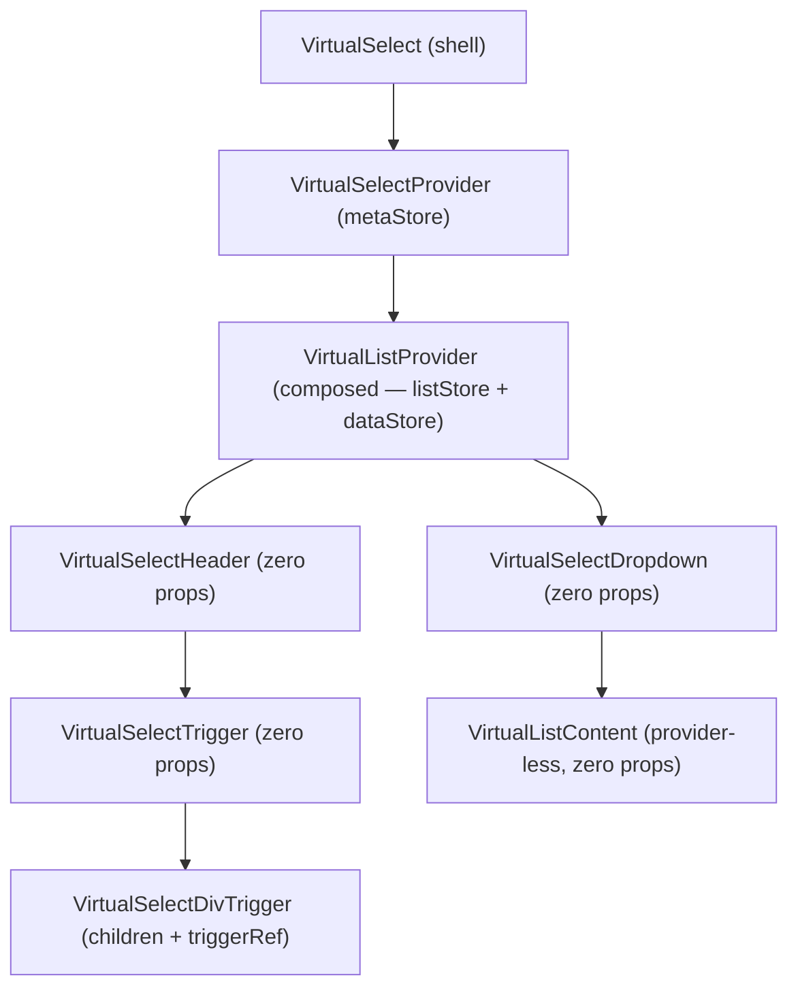
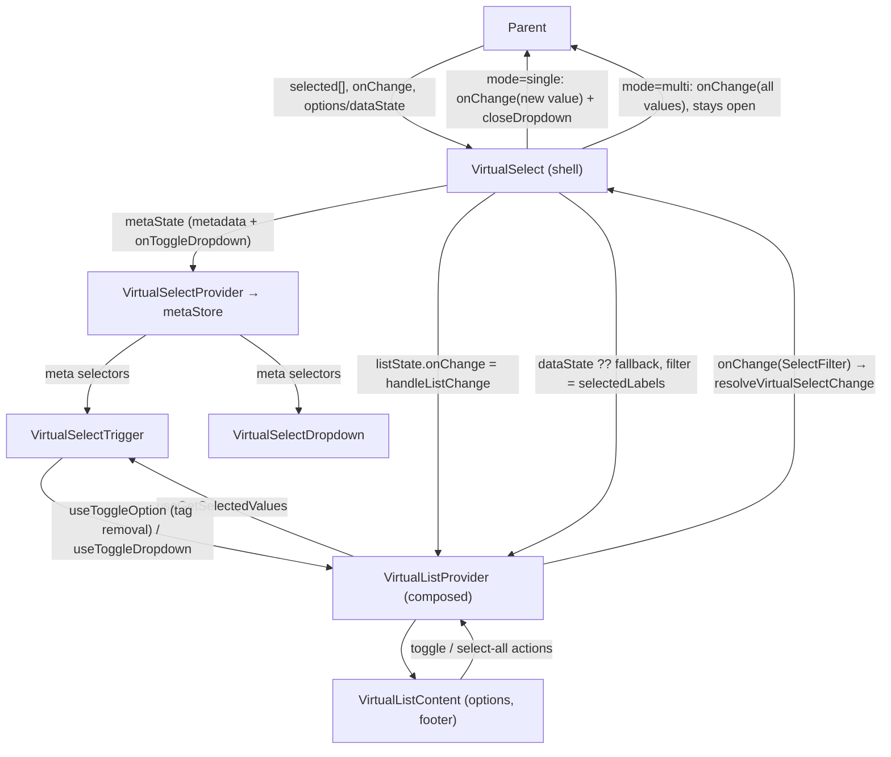
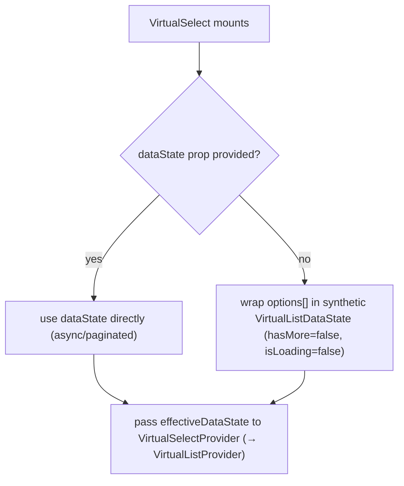

# VirtualSelect Architecture

Dropdown select component (single or multi) backed by a virtualized list, with tag-chip display, overflow counting, and optional async infinite-scroll data loading.

`VirtualSelect` is a **thin shell over one provider** — `VirtualSelectProvider`, which provides its own `VirtualSelectContext` (select-level presentation metadata in a meta store) **and composes `VirtualListProvider`** around the children, so delegates read two contexts with no provider nesting in the shell. Every delegate — header, trigger, div trigger, dropdown — is fully self-connected, consuming selectors and actions where the value is actually rendered; the only surviving props are producer→direct-child values (`triggerRef`, `children`). List-layout config (`listMaxHeight`, `shouldFillHeight`) lives in the **list store**, not the meta store, so `VirtualListContent`/`VirtualListBody` read it in standalone VirtualList use too. Selection stays parent-owned: list changes exit through the shell's `onChange` mapping passed on the `listState` group.

## File Structure

```
VirtualSelect/
├── index.ts                          → Barrel export
├── VirtualSelect.component.tsx       → Shell: option label↔value resolution, open state,
│                                        provider mounting, list-change → onChange mapping
├── VirtualSelect.types.ts            → VirtualSelectProps, VirtualSelectMode, VirtualSelectMetaState
├── VirtualSelect.stylex.ts           → Container styles
│
├── contexts/                         → VirtualSelectProvider: meta store + toggle action,
│   └── (see contexts/ARCHITECTURE.md)  composes VirtualListProvider
│
├── VirtualSelectHeader/              → Private delegate — busy overlay + trigger composition;
│   └── (see its ARCHITECTURE.md)       zero props, reads only isBusy
│
├── VirtualSelectDropdown/            → Private delegate — positioned listbox shell around
│   └── (see its ARCHITECTURE.md)       VirtualListContent; zero props (meta + list config selectors)
│
├── VirtualSelectTrigger/             → Self-connected combobox trigger (placeholder / label / tags,
│                                        owns triggerRef + overflow)
│   ├── ARCHITECTURE.md
│   ├── index.ts
│   ├── VirtualSelectTrigger.component.tsx
│   ├── VirtualSelectTrigger.stylex.ts   (exports TRIGGER_MAX_HEIGHT)
│   └── VirtualSelectTrigger.types.ts
│
├── hooks/
│   ├── useVirtualSelectDropdown.hook.ts     → Open/close state + onOpenChange notification
│   └── useVirtualSelectTagOverflow.hook.ts  → ResizeObserver-driven visible tag count
│
└── utils/
    ├── ARCHITECTURE.md
    ├── index.ts
    └── (option/selection/overflow resolution — see utils/ARCHITECTURE.md)
```

`VirtualSelectHeader` and `VirtualSelectDropdown` are private delegates (no `index.ts`, imported via direct file paths — ADR-007); both have zero props, so they carry no `.types.ts`.

## Component Hierarchy



## State Ownership Rule

Every store slice is read — and every action dispatched — inside the component that renders it, and **each piece of state has exactly one owning store** (select metadata → meta store; list config/callbacks + search/filter-mode → list store; data + selection → list data store). The shell holds no store wiring; it owns only the select-level concerns it mirrors into the provider.

| Delegate                  | Selectors read                                                                                                                                   | Actions dispatched                                   | Props kept                                |
| ------------------------- | ------------------------------------------------------------------------------------------------------------------------------------------------ | ---------------------------------------------------- | ----------------------------------------- |
| `VirtualSelect` (shell)   | — (mounts the provider)                                                                                                                          | — (`onChange` mapping lives on the `listState`)      | public API (unchanged)                    |
| `VirtualSelectHeader`     | `useGetIsBusy` (meta) — only what it renders itself (the overlay)                                                                                | —                                                    | none                                      |
| `VirtualSelectTrigger`    | `useGetIsAlwaysOpen`, `useGetIsBusy`, `useGetIsOpen`, `useGetListboxId`, `useGetMode`, `useGetPlaceholder` (meta); `useGetSelectedValues` (data) | `useToggleDropdown` (meta), `useToggleOption` (data) | none (owns `triggerRef` + overflow)       |
| `VirtualSelectDivTrigger` | `useGetIsAlwaysOpen`, `useGetIsBusy`, `useGetIsOpen`, `useGetListboxId`, `useGetMode` (meta)                                                     | `useToggleDropdown` (meta)                           | `children`, `triggerRef` (producer→child) |
| `VirtualSelectDropdown`   | `useGetCustomStylex`, `useGetIsAlwaysOpen`, `useGetIsListVisible`, `useGetListboxId` (meta); `useGetShouldFillHeight` (list)                     | —                                                    | none                                      |

## Data Flow



The shell resolves the option mapping (`resolveVirtualSelectOptions`), the effective data state (`dataState ?? buildFallbackDataState`), and the open state (`useVirtualSelectDropdown`); every list-side selection change — option toggle, select-all, and header tag removal alike — funnels through the list context's `onChange` (`handleListChange`, passed on `listState`), which maps labels back to values via `resolveVirtualSelectChange` and closes the dropdown after a single-mode pick.

## Provider Lifetime (differs from standalone VirtualList)

The provider lives for the **select's lifetime**, not per dropdown open:

- `onFetchInitial` fires once when the select mounts (the data store comes alive), not on every open.
- Loaded data, the search term, and the filter mode persist across close/reopen cycles.
- Only the dropdown's DOM (`VirtualListContent`) unmounts while closed; the trigger keeps reading the selected labels from the store the whole time.

## Selection Modes

| Mode     | Trigger display      | List store flags                            | On change                              |
| -------- | -------------------- | ------------------------------------------- | -------------------------------------- |
| `single` | Single text label    | `hasCheckboxes=false`, `hasSelectAll=false` | Pick newly added value, close dropdown |
| `multi`  | Tag chips + overflow | `hasCheckboxes=true`, `hasSelectAll=true`   | Forward full values array, stay open   |

## Dropdown Positioning

Owned by `VirtualSelectDropdown` (see its `ARCHITECTURE.md`): `getDropdownStyle({ isAlwaysOpen, shouldFillHeight })` picks between floating (`dropdownAbsolute`), inline (`dropdownStatic`), and fill-height (`dropdownStaticFill`) positioning.

The container and dropdown use explicit `border-box`, `min-width: 0`, and
`max-width: 100%` sizing so both floating and always-open variants remain
contained by drawer/card parents.

## Static vs. Async Data



## Tag Overflow (multi mode)

Owned by `VirtualSelectTrigger` (see its `ARCHITECTURE.md`): the trigger holds its own ref, runs `useVirtualSelectTagOverflow` (ResizeObserver → `countVisibleTags`), and splits the store-read selected labels into `visibleTags` + `overflowCount` via `resolveTagOverflow`.

## Click-Outside Handling

`useClickOutside` listens on `containerRef` (wraps both header and dropdown). When a click lands outside the container, `closeDropdown()` sets `isOpen = false`.

## Busy State

Owned by `VirtualSelectHeader` (see its `ARCHITECTURE.md`): when `isBusy` is true, a shimmer overlay renders over the container and the trigger is disabled so the dropdown cannot be opened while the parent UI is loading. `useVirtualSelectDropdown` also suppresses `toggleDropdown` while busy.

## Props

| Prop               | Type                           | Default           | Description                                           |
| ------------------ | ------------------------------ | ----------------- | ----------------------------------------------------- |
| `customStylex`     | `StyleXStyles`                 | —                 | Style overrides for the dropdown container            |
| `dataState`        | `VirtualListDataState`         | —                 | Async data (mutually exclusive with `options`)        |
| `isBusy`           | `boolean`                      | `false`           | Shows a shimmer overlay and disables trigger input    |
| `isAlwaysOpen`     | `boolean`                      | `false`           | List is always visible; trigger is non-interactive    |
| `listboxId`        | `string`                       | generated         | id wiring the trigger/listbox ARIA relationship       |
| `listMaxHeight`    | `string`                       | `LIST_MAX_HEIGHT` | CSS max-height for the VirtualList scroll area        |
| `mode`             | `'single' \| 'multi'`          | —                 | Selection behaviour (required)                        |
| `onChange`         | `(selected: string[]) => void` | —                 | Called on every selection change                      |
| `onFetchInitial`   | `() => Promise<void> \| void`  | —                 | Fires once when the select mounts (composed provider) |
| `onFetchMore`      | `() => Promise<void> \| void`  | —                 | Infinite-scroll fetch (via the fetch-more action)     |
| `onOpenChange`     | `(isOpen: boolean) => void`    | —                 | Notifies parent of open/close state                   |
| `options`          | `string[]`                     | `[]`              | Static options (used when no `dataState`)             |
| `placeholder`      | `string`                       | `'Select...'`     | Shown when nothing is selected                        |
| `selected`         | `string[]`                     | —                 | Controlled selected values (required)                 |
| `shouldFillHeight` | `boolean`                      | `false`           | Expand to fill available vertical space               |
