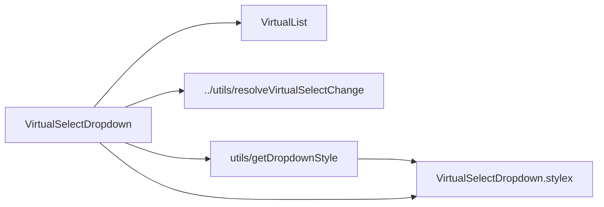

# VirtualSelectDropdown Architecture

Dropdown slice of `VirtualSelect`: the positioned listbox shell around `VirtualList`, owning dropdown styling/positioning and selection-change resolution. Private delegate — no `index.ts`, imported by `VirtualSelect` via direct file path (ADR-007).

## File Structure

```
VirtualSelectDropdown/
├── VirtualSelectDropdown.component.tsx   → Listbox shell + VirtualList, owns handleVirtualListChange
├── VirtualSelectDropdown.types.ts        → Props (resolved listbox wiring + change plumbing)
├── VirtualSelectDropdown.stylex.ts       → dropdownBase / dropdownAbsolute / dropdownStatic / dropdownStaticFill
├── VirtualSelectDropdown.component.test.tsx
└── utils/
    ├── getDropdownStyle.util.ts          → Pick the dropdown position style
    └── getDropdownStyle.util.test.ts
```

`getDropdownStyle` is imported via direct file path (single consumer — no `utils/index.ts`, ADR-007 rule 3).

## Dependencies



## Behaviour

- **Visibility** — renders `null` while `isListVisible` is false; the parent computes visibility from `isAlwaysOpen || isOpen`.
- **Selection change (owned handler)** — `handleVirtualListChange(filter)` resolves the VirtualList `SelectFilter` into the next selected values via `resolveVirtualSelectChange` (single mode picks the newly added value; multi forwards all), calls `onChange`, and calls `onClose` when a single-mode pick should close the dropdown.
- **Multi wiring** — `hasCheckboxes`/`hasSelectAll` are derived from `mode === 'multi'`.

## Dropdown Positioning

Controlled by `utils/getDropdownStyle({ isAlwaysOpen, shouldFillHeight })`, composed after `dropdownBase` and before the consumer's `customStylex` override:

| `isAlwaysOpen` | `shouldFillHeight` | Style applied        | Behaviour                           |
| -------------- | ------------------ | -------------------- | ----------------------------------- |
| `false`        | any                | `dropdownAbsolute`   | Floats below trigger, z-elevated    |
| `true`         | `false`            | `dropdownStatic`     | Inline block (e.g. filter panel)    |
| `true`         | `true`             | `dropdownStaticFill` | Flex-fill (e.g. full-height drawer) |

## Props

| Prop                | Type                           | Description                                        |
| ------------------- | ------------------------------ | -------------------------------------------------- |
| `customStylex`      | `StyleXStyles`                 | Consumer override, always last in `stylex.props`   |
| `dataState`         | `VirtualListDataState`         | Resolved data (async or static-options fallback)   |
| `getValueFromLabel` | `(label: string) => string`    | Maps option labels back to values on change        |
| `isAlwaysOpen`      | `boolean`                      | Static vs floating positioning                     |
| `isListVisible`     | `boolean`                      | Renders nothing while false                        |
| `listboxId`         | `string`                       | `id` of the `role='listbox'` shell                 |
| `listMaxHeight`     | `string`                       | Forwarded to the VirtualList scroll area           |
| `mode`              | `'single' \| 'multi'`          | Drives checkboxes/select-all and change resolution |
| `onChange`          | `(selected: string[]) => void` | Called with the next selected values               |
| `onClose`           | `() => void`                   | Requests the parent close after a single-mode pick |
| `onFetchInitial`    | `() => Promise<void> \| void`  | Forwarded to VirtualList                           |
| `onFetchMore`       | `() => Promise<void> \| void`  | Forwarded to VirtualList                           |
| `selected`          | `readonly string[]`            | Current selection (input to change resolution)     |
| `selectedLabels`    | `readonly string[]`            | Labels for the VirtualList `filter` prop           |
| `shouldFillHeight`  | `boolean`                      | Fill-height layout (forwarded + positioning input) |
