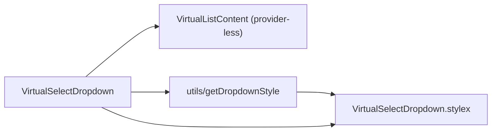

# VirtualSelectDropdown Architecture

Dropdown slice of `VirtualSelect`: the positioned listbox shell around the provider-less `VirtualListContent`. **Presentation only** — the VirtualList providers (and the selection-change mapping) are owned by the `VirtualSelect` shell, so the dropdown carries no store wiring and no handlers. Private delegate — no `index.ts`, imported by `VirtualSelect` via direct file path (ADR-007). Must render inside the VirtualList providers mounted by the shell.

## File Structure

```
VirtualSelectDropdown/
├── VirtualSelectDropdown.component.tsx   → Listbox shell + VirtualListContent
├── VirtualSelectDropdown.types.ts        → Props (positioning + listbox wiring only)
├── VirtualSelectDropdown.stylex.ts       → dropdownBase / dropdownAbsolute / dropdownStatic / dropdownStaticFill
├── VirtualSelectDropdown.component.test.tsx
└── utils/
    ├── getDropdownStyle.util.ts          → Pick the dropdown position style
    └── getDropdownStyle.util.test.ts
```

`getDropdownStyle` is imported via direct file path (single consumer — no `utils/index.ts`, ADR-007 rule 3).

## Dependencies



## Behaviour

- **Visibility** — renders `null` while `isListVisible` is false; the shell computes visibility from `isAlwaysOpen || isOpen`. Only the list DOM unmounts while closed — the providers (and their stores) stay alive on the shell.
- **Selection changes** — none here: option toggles inside `VirtualListContent` dispatch store actions whose emitted `SelectFilter` funnels through the shell's `handleListChange` (config context `onChange`).

## Dropdown Positioning

Controlled by `utils/getDropdownStyle({ isAlwaysOpen, shouldFillHeight })`, composed after `dropdownBase` and before the consumer's `customStylex` override:

| `isAlwaysOpen` | `shouldFillHeight` | Style applied        | Behaviour                           |
| -------------- | ------------------ | -------------------- | ----------------------------------- |
| `false`        | any                | `dropdownAbsolute`   | Floats below trigger, z-elevated    |
| `true`         | `false`            | `dropdownStatic`     | Inline block (e.g. filter panel)    |
| `true`         | `true`             | `dropdownStaticFill` | Flex-fill (e.g. full-height drawer) |

## Props

| Prop               | Type           | Description                                        |
| ------------------ | -------------- | -------------------------------------------------- |
| `customStylex`     | `StyleXStyles` | Consumer override, always last in `stylex.props`   |
| `isAlwaysOpen`     | `boolean`      | Static vs floating positioning                     |
| `isListVisible`    | `boolean`      | Renders nothing while false                        |
| `listboxId`        | `string`       | `id` of the `role='listbox'` shell                 |
| `listMaxHeight`    | `string`       | Forwarded to the VirtualListContent scroll area    |
| `shouldFillHeight` | `boolean`      | Fill-height layout (forwarded + positioning input) |
