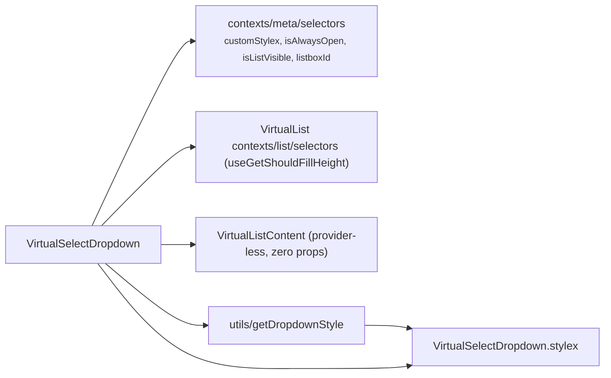

# VirtualSelectDropdown Architecture

Dropdown slice of `VirtualSelect`: the positioned listbox shell around the provider-less `VirtualListContent`. **Fully self-connected — zero props** (so it carries no `.types.ts`): visibility/positioning metadata comes from the select meta selectors and the fill-height flag from the **list store** (its single owner — `listMaxHeight` never passes through here; `VirtualListBody` reads it directly). It holds no handlers, since the provider and the selection-change mapping are owned by the shell. Private delegate — no `index.ts`, imported by `VirtualSelect` via direct file path (ADR-007). Must render inside the `VirtualSelectProvider` (which composes `VirtualListProvider`) mounted by the shell.

## File Structure

```
VirtualSelectDropdown/
├── VirtualSelectDropdown.component.tsx   → Listbox shell + VirtualListContent, meta-selector-connected
├── VirtualSelectDropdown.stylex.ts       → dropdownBase / dropdownAbsolute / dropdownStatic / dropdownStaticFill
├── VirtualSelectDropdown.component.test.tsx
└── utils/
    ├── getDropdownStyle.util.ts          → Pick the dropdown position style
    └── getDropdownStyle.util.test.ts
```

`getDropdownStyle` is imported via direct file path (single consumer — no `utils/index.ts`, ADR-007 rule 3).

## Dependencies



## Behaviour

- **Visibility** — renders `null` while the meta store's pre-computed `isListVisible` (`isAlwaysOpen || isOpen`) is false. Only the list DOM unmounts while closed — the provider (and its stores) stays alive on the shell.
- **Selection changes** — none here: option toggles inside `VirtualListContent` dispatch store actions whose emitted `SelectFilter` funnels through the shell's `handleListChange` (list context `onChange`).

## Dropdown Positioning

Controlled by `utils/getDropdownStyle({ isAlwaysOpen, shouldFillHeight })`, composed after `dropdownBase` and before the consumer's `customStylex` override (read from the meta store, always last in `stylex.props`):

| `isAlwaysOpen` | `shouldFillHeight` | Style applied        | Behaviour                           |
| -------------- | ------------------ | -------------------- | ----------------------------------- |
| `false`        | any                | `dropdownAbsolute`   | Floats below trigger, z-elevated    |
| `true`         | `false`            | `dropdownStatic`     | Inline block (e.g. filter panel)    |
| `true`         | `true`             | `dropdownStaticFill` | Flex-fill (e.g. full-height drawer) |

## State Ownership

| Source            | Read                                                         | Dispatched |
| ----------------- | ------------------------------------------------------------ | ---------- |
| Select meta store | `customStylex`, `isAlwaysOpen`, `isListVisible`, `listboxId` | —          |
| List store        | `shouldFillHeight` (positioning input)                       | —          |
