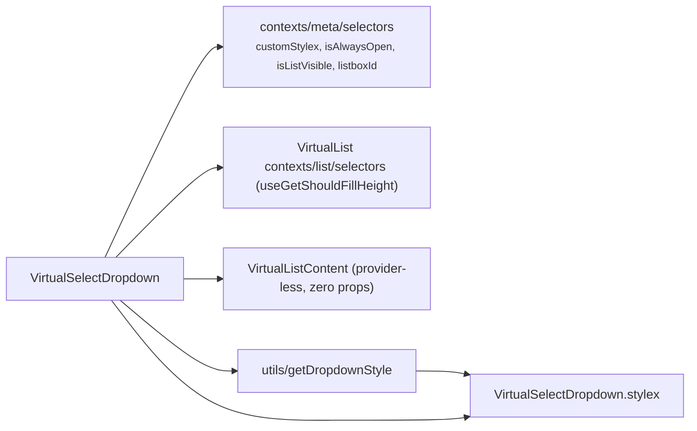

# VirtualSelectDropdown Architecture

Dropdown slice of `VirtualSelect`: the positioned listbox shell around the provider-less `VirtualListContent`. **Fully self-connected — zero props** (so it carries no `.types.ts`): visibility/positioning metadata comes from the select meta selectors and the fill-height flag from the **list store** (its single owner — `listMaxHeight` never passes through here; `VirtualListBody` reads it directly). It holds no handlers, since the provider and the selection-change mapping are owned by the shell. Private delegate — no `index.ts`, imported by `VirtualSelect` via direct file path (ADR-007). Must render inside the `VirtualSelectProvider` (which composes `VirtualListProvider`) mounted by the shell.

## File Structure

```
VirtualSelectDropdown/
├── VirtualSelectDropdown.component.tsx   → Listbox shell + VirtualListContent, meta-selector-connected
├── VirtualSelectDropdown.constants.ts    → DROPDOWN_GAP_PX + HAS_POPOVER_SUPPORT (feature detection)
├── VirtualSelectDropdown.stylex.ts       → dropdownBase / dropdownFloating / dropdownAt / dropdownUnplaced / dropdownStatic / dropdownStaticFill
├── VirtualSelectDropdown.types.ts        → AnchorRect, DropdownPlacement
├── useVirtualSelectDropdownPosition.hook.ts → Top-layer promotion + viewport coordinates (bundle-local hook, mirrors useTableActionsPopoverPosition)
├── VirtualSelectDropdown.component.test.tsx
└── utils/
    ├── getDropdownStyle.util.ts          → Pick the dropdown position style
    ├── getDropdownStyle.util.test.ts
    ├── resolveDropdownPlacement.util.ts  → Pure below/flip-above placement maths
    └── resolveDropdownPlacement.util.test.ts
```

`getDropdownStyle` is imported via direct file path (single consumer — no `utils/index.ts`, ADR-007 rule 3).

## Dependencies



## Behaviour

- **Visibility** — renders `null` while the meta store's pre-computed `isListVisible` (`isAlwaysOpen || isOpen`) is false. Only the list DOM unmounts while closed — the provider (and its stores) stays alive on the shell.
- **Selection changes** — none here: option toggles inside `VirtualListContent` dispatch store actions whose emitted `SelectFilter` funnels through the shell's `handleListChange` (list context `onChange`).

## Dropdown Positioning

Controlled by `utils/getDropdownStyle({ isAlwaysOpen, shouldFillHeight })`, composed after `dropdownBase` and the consumer's `customStylex` override (read from the meta store) — so the positioning styles are **always last in `stylex.props`**:

| `isAlwaysOpen` | `shouldFillHeight` | Style applied        | Behaviour                                              |
| -------------- | ------------------ | -------------------- | ------------------------------------------------------ |
| `false`        | any                | `dropdownFloating`   | Top layer, fixed to the trigger's viewport coordinates |
| `true`         | `false`            | `dropdownStatic`     | Inline block (e.g. filter panel)                       |
| `true`         | `true`             | `dropdownStaticFill` | Flex-fill (e.g. full-height drawer)                    |

**The order is load-bearing, not cosmetic.** StyleX is last-wins, so a
`customStylex` composed after the positioning styles can null out
`position: fixed` or the computed coordinates — and a popover that is not
absolutely positioned still sits in the top layer, where it lays out against the
initial containing block, i.e. the viewport's top-left corner. `OperatorSelect`
passed exactly such an override and the operator list rendered in the screen
corner in the Column Settings drawer, and only there, because that drawer is the
only caller that triggered it. `customStylex` tunes the surface; the component
owns where it goes.

### Why the floating variant lives in the top layer

It used to be `position: absolute` inside the shell's `position: relative`
container, so **any** ancestor establishing a clipping context cut it off — a Form
group card (`overflow: hidden`), the form's own scroll region, a settings drawer.
No z-index resolves that; clipping is not a stacking question. The same select
looks correct on the showcase page only because that page has no such ancestor.

`useVirtualSelectDropdownPosition` promotes the element with the native Popover
API (`popover="manual"` + `showPopover()`) and positions it `fixed` from the
anchor's measured rect. Three consequences worth knowing:

- **The DOM tree is unchanged** — unlike a React portal, only painting moves. The
  shell's `useClickOutside` uses `contains()`, so a click inside the list still
  counts as inside the select. That is why a portal was not used.
- **Support is feature-detected** (`HAS_POPOVER_SUPPORT`). jsdom applies the
  `[popover]` UA rule — `display: none` until open — but ships no `showPopover`,
  so an unconditional attribute would make the list permanently invisible. Without
  the attribute the dropdown still positions correctly; it is just clippable again.
- **Scrolling an ancestor dismisses the dropdown** rather than re-anchoring it. A
  fixed-position list cannot follow its trigger without reading layout on every
  scroll frame, and one lagging its trigger reads worse than one that closes. Size
  changes (viewport, trigger, list) _do_ re-anchor, via a `ResizeObserver` that
  also takes the first measurement — which is why nothing sets state synchronously
  in the effect.
- **Scrolling the option list does not**, and the listener needs an explicit
  guard to tell the two apart. The dismissal listener is on `window` in the
  capture phase, and non-bubbling removes only the _bubble_ phase — a capture
  listener there is on the path of a scroll from **every** element, and the
  option list is itself a scroll container. Without the `contains(target)` guard
  the dropdown closed on the first wheel tick over its own list. `VirtualListBody`
  also sets `overscroll-behavior: contain`, so a scroll that reaches either end
  of the list does not chain to the drawer behind it and dismiss it that way.
- **Dismissal dispatches a close, not a toggle.** A toggle is suppressed while
  the list is busy, so an ancestor scroll over a loading list left the dropdown
  open.

The `[popover]` UA stylesheet is aggressive — `inset: 0`, `margin: auto`,
`padding: .25em`, a solid border, system colors, `overflow: auto` — so most of
`dropdownFloating` exists to undo it. Author styles beat the UA origin regardless
of specificity, so plain longhands suffice.

## State Ownership

| Source            | Read                                                         | Dispatched                                     |
| ----------------- | ------------------------------------------------------------ | ---------------------------------------------- |
| Select meta store | `customStylex`, `isAlwaysOpen`, `isListVisible`, `listboxId` | `onCloseDropdown` (dismiss on ancestor scroll) |
| Select context    | `anchorRef` — the shell container placement measures against | —                                              |
| List store        | `shouldFillHeight` (positioning input)                       | —                                              |
