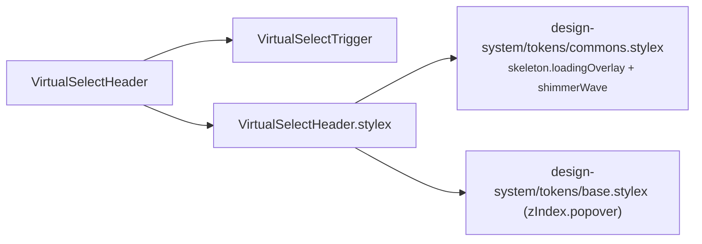

# VirtualSelectHeader Architecture

Header slice of `VirtualSelect`: renders the busy shimmer overlay and the combobox trigger, and owns tag removal. Private delegate — no `index.ts`, imported by `VirtualSelect` via direct file path (ADR-007).

## File Structure

```
VirtualSelectHeader/
├── VirtualSelectHeader.component.tsx   → Busy overlay + VirtualSelectTrigger, owns handleRemoveTag
├── VirtualSelectHeader.types.ts        → Props (trigger props minus onRemoveTag, plus selection wiring)
├── VirtualSelectHeader.stylex.ts       → Busy overlay styles (skeleton tokens + popover z-index)
└── VirtualSelectHeader.component.test.tsx
```

## Dependencies



## Behaviour

- **Busy overlay** — when `isBusy` is true, an `aria-hidden` shimmer overlay is rendered above the trigger (absolutely positioned against the `VirtualSelect` container, `zIndex.popover`). The trigger itself also receives `isBusy` so it renders disabled.
- **Tag removal (owned handler)** — `handleRemoveTag(label)` maps the removed tag's label back to its value via `getValueFromLabel` and calls `onChange` with the filtered `selected` array. The parent only supplies the mapping function and the change callback.

## Props

| Prop                | Type                                                    | Description                                        |
| ------------------- | ------------------------------------------------------- | -------------------------------------------------- |
| `getValueFromLabel` | `(label: string) => string`                             | Maps a tag label back to its selected value        |
| `isAlwaysOpen`      | `boolean`                                               | Forwarded to the trigger (static, non-interactive) |
| `isBusy`            | `boolean`                                               | Shows the shimmer overlay + disabled trigger       |
| `isOpen`            | `boolean`                                               | Chevron direction / `aria-expanded`                |
| `listboxId`         | `string`                                                | Wired to the trigger's `aria-controls`             |
| `mode`              | `'single' \| 'multi'`                                   | Trigger display mode                               |
| `onChange`          | `(selected: string[]) => void`                          | Called with the next selection after tag removal   |
| `onToggle`          | `() => void`                                            | Opens/closes the dropdown                          |
| `overflowCount`     | `number`                                                | Tags hidden behind "+N more"                       |
| `placeholder`       | `string`                                                | Shown when nothing is selected                     |
| `selected`          | `readonly string[]`                                     | Current selection (source for removal filtering)   |
| `triggerRef`        | `RefObject<HTMLButtonElement \| HTMLDivElement \| ...>` | Measured by the parent's ResizeObserver            |
| `visibleTags`       | `readonly string[]`                                     | Tag labels that fit in the trigger                 |
