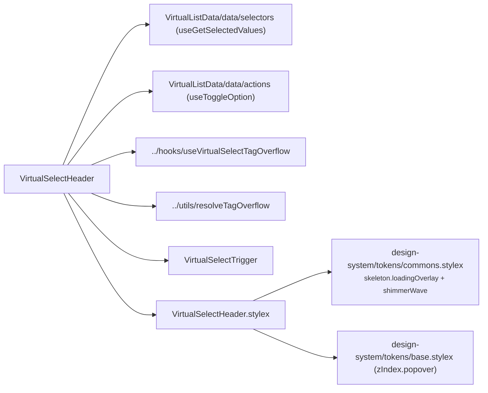

# VirtualSelectHeader Architecture

Header slice of `VirtualSelect`: renders the busy shimmer overlay and the combobox trigger. **Self-connected** — reads the selected labels from the VirtualList data store, owns the trigger ref + tag-overflow measurement, and dispatches tag removal through the toggle-option action. Private delegate — no `index.ts`, imported by `VirtualSelect` via direct file path (ADR-007). Must render inside the VirtualList providers mounted by the `VirtualSelect` shell.

## File Structure

```
VirtualSelectHeader/
├── VirtualSelectHeader.component.tsx   → Busy overlay + VirtualSelectTrigger, store-connected
├── VirtualSelectHeader.types.ts        → Props (presentation subset of the trigger props)
├── VirtualSelectHeader.stylex.ts       → Busy overlay styles (skeleton tokens + popover z-index)
└── VirtualSelectHeader.component.test.tsx
```

## Dependencies



## Behaviour

- **Busy overlay** — when `isBusy` is true, an `aria-hidden` shimmer overlay is rendered above the trigger (absolutely positioned against the `VirtualSelect` container, `zIndex.popover`). The trigger itself also receives `isBusy` so it renders disabled.
- **Selected labels (store read)** — `useGetSelectedValues` mirrors the shell's `filter.values` (the selected option **labels**); they feed the trigger's tags and the single-mode label.
- **Tag overflow (owned)** — the header holds `triggerRef`, runs `useVirtualSelectTagOverflow` (ResizeObserver → `countVisibleTags`), and splits the labels into `visibleTags` + `overflowCount` via `resolveTagOverflow`.
- **Tag removal (action dispatch)** — removing a tag dispatches `useToggleOption(label)`; the emitted `SelectFilter` funnels through the shell's `handleListChange`, which maps labels back to values and calls the parent `onChange`.

## Props

Presentation wiring only (`Pick` of the trigger props) — selection state never arrives via props.

| Prop           | Type                  | Description                                        |
| -------------- | --------------------- | -------------------------------------------------- |
| `isAlwaysOpen` | `boolean`             | Forwarded to the trigger (static, non-interactive) |
| `isBusy`       | `boolean`             | Shows the shimmer overlay + disabled trigger       |
| `isOpen`       | `boolean`             | Chevron direction / `aria-expanded`                |
| `listboxId`    | `string`              | Wired to the trigger's `aria-controls`             |
| `mode`         | `'single' \| 'multi'` | Trigger display mode                               |
| `onToggle`     | `() => void`          | Opens/closes the dropdown                          |
| `placeholder`  | `string`              | Shown when nothing is selected                     |
