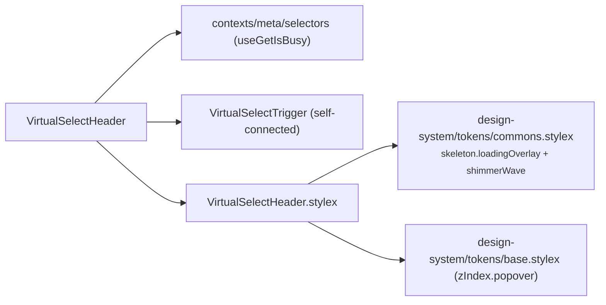

# VirtualSelectHeader Architecture

Header slice of `VirtualSelect`: renders the busy shimmer overlay and composes the self-connected combobox trigger. **Fully self-connected — zero props** (so it carries no `.types.ts`) and reads only what it renders itself: the busy flag for the overlay. Everything trigger-related (labels, tags, overflow, toggle) is owned by `VirtualSelectTrigger`. Private delegate — no `index.ts`, imported by `VirtualSelect` via direct file path (ADR-007). Must render inside the providers mounted by the `VirtualSelect` shell.

## File Structure

```
VirtualSelectHeader/
├── VirtualSelectHeader.component.tsx   → Busy overlay + VirtualSelectTrigger composition
├── VirtualSelectHeader.stylex.ts       → Busy overlay styles (skeleton tokens + popover z-index)
└── VirtualSelectHeader.component.test.tsx
```

## Dependencies



## Behaviour

- **Busy overlay** — when the meta store's `isBusy` is true, an `aria-hidden` shimmer overlay is rendered above the trigger (absolutely positioned against the `VirtualSelect` container, `zIndex.popover`). The trigger reads the same flag itself to render disabled.

## State Ownership

| Source            | Read     | Dispatched |
| ----------------- | -------- | ---------- |
| Select meta store | `isBusy` | —          |
