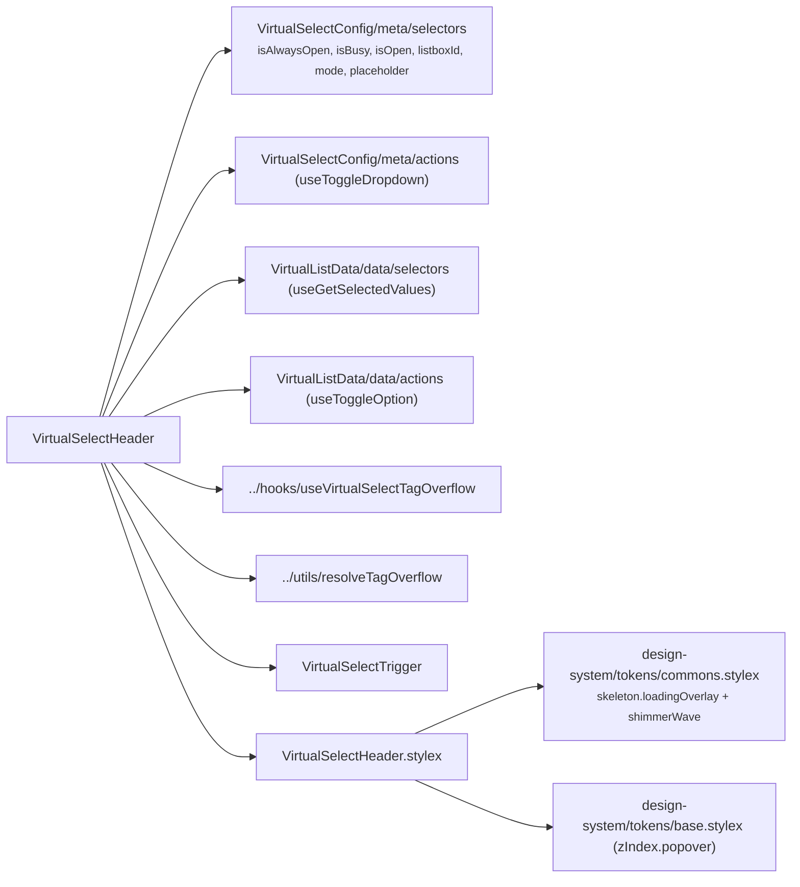

# VirtualSelectHeader Architecture

Header slice of `VirtualSelect`: renders the busy shimmer overlay and the combobox trigger. **Fully self-connected — zero props** (so it carries no `.types.ts`): presentation metadata comes from the select meta selectors, the selected labels from the VirtualList data store, and every interaction dispatches through actions. Private delegate — no `index.ts`, imported by `VirtualSelect` via direct file path (ADR-007). Must render inside the three providers mounted by the `VirtualSelect` shell.

## File Structure

```
VirtualSelectHeader/
├── VirtualSelectHeader.component.tsx   → Busy overlay + VirtualSelectTrigger, store-connected
├── VirtualSelectHeader.stylex.ts       → Busy overlay styles (skeleton tokens + popover z-index)
└── VirtualSelectHeader.component.test.tsx
```

## Dependencies



## Behaviour

- **Busy overlay** — when the meta store's `isBusy` is true, an `aria-hidden` shimmer overlay is rendered above the trigger (absolutely positioned against the `VirtualSelect` container, `zIndex.popover`). The trigger itself also receives `isBusy` so it renders disabled.
- **Selected labels (store read)** — `useGetSelectedValues` mirrors the shell's `filter.values` (the selected option **labels**); they feed the trigger's tags and the single-mode label.
- **Tag overflow (owned)** — the header holds `triggerRef`, runs `useVirtualSelectTagOverflow` (ResizeObserver → `countVisibleTags`), and splits the labels into `visibleTags` + `overflowCount` via `resolveTagOverflow`.
- **Tag removal (action dispatch)** — removing a tag dispatches `useToggleOption(label)`; the emitted `SelectFilter` funnels through the shell's `handleListChange`, which maps labels back to values and calls the parent `onChange`.
- **Dropdown toggle (action dispatch)** — the trigger's `onToggle` dispatches `useToggleDropdown`, which invokes the shell-owned callback from the select context value.

## State Ownership

| Source            | Read                                                                   | Dispatched          |
| ----------------- | ---------------------------------------------------------------------- | ------------------- |
| Select meta store | `isAlwaysOpen`, `isBusy`, `isOpen`, `listboxId`, `mode`, `placeholder` | `useToggleDropdown` |
| List data store   | `selectedValues` (labels)                                              | `useToggleOption`   |
