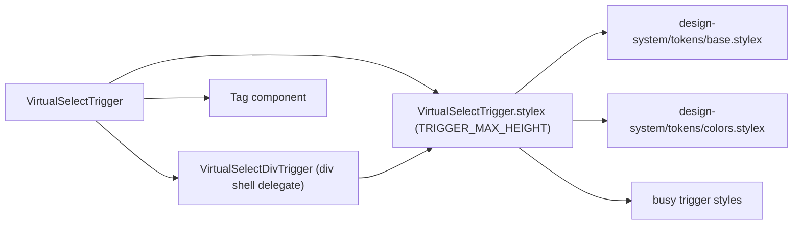

# VirtualSelectTrigger Architecture

Combobox trigger: shows placeholder, single-value label, or multi-select tag chips with overflow counter and a chevron indicator.
When busy, the trigger renders in a disabled state so it cannot open the dropdown.

## File Structure

```
VirtualSelectTrigger/
├── index.ts                              → Barrel export
├── VirtualSelectTrigger.component.tsx   → Picks the trigger element (button when safe, div delegate for tag/static mode)
├── VirtualSelectTrigger.stylex.ts       → Styles + TRIGGER_MAX_HEIGHT constant
├── VirtualSelectTrigger.types.ts        → Props
├── utils/                               → One-per-file trigger helpers (ref assign, style props, keydown, render content/chevron)
└── VirtualSelectDivTrigger/             → Private delegate — div trigger shell (static isAlwaysOpen + interactive tag mode)
    ├── VirtualSelectDivTrigger.component.tsx
    └── VirtualSelectDivTrigger.types.ts
```

`VirtualSelectDivTrigger` is a private delegate (no `index.ts`, imported via direct file path — ADR-007). It derives `shouldDisableInteraction` from `isBusy || isAlwaysOpen` and spreads the interaction props (`role='button'`, aria wiring, click/keydown, `tabIndex`) only in the interactive variant; the static variant renders the same shell with no interaction props. It receives the already-rendered content + chevron as `children` and reuses the shared `utils/` helpers and `VirtualSelectTrigger.stylex.ts` styles — it has no styles of its own.

## Dependencies



## Render Flow

```mermaid
graph TD
  A["VirtualSelectTrigger renders"] --> B{"hasSelection?"}
  B -->|no| C["span.triggerPlaceholder → placeholder text"]
  B -->|yes| D{"mode === 'single'?"}
  D -->|yes| E["span.triggerLabel → selected[0]"]
  D -->|no (multi)| F["visibleTags.map → Tag chips"]
  F --> G{"overflowCount > 0?"}
  G -->|yes| H["span.overflowTag → '+N more'"]
  G -->|no| I["(nothing extra)"]
  A --> J{"!isAlwaysOpen?"}
  J -->|yes| K["span.chevron (↑ open / ↓ closed)"]
  J -->|no| L["(no chevron)"]
  A --> M{"isAlwaysOpen or tag mode?"}
  M -->|yes| N["VirtualSelectDivTrigger (div shell, conditional interaction props)"]
  M -->|no| O["native button trigger"]
```

## Props

| Prop            | Type                                                     | Description                                                |
| --------------- | -------------------------------------------------------- | ---------------------------------------------------------- |
| `isAlwaysOpen`  | `boolean`                                                | Hides chevron and disables click/focus interaction         |
| `isBusy`        | `boolean`                                                | Shows busy styling and prevents opening the dropdown       |
| `isOpen`        | `boolean`                                                | Controls chevron direction and `aria-expanded`             |
| `mode`          | `'single' \| 'multi'`                                    | Single shows label; multi shows Tag chips                  |
| `onRemoveTag`   | `(option: string) => void`                               | Called when a Tag's remove button is clicked               |
| `onToggle`      | `() => void`                                             | Opens/closes the dropdown                                  |
| `overflowCount` | `number`                                                 | Number of tags hidden behind "+N more"                     |
| `placeholder`   | `string`                                                 | Shown when `selected` is empty                             |
| `selected`      | `string[]`                                               | Full selection (used to detect `hasSelection`)             |
| `triggerRef`    | `RefObject<HTMLButtonElement \| HTMLDivElement \| null>` | Measured by ResizeObserver in `VirtualSelect`              |
| `visibleTags`   | `string[]`                                               | Subset of `selected` that fits within `TRIGGER_MAX_HEIGHT` |

## Tag Overflow Behaviour

| Constant             | Value | Role                                           |
| -------------------- | ----- | ---------------------------------------------- |
| `TRIGGER_MAX_HEIGHT` | 88 px | Max pixel height before tags start overflowing |

When `mode === 'multi'` the parent `VirtualSelect` attaches a `ResizeObserver` to `triggerRef` and calls `countVisibleTags` to compute `visibleTags` and `overflowCount` on every resize.

The trigger uses explicit `border-box`, `min-width: 0`, and `max-width: 100%`
sizing so padding and borders do not push the select beyond its parent.

## Accessibility

| Attribute       | Value / Logic                                                              |
| --------------- | -------------------------------------------------------------------------- |
| Native element  | `button` for single/placeholder trigger; `div` for multi-selected tag mode |
| `aria-expanded` | `isOpen` on interactive branches                                           |
| `aria-haspopup` | `listbox` on interactive branches                                          |
| Keyboard        | Native button keyboard handling; `Enter`/`Space` handled on div tag branch |
