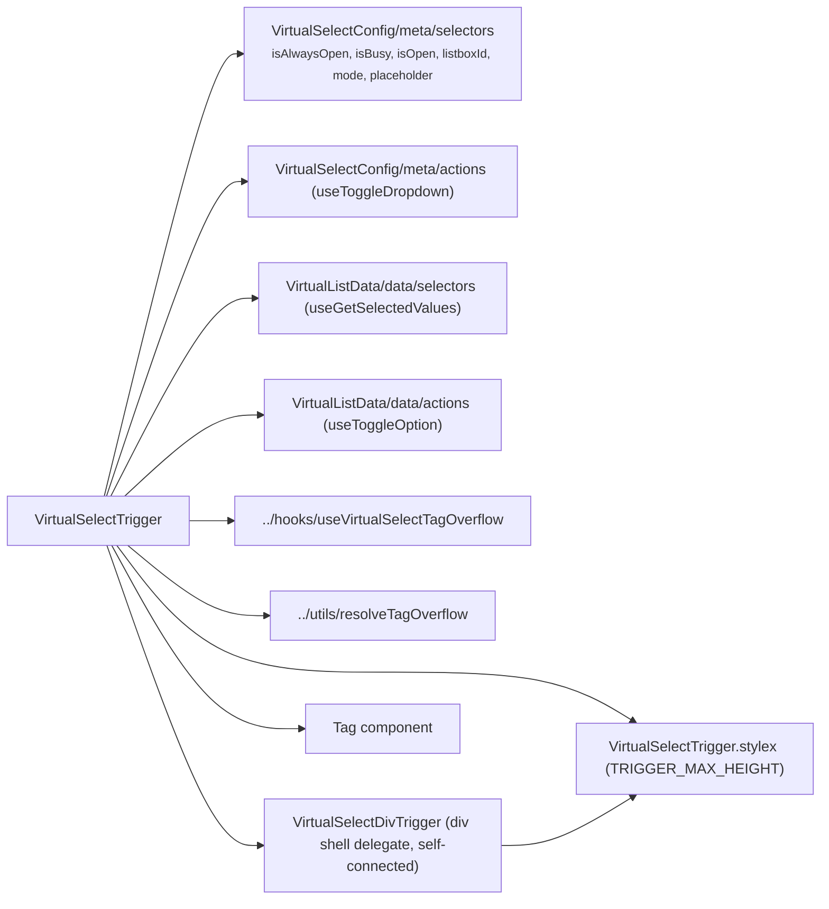

# VirtualSelectTrigger Architecture

Combobox trigger: shows placeholder, single-value label, or multi-select tag chips with overflow counter and a chevron indicator. **Fully self-connected — zero props**: display metadata comes from the select meta selectors, the selected labels from the list data store, and interactions dispatch through the toggle-dropdown/toggle-option actions. Owns the trigger ref and the ResizeObserver-driven tag-overflow measurement. When busy, the trigger renders in a disabled state so it cannot open the dropdown.

## File Structure

```
VirtualSelectTrigger/
├── index.ts                              → Barrel export
├── VirtualSelectTrigger.component.tsx   → Store-connected; picks the trigger element (button when safe, div delegate for tag/static mode)
├── VirtualSelectTrigger.stylex.ts       → Styles + TRIGGER_MAX_HEIGHT constant
├── VirtualSelectTrigger.types.ts        → VirtualSelectTriggerRef (shared trigger-ref type)
├── utils/                               → One-per-file trigger helpers (ref assign, style props, keydown, render content/chevron)
└── VirtualSelectDivTrigger/             → Private delegate — div trigger shell (static isAlwaysOpen + interactive tag mode)
    ├── VirtualSelectDivTrigger.component.tsx
    └── VirtualSelectDivTrigger.types.ts
```

`VirtualSelectDivTrigger` is a private delegate (no `index.ts`, imported via direct file path — ADR-007). It is **self-connected too** — it reads the interaction/styling state (`isAlwaysOpen`, `isBusy`, `isOpen`, `listboxId`, `mode`) through the meta selectors and dispatches `useToggleDropdown`; its only props are the producer→direct-child `triggerRef` and the already-rendered `children` (content + chevron). It derives `shouldDisableInteraction` from `isBusy || isAlwaysOpen` and spreads the interaction props (`role='button'`, aria wiring, click/keydown, `tabIndex`) only in the interactive variant; the static variant renders the same shell with no interaction props. It reuses the shared `utils/` helpers and `VirtualSelectTrigger.stylex.ts` styles — it has no styles of its own.

## Dependencies



## Render Flow

```mermaid
graph TD
  A["VirtualSelectTrigger renders (store-connected)"] --> B{"hasSelection?"}
  B -->|no| C["span.triggerPlaceholder → placeholder text"]
  B -->|yes| D{"mode === 'single'?"}
  D -->|yes| E["span.triggerLabel → selected label"]
  D -->|no (multi)| F["visibleTags.map → Tag chips"]
  F --> G{"overflowCount > 0?"}
  G -->|yes| H["span.overflowTag → '+N more'"]
  G -->|no| I["(nothing extra)"]
  A --> J{"!isAlwaysOpen?"}
  J -->|yes| K["span.chevron (↑ open / ↓ closed)"]
  J -->|no| L["(no chevron)"]
  A --> M{"isAlwaysOpen or tag mode?"}
  M -->|yes| N["VirtualSelectDivTrigger (div shell, conditional interaction props)"]
  M -->|no| O["native button trigger"]
```

## State Ownership

| Source            | Read                                                                   | Dispatched                      |
| ----------------- | ---------------------------------------------------------------------- | ------------------------------- |
| Select meta store | `isAlwaysOpen`, `isBusy`, `isOpen`, `listboxId`, `mode`, `placeholder` | `useToggleDropdown`             |
| List data store   | `selectedValues` (labels — tags, single label, `hasSelection`)         | `useToggleOption` (tag removal) |

## Tag Overflow Behaviour

| Constant             | Value | Role                                           |
| -------------------- | ----- | ---------------------------------------------- |
| `TRIGGER_MAX_HEIGHT` | 88 px | Max pixel height before tags start overflowing |

When `mode === 'multi'` the trigger attaches a `ResizeObserver` to its own `triggerRef` (`useVirtualSelectTagOverflow` → `countVisibleTags`) and derives `visibleTags`/`overflowCount` via `resolveTagOverflow` on every resize.

The trigger uses explicit `border-box`, `min-width: 0`, and `max-width: 100%`
sizing so padding and borders do not push the select beyond its parent.

## Accessibility

| Attribute       | Value / Logic                                                              |
| --------------- | -------------------------------------------------------------------------- |
| Native element  | `button` for single/placeholder trigger; `div` for multi-selected tag mode |
| `aria-expanded` | `isOpen` on interactive branches                                           |
| `aria-haspopup` | `listbox` on interactive branches                                          |
| Keyboard        | Native button keyboard handling; `Enter`/`Space` handled on div tag branch |
