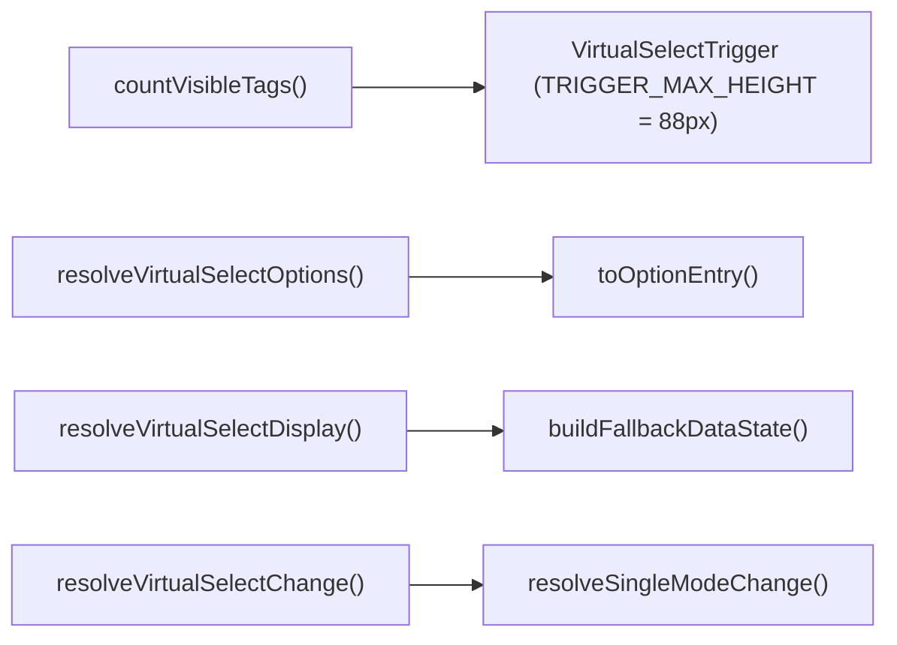
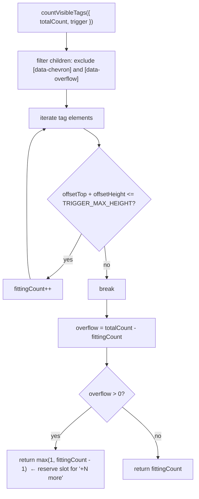

# utils/ Architecture

Pure utility functions for VirtualSelect: tag overflow measurement and option/selection/display resolution. Dropdown positioning (`getDropdownStyle`) lives with its owner in `../VirtualSelectDropdown/utils/`.

## File Structure

```
utils/
├── index.ts                             → Barrel export
├── countVisibleTags.util.ts             → DOM-measure how many tags fit in the trigger
├── buildFallbackDataState.util.ts       → Wrap static options in a synthetic VirtualListDataState
├── toOptionEntry.util.ts                → Normalize string | {label,value} into an option entry
├── resolveVirtualSelectOptions.util.ts  → Option entries + label↔value mapping + selected labels
├── resolveVirtualSelectDisplay.util.ts  → effectiveDataState, visibleTags, overflowCount
├── resolveVirtualSelectChange.util.ts   → Map a VirtualList SelectFilter to the next selection
└── resolveSingleModeChange.util.ts      → Pick the newly added value in single mode
```

## Dependencies



## `countVisibleTags`

### Logic Flow



### Args

| Field        | Type          | Description                                      |
| ------------ | ------------- | ------------------------------------------------ |
| `totalCount` | `number`      | Total selected items (full `selected.length`)    |
| `trigger`    | `HTMLElement` | The trigger DOM node (from `triggerRef.current`) |

### Overflow Slot Rule

When some tags overflow, one visible slot is reserved for the `"+N more"` badge — but at least **1** real tag is always shown.

## Resolution Utilities

| Util                          | Consumed by             | Role                                                                                     |
| ----------------------------- | ----------------------- | ---------------------------------------------------------------------------------------- |
| `resolveVirtualSelectOptions` | `VirtualSelect`         | Normalizes options, builds `getLabelFromValue`/`getValueFromLabel`, maps selected labels |
| `resolveVirtualSelectDisplay` | `VirtualSelect`         | Derives `effectiveDataState` (async or fallback), `visibleTags`, `overflowCount`         |
| `resolveVirtualSelectChange`  | `VirtualSelectDropdown` | Maps a `SelectFilter` to `{ nextSelected, shouldCloseDropdown }` per mode                |
| `resolveSingleModeChange`     | (internal)              | Picks the newly added value in single mode                                               |
| `buildFallbackDataState`      | (internal)              | Wraps static option labels in a synthetic non-loading `VirtualListDataState`             |
| `toOptionEntry`               | (internal)              | Normalizes `string \| { label, value }` options                                          |
