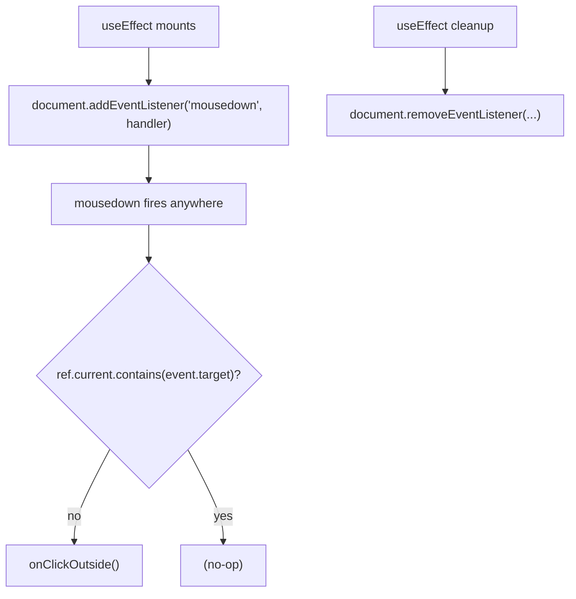
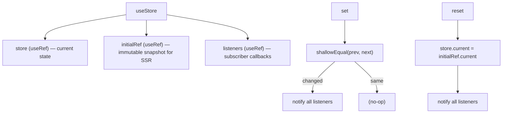
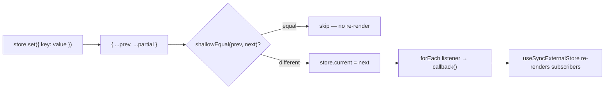
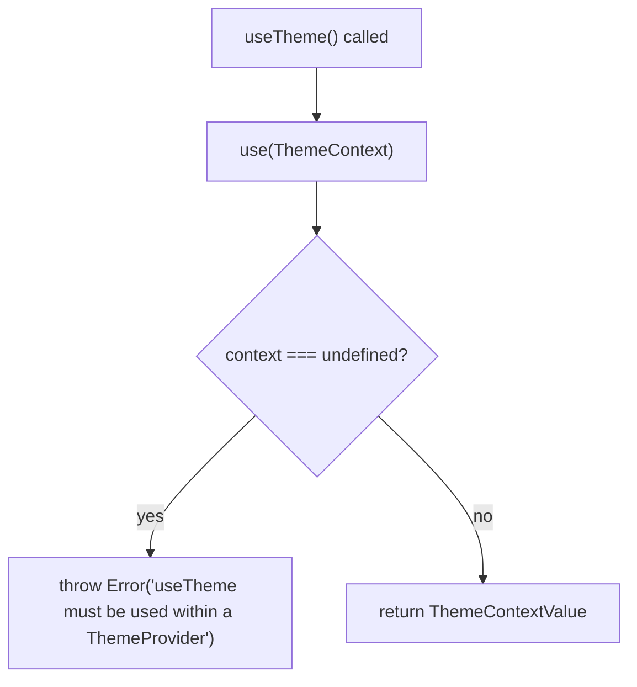
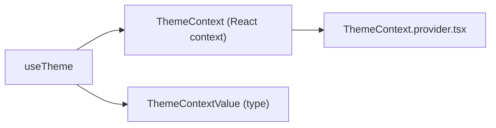

# hooks/ Architecture

Custom React hooks shared across the application.

## File Structure

```
hooks/
├── index.ts                              → Barrel export
├── useClickOutside.hook.ts               → Detect mousedown outside a DOM element
├── useElementSize.hook.ts                → Track a ref element's client size via ResizeObserver (SSR-safe)
├── useInfiniteScrollObserver.hook.ts     → IntersectionObserver sentinel trigger for infinite scroll
├── useNotifyOnError.hook.ts              → Fire error toast whenever error identity changes
├── useResizeObserver.hook.ts             → Low-level ResizeObserver lifecycle (lazy target, deferred initial measure, SSR-safe)
├── useStore.hook.ts                      → Lightweight external store (useSyncExternalStore-compatible)
├── useStoreSelector.hook.ts              → Subscribe to a slice of a useStore store (shared useSyncExternalStore wiring)
├── useTheme.hook.ts                      → Access ThemeContext via React 19 use()
├── useVirtualization.hook.ts             → Vertical virtual-scroll geometry computation (ResizeObserver-based)
└── utils/
  ├── ARCHITECTURE.md                   → Hook-local utility architecture
  └── index.ts                          → Utility barrel exports
```

## Hook Summary

| Hook                        | Category      | Returns                                | Key dependency                               |
| --------------------------- | ------------- | -------------------------------------- | -------------------------------------------- |
| `useClickOutside`           | DOM event     | `void`                                 | `document` mousedown                         |
| `useElementSize`            | Layout        | `{ height, width }`                    | `useResizeObserver` on the ref element       |
| `useResizeObserver`         | Layout        | `void`                                 | `ResizeObserver` on a lazily-resolved target |
| `useInfiniteScrollObserver` | Layout/scroll | `void`                                 | `IntersectionObserver` on a sentinel element |
| `useNotifyOnError`          | Notification  | `void`                                 | `useNotifyAction`, `useEffect`               |
| `useStore`                  | State mgmt    | `TStore<TData>`                        | `useRef`, `isShallowEqual`                   |
| `useStoreSelector`          | State mgmt    | `TSelected`                            | `useSyncExternalStore`, `TStore`             |
| `useTheme`                  | Context       | `ThemeContextValue`                    | `ThemeContext`, `use()`                      |
| `useVirtualization`         | Layout/scroll | `{ startIndex, endIndex, offsetY, … }` | `ResizeObserver` + RAF-batched scroll events |
| `useBackNavigate`           | Navigation    | `(fallbackTo: string) => void`         | `useNavigate`, `history.state.idx`           |
| `usePersistCookieAction`    | Persistence   | `(entries) => void`                    | `useFetcher` → `/_action/persist-cookie`     |

---

## `useClickOutside`

Fires `onClickOutside` whenever a `mousedown` event occurs outside `ref.current`.

### Signature

```ts
useClickOutside({ ref, onClickOutside }): void
```

### Flow



### Args

| Field            | Type                             | Description                       |
| ---------------- | -------------------------------- | --------------------------------- |
| `ref`            | `RefObject<HTMLElement \| null>` | Element whose boundary is guarded |
| `onClickOutside` | `() => void`                     | Called on outside mousedown       |

> Both `ref` and `onClickOutside` are dependencies of the `useEffect`. Consumers should stabilise `onClickOutside` with `useCallback` to avoid re-registering the listener on every render.

---

## `useVirtualization`

Computes the vertical virtual-scroll window for fixed-height rows. This is the
current default implementation used by the table.

Implementation details:

- Initializes `containerHeight` from `containerRef.current.offsetHeight` on
  mount, falling back to `defaultContainerHeight` only when measurement is
  unavailable.
- Installs a `ResizeObserver` on the scroll container instead of listening to
  `window.resize`, so container-only size changes are tracked correctly.
- Uses a passive scroll listener and batches `scrollTop` updates with
  `requestAnimationFrame` to reduce re-render pressure during rapid scrolling.
- Reuses `setupObservedContainer()` from `hooks/utils` for shared
  ResizeObserver + scroll subscription wiring (the observer is skipped when
  `ResizeObserver` is unavailable, keeping SSR and tests safe).
- Preserves the previous non-zero height when a resize temporarily reports `0`
  (for example hidden/inactive layouts).

### Signature

```ts
useVirtualization(args: UseVirtualizationArgs)
```

### `UseVirtualizationArgs`

| Field                    | Type                             | Default | Description                            |
| ------------------------ | -------------------------------- | ------- | -------------------------------------- |
| `containerRef`           | `RefObject<HTMLElement \| null>` | —       | Scrollable container element           |
| `defaultContainerHeight` | `number`                         | `400`   | Fallback height before DOM measurement |
| `itemHeight`             | `number`                         | —       | Fixed row height in pixels             |
| `overscan`               | `number`                         | `3`     | Extra rows rendered above and below    |
| `totalItems`             | `number`                         | —       | Total number of virtualized rows       |

### Return Shape

`useVirtualization` returns:

- `startIndex` / `endIndex`: visible row window
- `offsetY`: top virtual offset in pixels
- `bottomSpacerHeight`: remaining virtual height below the rendered window
- `totalHeight`: full logical height of the row list
- `containerHeight` / `visibleCount`: current viewport geometry

### Geometry

```
scrollTop ──► startIndex / endIndex
              │
              ├─► offsetY
              └─► bottomSpacerHeight
```

---

## `useStore`

Creates a ref-based external store that is compatible with `useSyncExternalStore`. Uses shallow equality to suppress no-op updates.

### Signature

```ts
useStore<TData extends Record<string, unknown>>(initialState: TData): TStore<TData>
```

`initialState` is **required**, which is what lets `get()` return `TData` rather
than `TData | undefined`. A store is never empty, so no reader needs an
empty-store fallback or a cast — the `?? ({} as SomeState)` defaults that habit
produced were unreachable, and one of them (`{} as ColumnVisibilityState`, a
`Set`) was actively wrong.

### `TStore<TData>` interface

| Method                | Signature                         | Description                                                     |
| --------------------- | --------------------------------- | --------------------------------------------------------------- |
| `get()`               | `() => TData`                     | Returns current state — never undefined; the store is seeded    |
| `getServerSnapshot()` | `() => TData`                     | Returns **initial** state — used by SSR hydration               |
| `set(partial)`        | `(value: Partial<TData>) => void` | Merges partial update; notifies listeners only if state changed |
| `reset()`             | `() => void`                      | Restores state to `initialState`; always notifies               |
| `subscribe(cb)`       | `(cb: () => void) => () => void`  | Registers a listener; returns unsubscribe function              |

### Internal Structure



### Update Flow



### Canonical Usage

```tsx
const store = useStore<{ count: number }>({ count: 0 });

// Read through useStoreSelector rather than wiring useSyncExternalStore by hand
const count = useStoreSelector({ selector: (state) => state.count, store });

store.set({ count: count + 1 });
```

### Design Notes

- **No React state** — the store lives in `useRef`, so mutations never cause the owning component to re-render directly.
- **Shallow equality guard** prevents `set` from notifying listeners when the merged object is identical to the previous state.
- **`getServerSnapshot`** always returns the `initialState` snapshot, satisfying React's SSR hydration contract.
- The listener `Set` is also a ref, so subscribe/unsubscribe operations are stable across renders.

---

## `useStoreSelector`

Subscribes to a slice of a `useStore` store. This is the read half of the store
pattern — `useStore` creates the store, `useStoreSelector` reads from it — and
it owns the `useSyncExternalStore` wiring (client snapshot, server snapshot,
subscribe) so no per-context hook repeats it.

### Signature

```ts
useStoreSelector<TState extends Record<string, unknown>, TSelected>(args: {
  selector: (state: TState) => TSelected;
  store: TStore<TState>;
}): TSelected
```

`useStore` requires an initial state, so `get()` always returns one. There is no
empty-store fallback and no cast — a selector always receives real state.

### Consumers

This hook owns **every** `useSyncExternalStore` call in the package. Each
per-context `use*Store` infrastructure hook resolves its own store from its own
context and delegates here:

| Hook                                             | Context                     |
| ------------------------------------------------ | --------------------------- |
| `TableConfig/columns/useColumnsStore`            | `TableConfigContext`        |
| `TableConfig/meta/useMetaStore`                  | `TableConfigContext`        |
| `TableData/data/useDataStore`                    | `TableDataContext`          |
| `FiltersData/filters/useFiltersStore`            | `FiltersDataContext`        |
| `TableSettingsDrawer/.../useColumnsStore`        | `TableDrawerContext`        |
| `ColumnSettingsDrawer/.../useColumnsStore`       | `ColumnDrawerContext`       |
| `ColumnOrderSection/.../useModalsStore`          | `ColumnOrderSectionContext` |
| `Form/contexts/FormContext/useFieldsStore`       | `FormContext`               |
| `Form/contexts/FormContext/useMetaStore`         | `FormContext`               |
| `Settings/SettingsDraftContext/useDraftStore`    | `SettingsDraftContext`      |
| `VirtualList/contexts/list/useListStore`         | `VirtualListContext`        |
| `VirtualList/contexts/data/useListDataStore`     | `VirtualListContext`        |
| `VirtualSelect/contexts/meta/useSelectMetaStore` | `VirtualSelectContext`      |
| `GlobalSettingsContext/useGlobalSettingsStore`   | `GlobalSettingsContext`     |
| `NotificationContext/useNotificationStore`       | `NotificationContext`       |

Each hook types its selector against **its own store's state** — the drawer
stores hold a narrower slice than `TableConfig`, and typing them against the
full `TableColumnsState` would let selectors read fields the store never holds.

### Design Notes

- **Re-render granularity comes from the selector's _result_, not the store.**
  `useStore.set` notifies on any change, so the selector re-runs on every
  update; `useSyncExternalStore` then compares the result with `Object.is` and
  skips the re-render when it is unchanged. Selecting a primitive is therefore
  stable, while a selector building a **new object/array each call re-renders on
  every store write** — select stored values, not freshly-derived containers.
- Selector hooks (`useGet*`) are the intended consumers; view components read
  through those, never through this hook directly.

---

## `useTheme`

Accesses `ThemeContext` using React 19's `use()` API. Throws if called outside `ThemeProvider`.

### Signature

```ts
useTheme(): ThemeContextValue
```

### `ThemeContextValue`

| Field         | Type                         | Description                           |
| ------------- | ---------------------------- | ------------------------------------- |
| `theme`       | `'light' \| 'dark'`          | Current active theme                  |
| `isDarkMode`  | `boolean`                    | Convenience flag — `theme === 'dark'` |
| `setTheme`    | `(theme: ThemeMode) => void` | Set theme explicitly                  |
| `toggleTheme` | `() => void`                 | Toggle between `'light'` and `'dark'` |

### Flow



### Dependencies



### Design Note

Uses `use(ThemeContext)` (React 19) rather than `useContext`. This enables calling the hook inside conditional branches and Suspense boundaries where `useContext` is not allowed.
