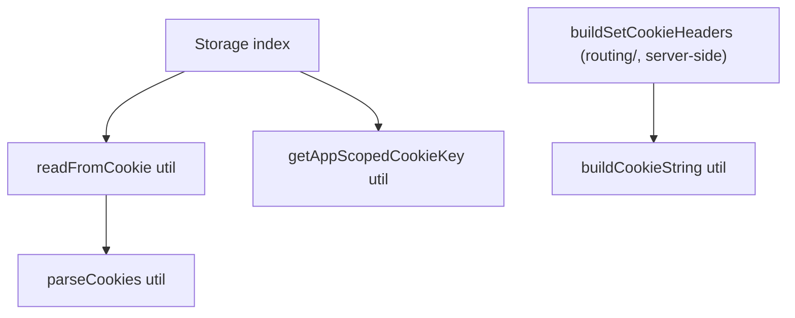

# Storage Architecture

SSR-safe cookie **reads** plus the pure cookie-string helpers.

Client-side cookie **writes** no longer live in this layer. The single
client cookie-write path is now `usePersistCookieAction`
(`packages/ui/src/hooks/`), which POSTs entries to the
`/_action/persist-cookie` server action so the `Set-Cookie` comes from the
server — the only channel the SSR loader can read back to seed first paint.
The former client-side cookie writer (`document.cookie` / `Set-Cookie`) and the
`localStorage` writer that used to live here were deleted with it.

## Reads + pure helpers only (purity rule)

Everything here is now either a **pure helper** (`*.util.ts`) or the one
ambient **reader**. There are no effectful writers (`*.service.ts`) left in
this directory — the effect moved to `usePersistCookieAction` (see above).

**Readers** (`readFromCookie`) stay `*.util.ts` as
an accepted exception: they perform ambient _reads_ (no mutation, no
observable side effect) and accepting them as utils keeps the read call site
consistent with the pure builders. This is a documented, deliberate
deviation — do not "fix" it to a service.

## File Structure

```
storage/
├── ARCHITECTURE.md
├── index.ts
├── buildCookieString.util.ts        → Pure: cookie string from key/value + injected expiresAt (consumed server-side by `buildSetCookieHeaders` in `routing/`)
├── getAppScopedCookieKey.util.ts    → Pure: optional appId-scoped cookie key
├── parseCookies.util.ts             → Pure: cookie header string → record
└── readFromCookie.util.ts           → Ambient read (accepted): browser/SSR cookie read
```

## Dependency Graph



## Key Behaviors

| Module                  | Kind         | Behavior                                                                                                     |
| ----------------------- | ------------ | ------------------------------------------------------------------------------------------------------------ |
| `buildCookieString`     | pure util    | `encodeURIComponent` value; `path=/; SameSite=Lax`; **expiry is injected** (`expiresAt`) so the util is pure |
| `getAppScopedCookieKey` | pure util    | Prefixes the key with `appId-` when an appId is provided                                                     |
| `parseCookies`          | pure util    | Cookie header string → `Record<string, string>`                                                              |
| `readFromCookie`        | ambient read | Browser `document.cookie` or explicit SSR `cookieString`                                                     |

## Barrel Exports

`index.ts` exports: `getAppScopedCookieKey`, `readFromCookie`.

`buildCookieString` and `parseCookies` stay off the barrel and are
direct-imported: `parseCookies` only by `readFromCookie` here, and
`buildCookieString` by the server-side `buildSetCookieHeaders` in
`packages/ui/src/routing/`.

The tab-scoped sessionStorage pair (`readFromSessionStorage` /
`writeToSessionStorage`) was removed alongside the Table's unwired
"paint stale rows during refresh" feature, its only consumer. Persistence
here is cookie-based, which is the channel SSR can actually read.
