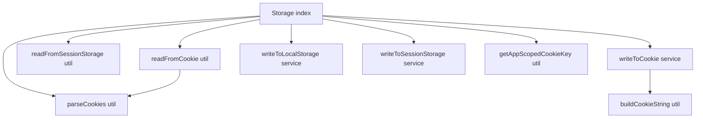

# Storage Architecture

Environment-safe persistence for cookies, localStorage, and sessionStorage
with SSR support.

## Util vs Service Split (purity rule)

Effectful **writers** carry the `*.service.ts` suffix — they are designated
side-effect homes (`.claude/rules/typescript.md` § Functional Programming &
Immutability) and may touch `document.cookie`, Web Storage, ambient clocks,
and loggers. Pure helpers keep the `*.util.ts` suffix.

**Readers** (`readFromCookie`, `readFromSessionStorage`) stay `*.util.ts` as
an accepted exception: they perform ambient _reads_ (no mutation, no
observable side effect) and accepting them as utils keeps every read/write
call site symmetrical. This is a documented, deliberate deviation — do not
"fix" them to services without revisiting this note.

## File Structure

```
storage/
├── ARCHITECTURE.md
├── index.ts
├── buildCookieString.util.ts        → Pure: cookie string from key/value + injected expiresAt
├── getAppScopedCookieKey.util.ts    → Pure: optional appId-scoped cookie key
├── parseCookies.util.ts             → Pure: cookie header string → record
├── readFromCookie.util.ts           → Ambient read (accepted): browser/SSR cookie read
├── readFromSessionStorage.util.ts   → Ambient read (accepted): tab-scoped read
├── writeToCookie.service.ts         → Effect: document.cookie / Set-Cookie header; owns the 1y expiry clock
├── writeToLocalStorage.service.ts   → Effect: localStorage.setItem + debug logging
└── writeToSessionStorage.service.ts → Effect: sessionStorage.setItem + debug logging
```

## Dependency Graph



## Key Behaviors

| Module                   | Kind             | Behavior                                                                                                     |
| ------------------------ | ---------------- | ------------------------------------------------------------------------------------------------------------ |
| `buildCookieString`      | pure util        | `encodeURIComponent` value; `path=/; SameSite=Lax`; **expiry is injected** (`expiresAt`) so the util is pure |
| `getAppScopedCookieKey`  | pure util        | Prefixes the key with `appId-` when an appId is provided                                                     |
| `parseCookies`           | pure util        | Cookie header string → `Record<string, string>`                                                              |
| `readFromCookie`         | ambient read     | Browser `document.cookie` or explicit SSR `cookieString`                                                     |
| `readFromSessionStorage` | ambient read     | Tab-scoped read; `undefined` outside the browser                                                             |
| `writeToCookie`          | service (effect) | SSR: appends `Set-Cookie` to provided `Headers`; browser: `document.cookie`; computes the 1-year expiry      |
| `writeToLocalStorage`    | service (effect) | Swallows quota/disabled errors; logs at debug level                                                          |
| `writeToSessionStorage`  | service (effect) | Swallows quota/disabled errors; logs at debug level                                                          |

## Barrel Exports

`index.ts` exports: `getAppScopedCookieKey`, `readFromCookie`,
`readFromSessionStorage`, `writeToCookie`, `writeToLocalStorage`,
`writeToSessionStorage`.
