# URL State Utils Architecture

Compact serialization/deserialization helpers for table state in URL query params.
Designed for shareable links, SSR hydration, and resilient decoding.

## The codec layer

Every param in this folder is read back through a **codec** built by
`createUrlStateCodec`. A codec pairs one `serialize` with one `deserialize` and
takes its entire validation story from a single caller-supplied `narrow`
function. There is no schema type, no combinator and no error object, because
`@lcabrera/ui` ships to browsers without a validation dependency and this is how
a helper grows into a schema library by accident.

**The contract is refusal, not repair.** `narrow` answers `undefined` for any
token outside its vocabulary, and `deserialize` then answers the codec's declared
`fallback` — for the _whole_ payload, never one field of it. A hand-edited param
therefore yields no state at all rather than a partly applied one, so a token
_the narrowing rejects_ never reaches a downstream lookup typed as valid.

That guarantee is exactly as wide as the narrowing each codec supplies and no
wider — one that asserts only an envelope buys nothing about the values inside
it. The per-codec reach is spelled out below, and it is not uniform.
([ADR-061](../../../../../docs/decisions/ADR-061-grouping-config-in-url-expansion-in-store.md)
states why: a malformed param must yield a flat table, not a half-applied query.)

Anything thrown along the way — undecodable Base64, malformed JSON, a narrowing
that throws — is a refusal too, so a URL a user edited by hand degrades instead
of failing a loader.

`decodeParam` / `encodeParam` are the optional text layer between the raw param
and the JSON: the state param is Base64, the sorting and filter params are plain
JSON and leave both off.

Each codec's `narrow` chooses what "unrecognised" means for its param:

| Codec          | Vocabulary it checks                                                      | Fallback    |
| -------------- | ------------------------------------------------------------------------- | ----------- |
| `sortingCodec` | every value is `asc` or `desc`; one bad direction refuses the lot         | `{}`        |
| `filtersCodec` | the envelope is a column-keyed object; each value via `deserializeFilter` | `{}`        |
| `stateCodec`   | the envelope is a plain object; values stay `unknown`                     | `undefined` |

`filtersCodec` keeps the pre-existing per-entry drop inside a recognised object,
and it is worth being exact about what that drop covers. `deserializeFilter`
does **not** reject an unknown operator code — its last branch reads any
all-strings array as a select-equals filter, so `["ZZ","x"]` produces a select
filter over the values `ZZ` and `x`. The pass that rejects a filter a column
cannot carry is `sanitizeFiltersByColumns` in the loader path: it drops unknown
column keys and runs `isFilterCompatibleWithColumn` against each column's
declared `dataType`. Note it runs **only when the loader passes `columns`**,
which is optional on `readTableLoaderStateFromRequest` — a loader that omits
them gets the filters unchecked. The codec closes the envelope; that pass closes
the rest when it runs.

`stateCodec` asserts the envelope only, and that is the honest description of it:
the values inside are **not** narrowed here and are **not** narrowed downstream
either. `readTableLoaderStateFromRequest` casts them — `urlState?.columnOrder` to
`ColumnOrderState`, `urlState?.columnVisibility` to `ColumnVisibilityState` — so a
hand-edited payload can put a number behind an array type. (`readPersistedStateFromCookie`
and `collectPersistedStateSlices` serve the _cookie_ path, not this param, and are
not a guard on it.) That is pre-existing and unchanged by this codec; hardening
those slices is separate work, tracked on its own. A non-object payload is still
refused, because an array or a scalar is not a `tableState` value in any shape
this param defines.

**No codec here validates a column key.** The vocabularies above are _value_
vocabularies; a key is any string. Sorting keys are checked server-side in
`buildOrderByClause` — `assertSafeIdentifier` on every column with no caller
opt-out, and `assertColumnAllowed` only for queries that pass `allowedColumns`.
Filter keys are checked in the loader by `sanitizeFiltersByColumns`, when the
loader passes it `columns`.

A narrowing rebuilds its state with `Object.fromEntries`, never by assigning
into `{}`. Plain assignment routes a `__proto__` key to the prototype setter and
silently drops it — a per-field drop, which is the outcome this contract exists
to rule out. `Object.fromEntries` defines an own property instead, so the key
survives and `Object.prototype` is untouched.

## File Structure

```
urlState/
├── ARCHITECTURE.md
├── index.ts
├── urlState.types.ts
├── createUrlStateCodec.util.ts
├── sortingCodec.util.ts
├── filtersCodec.util.ts
├── stateCodec.util.ts
├── encodeStateToURL.util.ts
├── decodeStateFromURL.util.ts
├── readStateFromURL.util.ts
├── readTableStateFromURL.util.ts
├── serializeSortingToURL.util.ts
├── deserializeSortingFromURL.util.ts
├── serializeFiltersToURL.util.ts
├── serializeFilter.util.ts
├── serializeBooleanFilter.util.ts
├── serializeDateFilter.util.ts
├── serializeSelectFilter.util.ts
├── serializeNumberFilter.util.ts
├── serializeTextFilter.util.ts
├── getSerializedOperator.util.ts
├── deserializeFilter.util.ts
└── deserializeFiltersFromURL.util.ts
```

## Dependency Graph

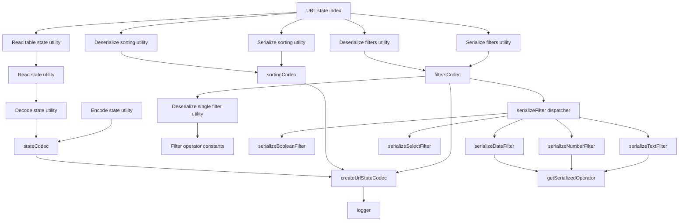

## Utilities

### createUrlStateCodec.util.ts

Builds a codec from `compact`, `narrow`, `fallback`, a `label` for the debug log,
and the optional `decodeParam`/`encodeParam` transport.

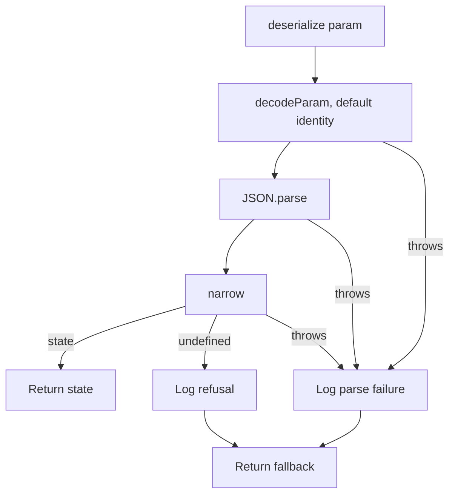

`serialize` is the mirror: `compact` then `JSON.stringify` then `encodeParam`. It
always produces a string — whether the param belongs in the URL at all is the
caller's decision, which is why `serializeSortingToURL` and
`serializeFiltersToURL` return early on empty state before reaching the codec.

### urlState.types.ts

`CompactSorting` — names the closed `{ columnKey: 'asc' | 'desc' }` wire form of
the `sorting` param. `sortingCodec` is its consumer: it is the vocabulary that
codec's narrowing checks a URL-supplied token against.

### sortingCodec.util.ts

Codec for the `sorting` param. Its narrowing checks every entry's direction
first, short-circuiting on the first one that is not `asc` or `desc`, and only
then rebuilds the record with `Object.fromEntries`.

### filtersCodec.util.ts

Codec for the `filters` param. Its narrowing checks the envelope, then routes
each value through `deserializeFilter`.

### stateCodec.util.ts

Codec for the Base64 `<persistenceKey>-tableState` param. Supplies both transport
halves and converts `Set` values to arrays on the way out.

### encodeStateToURL.util.ts

Encodes plain object state into Base64 URL-safe string — `stateCodec.serialize`
under a name, so the Set conversion and the Base64 transport live in the codec.

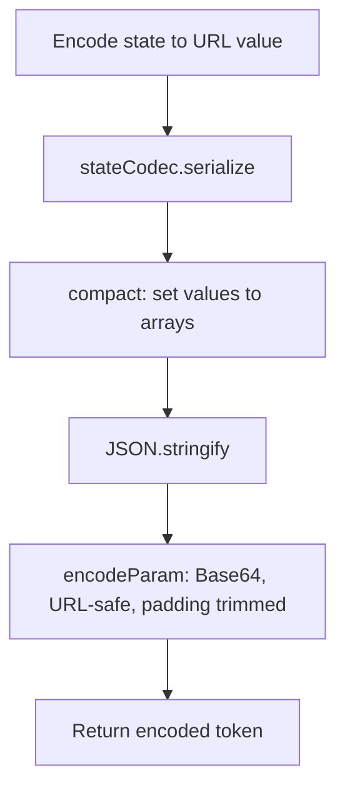

Key behavior:

- Ensures `Set` values are serializable.
- Produces compact URL-safe payload.

### decodeStateFromURL.util.ts

Decodes URL-safe Base64 state via `stateCodec` and optionally rehydrates arrays
into sets. The rehydration copies rather than mutating the decoded object, and
is applied here rather than in the codec because the key list is a per-call
argument.

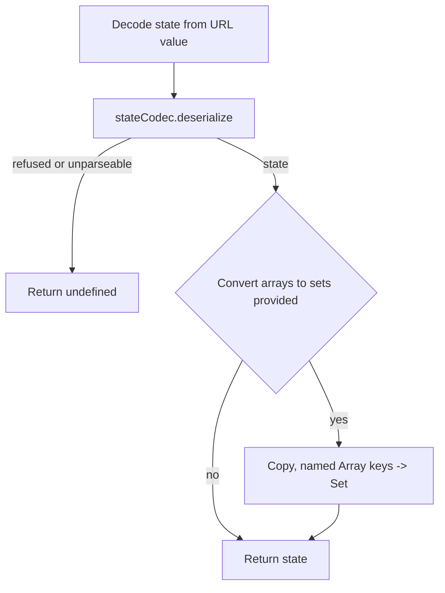

### readStateFromURL.util.ts

Reads named query param and decodes via `decodeStateFromURL`.

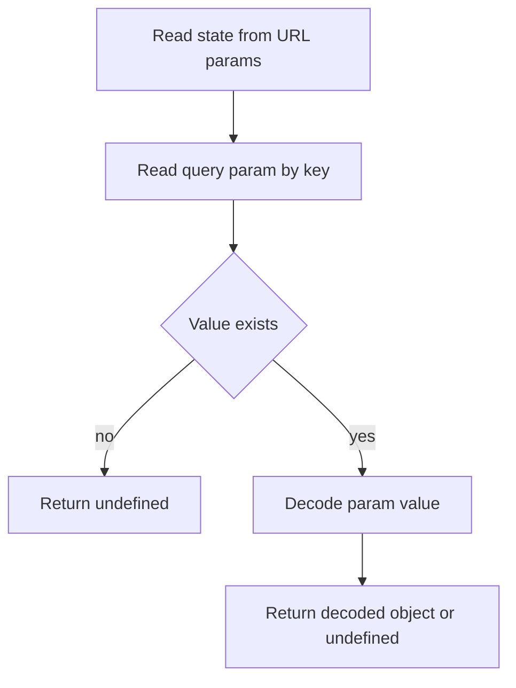

### readTableStateFromURL.util.ts

Table-specific wrapper around `readStateFromURL`.

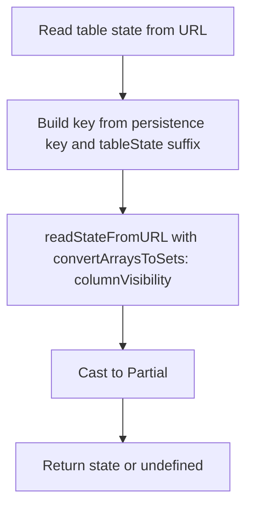

Typed state envelope:

- `columnOrder?`
- `columnVisibility?`
- `filters?`
- `sorting?`

### serializeSortingToURL.util.ts

Compacts sorting array into object map for shorter query payload.

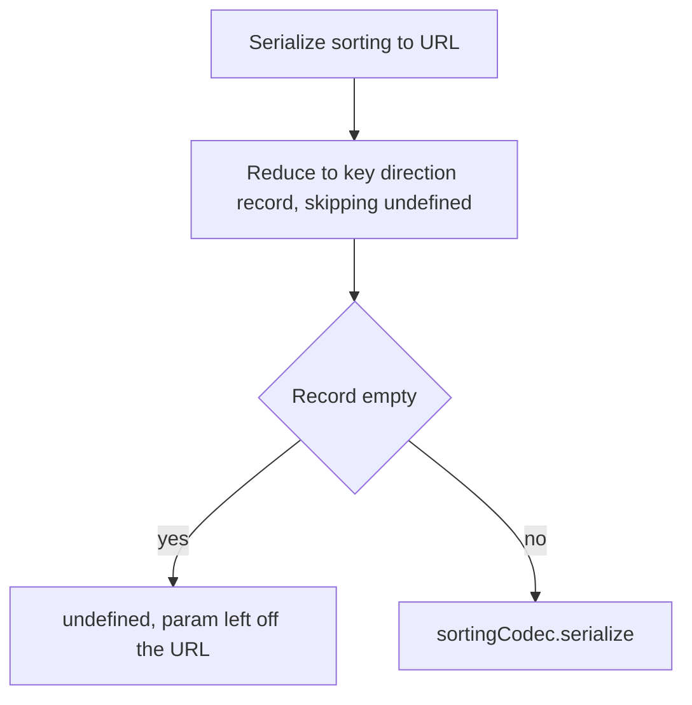

Example transform:

- Input: `[{ columnKey: 'name', direction: 'asc' }]`
- Output: `{"name":"asc"}`

### deserializeSortingFromURL.util.ts

Rebuilds sorting array from compact object representation.

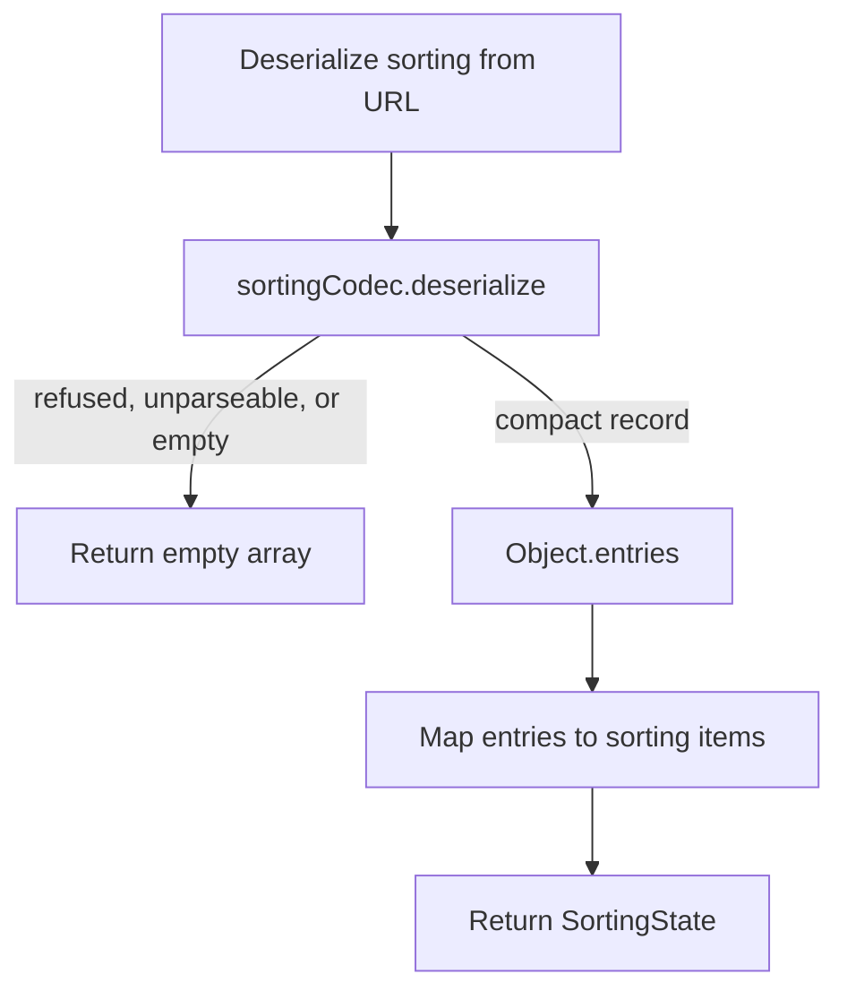

Column keys stay bare strings here, and the loader path does not check them
against a table's real columns — `sanitizeSorting` drops only undirected entries
and the UI-only `actions` key. The column guard is server-side, in
`buildOrderByClause`.

### serializeFiltersToURL.util.ts

Compacts column filters into JSON string using short operator codes and reduced shape.

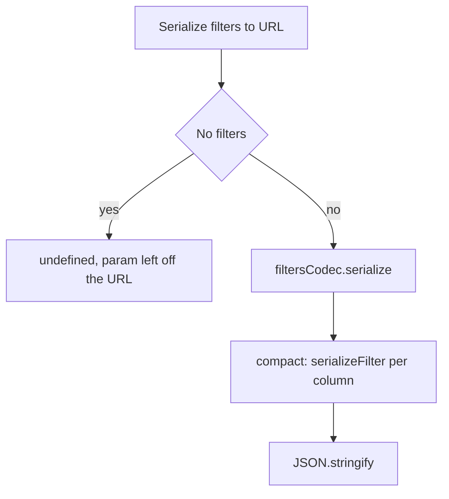

`serializeFilter` behavior by filter type:

- `boolean` -> bare boolean
- `text/number/date` -> `[shortOp, value]` or `[shortOp, value, value2]`
- `select/multiSelect` -> values array or `['!', ...values]` for `notEquals`

### serializeFilter.util.ts

Dispatches a single `ColumnFilter` to the matching leaf serializer.

### getSerializedOperator.util.ts

Maps long operator names to their short codes using `OPERATOR_TO_SHORT`.

### serializeBooleanFilter.util.ts

Serializes boolean filters as bare booleans.

### serializeDateFilter.util.ts

Serializes date filters using short operator codes and optional `value2` for between filters.

### serializeSelectFilter.util.ts

Serializes select and multi-select filters as arrays, including `['!', ...values]` for `notEquals`.

### serializeNumberFilter.util.ts

Serializes number filters using short operator codes and optional `value2` for between filters.

### serializeTextFilter.util.ts

Serializes text filters as `[shortOp, value]`.

### deserializeFilter.util.ts

Infers filter type from compact value shape and expands short codes.

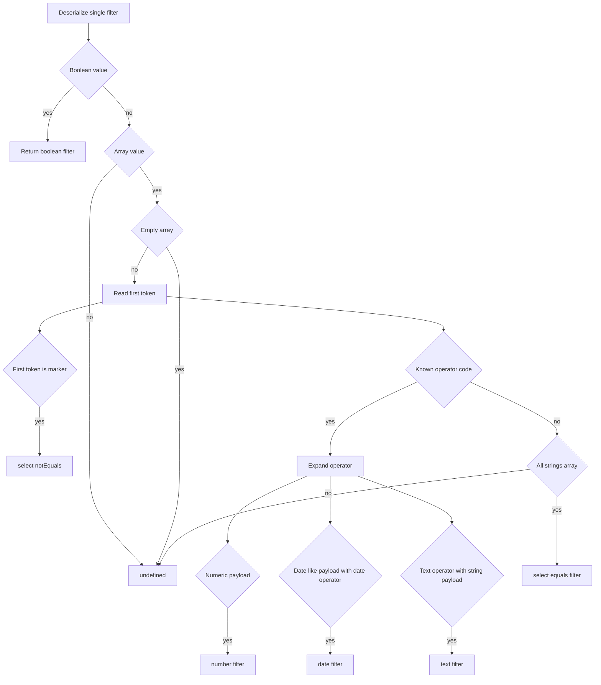

### deserializeFiltersFromURL.util.ts

Deserializes complete filters payload by applying `deserializeFilter` per entry.

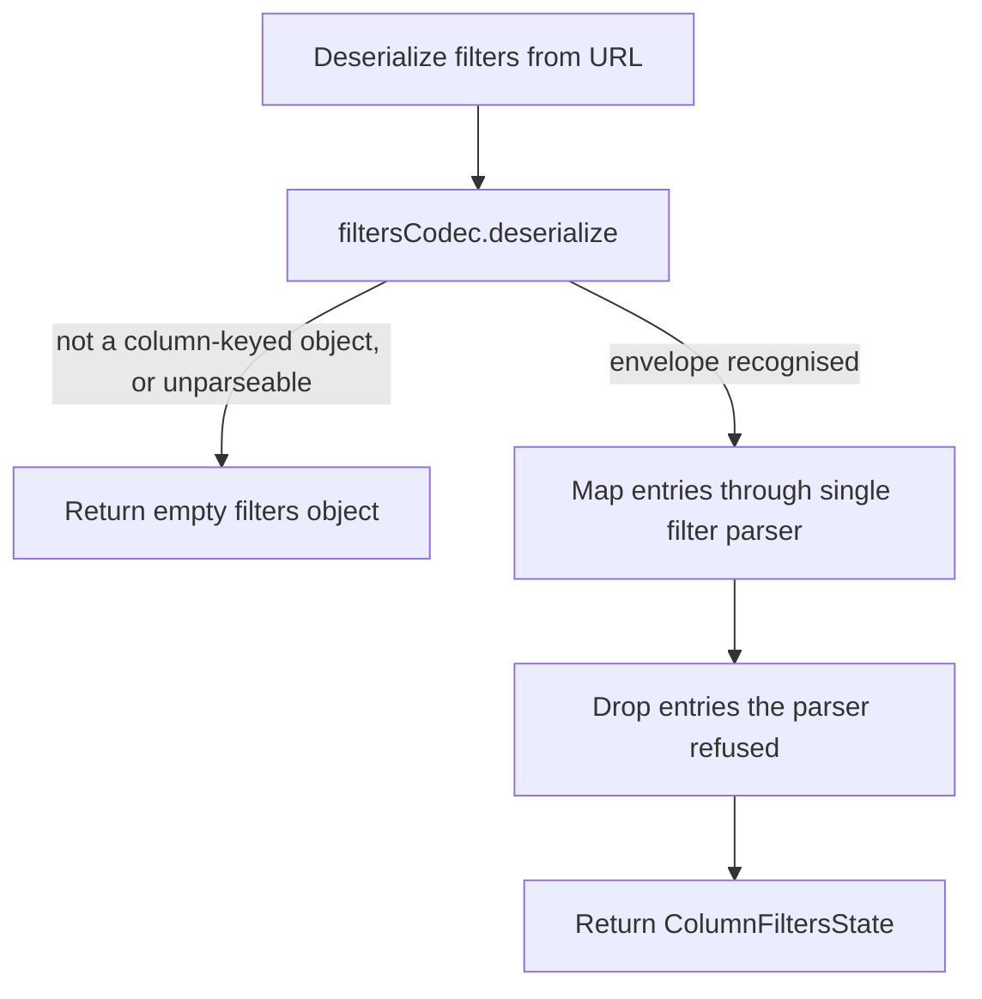

## Public API

`index.ts` exports:

- `deserializeFiltersFromURL`
- `deserializeSortingFromURL`
- `readTableStateFromURL`
- `serializeFiltersToURL`
- `serializeSortingToURL`

The codecs and the factory are **not** barrelled. Nothing outside this folder
consumes them yet, and per ADR-007 a barrel exports what is actually imported
through it; a new codec (the `grouping` param) imports `createUrlStateCodec` by
file path, the way `encodeStateToURL.util` is already imported elsewhere.
