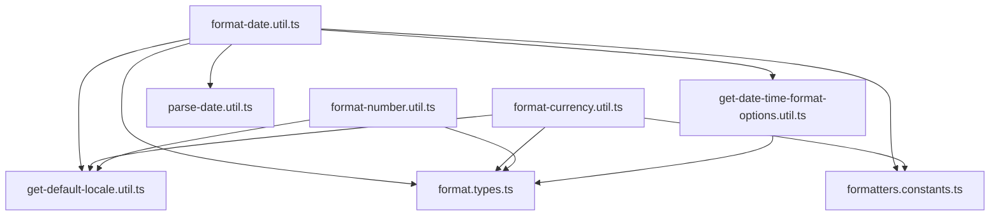
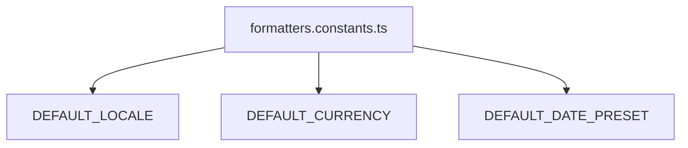
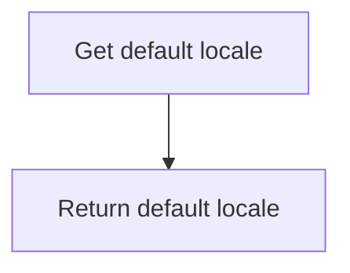
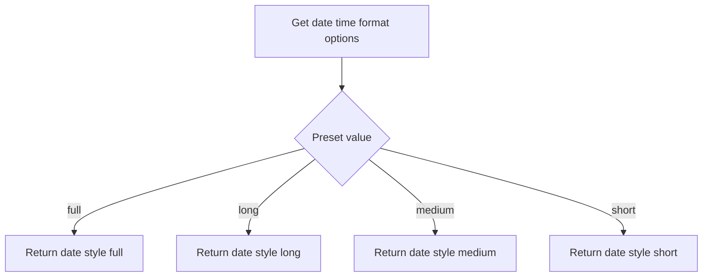
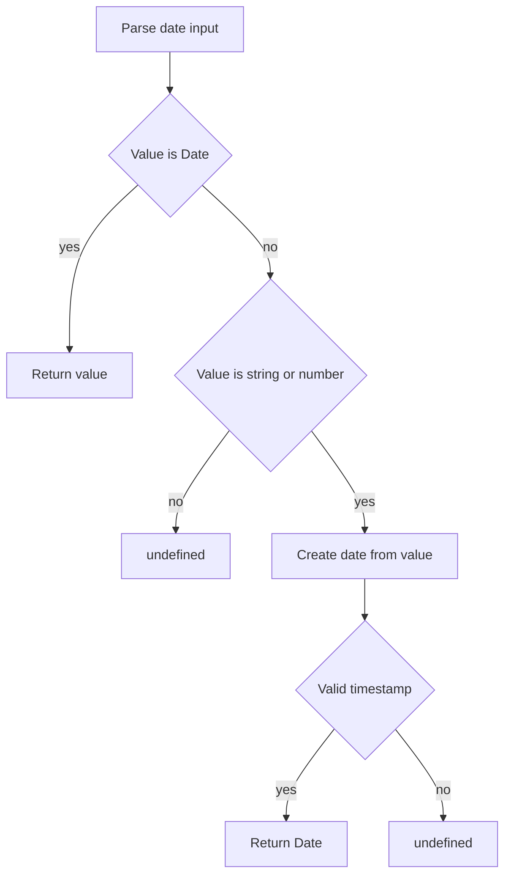
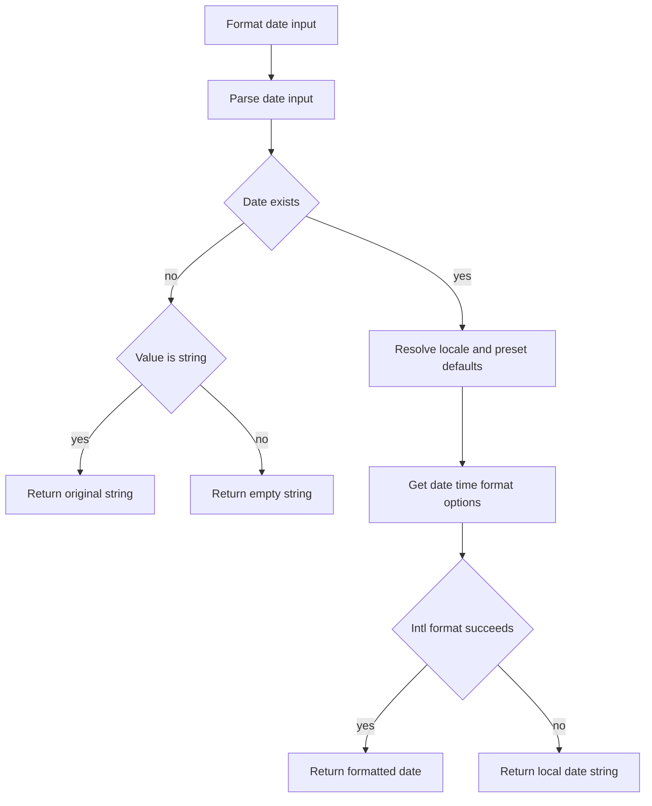
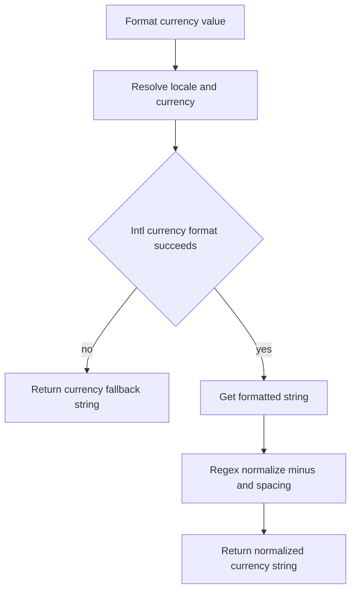
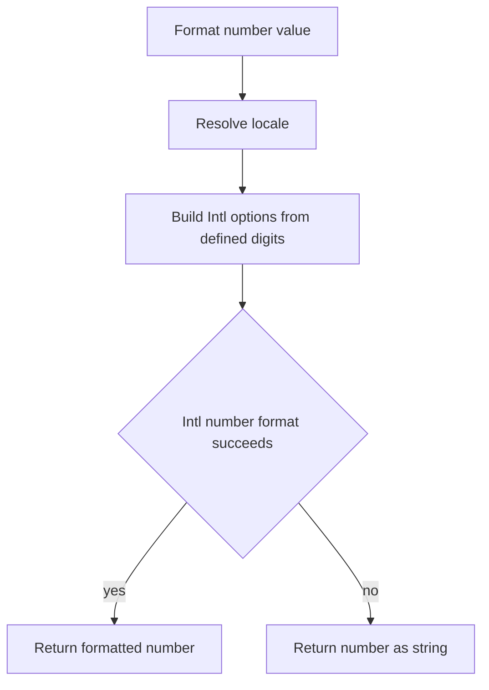

# Formatters Utils Architecture

Locale-safe, SSR-consistent formatting helpers for numbers, currency, and dates.
Pure `Intl` wrappers with no React/DOM dependency — they live in `@repo/utils`
(the lowest layer) and are consumed by `@repo/ui` and the apps.

## File Structure

```
formatters/
├── ARCHITECTURE.md
├── format.types.ts
├── formatters.constants.ts
├── get-default-locale.util.ts
├── get-date-time-format-options.util.ts
├── parse-date.util.ts
├── format-date.util.ts
├── format-currency.util.ts
└── format-number.util.ts
```

## Dependency Graph



## Utilities

### format.types.ts

Shared `Intl`-formatter option types (`CurrencyFormatOptions`,
`DateFormatOptions`, `DateFormatPreset`, `NumberFormatOptions`) consumed by the
formatters and by `@repo/ui`'s `Table.types`.

### formatters.constants.ts

Defines module defaults:

- `DEFAULT_LOCALE = 'en-US'`
- `DEFAULT_CURRENCY = 'USD'`
- `DEFAULT_DATE_PRESET = 'medium'`



### get-default-locale.util.ts

Returns deterministic locale default to avoid SSR/client hydration mismatches.



### get-date-time-format-options.util.ts

Maps date preset names to `Intl.DateTimeFormatOptions`.



### parse-date.util.ts

Normalizes unknown date-like input into a valid `Date` or returns `undefined`.



### format-date.util.ts

Formats unknown value as localized date string with safe fallbacks.



Key behavior:

- Accepts `unknown` input and defends against invalid date values.
- Preserves incoming string when parsing fails (useful for opaque backend values).

### format-currency.util.ts

Formats number as currency and normalizes symbol/sign output.



Normalization rules:

- Moves leading minus after currency symbol when needed.
- Ensures a space between symbol and numeric sign/value.

### format-number.util.ts

Formats number with optional precision controls.



Key behavior:

- Omits undefined fraction digit options to avoid unintended defaults.
- Gracefully degrades when Intl fails.

## Subpath Exports

`@repo/utils` uses **explicit per-file subpath exports** — there is no barrel.
Each helper is imported directly so consumers pull in exactly one:

- `@repo/utils/formatters/format-currency.util`
- `@repo/utils/formatters/format-date.util`
- `@repo/utils/formatters/format-number.util`
- `@repo/utils/formatters/parse-date.util`
- `@repo/utils/formatters/get-date-time-format-options.util`
- `@repo/utils/formatters/get-default-locale.util`
- `@repo/utils/formatters/formatters.constants`
- `@repo/utils/formatters/format.types`
