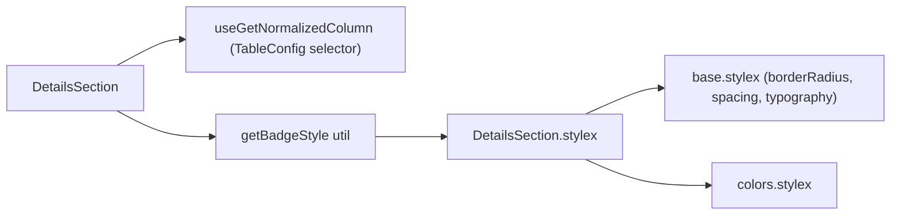
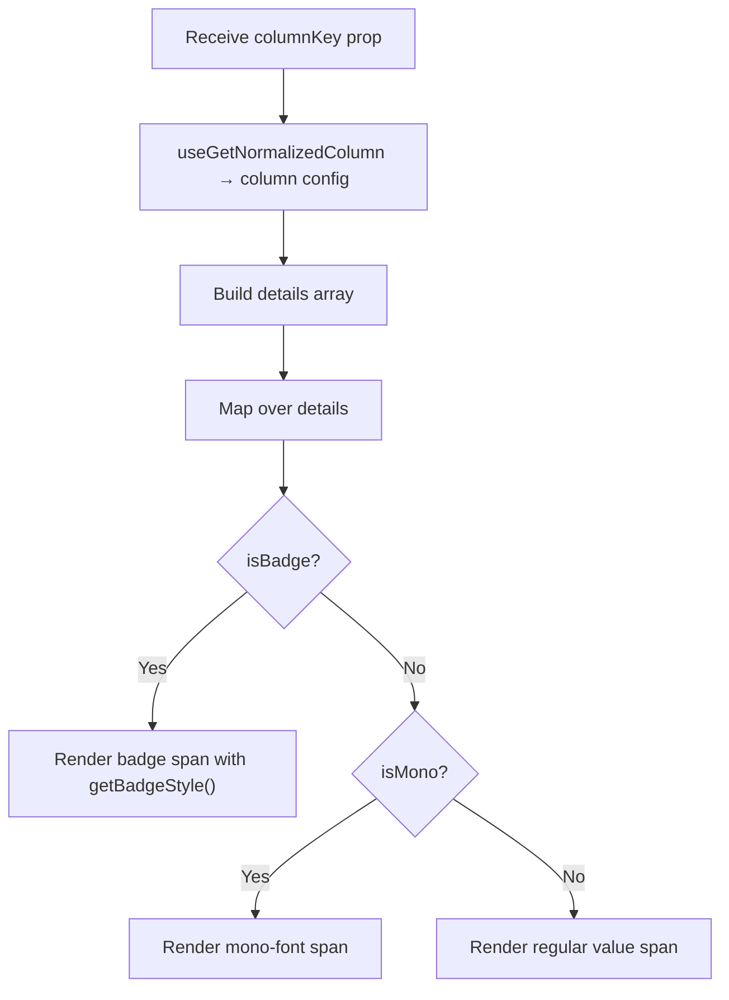

# DetailsSection Architecture

Read-only display of column metadata. No actions or state mutations — purely
informational, reading from `TableConfigContext` via `useGetNormalizedColumn`.

## File Structure

```
DetailsSection/
├── index.ts                       → Barrel export
├── DetailsSection.component.tsx   → Metadata list with badge styling
├── DetailsSection.types.ts        → Props + DetailItem type
├── DetailsSection.stylex.ts       → Full custom styles (base.stylex + colors.stylex)
│
└── utils/
    ├── index.ts                   → Barrel export
    └── getBadgeStyle.util.ts      → Maps "Yes"/"No"/"None" → badge color style
```

## Dependencies



## Render Flow



## Detail Items Rendered

| Label          | Value Source           | Display Mode |
| -------------- | ---------------------- | ------------ |
| Label          | `column.label`         | Text         |
| Key            | `column.key`           | Mono font    |
| Data Type      | `column.dataType`      | Text (or —)  |
| Sortable       | `column.isSortable`    | Badge        |
| Filterable     | `column.isFilterable`  | Badge        |
| Sort Direction | `column.sortDirection` | Badge        |
| Min Width      | `column.minWidth`      | Text (or —)  |
| Max Width      | `column.maxWidth`      | Text (or —)  |

## Badge Color Mapping

| Value   | Style       | Semantic                      |
| ------- | ----------- | ----------------------------- |
| `"Yes"` | `badgeYes`  | Success (green background)    |
| `"No"`  | `badgeNo`   | Error (red background)        |
| Other   | `badgeNone` | Neutral (tertiary background) |

## Props

| Prop        | Type             | Description       |
| ----------- | ---------------- | ----------------- |
| `columnKey` | `DataKey<TData>` | Column identifier |

## Style Composition

Unlike other sections that delegate to `drawerSectionStyles`, DetailsSection defines
its own complete styles using `base.stylex` and `colors.stylex` tokens directly:

- **container**: Flex column, no gap
- **item**: Row with space-between, bottom border separator
- **label**: Uppercase, secondary color, xs font
- **value**: Primary color, sm font, right-aligned
- **badge**: Rounded pill with color-coded background
- **mono**: Monospace font for the column key
