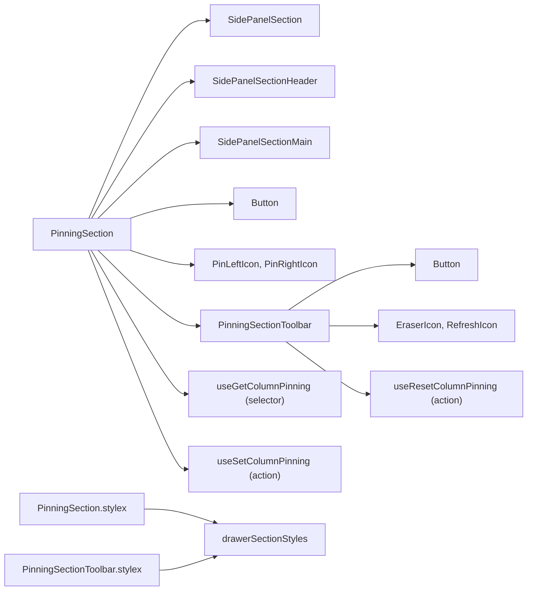
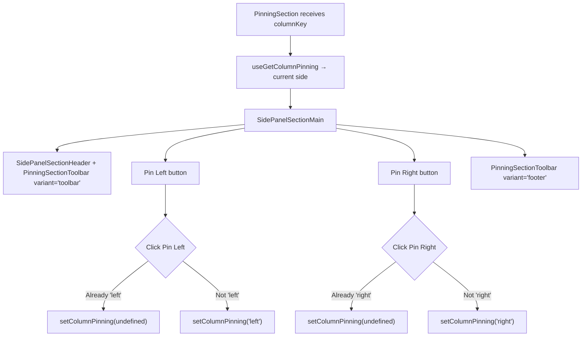

# PinningSection Architecture

Pin left/right toggle with clear/reset toolbar.

## File Structure

```
PinningSection/
├── index.ts                        → Barrel export
├── PinningSection.component.tsx    → Pin left/right toggle buttons
├── PinningSection.types.ts         → Props: { columnKey }
├── PinningSection.stylex.ts        → Delegates to drawerSectionStyles.list
│
└── PinningSectionToolbar/
    ├── index.ts                    → Barrel export
    ├── PinningSectionToolbar.component.tsx → Clear/reset pinning buttons
    ├── PinningSectionToolbar.types.ts     → { variant?: 'footer' | 'toolbar' }
    └── PinningSectionToolbar.stylex.ts    → Delegates to drawerSectionStyles
```

## Dependencies



## Render Flow



## Toolbar Dual-Variant Pattern

| Variant     | Placement              | Button Style            | Labels?        |
| ----------- | ---------------------- | ----------------------- | -------------- |
| `'toolbar'` | SidePanelSectionHeader | `ghost`, `mini`, `auto` | No (icon only) |
| `'footer'`  | Below toggle buttons   | `outline`, `sm`, `full` | Yes            |

| Button        | Action                              | Disabled When  |
| ------------- | ----------------------------------- | -------------- |
| Clear Pinning | `setColumnPinning(undefined)`       | No pinning set |
| Reset Pinning | `resetColumnPinning()` (from table) | Never          |

## Props

| Prop        | Type             | Description                                                        |
| ----------- | ---------------- | ------------------------------------------------------------------ |
| `columnKey` | `DataKey<TData>` | Column identifier (received but unused — state comes from context) |
