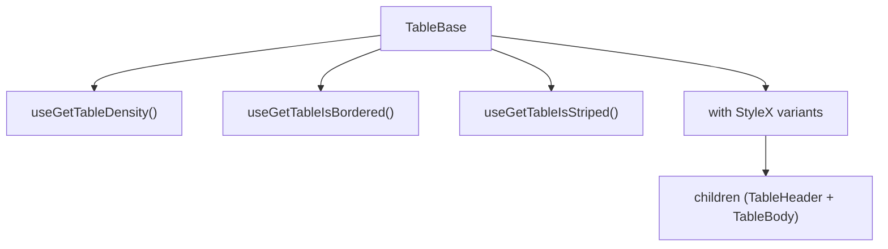

# TableBase Architecture

Thin wrapper around the native `<table>` element that applies density,
border, and stripe styles from `TableConfigContext` meta state.

## File Structure

```
TableBase/
├── TableBase.component.tsx   → <table> with density/border/stripe StyleX
├── TableBase.types.ts        → TableBaseProps extends <table> + customStylex
├── TableBase.stylex.ts       → Base, density (compact/comfortable), borderless
└── index.ts                  → Barrel export
```

## Context Dependencies

Reads from `TableConfigContext` meta selectors:

| Selector                | Controls                       |
| ----------------------- | ------------------------------ |
| `useGetTableDensity`    | Compact vs comfortable spacing |
| `useGetTableIsBordered` | Show/hide cell borders         |
| `useGetTableIsStriped`  | `data-striped` attribute       |

## Render


